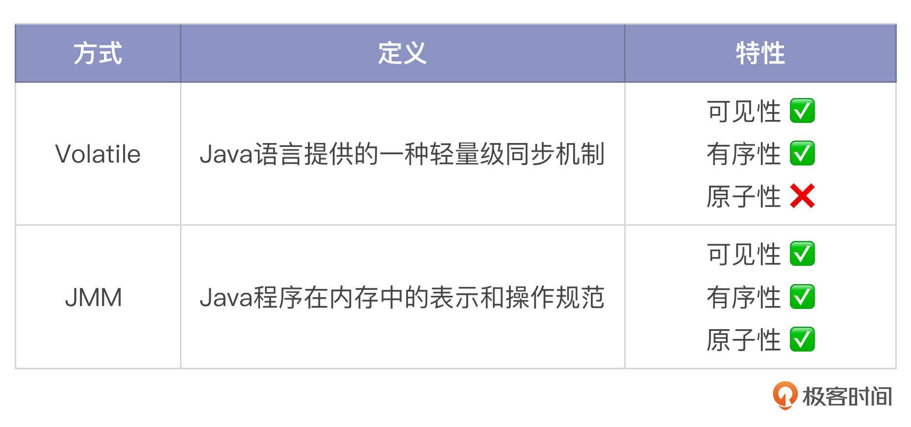
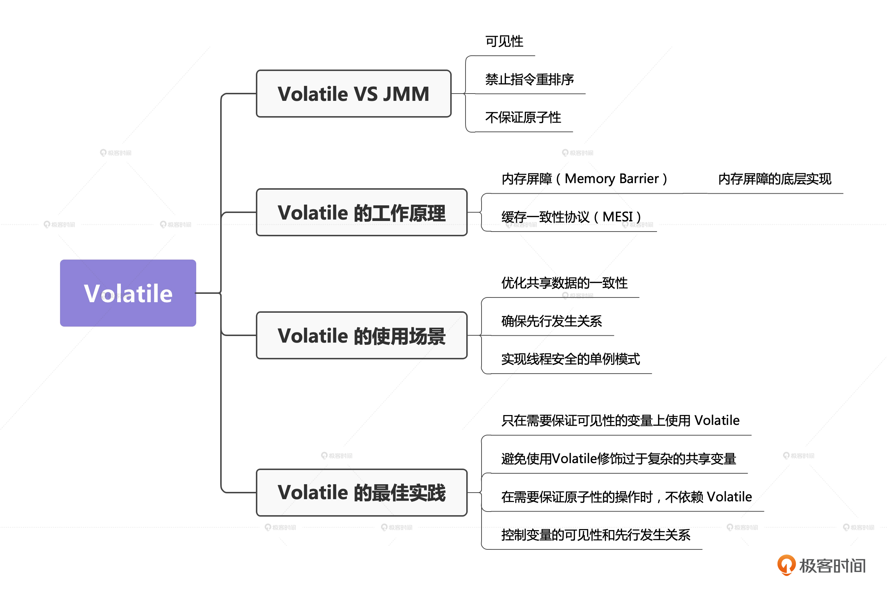
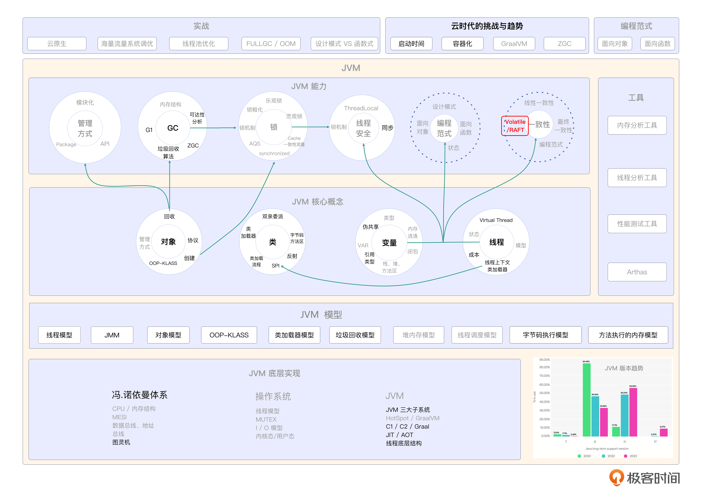

# 22｜Volatile：深入解析JVM中的轻量级同步机制
你好，我是康杨。

在多线程编程中，确保数据的可见性和一致性至关重要。为了解决这个问题，Java 提供了一个特殊的关键字——Volatile，它可以保证线程之间的可见性并提供一种轻量级的同步机制。

今天我们将深入解析 JVM 中的 Volatile 关键字，详细介绍它的工作原理、使用场景及其在实际应用中的最佳实践。这对于深入理解 Java 多线程编程以及提高并发编程能力都是非常有益的。通过学习和掌握 Volatile 关键字的使用方法和原理，我们能够编写出更加高效和可靠的多线程程序。

## Volatile VS JMM

我前面介绍过，Java 内存模型（JMM）是Java程序在内存中的表示和操作规范。它定义了线程如何在共享内存中存取数据的原则，包括原子性、可见性、有序性等。 **Volatile 关键字正是基于 JMM 的原则来实现其功能的。**



### 可见性

JMM 中有一个主内存和工作内存的概念。主内存是所有线程共享的内存区域，工作内存是每个线程独立的内存区域。当一个线程修改了主内存中的变量时，这个修改对其他线程是立即可见的。Volatile 关键字正是利用了 JMM 的这一特性，确保变量的可见性。

### 禁止指令重排序

JMM 对指令重排序做了限制，要求处理器按照顺序执行指令。但是为了提高执行效率，编译器和处理器可能会对指令进行重排序。在这种情况下，Volatile 关键字就派上用场了。它会禁止编译器和处理器对代码进行指令重排序优化，确保代码有序执行。

### 不保证原子性

JMM 定义了原子性操作的概念，要求对于多线程并发修改的变量，必须使用同步机制来保证原子性。Volatile 关键字虽然不能保证原子性，但它提供了一种简单的方式来保证可见性，下面工作原理部分我会为你详细说明。在某些场景下，Volatile 关键字可以与其他同步机制结合使用，实现更好的性能和线程安全。

所以，Volatile 关键字在多线程环境下具有重要作用和特性，它与 JMM 的关系密切。理解 Volatile 关键字的作用和特性以及它与 JMM 的关系，有助于我们更好地利用 Volatile 关键字解决实际问题。

## Volatile的工作原理

刚刚我们说到Volatile 关键字提供了一种简单的方式来保证可见性，具体是哪些方式呢？我们一起来看一下。

### 内存屏障（Memory Barrier）

**Java 通过插入特定类型的 Memory Barriers 来确保指令不会被重排序。** 对于 Volatile 写操作，JVM 会在写操作后面插入一个 Write Barrier，来禁止写操作与其后面的操作重排序；对于 Volatile 读操作，JVM 会在读操作前面插入一个 Read Barrier，来禁止读操作与其前面的操作重排序。这样就保证了 Volatile 写/读操作的有序性。

### 内存屏障的底层实现

内存屏障是一种 **处理器指令**，它能影响之前和之后的指令顺序。这种机制能确保特殊的内存顺序一致性。内存屏障同时也是一种硬件或软件机制，用于控制指令的执行顺序和内存的访问顺序。具体实现方式可能有所不同，常见的内存屏障实现方式有两种。

1. CPU 层面的内存屏障：CPU 提供了指令级别的内存屏障指令，例如 x86 架构中的 MFENCE（内存栅栏）指令。这些指令可以确保所属线程的指令按照严格的顺序执行，保证数据的一致性。
2. 编译器层面的内存屏障：编译器可以通过指令重排序和代码优化来提高程序的性能。为了保证 Volatile 关键字的语义，编译器会在相应的代码位置插入内存屏障，以确保指令的执行顺序和内存的访问顺序。

### 缓存一致性协议（MESI）

除了 Memory Barrier 外，Volatile 关键字还利用 **缓存一致性协议**，如 MESI、修改、独占、共享、无效，来保证多个线程之间的可见性。

当一个线程修改了一个被 Volatile 修饰的变量时，会立即将修改的值刷新到主内存。同时，利用缓存一致性协议，强制把其他处理器的缓存行状态设置为无效。这样，当其他处理器再次需要读取这个变量的时候，因为在它的缓存里面这个变量已经是无效状态，它会从主内存重新读取，这样就保证了可见性。

### 数据结构

Volatile 关键字在 JVM 层面主要涉及到两个数据结构：对象头 ( Object Header) 和线程本地存储区 (Thread Local Area)。

对于每个 Java 对象，包括数组，它们在内存的布局当中都包含了一个对象头。对象头中包含了对象的 Hashcode、GC 分代年龄等信息，对于实例对象，还包含了指向其类元数据的指针以及锁信息。当对象被 Volatile 变量引用，锁信息会被更新，从而实现内存语义。

线程本地存储区是每个线程在 JVM 内部开辟的一块区域。这块区域包含了线程的堆栈信息，以及线程对特定变量的 Lock 定位信息。当线程对 Volatile 变量解锁，JVM 会清空这个区域内对应的 Lock 信息，从而使下次读取时可以直接从主内存获取数据，实现同步。

这种机制保证了 Volatile 变量的修改对所有线程立即可见，以及 Volatile 变量读写操作的原子性。

## Volatile 的使用场景

Volatile 在Java中主要用来优化多线程共享数据的一致性，确保变量的先行发生关系，实现线程安全的单例模式，以及在特定场景下提高程序性能。下面我们一个一个看。

### 优化共享数据的一致性

当一个变量被多个线程共享且被频繁修改时，可以使用 Volatile 关键字来保证所有线程都能够看到最新的值。

#### 计数器

假设我们有一个计数器类，用于统计某功能的调用次数。由于这个计数器会被多个线程访问和修改，因此需要确保其可见性。

```plain
 public class Counter {
    private volatile int count;
    public void increment() {
        count++;
    }
    public int getCount() {
        return count;
    }
}

```

在代码中，我们将 count 变量声明为 Volatile，确保其他线程能够立即看到其最新值。increment 方法用于递增计数器，getCount 方法用于获取当前计数值。

### 确保先行发生关系

当一个变量依赖于另一个变量的值时，可以使用 Volatile 关键字来确保变量之间的先行发生关系。

#### 定时任务调度

假设我们需要实现一个定时任务调度器，其内部需要用到一个 flag 变量作为是否执行任务的标志。由于 flag 的值由多个线程设置和修改，因此需要确保其先行发生关系。

```plain
public class TimerScheduler {
    private volatile boolean flag;
    private Runnable task;
    public TimerScheduler(Runnable task) {
        this.task = task;
    }
    public void setFlag(boolean flag) {
        this.flag = flag;
    }

    public void run() {
        if (flag) {
            task.run();
        }
    }
}

```

在示例里，我们将 flag 变量声明为 Volatile，确保其他线程能够立即看到它的最新值。setFlag 方法用来设置 flag 变量的值，run 方法用于执行任务。

### 实现线程安全的单例模式

在实际应用中，Volatile 关键字可以用于实现线程安全的单例模式。单例模式是一种设计模式，用于确保一个类只有一个实例，并提供全局访问点。

案例：线程安全的单例模式

```java
public class Singleton {
 private static volatile Singleton instance;
   private Singleton() {
        // 私有构造函数
    }
    public static Singleton getInstance() {
        if (instance == null) {
            synchronized (Singleton.class) {
                if (instance == null) {
                    instance = new Singleton();
                }
            }
        }
        return instance;
    }
}

```

我们将 instance 变量声明为 Volatile，确保其他线程能够立即看到其最新值。使用双重检查锁定（Double-Checked Locking）的方式实现线程安全的单例模式。

### 提高程序的性能

在某些场景下，使用 Volatile 关键字可以提高程序的性能。

#### 延迟初始化

假设我们需要延迟初始化某个类，可以使用 Volatile 关键字确保线程安全。

```plain
public class DelayedInitialization {
private volatile boolean initialized;
private Runnable initTask;
public DelayedInitialization(Runnable initTask) {
        this.initTask = initTask;
    }
    public void init() {
        if (!initialized) {
            synchronized (this) {
                if (!initialized) {
                    initTask.run();
                    initialized = true;
                }
            }
        }
    }
}

```

我们将 initialized 变量声明为Volatile，确保其他线程能够立即看到其最新值。使用 synchronized 关键字确保线程安全，在 init 方法中仅初始化一次。

## Volatile 的最佳实践

1. 只在需要保证可见性的变量上使用 Volatile 关键字，不要过度使用。
2. 避免使用 Volatile 关键字修饰过于复杂的共享变量，减少出错的可能性。
3. 在需要保证原子性的操作时，不要单独依赖 Volatile 关键字，可以配合其他同步机制来实现。
4. 控制变量的可见性：当一个变量被多个线程共享且频繁被修改时，可以使用 Volatile 关键字来保证所有线程都能够看到最新的值。
5. 控制变量的先行发生关系：当一个变量依赖于另一个变量的值时，可以使用 Volatile 关键字来确保变量之间的先行发生关系。

在实际应用中，Volatile 关键字还可以用于实现基于消息传递的框架中的可见性，例如 Netty 框架中的 EventLoop。在一些用于高性能计算的框架中，例如 Disruptor 和 JCTools，也可以利用 Volatile 关键字进行线程间的数据通信和控制。

## 重点回顾

Java 中的 Volatile 关键字对于多线程编程中的数据可见性和一致性具有重要作用。 **Volatile 关键字基于 Java 内存模型的工作原理，通过内存屏障禁止指令重排序，确保变量的有序性和可见性。** 虽然 Volatile 关键字不能保证原子性操作，但它可以与其他同步机制结合使用以实现更好的性能和线程安全。

Volatile 关键字在实际应用中可用于优化共享数据的一致性、实现线程安全的单例模式、提高程序性能等。在使用Volatile 关键字时，要注意遵循最佳实践，避免过度使用，减少出错可能性。



## 思考题

学而不思则罔，学完这节课之后，我给你留两个问题。

1. 如何使用 Volatile 关键字确保线程安全的不变性？
2. Volatile 关键字在实际应用中有什么最佳实践？

希望你认真思考，然后把思考后的结果分享到评论区，我们一起讨论，如果有收获的话，也欢迎你把这节课的内容分享给需要的朋友，我们下节课再见！

## 💡 点亮你的知识框架图

