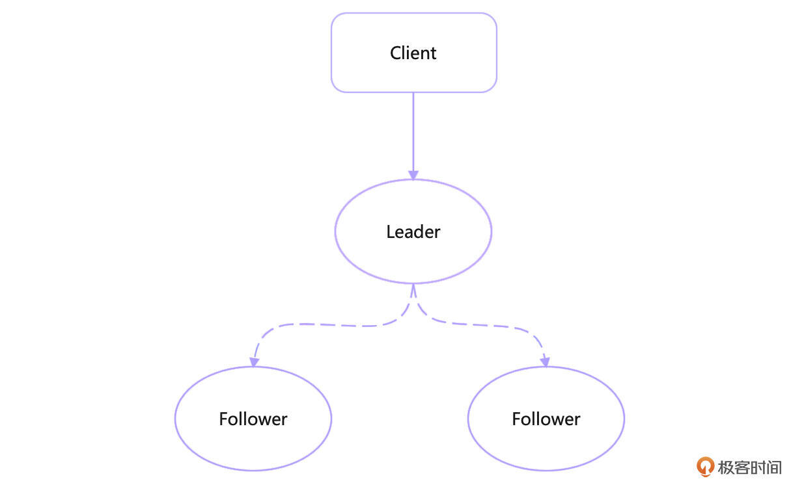
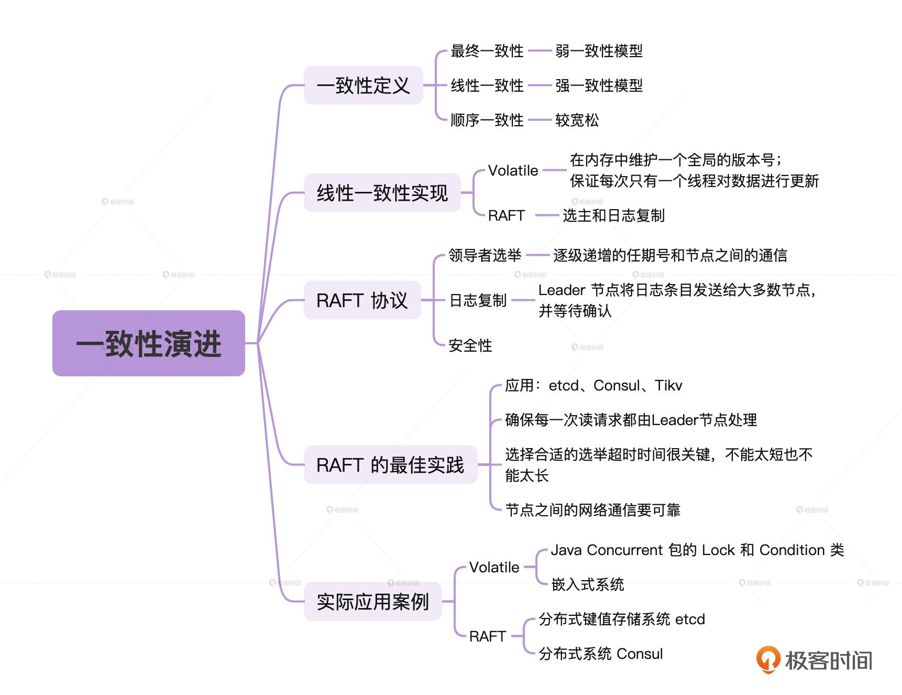
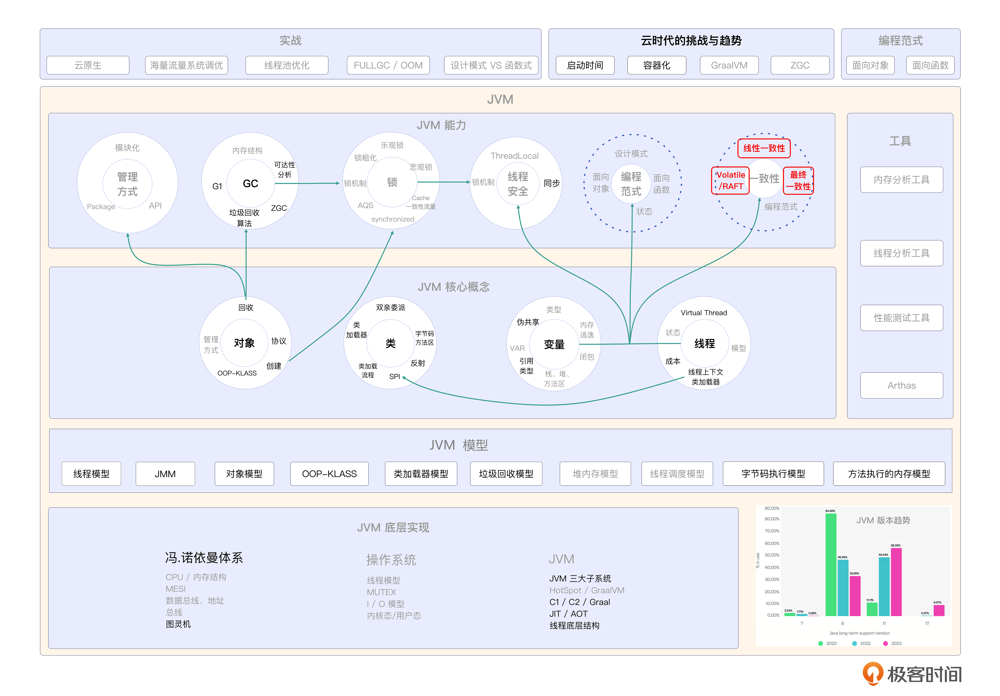

# 23｜一致性演进：Volatile与RAFT有何异同？
你好，我是康杨。今天我们来聊一下一致性问题。

在分布式系统中，一致性（Consistency）是一个至关重要的概念。这节课我们将探讨各种一致性概念，比如线性一致性（Linearizability）、顺序一致性（Sequential Consistency）、最终一致性（Eventual Consistency），并深入分析 Volatile 与 RAFT 在实现线性一致性的差异。

## 一致性定义

一致性是指系统中的所有实例在相同的状态下执行。根据 CAP 定理，一致性可以分为强一致性（Strong Consistency）和最终一致性（Eventual Consistency）。强一致性要求系统在所有时刻都保持一致状态，而最终一致性则允许系统在经过一段时间后达到一致状态。

### 线性一致性

线性一致性是一种强一致性模型，它要求所有操作按顺序执行。就如同一个严密的齿轮系统，每个齿轮都紧密相依，按照前一个齿轮的转动节奏，有条不紊地向前推进。我们在执行操作时，每个步骤都必须依赖前面的步骤，确保每个操作的结果都能充分地建立在之前所有操作的基础之上。

### 顺序一致性

顺序一致性是一种较为宽松的一致性模型，它要求操作按照它们在日志中的顺序执行。只要操作在日志中的顺序正确，系统就是一致的。顺序一致性则像是图书馆的管理系统，每本书都有自己的编号，只要按照编号的顺序上架和借阅，那么整个图书馆就能保持井然有序。同样的，这就像我们在处理电子邮件时，只要按照收件时间的顺序逐一阅读和回复，就不会出现混乱的情况。

### 最终一致性

最终一致性是一种弱一致性模型，它允许系统在一段时间内存在不一致状态，但最终会达到一致状态。很多现代分布式系统都采用了这种模型，因为它可以提高系统的可用性和灵活性。

最终一致性就像是行驶中的汽车，在行驶过程中可能因为路况、天气等外部因素，出现短暂的失控，但是司机通过刹车、调整方向等方式，最终还是能够恢复到正常的行驶状态。这就像许多现代分布式系统，在运行过程中可能会因为网络延迟、服务器故障等不确定因素，出现短暂的不一致状态，但是系统会通过自我调整，比如数据重传、心跳检测等机制，最终达到一致状态。这种模型既保证了系统的可用性，又增强了系统的灵活性，使系统能够在复杂的环境下正常运行，直至达到最终的一致状态。

## Volatile 与 RAFT 的线性一致性实现

Volatile 和 RAFT 都是保证线性一致性的机制，只不过它们实现一致性的方法有所不同。

### Volatile的一致性实现

Volatile 是一种在 Java 中用于声明变量的关键字，它确保总是从主内存中读取变量，而对于写入操作则总是将变量刷新到主内存。Volatile主要用于单机环境中的并发控制，它通过在内存中维护一个全局的版本号来解决并发更新的问题，保证每次只有一个线程可以对数据进行更新操作。它提供了一种简单的实现线性一致性的方式。

### RAFT的一致性实现

RAFT是分布式系统中的一种一致性算法，用于 **管理分布式系统的状态机复制协议**，它保证分布式系统在网络分区的情况下仍然能够正常运行，是分布式系统集群中保证多副本数据一致性的重要算法之一。

RAFT通过 **选主** 和 **日志复制** 来解决分布式系统的一致性问题，保证每个节点的状态都和Leader节点保持一致，而Leader节点则负责处理所有的更新操作。在 RAFT 中，每个节点都会维护一个日志，用于记录状态机的操作。当客户端发起请求时，领导者会将请求作为一条日志条目记录到自己的日志中，然后将该条目标记为已提交。随后，领导者将日志条目同步到其他节点，从而保证所有节点的日志保持一致。因此， **RAFT 实现了线性一致性。**

## RAFT 协议

RAFT协议是一种为了解决分布式系统数据一致性而设计的一致性算法，它的设计目标是简单易懂。RAFT协议将一致性问题分解为几个相对独立的子问题： **领导者选举，日志复制和安全性**，然后用简单的方式分别解决这些子问题。

### 角色定位

在RAFT协议中，有三种不同的角色：Leader、Follower和Candidate。Leader负责处理客户端请求以及复制日志到Follower节点。Follower接收来自Leader或Candidate的请求并返回响应。Candidate在进行领导者选举时充当候选人。

初始时，所有节点都是Follower。

### 选举过程

当一个节点成为Candidate时，它会为自己增加任期号，并向其他节点发送RequestVote请求以获取选票。其他节点在收到请求后会检查候选者的任期号和日志信息，决定是否给予其选票。如果候选者获得大多数节点的选票（票数超过节点总数的一半），则成为新的Leader。如果在任期内没有节点获得大多数选票，则选举失败，候选者会增加自己的任期号，并再次进行选举。

### 领导者选举过程的处理方案

如果某个Follower节点在一段时间内没有收到Leader的心跳信号，则认为Leader宕机，触发新一轮选举。在进行选举时，如果两个Candidate的任期号相同，那么将按照节点ID的大小决定谁成为Leader。当Leader宕机后重新选举，旧的Leader可能会恢复，并试图竞选新的Leader。在这种情况下，任期号较大的候选人将获胜。

### 日志复制过程

首先，Leader接收客户端请求，并将操作写入自己的日志中。然后Leader将日志条目发送给所有的Follower节点，并等待大多数节点确认成功。一旦Leader收到来自大多数节点的确认，可以将该日志条目应用到状态机中。Leader周期性地发送心跳信号给所有的Follower节点，以保持其领导地位。

### **处理网络故障**

如果Leader在复制日志期间崩溃，Follower会在超时后开始新一轮选举。新的Leader被选举出来后，它会与其他节点同步日志，确保数据一致性。客户端请求如果发送给了无效的Leader，会由Leader将其重定向至正确的Leader节点。

RAFT协议通过领导者选举和日志复制机制实现了强一致性。在领导者选举过程中，通过逐级递增的任期号和节点之间的通信来确保选举正确性。在日志复制过程中，通过Leader节点将日志条目发送给大多数节点，并等待确认来保证数据一致性。同时，RAFT协议还考虑了网络故障和Leader崩溃等情况，通过重新选举和重新同步日志来处理这些问题，保证系统的可用性和正确性。

### RAFT的最佳实践

一些知名的开源框架，如etcd、Consul、Tikv等都采用了RAFT作为他们的一致性算法。RAFT最大的优点是简单易懂，对开发者友好，所以在实际应用中也有很多最佳实践。

- 确保每一次读请求都由Leader节点处理，这样可以保证读请求的一致性和准确性。
- RAFT协议在应用时要尽可能地避免发生脑裂现象，选择合适的选举超时时间很关键，不能太短也不能太长，需要考虑到网络环境和节点数目。
- 节点之间的网络通信要可靠，否则会影响RAFT协议的效率。

> 脑裂是一种常见的分布式系统故障，可能由于网络分区、节点故障或其他原因引起。为了解决脑裂问题，RAFT协议中采用了多数派选举的机制，通过选举出一个唯一的领导者来保证数据一致性。

## Volatile 和 RAFT 实际应用案例

### Volatile

在Java Concurrent包的Lock和Condition类中，Volatile变量用于保证线程间通信可见性。例如，一个线程可能会锁定一个锁然后改变一些状态，然后解锁并唤醒其他等待锁的线程，唤醒的线程应该看到的是最新的状态。

在嵌入式系统中，Volatile常用于对特殊内存映射的设备进行I/O操作。在这种情况下，内存地址是被硬件设备占用，CPU的写操作可能会向设备发送信号或者改变设备的某些状态。

### RAFT

在分布式键值存储系统etcd中，RAFT用于确保分布在不同节点上的数据一致性。RAFT通过领导者选举、日志复制等方式，让每一个节点上的数据始终与集群中的Leader节点保持一致，从而达到分布式数据一致性。

在分布式系统Consul中，RAFT协议也被用于实现服务的注册和发现。每个服务在启动的时候会向Consul的Leader节点注册自己，Leader节点会把这些信息复制到其他Follower上，当服务需要发现其他服务时只需查询这些节点即可。

## 重点回顾

在分布式系统中，一致性是一个重要的概念，根据CAP定理，一致性可以分为强一致性和最终一致性。线性一致性是一种强一致性模型，要求所有操作按顺序执行；顺序一致性是一种相对宽松的一致性模型，要求操作按日志中的顺序执行；最终一致性是一种弱一致性模型，允许系统在一段时间内存在不一致状态，但最终会达到一致状态。

Volatile和RAFT是实现线性一致性的机制，Volatile通过在内存中维护全局的版本号来解决并发更新的问题，实现线性一致性；而RAFT是一种一致性算法，通过选主和日志复制来实现线性一致性。

RAFT协议在分布式系统中广泛应用，如etcd和Consul等开源框架都采用了RAFT作为一致性算法，通过保证选举正确性、数据一致性和处理网络故障等机制来实现强一致性。在实际应用中，要确保每次读请求由Leader节点处理，避免脑裂现象的发生，保证节点间网络通信可靠等。

## 思考题

学而不思则罔，学完这节课之后，我给你留两个问题。

1. 什么是一致性？
2. 在日常工作中有哪些线性一致性的场景？

希望你认真思考，然后把思考后的结果分享到评论区，我们一起讨论，如果有收获的话，也欢迎你把这节课的内容分享给需要的朋友，我们下节课再见！

💡 点亮你的知识框架图

