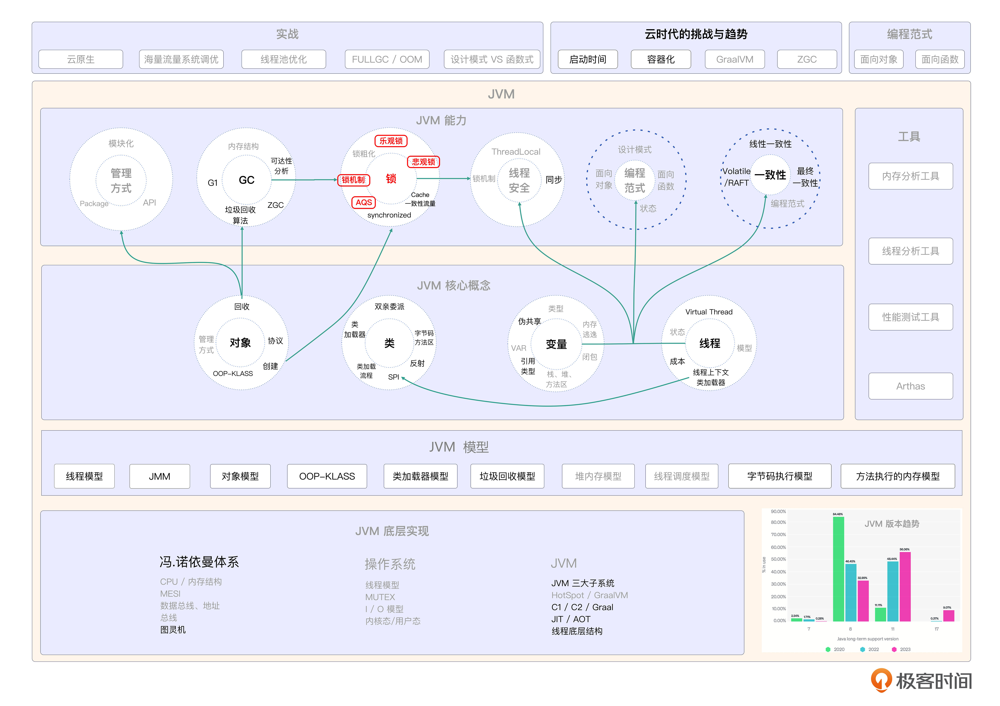

# 25｜锁家族的裂变：如何打造一个锁程序？
你好，我是康杨。

在多线程编程中，锁是一个非常重要的概念。了解不同类型的锁以及它们的特性和使用场合，能够帮助我们编写出高并发、高效率的程序。今天我们来聊聊Java中的各种锁，深入剖析这些锁的工作原理和应用场景，并了解如何使用AQS（AbstractQueuedSynchronizer）构造自定义锁。

## 锁的分类

Java 锁可以根据不同的维度进行分类，这里我列举了几种常见的分类方式。

### 乐观锁和悲观锁

乐观锁和悲观锁是并发控制领域的两种主要策略，它们在处理多线程对共享资源的访问时采用不同的方法。

乐观锁，顾名思义，是一种比较乐观的策略。它假设数据在同一时间被多个线程修改的概率比较小，因此不会在读取操作时对数据加锁。这种锁策略适用于读取操作远多于写入操作的场景。在 Java 中，原子操作类（如 AtomicInteger、AtomicLong 等）就是乐观锁的典型应用。乐观锁的核心思想是，在读取数据时，不考虑数据可能被其他线程修改的情况，只在数据写入时通过版本号机制进行校验。如果发现数据已经被其他线程修改，那么就放弃此次写入，重新读取数据并尝试再次写入。

悲观锁，则是一种比较悲观的策略。它假设数据在同一时间被多个线程访问的概率较大，因此会始终对数据进行加锁保护。这种锁策略适用于数据竞争比较激烈的场景。在 Java 中，同步关键字 Synchronized 或 ReentrantLock 就是典型的悲观锁。悲观锁的核心思想是，在任何时候，只允许一个线程对数据进行操作，其他线程必须等待，直到获得锁。这样就能确保数据在读取和写入过程中的安全性。

乐观锁适用于读多写少的场景，它通过版本号机制来避免数据冲突；而悲观锁适用于写多读少的场景，它通过始终加锁来保护数据的安全。在实际应用中，我们需要根据具体场景选择合适的锁策略，以实现高效的并发控制。

```java
// 假设你有一个counter类，你想给他添加一个线程安全的increment方法
public class Counter {
private volatile int count = 0;
public void increment() {
int current = count;
int next = current + 1;
if (count != current) // 这就是乐观锁的操作
throw new ConcurrentModificationException();
count = next;
}
}

```

### **独占锁和共享锁**

独占锁和共享锁是计算机科学中并发控制的两种锁策略。理解这两种锁策略对于掌握并发编程非常重要。

独占锁，正如其名，是一种只能被一个线程所持有的锁。当一个线程获得了独占锁，其他线程想要访问被独占锁保护的资源时，必须等待，直到锁被释放。在 Java 中，Synchronized 关键字和 ReentrantLock 类都实现了独占锁。

共享锁与独占锁相反，可以被多个线程同时持有。当一个线程想要获取共享锁，但如果当前已经有其他线程持有共享锁，那么这个线程必须等待。共享锁通常用于读操作远多于写操作的场景，这样可以提高程序的并发性能。例如，在数据库系统中，表的读锁就是一种共享锁。

下面是一个简单的 Java 程序，展示了独占锁和共享锁的使用。

```java
import java.util.concurrent.locks.Lock;
import java.util.concurrent.locks.ReentrantLock;
public class LockExample {
    // 使用独占锁保护临界区
    private final Lock exclusiveLock = new ReentrantLock();
    // 使用共享锁保护临界区
    private final Lock sharedLock = new ReentrantLock();
    public void exclusiveMethod() {
        // 获取独占锁
        exclusiveLock.lock();
        try {
            // 临界区
            System.out.println("Exclusive lock acquired");
        } finally {
            // 释放独占锁
            exclusiveLock.unlock();
        }
    }
    public void sharedMethod() {
        // 获取共享锁
        sharedLock.lock();
        try {
            // 临界区
            System.out.println("Shared lock acquired");
        } finally {
            // 释放共享锁
            sharedLock.unlock();
        }
    }
    public static void main(String[] args) {
        LockExample lockExample = new LockExample();
        // 创建两个线程
        Thread thread1 = new Thread(() -> lockExample.exclusiveMethod());
        Thread thread2 = new Thread(() -> lockExample.sharedMethod());
        // 启动线程
        thread1.start();
        thread2.start();
        // 等待线程执行完毕
        try {
            thread1.join();
            thread2.join();
        } catch (InterruptedException e) {
            e.printStackTrace();
        }
    }
}

```

在这个例子中，我们创建了一个名为 LockExample 的类，它有两个方法：exclusiveMethod() 和 sharedMethod()。这两个方法分别使用独占锁和共享锁保护它们的临界区。在 main() 方法中，我们创建了两个线程，分别执行这两个方法。由于 exclusiveMethod() 使用独占锁，因此只有一个线程可以访问临界区；而 sharedMethod() 使用共享锁，因此多个线程可以同时访问临界区。

### 公平锁和非公平锁

这两种锁在处理并发访问时有着不同的策略。

公平锁，是一种保证所有线程公平地获取锁的机制。这种锁按照线程到达的顺序来分配锁，确保了不会出现某个线程因为等待时间过长而饿死的情况。Java 中的 ReentrantLock 和 ReentrantReadWriteLock 就是公平锁的例子。

非公平锁则不保证线程获取锁的顺序，它只保证同一时刻只有一个线程能持有锁。这种锁可能会导致后来的线程优先获得锁，从而使先到的线程饿死。

这两种锁的应用场景各有不同。公平锁通常在需要保证所有线程公平访问共享资源的场景下使用，比如打印机、数据库连接等。以打印机为例，如果一个任务需要等待很长时间才能打印，那么使用公平锁就能保证这个任务不会被后来的任务挤掉，而是按照先来先服务的原则打印。然而，公平锁需要维护一个有序的队列，这会带来一定的开销，可能会降低性能。

非公平锁通常在需要优先处理较紧急的任务的场景下使用，比如 CPU 密集型任务。非公平锁的优点是可以减少 CPU 执行调度的频率，从而提高系统性能。

下面是一个简单的 Java 程序，展示了公平锁和非公平锁的使用。

```java
import java.util.concurrent.locks.Lock;
import java.util.concurrent.locks.ReentrantLock;
public class LockExample {
    // 使用公平锁保护临界区
    private final Lock fairLock = new ReentrantLock(true);
    // 使用非公平锁保护临界区
    private final Lock nonFairLock = new ReentrantLock(false);
    public void fairMethod() {
        // 获取公平锁
        fairLock.lock();
        try {
            // 临界区
            System.out.println("Fair lock acquired");
        } finally {
            // 释放公平锁
            fairLock.unlock();
        }
    }
    public void nonFairMethod() {
        // 获取非公平锁
        nonFairLock.lock();
        try {
            // 临界区
            System.out.println("Non-fair lock acquired");
        } finally {
            // 释放非公平锁
            nonFairLock.unlock();
        }
    }
    public static void main(String[] args) {
        LockExample lockExample = new LockExample();
        // 创建两个线程
        Thread thread1 = new Thread(() -> lockExample.fairMethod());
        Thread thread2 = new Thread(() -> lockExample.nonFairMethod());
        // 启动线程
        thread1.start();
        thread2.start();
        // 等待线程执行完毕
        try {
            thread1.join();
            thread2.join();
        } catch (InterruptedException e) {
            e.printStackTrace();
        }
    }
}

```

在这个例子中，我们创建了一个名为 LockExample 的类，它有两个方法：fairMethod() 和 nonFairMethod()。这两个方法分别使用公平锁和非公平锁保护它们的临界区。在 main() 方法中，我们创建了两个线程，分别执行这两个方法。由于 fairMethod() 使用公平锁，因此所有线程都会按照先来先服务的顺序获取锁；而 nonFairMethod() 使用非公平锁，因此线程获取锁的顺序并不确定。

## 锁的基本概念和实现

Java 中的锁主要通过 Synchronized 关键字以及 java.util.concurrent.locks 包中的接口和类实现。我们来看里面的一些基本概念。

1. 锁的状态：无锁（Unlocked）、偏向锁（Biased Locking）、轻量级锁（Lightweight Locking）、重量级锁（Heavyweight Locking）。
2. 锁的获取和释放：通过 acquire() 和 release() 方法实现。
3. 锁的升级：当一个线程获取锁时，如果锁的状态为偏向锁或轻量级锁，那么会尝试将锁升级为重量级锁。

## 锁的应用实例

下面我们来看一个简单的使用 Synchronized 关键字实现悲观锁的例子。

```plain
 public class Bank {
    private int money;
    public synchronized void withdraw(int amount) {
        if (money >= amount) {
            money -= amount;
        } else {
            System.out.println("余额不足");
        }
    }
}

```

## 使用 AQS 构建自定义锁

我们可以使用AQS （AbstractQueuedSynchronizer）实现一个自定义锁。AQS是一个用于构建锁和其他同步组件的基础框架，它使用一个 int 类型的 state 变量来表示同步状态。

1. 首先，我们需要创建一个继承自 AQS 的子类。这个子类将用于实现我们的自定义锁。

```java
import java.util.concurrent.locks.AbstractQueuedSynchronizer;
public class CustomLock extends AbstractQueuedSynchronizer {
}

```

1. 接下来，我们需要重写 AQS 中的一些方法，以便于实现自定义锁的功能。

```java
// 尝试获取锁，如果 state 为 0 则表示锁可用，否则返回 false
@Override
protected boolean tryAcquire(int arg) {
   return compareAndSetState(0, 1);
}
// 释放锁，将 state 设置为 0
@Override
protected boolean tryRelease(int arg) {
    setState(0);
    return true;
}
// 获取锁的线程数量
@Override
protected int getState() {
    return super.getState();
}

```

1. 现在我们已经创建了一个 CustomLock 类，接下来我们可以创建一个锁对象，并使用 tryLock 方法尝试获取锁。

```java
public class Main {
    public static void main(String[] args) {
        CustomLock lock = new CustomLock();
        // 尝试获取锁，如果成功返回 true，否则返回 false
        boolean acquired = lock.tryLock();
        if (acquired) {
            try {
                // 临界区
                System.out.println("Lock acquired");
            } finally {
                // 释放锁
                lock.unlock();
            }
        } else {
            System.out.println("Failed to acquire lock");
        }
    }

}

```

在上面例子中，我们创建了一个 CustomLock 对象，并使用 tryLock 方法尝试获取锁。如果成功获取到锁，我们可以在临界区执行一些操作，然后在 finally 块中释放锁。如果 tryLock 方法返回 false，说明锁已被其他线程占用，我们无法获取到锁。

这就是如何使用 AQS 实现一个简单的自定义锁。你可以根据实际需求对 CustomLock 类进行扩展，以实现更复杂的功能，例如公平锁等。

## 重点回顾

在多线程编程中，锁是控制多个线程对共享资源访问的关键概念。了解不同类型的锁以及它们的特性和使用场合有助于我们编写出高并发、高效率的程序。Java 中的锁种类繁多，包括乐观锁、悲观锁、独占锁、共享锁、公平锁、非公平锁等。

在实际应用中，我们需要根据具体场景选择合适的锁策略，以实现高效的并发控制。例如，乐观锁适用于读多写少的场景，通过版本号机制来避免数据冲突；悲观锁适用于写多读少的场景，始终对数据进行加锁保护。此外，我们还了解到公平锁和非公平锁的区别，公平锁按线程顺序分配锁，避免饥饿现象，适用于读操作远多于写操作的场景；非公平锁则不保证线程获取锁的顺序，适用于写操作密集的场景。

在 Java 中，锁可以通过 Synchronized 关键字以及 java.util.concurrent.locks 包中的接口和类实现。此外，通过使用 AQS（AbstractQueuedSynchronizer）框架，我们可以轻松地构建自定义锁，以满足特定场景的需求。

## 思考题

学而不思则罔，学完这节课之后，我给你留两个问题。

1. 乐观锁和悲观锁有什么区别，主要应用在那些场景？
2. 如何打造一个自定义的锁程序？

希望你认真思考，然后把思考后的结果分享到评论区，我们一起讨论，如果有收获的话，也欢迎你把这节课的内容分享给需要的朋友，我们下节课再见！

## 💡 点亮你的知识框架图

