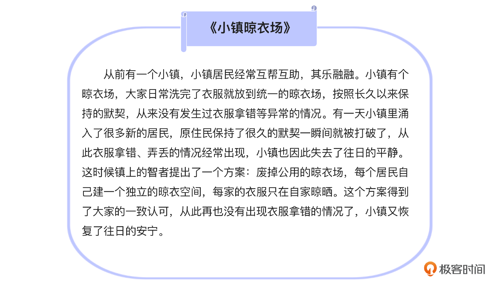
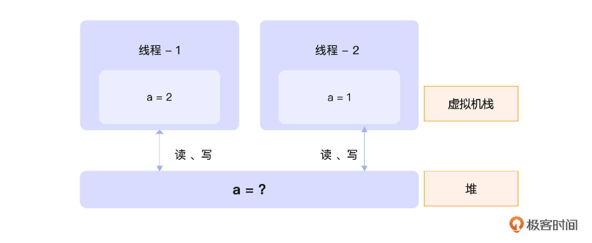
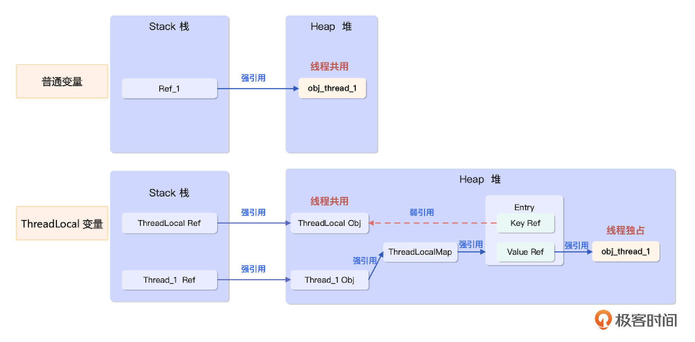
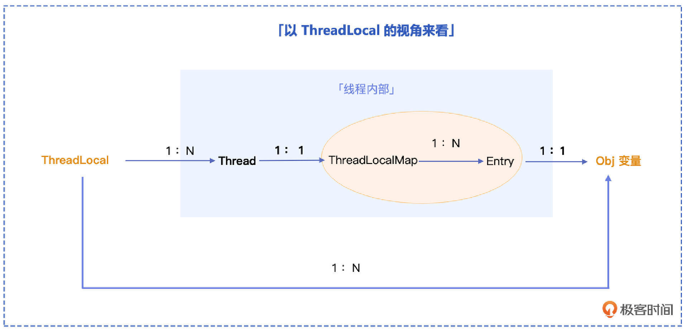
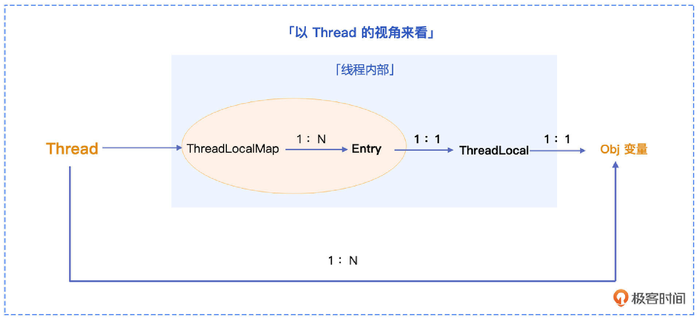
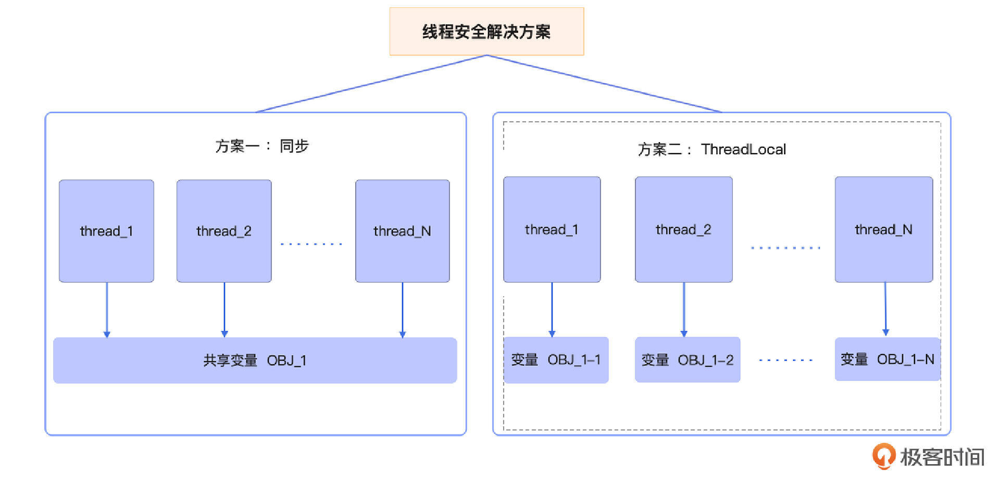
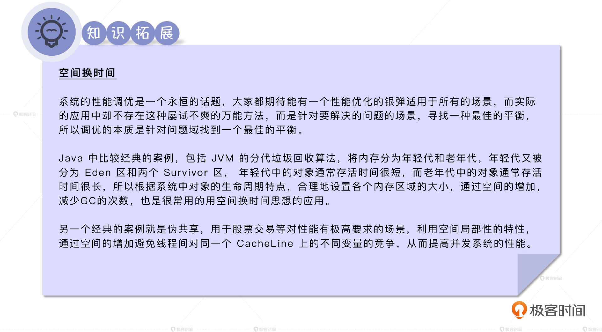
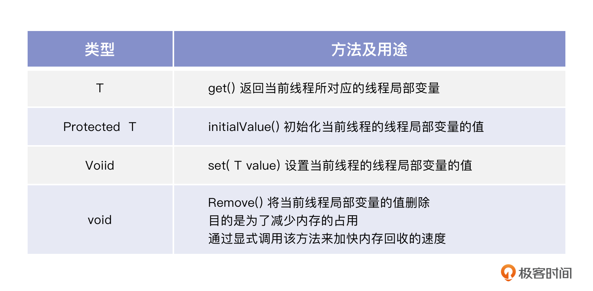
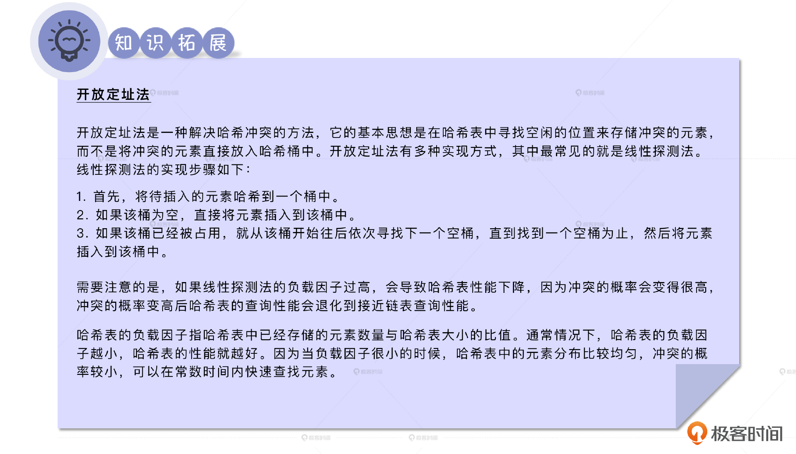
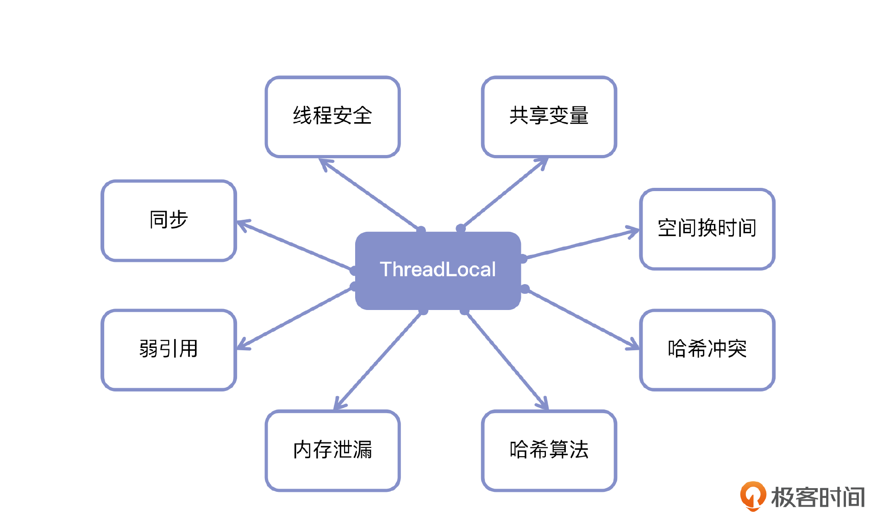

# 26｜ThreadLocal（上）：线程安全的另类实现思路
你好，我是康杨。

今天我们来聊聊线程安全的另一种经典实现：ThreadLocal。在正式学习之前，我想先给你讲个故事，希望这个故事能帮你体会到ThreadLocal背后的设计思想。



这个故事其实体现了ThreadLocal的设计原理。我们都知道，在多线程编程中，如果多个线程共享同一个变量，而没有应用类似乐观锁、悲观锁的同步机制时，很容易出现线程安全问题。



就像图中 a 的值，最终到底是1还是2完全是不可预知的，在没有同步机制的情况下，它既可能是1也可能是2。而ThreadLocal绕过了线程间如何竞争一个变量的惯常思路， **通过为每个线程提供一个线程独享的变量副本的方式**， **以用空间换时间的思想从另一个角度解决了线程安全问题。** 而这也是我们日常解决问题时可以借鉴的一种思想，当用通常的方式似乎无解的时候，也许换个视角，思路就完全打开了，借用古人的一句诗就是“行到水穷处，坐看云起时”。

在这个故事中，每个人独立的晾衣空间就相当于 ThreadLocal，晾衣空间中的衣服就相当于线程中的变量。每个人只能用自己的晾衣空间，也只能晾晒自己的衣服，从而避免了衣服被拿错的情况。当然，任何事情都是一体两面，为了解决线程安全的问题我们引入了ThreadLocal，但是对于 ThreadLocal 的误用又会带来其他风险，比如内存泄漏。

所以接下来两节课，我将完整讲述 ThreadLocal 的原理、演进以及最佳实践，并结合实际的场景、案例，展示如何正确应用 ThreadLocal，让你在享受 ThreadLocal 带来便利的同时，避免掉坑。

## ThreadLocal 是什么？

ThreadLocal 也叫 **线程局部变量，** 最早出现在 JDK 1.2 版本中，采用了为每个线程提供一个独立的变量副本，来避免变量共享的思路，以实现线程安全，或者可以说避开了线程安全。当使用ThreadLocal维护变量时，ThreadLocal 会为每个使用该变量的线程提供线程独享的变量副本，每个线程完全独立地改变自己的副本，而不会影响其他线程所对应的副本，也就是上面案例中每个居民不再用共用的晾衣场，而是用自己独立的晾衣空间。

ThreadLocal是如何做到的呢? 让我们先 **从一个最简单的变量读取和设置开始。**

```plain
public class Wine {
     private static ThreadLocal obj_thread = new ThreadLocal();
     private Integer  obj_common = new Integer(10);
     public static void main(String[] args) {
      Wine a = new Wine();

      //情况1：普通变量的设置和获取
      a.obj_common = new Integer(5);
      System.out.println(a.obj_common);

      //情况2：ThreadLocal变量的设置和获取
      obj_thread.set(new Integer(6));
      System.out.println(obj_thread.get());
     }
}

```

我们发现ThreadLocal在设置和读取变量上，还是和普通变量存在很大差别的。当我们需要读取ThreadLocal管理的变量时，不能直接读取，而是需要调用ThreadLocal对象的 get()方法，同理，当我们需要设置ThreadLocal的变量时，也需要借助ThreadLocal的set方法。这里面到底蕴藏了怎样的玄机呢？让我们赶紧潜入JVM内部，一探究竟。

### ThreadLocal的内存布局



我们看到在JVM内部的普通变量还是和我们预想的一样，在虚拟机栈上分配的变量直接指向了在堆上创建的一个对象的内存地址，但是当我们用ThreadLocal去管理一个变量的时候，中间多了很多其他的元素。下面我们来分别介绍下它们以及它们在这件事上起到的作用。

首先是我们非常熟悉的 **Thread对象**，为了协助ThreadLocal，Thread 对象在它的内部专门创建了一个 ThreadLocal.ThreadLocalMap 对象，打开Thread的源码，我们会看到这样一行。

```plain
ThreadLocal.ThreadLocalMap   threadLocals =  null;

```

**ThreadLocalMap** 是 ThreadLocal 的一个内部类，是一个类Map的实现，类 Map是指它虽然提供了类似 Map 的操作，但没有实现 Map 接口；ThreadLocalMap 用数组存储数据，没有像 HashMap 等其他 Map 结构一样，用链表+数组的方式实现。ThreadLocalMap包含了一个 **Entry 数组**，每个 Entry 对象包含一个 ThreadLocal 变量的引用和一个对应的值。

在 ThreadLocalMap 中，ThreadLocal 变量的引用被用作哈希表的键，而对应的值的引用则被存储在 Entry 对象中。由于每个线程都有自己独立的 ThreadLocalMap 对象，因此不同线程中的 ThreadLocal 变量是独立的，不会相互干扰。

当一个线程创建一个ThreadLocal 变量时，它会在自己的 ThreadLocalMap 中添加一个 Entry 对象，其中ThreadLocal变量的引用被用作键，而对应的变量的引用则被存储在 Entry 对象的 Value 中。当线程需要访问 ThreadLocal 变量时，它会从自己的 ThreadLocalMap 中获取对应的值。

#### **Thread** **、ThreadLocal、 ThreadLocalMap及Entry** **之间的关系**

ThreadLocal 和 Thread、ThreadLocalMap、Entry 以及真正的堆上的对象关系是怎样的呢？你可以看下面的图片。



看到这里你可能有点困惑，一个ThreadLocal 不是对应一个Obj 变量吗，怎么成对应多个了？其实站在单个线程的视角来看，你说得没错。在单个线程内，一个ThreadLocal只会对应一个Obj变量。但是当你站在全局的视角来看，就会发现其实 **一个ThreadLocal对象对应着多个Obj变量，只是其中任意一个Obj 变量只会属于一个确定的线程**，这也是在实际使用中将ThreadLocal通过private static方式设置成全局变量的原因所在，关于这一部分的详细情况我将在下一节为你展开分析。

为了更好地理解ThreadLocal，我们换个方向，以Thread的视角再来审视下它们之间的关系 。每一个Thread对象都有一个自己独享的ThreadLocalMap对象，ThreadLocalMap维护了一个Entry的数组，Entry的Key部分就是ThreadLocal对象的弱引用，而Value的部分是指向内存对象的强引用。



现在谜底揭开了，原来ThreadLocal正是借助 **Thread类和ThreadLocal的内部类ThreadLocalMap** 为每个线程创建了线程独享的变量副本来实现的。希望你能体会下这种遇到复杂问题时，通过多视角拆解，将复杂问题简单化的方式。

### 与其他线程安全方案的对比

到这里，我们就解锁了这一章最后一个线程安全的机制：ThreadLocal。现在让我们简单回顾下不同方式在实现线程安全上的区别。



同步与ThreadLocal在JVM内存布局上的区别

1. 同步：通过 **以时间换空间** 的思想，实现线程操作变量的全局排序线性化来保证线程安全。不管是volatile、synchronized还是lock，本质都是基于共享存储的全局排序线性化，第二章我们也详细解读过，这里你可以简单回顾一下。

2. ThreadLocal ：另辟蹊径，反其道而行之，采用 **以空间换时间** 的思想，通过为每个线程分配一个独享的变量的方式，从根本上绕开了线程安全的问题。虽然解决了线程安全的问题 ，但是也失去了同步方式带来的线程通信方面的便利，但是ThreadLocal通过采用其他的方式实现了父子线程间通信的机制，这部分详细介绍我将在下节课为你展开。


所以同步这种方式的解法着眼于直面应对问题，而ThreadLocal的解法在于换个角度，绕开问题，二者殊途而同归，在不同的业务场景，解决了同样的问题，所以具体采用哪种方式，建议你具体问题具体分析，避免一概而论。



## ThreadLocal的使用

现在我们已经知道了ThreadLocal的设计原理以及各种元素间的关系。内部的事情梳理清楚了，下面我们再来看ThreadLocal的使用。

### 常用方法

刚刚在聊到ThreadLocal设置和读取变量的问题时，我们也提到了ThreadLocal中的两个关键方法：get()方法和set方法。除了这两个方法外，initialValue()方法和Remove()方法也很常用，我将这四个方法整理成了一张表格，你可以看一下。



### 如何使用ThreadLocal？

ThreadLocal使用起来非常简单，主要分为三步。

1. 创建一个ThreadLocal对象。
2. 通过调用 ThreadLocal 的 set() 方法来设置当前线程的变量副本。
3. 调用 ThreadLocal 的 get() 方法获取当前线程的变量副本。

下面我给你一个例子，你来体会一下，借助ThreadLocal来设定三所学校的基础学号。

```java
public class SchoolManage {
   private static final Integer[]  ids = {1,10,20};
    private static ThreadLocal<Integer> counter = new ThreadLocal<Integer>() {
        // 关键点1：这里我们设定所有线程局部变量的基础值
        protected Integer initialValue() {
            return new Integer(10000);
        }
    };
    public static void main(String[] args) throws InterruptedException {
        CountDownLatch cdl = new CountDownLatch(ids.length);
        Stream.of(ids).forEach(i->{
            new Thread(()->{
                //关键点2：在这里每个线程根据自己独特的信息设定专属于这个线程的值
                counter.set(counter.get()+i);
                System.out.println(String.format("School_%d has %d students",i ,counter.get()));
                //关键点3：线程局部变量不用的时候记得及时删除
                counter.remove();
                cdl.countDown();
            }).start();
        });
        cdl.await();
    }
}

School_1 has 10001 students
School_10 has 10010 students
School_20 has 10020 students

```

跟着我的步调，现在你应该学会如何使用ThreadLocal了吧？不过光知道ThreadLocal的使用方法还远远不够，为了让你更好地掌握ThreadLocal的使用和优化技巧，加深对Java多线程编程的理解，我们还需深入到ThreadLocal源码中去看看其中的原理

## ThreadLocal源码解读

在开始解读之前，你先来思考几个问题

1. 当我们设置一个ThreadLocal变量的时候发生了什么？
2. 如何实现对ThreadLocal变量的快速访问？
3. ThreadLocal如何解决内存泄漏的问题？

这些内容是我们深入ThreadLocal原理的关键，下面我来为你一一解答。

### set方法解读

设置ThreadLocal的变量用到了ThreadLocalMap中的set方法，下面我们来解读一下这一方法。

```plain
public void set(T value) {

// 1.获取当前执行的线程
    Thread t = Thread.currentThread();
// 2.获取当前线程中的属性 threadLocalMap，如果threadLocalMap 不为空则直接更新，否则创建一个threadLocalMap并赋值，因为是操作当前线程的数据，所以不存在并发的问题
    ThreadLocalMap map = getMap(t);
    if (map != null)
        map.set(this, value);
    else
// 3.初始化threadLocalMap并赋值
        createMap(t, value);
}

```

从上面的源码中可以看出，ThreadLocal的set()方法主要包含2个步骤。

第一步：获取当前线程的ThreadLocalMap对象。如果当前线程还没有ThreadLocalMap对象，需要先创建一个新的ThreadLocalMap对象，并将其保存在当前线程的ThreadLocalMap对象中

第二步：将当前ThreadLocal对象和变量副本的值作为参数，调用ThreadLocalMap的set()方法将其保存在ThreadLocalMap中。在set()方法中，首先根据ThreadLocal对象的HashCode值计算出在 Entry数组中的位置，然后使用 **开放定址法** 解决Hash冲突找到空闲的位置，将ThreadLocal对象的引用和变量副本的引用保存在这个位置上。

由于ThreadLocal的set()方法是在当前线程的ThreadLocalMap中保存变量副本的，因此不同线程之间的变量副本是独立的，不会相互影响。

### **如何在ThreadLocalMap中快速定位\*\*\*\*ThreadLocal对象？**

你可以先看一下我给出的源码和注释。

```plain
private Entry getEntry(ThreadLocal<?> key) {

    // 1. 使用ThreadLocal对象的hashCode作为下标，在ThreadLocalMap对象的table数组中查找对应的Entry对象
    int i = key.threadLocalHashCode & (table.length - 1);

    Entry e = table[I];
    //  2.如果找到了对应的Entry对象，则直接返回该Entry对象
    if (e != null && e.get() == key)
        return e;
    else
        return getEntryAfterMiss(key, i, e);
}

private Entry getEntryAfterMiss(ThreadLocal<?> key, int i, Entry e) {
     // 获取 threadlocalMap 维护的Entry数组，每个 entry 的 key 是 threadlocal，value 是所关联的变量
    Entry[] tab = table;
    int len = tab.length;

    while (e != null) {
        ThreadLocal<?> k = e.get();
        // 场景1：定位到所要找的ThreadLocal的场景，直接返回
        if (k == key)
            return e;
        // 场景2：这个方法非常关键，是threadlocalmap解决内存泄漏问题的关键点，我们稍后马上重点介绍，此处只需要知道这是threadlocalmap清除无效数据的方法
        if (k == null)
            expungeStaleEntry(i);
        else
        // 场景3：这种情况表示entry数组当前的位置已经存在其他的有效数据，所以需要遵照开放定址法继续遍历查找
            i = nextIndex(i, len);
        e = tab[i];
    }
    return null;
}

```

getEntryAfterMiss()方法展示了用 **线性探测法** 来避免哈希冲突的部分细节。线性探测法是一种简单的解决哈希冲突的方法，它会在哈希表中依次查找下一个可用的位置，直到找到一个空的位置或者遍历完整个哈希表。

这种方法虽然简单，但可能会导致哈希表出现较长的查找链，从而影响哈希表的性能。因此，在使用线性探测法时，需要对哈希表的容量和负载因子进行适当地调整，以保证哈希表的性能和空间效率。Netty 为了追求高性能对此进行了优化 ，这部分我们下节课我会展开聊聊。



### ThreadLocal是如何解决内存泄漏问题的？

**关键点1：弱引用** **。** ThreadLocalMap 的每个 Entry 都是一个对键的弱引用，但是每个 Entry 都包含了一个对值的强引用。

```plain
static class Entry extends WeakReference<ThreadLocal<?>> {
    Object value;
    Entry(ThreadLocal<?> k, Object v) {
        super(k);
        value = v;
    }
}

```

**关键点2** **：将所有键为 null 的 Entry 的值设置为 null，从而使得这个值可以被回收，来避免内存泄漏。** staleSlot表示它下标的数组元素就是一个可回收数据。从这个位置往后继续查找可回收数据，直到碰到 `slot == null` 的情况才结束。在遍历过程中，遇到可回收数据就删除，遇到有效数据，就把它放到离正确的位置最近的一个下标，来提升下次查找的效率，这样的技巧也是我们在阅读源码时需要深刻领悟的。

```plain
private int expungeStaleEntry(int staleSlot) {

    // 获取threadlocal数组
    Entry[] tab = table;
    // 获取数组的长度
    int len = tab.length;

    // 这是解决掉Threadlocal所维护的变量内存泄漏的关键，虽然entry对threadlocal的key是弱引用，但是针对变量的value是强引用
    tab[staleSlot].value = null;
    tab[staleSlot] = null;
    size--;
    Entry e;
    int i;

    //从 staleSlot + 1的位置开始搜索可回收数据，直到 slot == null 才结束。
    for (i = nextIndex(staleSlot, len);
         (e = tab[i]) != null;
         i = nextIndex(i, len)) {

        //获取当前遍历节点 entry 的key.
        ThreadLocal<?> k = e.get();

        //场景1 ：说明k表示的threadLocal对象 已经被GC回收了... 当前entry属于脏数据了...
        if (k == null) {
            e.value = null;   //非常关键：使ThreadLocal所维护的变量可被GC
            tab[i] = null;    //使entry对象可以被GC
            size--;
        } else {
        //场景：当前entry对象是正常数据，但是前面的数据有可能清理过，并且这个entry对象很有可能因为hash冲突存放时后移了，此时
        // 正好优化位置，方便下一次更高效地定位，重新计算当前entry对应的 index
            int h = k.threadLocalHashCode & (len - 1);
            //这个场景说明当前entry存储时确实发生过hash冲突，被向后偏移过
            if (h != i) {
                //将entry当前位置 设置为null
                tab[i] = null;
                //可以重新存放entry的位置。
                while (tab[h] != null)
                    h = nextIndex(h, len);
                //找到位置后重新放置
                tab[h] = e;
            }
        }
    }
    return i;
}

```

## 重点回顾

好了，这就是今天的主要内容，ThreadLocal相关的知识确实比较繁杂，所以我总结了ThreadLocal的一些要点，来帮助你查漏补缺。



ThreadLocal是一种管理变量的方式，通常被 private static 修饰作为全局变量使用，主要用在需要考虑线程安全的场景，尤其是需要在线程间隔离，而在方法间共享变量的场景。它并不解决线程间共享数据的问题，而是通过空间换时间的方式，在每个线程中创建独立的变量副本，避免了多线程并发访问时的竞争和线程安全问题。ThreadLocal是一个泛型类，可以使用不同的类型来保存变量副本。

ThreadLocal在设计上有很多经典的实现，值得我们去学习、体会，比如采用了 **开放定址法** 解决元素定位的问题，比如将ThreadLocalMap的Entry中的Key即ThreadLocal 的引用设置为弱引用，通过set 方法调用 replaceStaleEntry 方法，回收键为 null 的 Entry 对象的值和 Entry 对象本身等手段尽量避免内存泄漏。之所以说尽量，是因为只有我们在日常编程中结合ThreadLocal的设计才能真正避免内存泄漏，这部分的详细介绍我将在下节课为你展开。

## 思考

Threadlocal能够处理哪些问题，你是否在工作中应用过Threadlocal？在这个过程中你是否看到了ThreadLocal的局限，比如线程池场景下有哪些问题，又该如何解决？欢迎你把你对Threadlocal的应用分享到评论区，我们一起交流讨论，也欢迎你把这节课分享给需要的朋友，邀他一起学习。我们下节课再见！