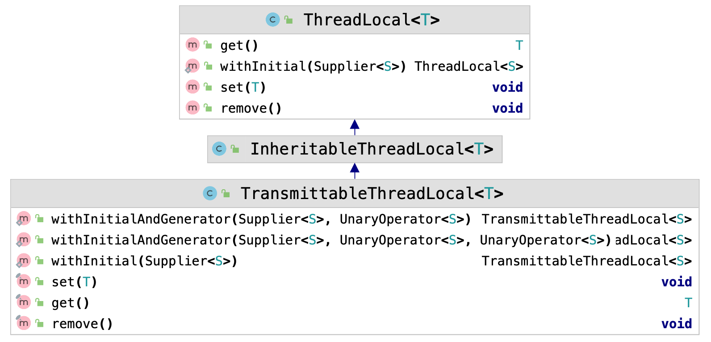
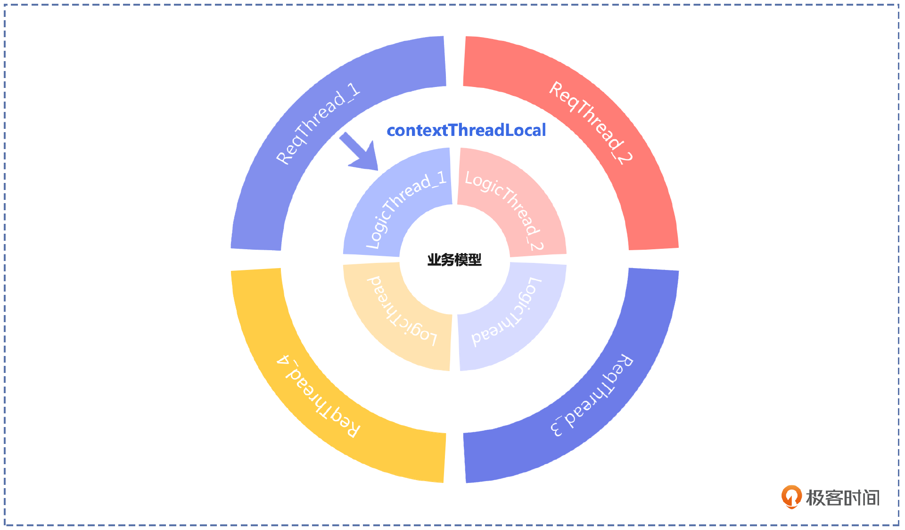
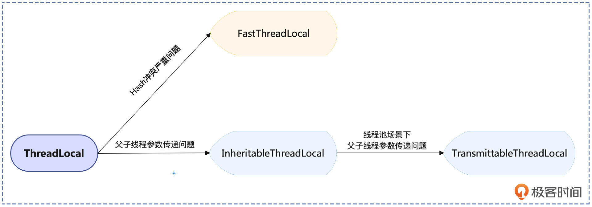
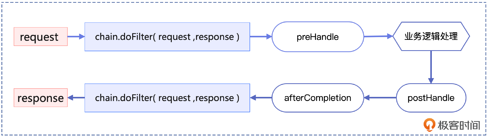
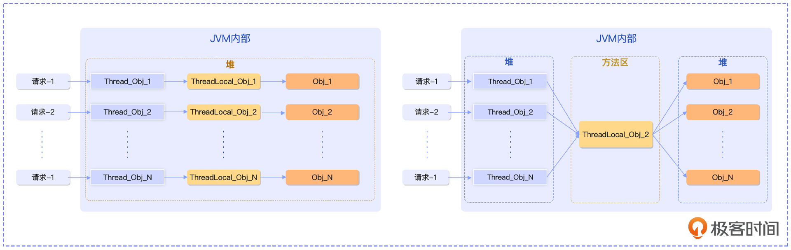
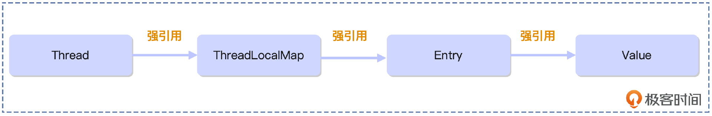
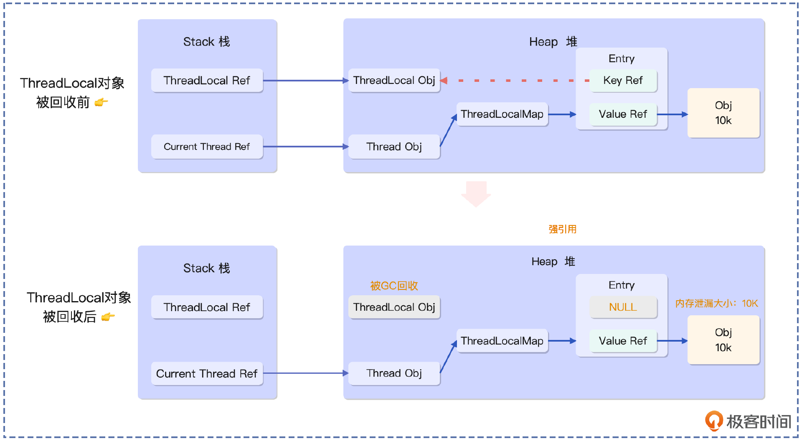
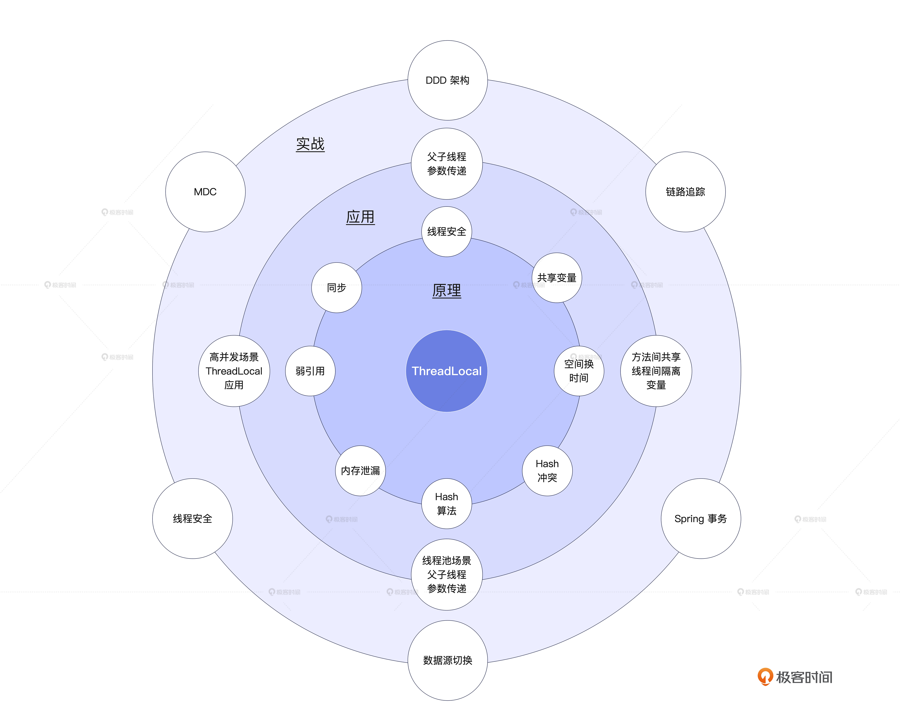
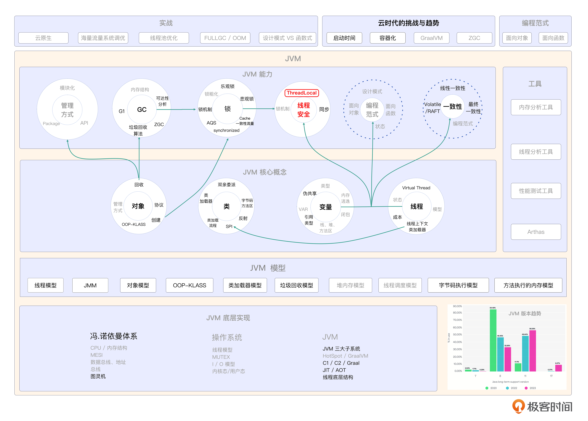

# 27｜ThreadLocal（下）：ThreadLocal家族成员及应用指南
你好，我是康杨。

通过上节课的学习相信你对 ThreadLocal 已经有了深刻的理解，但是在复杂的现实业务场景中，单靠ThreadLocal 所能解决的问题是有限的，我们需要通过了解ThreadLocal家族的其他成员，以及ThreadLocal 在实际场景中的各种应用，来进一步提升ThreadLocal的战斗力，帮你在现实中解决更加棘手的问题。

接下来就让我们进入ThreadLocal的江湖，首先出场的就是ThreadLocal家族的4个成员。

## ThreadLocal家族

通过上节课的学习，我们知道ThreadLocal是在JDK 1.2中引入的，解决了一个线程中多个方法间信息传递的问题。在生产环境中，为了提升系统的性能，充分发挥多核CPU的优势，我们经常通过增加线程或者异步的方式来更好地发挥底层硬件的性能。

### **InheritableThreadLocal**

在这种情况下，就自然引出了 **父子线程** 的问题，也就是如何优雅地把父线程的信息传递给子线程，这显然超出了ThreadLocal的能力范围。所以在JDK 1.3 中，JVM 引入了 **InheritableThreadLocal**，在创建子线程时将父线程的变量副本复制到子线程中，实现子线程继承父线程的变量副本，从而有效解决父子线程之间参数传递的问题，实现了跨线程的变量传递。

下面我们通过例子来展示一下。

```plain
private final static ThreadLocal<String> threadLocalVar1 = new ThreadLocal<>();

private final static InheritableThreadLocal<String> threadLocalVar2 = new InheritableThreadLocal<>();

public static void main(String[] args) {
    threadLocalVar1.set("GoodBoy");
    Runnable runnable1 = () ->
    System.out.println(Thread.currentThread().getName()+"_"+threadLocalVar1.get());
    new Thread(runnable1).start();

    threadLocalVar2.set("GoodGirl");
    Runnable runnable2 = () ->
    System.out.println(Thread.currentThread().getName()+":"+threadLocalVar2.get());
    new Thread(runnable2).start();
}

Thread-0_null
Thread-1:GoodGirl

```

从例子中，你会发现当使用ThreadLocal时，父线程中创建的线程局部变量在子线程中是无法取到的，但是借助InheritableThreadLocal，我们在子线程中实现了获取父线程中设置的线程局部变量。

InheritableThreadLocal 解决了ThreadLocal 不能跨父子线程进行参数传递的问题，但是当遇到线程池的场景又会触碰到它的能力边界。因为InheritableThreadLocal 在一开始创建子线程时，就对子线程进行所有可继承线程局部变量的赋值，但在通过线程池管理线程的场景下，由于父子线程都是由线程池进行管理，线程在每次使用之前不见得都是需要创建才能使用的，所以会出现即使使用了InheritableThreadLocal，也无法对子线程有效赋值的情况。

### **TransmittableThreadLocal**

好在这个问题，业内已经有了解决方案，阿里巴巴开源的 **TransmittableThreadLocal** 实现了在线程池的场景下也能正常访问父线程设置的线程局部变量。从而解决了线程池场景下父子线程间参数传递的问题。

你可以看一下TransmittableThreadLocal 与其他两个ThreadLocal 的关系。



下面让我们通过一个经典的案例来演示 **如何使用 TransmittableThreadLocal**。

首先我们在pom.xml 文件中引入maven依赖。

```plain
<dependency>
    <groupId>com.alibaba</groupId>
    <artifactId>transmittable-thread-local</artifactId>
    <version>2.14.2</version>
</dependency>

```

然后我们模拟现实中真实的业务场景，用两个线程池来协作完成业务请求的处理。第一个线程池用于和外部请求交互，接收和处理请求，设置相应的上下文环境。第二个线程池用于单纯的业务逻辑处理，借助 TransmittableThreadLocal 类型变量 contextThreadLocal，我们在逻辑处理线程LogicThread中读取到了ReqThread中设置的上下文信息，从而实现了核心业务逻辑和外部请求之间的解耦。

```plain
public class ReqService {
    private static final  int threadCnt = 3;
    private static TransmittableThreadLocal<Integer> contextThreadLocal = new TransmittableThreadLocal<>();

    //接收和处理请求的线程池
    private static ExecutorService mainExecutors = Executors.newFixedThreadPool(threadCnt);
    //真正处理业务逻辑的线程池
    private static ExecutorService execExecutors =
            TtlExecutors.getTtlExecutorService(Executors.newFixedThreadPool(threadCnt));

    public static void main(String[] args) {

        IntStream.range(0,threadCnt).forEach(i->{
            mainExecutors.submit(new ReqThread(i));
        });
        try {
            Thread.sleep(600);
        } catch (InterruptedException e) {
            e.printStackTrace();
        }
        execExecutors.shutdown();
        mainExecutors.shutdown();
    }

    // 此处模拟接收请求的线程
    static class ReqThread implements Runnable {
        private int i;
        public ReqThread(int i) {
            this.i = i;
        }
        @Override
        public void run() {
            System.out.println(Thread.currentThread().getName() + ":" + i);
            // 此处设置线程的上下文
            contextThreadLocal.set(i);
            execExecutors.submit(new LogicThread(Thread.currentThread().getName()));
        }
    }

    // 此处模拟实际处理业务逻辑的线程
    static class  LogicThread implements Runnable {
        private String parentThreadName;
        public LogicThread(String parentThreadName) {
            this.parentThreadName = parentThreadName;
        }
        @Override
        public void run() {
            System.out.println( "parentThreadName:" + parentThreadName + ":" + contextThreadLocal.get() );
        }
    }
}

```

为了帮你更好地理解上面这段代码，我画了一张图。结合图片，你会发现这种写法既符合高内聚、低耦合的思想，同时也符合了单一职责原则（Single Responsibility Principle，SRP），你可以仔细体会一下。



### FastThreadLocal

最后一个出场的是 **FastThreadLocal**。上节课，我们提到ThreadLocalMap是通过线性探测的开放定址法解决Hash冲突的问题，当Hash冲突严重时该方案会出现性能问题。为此Netty进行了优化，也是运用空间换时间的思想，通过用一个属性保存map的下标位置，用下标直接找到对应的位置，来应对大数据量和大并发的场景。但是FashThreadLocal在使用时有一个需要特别注意的地方，就是 **必须与Netty提供的FastThreadLocalThread结合使用** 才能发挥作用。

至此，ThreadLocal家族的成员已经全部给你介绍完了，我们认识了支持在方法间传参的ThreadLocal、为了解决父子线程间传参的InheritableThreadLocal、线程池场景下父子线程 传参的解决方案 [TransmittableThreadLocal](https://github.com/alibaba/transmittable-thread-local)，以及 Netty 为了追求高性能打造的 [FastThreadLocalThread](https://github.com/netty/netty)。



## ThreadLocal家族的应用场景

不知道此时你是否有一种感觉，就是 **任何一个解决方案都有它的局限性也有它应用的场景。** 所以在现实环境中选择哪个解决方案，要根据需求而定，对问题本质的理解远远比用什么工具去解决更加重要，我们既要避免用牛刀去杀鸡，也要避免用杀鸡刀去宰牛。

下面我来介绍一下现实场景中各个ThreadLocal的实际应用，向你更好地诠释这一点，希望能助你在遇到实际问题时，合理地应用ThreadLocal。

### **非线程安全转化为线程安全**

在JDK 对外提供的各种类中，并不是所有类都是线程安全的，而ThreadLocal一个非常重要的作用就是能将这些非线程安全的类以线程安全的方式使用。比如 SimpleDateFormat 本不是线程安全的，通过ThreadLocal的改造却可以当成线程安全的类来使用。

我给出了一段示例代码，我们看看ThreadLocal具体是怎么做的，通过对SimpleDateFormat变量的封装 ，我们把一个非线程安全的SimpleDateFormat变量，变成了线程安全的 ThreadLocal，这其实也是一个经典的装饰器模式（Decorator Pattern）的应用。当然如果你用的是JDK 1.8以上版本，也可以直接使用DateTimeFormatter代替SimpleDateFormat ，它直接就是线程安全的。

```plain
ThreadLocal<SimpleDateFormat> sdf = new ThreadLocal<SimpleDateFormat>() {
    @Override
    protected SimpleDateFormat initialValue() {
        return new SimpleDateFormat("yyyy-MM-dd HH:mm:ss");
    }
};

```

### **解决跨层传递变量的问题**

在复杂的系统中，可能需要在不同的层之间传递变量，例如在Controller层中获取用户信息，然后在Service层中使用用户信息。用ThreadLocal可以 **在当前线程中存储变量值，避免跨层传递变量的问题。**

在真实业务场景中，通常HTTP请求是通过网关进行接入，通过网关进行系统的安全防护和请求信息的解析。通过采用 **拦截器 +ThreadLocal** 的方式，将解析的请求信息存储到threadLocal中，利用其线程隔离特性，把这个请求相关的信息透传给下游。



```plain
// 在上下文中传递的信息
public class  Context {
    private String ip;
    public String getIp() {
        return ip;
    }
    public void setIp(String ip) {
        this.ip = ip;
    }
}

public class ContextHttpInterceptor implements HandlerInterceptor {

    private static  final ThreadLocal<Context> contextThreadLocal = new ThreadLocal<Context>();

    @Override
    public boolean preHandle(HttpServletRequest request, HttpServletResponse response, Object o)  throws Exception {
        try {
            Context context = new Context();
            String ip = request.getParameter("ip");
            if (StringUtils.isNotBlank(ip)){
                context.setIp(ip);
            }
            contextThreadLocal.set(context);
        }catch (Exception e){
        }
        return true;
    }

    @Override
    public void postHandle(HttpServletRequest request, HttpServletResponse resposne, Object o,
                           ModelAndView modelAndView) throws Exception {

    }
    @Override
    public void afterCompletion(HttpServletRequest request, HttpServletResponse resposne,
                                Object o, Exception e) throws Exception {
        contextThreadLocal.remove();
    }
}

```

### ThreadLocal其他应用场景

除此之外，ThreadLocal 在以下场景也得到了广泛应用。

- 链路追踪场景；
- Spring的事务管理器中；
- 全链路流量压测中，压测标记透传；
- 流程编排引擎的上下文传递场景；
- 多数据源场景下，切换数据源查询数据；
- DDD中六边形架构、菱形架构，通过ThreadLocal实现各层之间的数据传递。

感兴趣的话，欢迎你在评论区和我一起探索如何更好地使用ThreadLocal。

## 最佳实践

ThreadLocal虽然很强大，并且在各种业务场景和中间件解决方案中都得到了广泛地应用 ，但是任何事都是一体两面的，好用的同时也隐藏着风险，稍不留心就容易掉坑。下面我就把我遇到的一些坑点和使用ThreadLocal的一些小技巧分享给你，希望能帮你在日常工作中规避掉这些风险，那接下来就让我们进入到最佳实践环节。

### 小技巧：ThreadLocal变量的初始化

JDK8 提供了很多功能，能够使代码更加简洁和优雅 ，比如下面的ThreadLocal的初始化。

```plain
//  写法一：通常写法
private static final ThreadLocal<String> THREAD_LOCAL_Common = new ThreadLocal<String>(){
    protected String initialValue() {
        return "Hello World";
    }
};
// 写法二： JDK 1.8 写法
private static final ThreadLocal<String> THREAD_LOCAL_JDK8 = ThreadLocal.withInitial(()->"Hello World");

```

和一般写法相比，JDK8的写法是不是看起来更加简洁了！

### 小技巧：将ThreadLocal设置为全局变量

我们上节课阐述Thread、ThreadLocal、ThreadLocalMap、Entry之间的关系时，曾说到建议将ThreadLocal设置成全局变量，你有没有想过为什么这样做呢？

**将ThreadLocal设置成static，主要是为了提升内存效率。** 如果ThreadLocal变量不是static的，针对某一个变量，每个线程都会有一个单独的ThreadLocal变量，假如有100个线程那就需要创建100个ThreadLocal对象，这在内存使用上是相当低效的。如果将ThreadLocal设置为static，那么所有对象就只需要一个ThreadLocal变量，大大节省了内存。

而且设置成static的话，ThreadLocal会在方法区分配，否则的话就是在堆分配， 这很可能成为触发GC的一个诱因，这在高并发、高性能的系统中是需要格外注意的，避免成为压缩骆驼的最后一根稻草。



### 小技巧：ThreadLocal对象的用后即删

这里我先给出推荐写法。

```plain
try {
  // 设置Threadlocal
objThreadLocal.set(...);
// 使用Threadlocal
doSomething();
} finally {
// 移除Threadlocal
 objThreadLocal.remove();   //移除ThreadLocal变量
}

```

ThreadLocal如果使用不当，最容易引发的问题就是 **内存泄漏和脏数据** ，这些问题日常很难排查，但是在关键时刻往往是致命的。虽然在上节课的源码阐释中，我们讲了ThreadLocal本身是如何规避这些问题的，但这不代表你就可以忽视这个问题，反而更应该重视起来，在使用时格外关注。下面我就来重点阐述下这些问题是如何产生的。

**场景1：仅内存泄露场景**

ThreadLocalMap 中 Entry 的 key 是 ThreadLocal 对象的弱引用，当 ThreadLocal 对象仅被这一个对象引用时，ThreadLocal 对象会在GC时触发回收。当 ThreadLocal 变量被回收后，该 Entry 的键变为null，你可以看一下从 Thread 到 ThreadLocal 操作的变量引用关系。



由于 Thread 对 ThreadLocalMap 是强引用，ThreadLocalMap 对 Entry 是强引用，Entry 针对Value 也是强引用，所以如果Thread一直不销毁，这个Entry就没办法被移除，这样一来被 Entry 引用的变量一直存在于内存中无法被回收，从而导致内存泄漏。但是ThreadLocal 内存泄露的根因是 **ThreadLocalMap的生命周期和Thread一样长**，如果没有手动删除对应的key会导致Entry( null,value )的对象越来越多，引发内存泄露。

注：Entry 对ThreadLocal 类型是弱引用，对变量是强引用。



**场景2：脏数据和内存泄露场景**

在实际的生产环节中，为了提升系统性能，我们一般使用线程池对线程进行管理，来减少线程创建和回收带来的系统性能开销。在这种场景下使用ThreadLocal，很容易因线程复用产生脏数据和内存泄露的问题。

由于线程池对Thread对象的复用，与Thread绑定的ThreadLocal变量（一般用private  static修饰）也会被复用。如果请求结束后没有执行remove()方法，对应的信息会被带到下一次请求中，从而造成脏数据的问题。与此同时，随着请求的持续访问，线程持续复用，历史累计的变量会一直叠加，从而导致内存泄露。所以在这种场景下， **每次请求后需要执行remove操作**。

### 其他注意事项

- 在使用ThreadLocal时 ，需要考虑性能问题  ，避免过度使用ThreadLocal导致性能下降。
- ThreadLocal 带来灵活方便的同时也降低了代码的可读性，增加了隐性的潜规则，所以要避免滥用，并写好相关代码注释，避免因组织变动等因素触发线上风险。
- 跨线程和线程池场景下，ThreadLocal需要谨慎使用。
- ThreadLocalMap 并不适合存放大量的数据 。ThreadLocalMap采用的是线性探测的Hash冲突解决方案，根据Key计算Hash值，一旦出现冲突就向后探测，到哈希表末尾时再从0开始，直到找到一个合适位置，这种算法决定了 ThreadLocalMap 并不适合存放大量数据。

## 重点回顾

好了，这就是今天的主要内容，其实ThreadLocal的应用场景远比我上面阐述的更丰富，很期待能在评论区看到你的留言，和我一起来挖掘ThreadLocal更大的潜力，下面我先总结下今天的一些要点。

通过今天的学习，我们发现ThreadLocal并不是只有一个类，而是一个家族的代名词，它们不分伯仲地在不同的应用场景发挥着各自的优势，所以在日常的使用中如何正确地选择是非常关键的。

ThreadLocal在整个java生态已经得到了广泛应用，很多你觉得非常牛的功能背后很可能就隐藏着ThreadLocal的身影，今天我们主要介绍了它在非线程安全变量转化为线程安全以及跨层信息传递领域的应用，后面我也将在实战篇为你揭示Threadlocal在其他领域中发挥的重大作用。最后，希望你一定要重视使用ThreadLocal的潜在风险，前人用血和泪换来的经验还是非常值得借鉴的，尤其是内存泄漏问题，切记！



## 思考题

ThreadLocal四大家族成员的使用场景和各自优劣势有哪些？你能说出几个ThreadLocal的应用场景？使用ThreadLocal的潜在风险有哪些，应该如何避免？

欢迎你把你对Threadlocal的应用分享到评论区，我们一起交流讨论，也欢迎你把这节课分享给需要的朋友，邀他一起学习。我们下节课再见！

## 💡 点亮你的知识框架图

