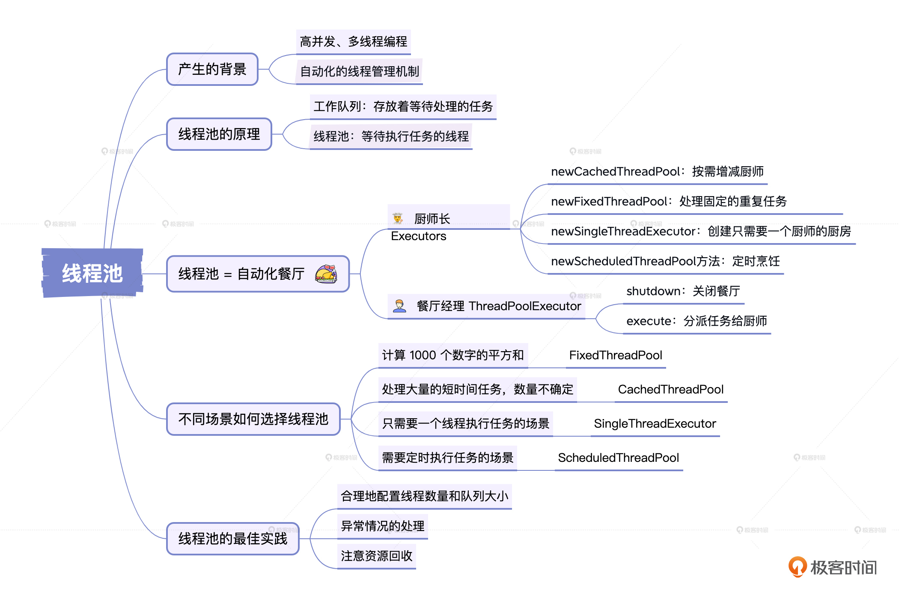

# 28｜线程池：不同场景下如何合理地选择线程池？
你好，我是康杨。

在计算机编程领域，多线程编程一直是一个热门话题。多线程可以提高程序的执行效率，实现并发处理，使得程序能够更好地利用计算机资源。然而，多线程编程也带来了许多挑战，如线程管理、资源竞争、死锁等问题。为了应对这些挑战，线程池应运而生。今天我们来详细聊聊线程池的诞生背景及其原理，帮助你更好地理解线程池的重要性和应用场景。

## **线程池产生的背景**

线程池是在高并发、多线程编程的场景下，出于对性能开销和系统稳定性的要求，而产生的。

想象一下，当你试图处理大量并发任务的时候，会发现你必须创建大量的线程来执行这些任务，然而，直接创建和销毁线程的方式却需要耗费大量的系统资源，涉及到线程栈的分配、回收以及线程间的同步竞争等问题，这个过程开销很大，而且在极限情况下，过多的线程甚至可能会将你的系统资源耗尽，影响程序的稳定性。

在这种背景下，线程池这种解决方案应运而生，它提供了一种自动化的线程管理机制，一方面，线程池能够预先创建一定数量的线程，当有任务需要处理时，直接从线程池中取出线程使用，无需重新创建；另一方面，当线程完成任务后，线程池能够自动将其回收，等待下一次使用，无需销毁线程。

因此，线程池的出现，让开发者不再需要担心线程的创建与销毁带来的性能损耗，不再需要担心错误的线程管理导致的资源竞争和死锁问题，能将更多的精力投入到任务的实现上，提高程序的性能和稳定性。如今，线程池已经成为许多复杂、高并发应用场景的关键技术，为许多开发者在处理高并发任务时提供了极大的帮助。

## **线程池的原理**

线程池的原理可以概括为两个核心部分： **工作队列和线程池**。工作队列存放着等待处理的任务。线程池则是一组等待执行任务的线程。当有新任务出现时，它会被首先放入工作队列，等待处理。如果线程池里的线程正在忙碌执行任务，那么这个新任务只能先在队列里等着。

线程池中的线程会按照一定的策略进行分配和调度。当线程池里有空闲的线程时，系统会从工作队列中取出任务，分配给空闲的线程执行。这个过程是自动的，无需开发者手动干预。线程池会根据当前的系统负载和任务数量，自动调整线程的数量。这样既能保证任务的及时处理，又能避免线程的过度创建和销毁，降低性能损耗。

衡量线程池的灵活性和高效程度，就像在对一间忙碌的厨房的运作机制进行评价。你可以把工作队列想象成厨房的食材清单，上面列出了所有需要入菜的食材。而我们的线程池，则就是一个由专业厨师组成的团队，他们翘首以盼，随时准备开始切菜、炒菜。

新来的任务就像是新提供的食材，一出现就会被添加到工作队列中，静待处理。假设此时厨师们都在忙着炒菜，那么新添加的食材只能在队列中耐心等待。当厨师们忙完手中的工作，系统就会把工作队列中的任务分派给他们，这和厨师开始处理新的食材是一个道理。

这个过程非常智能，全自动运作，不需要额外干预。忙碌厨房的智能主管，也就是线程池，能根据厨房的忙碌程度以及食材的数量，自动增减厨师的数量。这种机制保障了食物能够及时上桌，同时也确保了厨师们不会过度劳累，避免了资源的浪费。

在这个厨房里，线程的分派和调度遵守着一定的规则。比如，我们可以按照食材送达的顺序来炒菜，也就是先到先得；也可以根据食材的新鲜程度或者菜品的烹饪难度来分派任务。此外，我们还可以规定最多同时工作的厨师数，防止厨房变得过于拥挤，出现资源消耗过高的情况。

简单来说，线程池的运作原理就像一个智能化的厨房，可以根据需要自动分派任务，尽快完成烹饪。这不仅提高了我们的烹饪效率，还避免了资源的无谓浪费。这种高效运作的背后，全靠线程池这个得力的帮手。

## **线程池的主要实现**

在Java的世界里，线程池的实现就好比是一家餐厅的运转，餐厅的“厨师长” **Executors** 和“餐厅经理” **ThreadPoolExecutor** 负责着整个餐厅的运作。

Executors就像是一个多才多艺的厨师长，他擅长做各种类型的菜肴。比如他可以使用一种叫做 **newCachedThreadPool** 的方法，创造一个按需增减厨师的厨房，这样当客人多的时候，厨师就会忙碌起来，而在客人少的时候，大家就可以稍作休息。

当然，他也可以利用 **newFixedThreadPool** 的方法来创建一个固定厨师的厨房，这里的厨师们专门处理一些固定的重复任务，例如每天固定要做的早餐。除此之外，他还可以使用 **newSingleThreadExecutor** 的方法创造一个只需要一个厨师的厨房，这就像一家只做特色单品的小店。甚至，他还可以利用 **newScheduledThreadPool** 方法，创造一个定时烹饪任务的厨房，做出的菜肴总是能够恰到好处地在顾客需要的时候上桌。

而餐厅经理ThreadPoolExecutor则负责餐厅的运作管理。他可以用 **shutdown** 的方式来关闭这家餐厅，用 **execute** 方法来分派任务给厨师们，同时他还可以调整厨师的工作状态，比如调整核心厨师数量、最大厨师数量、厨师之间的空闲时间等。

总的来说，在这个Java餐厅中，通过Executors这个巧妙的厨师长和ThreadPoolExecutor这个精明的餐厅经理的共同努力，餐厅（线程池）能一直高效且稳定地运行，让每一位顾客（程序）都尽享美食（高效执行任务）。

## **不同场景如何选择线程池？**

分析选择线程池的类型需要根据实际情况，我这里就给你举两个例子，让你更好地理解这个过程。

假如你有一项任务，需要计算1000个数字的平方和，这个计算过程并不简单，可能需要很长时间。而这1000个数字的任务数量是固定不变的。在这种场景下，我建议你使用 **FixedThreadPool**。你可以参考我给出的代码。

首先我们需要创建一个固定大小的线程池，这里我设置的大小是10。然后把任务提交到线程池中，让线程池帮我们处理这个计算过程。之后在线程计算完成后，我们就可以将线程池关闭。

```java
import java.util.concurrent.ExecutorService;
import java.util.concurrent.Executors;
public class FixedThreadPoolDemo {
    public static void main(String[] args) {
        // 创建一个固定大小的线程池
        ExecutorService executorService = Executors.newFixedThreadPool(10);
        // 提交任务到线程池
        for (int i = 1; i <= 1000; i++) {
            final int num = i;
            executorService.submit(() -> {
                // 计算数字的平方和
                int sum = 0;
                for (int j = 1; j <= num; j++) {
                    sum += j * j;
                }
                System.out.println("数字 " + num + " 的平方和为: " + sum);
            });
        }
        // 关闭线程池
        executorService.shutdown();
    }
}

```

通过使用FixedThreadPool，可以让每个任务都得到一个可用的线程去处理，这样不仅可以提高效率，还能避免因为创建过多的线程而造成资源的浪费。

我们再来看第二个例子，这个任务需要处理大量的短时间任务，而这些任务的数量却不能确定，可能会有很多。在这种情况下，我推荐你使用 **CachedThreadPool**。

```java
import java.util.concurrent.ExecutorService;
import java.util.concurrent.Executors;
public class CachedThreadPoolDemo {
    public static void main(String[] args) {
        // 创建一个可缓存的线程池
        ExecutorService executorService = Executors.newCachedThreadPool();
        // 提交任务到线程池
        for (int i = 1; i <= 1000; i++) {
            final int num = i;
            executorService.submit(() -> {
                // 模拟短时间任务
                try {
                    Thread.sleep(100);
                } catch (InterruptedException e) {
                    e.printStackTrace();
                }
                System.out.println("数字 " + num + " 处理完成");
            });
        }
        // 关闭线程池
        executorService.shutdown();
    }
}

```

它的核心思想就是通过创建一个可缓存的线程池，让线程池根据任务的数量自动调整线程的数量，从而避免了因为创建和销毁线程所带来的性能损失。

除了这两种线程池类型，还有 **SingleThreadExecutor** 和 **ScheduledThreadPool**。前者适用于只需要一个线程执行任务的场景，后者则适用于需要定时执行任务的场景。

## **线程池的最佳实践**

使用线程池可以提高程序的性能，但要使其高效运行并避免浪费系统资源，我们需要做一些重要的事情。

首先，最关键的一点是 **合理地配置线程数量和队列大小**。你肯定不想线程太少，任务被堵塞；但同样你也不希望线程过多，让系统资源荒废。这条看似微妙的平衡线其实要走得非常小心，必须根据你的任务类型和系统资源来谨慎配置。再者，队列大小这个因素也不能忽视。如果你的队列太窄，任务可能会挤压不进去，处理得慢；反过来，如果队列像个大水塘，你可能会面临系统内存被过度消耗的风险。所以这里同样需要你仔细权衡。

其次，是 **异常情况的处理**。在任务运行的过程中，可能会遇到各种棘手的意外情况，比如网络掉线、计算错误等等。你要确保线程池能适应这些情况，将异常处理得干干净净，避免未能成功的任务拖累了系统，造成资源的浪费。

最后，就是 **注意资源回收**。当任务完成之后，线程池里的工作线程可能会继续占据着系统资源，你需要确保线程池能及时地做好“打扫战场”的工作，回收这些闲置的资源，避免它们无端消耗你的系统。

线程池的最佳实践要求我们做到这样几点：根据任务类型和系统资源合理配置线程数量和队列大小，确保线程池有效处理异常，并妥善进行资源回收。遵循这些原则，我们就可以充分发挥线程池的效能，提升任务处理效率，并且防止系统资源被浪费。

## 重点回顾



线程池是现代计算机编程中能够实现并发处理，优化任务处理效率的重要工具。主要原理是 **通过工作队列，合理地调配线程的数量和使用，来达到减轻系统负载，防止线程过度创建和销毁，从而降低不必要的性能损耗。** 配置上，一方面需要关注线程数量、队列大小这样的硬配置，以保证线程池的优势被充分发挥，避免资源浪费；另一方面，还需要了解各类线程池的特点，根据不同的任务需求进行灵活选择。

在程序运行过程中，也难免会出现各种异常，例如网络异常、计算错误等，需要保证线程池能够有效地处理这些问题，避免失败的任务对系统资源造成浪费。当任务完成后，及时地资源回收也不容忽视，无谓的资源占用同样会造成资源的浪费。

总的来说，线程池是多线程编程中一个非常高效的工具。合理使用线程池，需要理解其工作原理，懂得如何妥善配置和选择类型，注意异常处理和资源回收，这样才能发挥其最大的优势，提高程序处理的效率，同时保证系统资源的有效利用。线程池绝对是一个值得所有开发者深入掌握和学习的工具。

## 思考题

学而不思则罔，学完这节课之后，我给你留两个问题。

1. 线程池有哪些类型？
2. 使用线程池有哪些需要注意的地方？

希望你认真思考，然后把思考后的结果分享到评论区，我们一起讨论，如果有收获的话，也欢迎你把这节课的内容分享给需要的朋友，我们下节课再见！