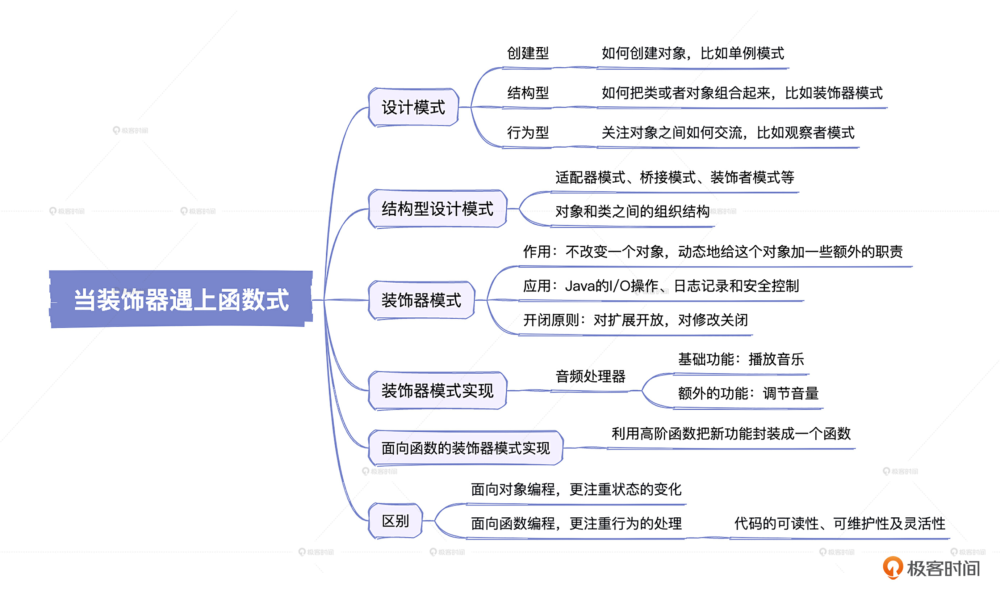

# 31｜当装饰器遇上函数式：打造一个函数式装饰器模式的程序
你好，我是康杨。

今天我们一起聊下设计模式，以及如何用函数式编程方式实现装饰器模式。通过装饰器模式，你会直面感受到面向对象时代的设计模式在函数式时代的演进，感受函数式编程的魅力，后面我还会带你打造你的第一个函数式装饰器模式程序。

下面我们先来介绍一下设计模式到底是怎么来的。

## 设计模式的由来

设计模式这个概念起源于上世纪80年代，一群计算机科学家和软件工程专家，在不断地开发过程中慢慢形成的一套实战经验的总结。他们将解决某种特定环境下的问题，经过大量实践检验的设计原则和解决方案，进行了归纳和记录。

简单说，设计模式就像是一个马路上的交通标志或者烹饪菜肴的食谱。它不仅提供了一种在特定情况下解决问题的思路，还提供了一套经过验证的、可供重复使用的解决方案。这样就可以让我们写出的代码看起来更加清晰、易于阅读、便于维护，更加适应日后的扩展。

他们把这些模式分为三类：创建型、结构型和行为型。创建型模式关注如何创建对象，比如单例模式；结构型模式关注如何把类或者对象组合起来，比如装饰器模式；行为型模式关注对象之间如何交流，比如观察者模式。

这些设计模式最早由四个人：Erich Gamma、Richard Helm、Ralph Johnson 和 John Vlissides 整理并出版在一本书里，这本书名叫《Design Patterns: Elements of Reusable Object-Oriented Software》。自此以后，设计模式就开始在全球软件开发社区广泛传播，成为了所有开发者和公司必备的参考书籍。

## **结构型设计模式**

在设计模式的大家族中，结构型设计模式也是一个非常重要的成员。它主要关注对象和类的组织架构，例如类、对象的组合或者继承。

结构型设计模式的家族中有多个重要的成员，包括我们熟悉的适配器模式、桥接模式、装饰者模式，还有代理模式、组合模式、外观模式、享元模式等等。

结构型设计模式主要解决的是对象和类之间的组织结构，它试图通过一些方式，比如分解、抽象和封装，来让整个系统更优雅，易于理解和修改。随着我们开发的项目越来越复杂，对象和类的组织会变得出奇地困难。而使用结构型设计模式，会使我们更容易地管理这些对象和类，将复杂的系统分解为灵活的、易于管理的部分。

这些模式在编程中也有丰富的应用场景。例如，在开发一个文档编辑器时，我们可以利用组合模式来组织各种图形对象，用代理模式来处理资源密集的操作；再比如在开发一个网络应用时，我们可以使用适配器模式解决不同网络协议之间的兼容问题，用外观模式来提供一个简单一致的接口给外部使用等等。

结构型设计模式可以看作是我们搭建软件架构的蓝图，它提供了一系列的方法让我们更好的组织和管理对象和类，使得我们的代码更加易读易懂，也使得我们能更快的开发出高质量的软件。

## 装饰器模式

装饰器模式是一种经典的结构型设计模式，它的创意首次出现是在上世纪90年代， Brian Kernighan 和 Peter J. Denning 在《The Practice of Programming》这本书里提出的。这个设计模式的特点就是，可以在不改变一个对象的基础上，动态地给这个对象加一些额外的职责。就好像我们去咖啡店点一杯咖啡，我们可以选择加糖，也可以选择加奶，这些都是额外的选项，但本质上它还是那一杯咖啡。

这种设计模式在Java的I/O操作、日志记录和安全控制等方面有很多应用。因为它可以在不修改原有类的代码的基础上，对一个对象进行包装扩展，使它有更强的功能，更能满足用户的多样化需要。所以它也实践了软件开发里的一条重要原则，就是开闭原则。也就是说，软件应该对扩展开放，对修改关闭。所以，如果你希望给现有的对象添加一些新功能，但又不想去修改既有的代码，那这个装饰器模式，就能帮你很好地解决这个问题。

### 装饰器模式解决的问题

装饰器模式，说白了其实就是我们在不改动一个东西本质的情况下，给它加一些额外的功效。我们都遇到过这样的情况，手上有一个物件，能做一件事，可是有时候我们还希望它可以多出一两个功能。打个比方，我们现在开发了一个打印服务，它可以打印文档，这是它的基本功能。但是，有时候我们除了需要打印，还希望在打印之前能预览一下打印内容，或者打印完才能自动关机。

这个时候，我们该怎么做呢？如果我们为每一个需求都打造一个全新的类，那么类的数量就会变得冗余，而且每次有新需求，我们都得改动代码，整个过程会非常麻烦，违反了设计原则。

幸好，我们有装饰器模式。装饰器模式的方便之处就在于，我们不用对已有的系统进行修改，就能像打造乐高积木砖一样，逐一插入我们的需求，使这项服务能够扩展出多种功能而不破坏它的原始功能。所以说，装饰器模式就像是我们的变形金刚，提供给我们一个可扩展、灵活而且可维护的方案。

## **装饰器模式实现**

我们设想一下，你是一个音频处理器的开发者，音频处理器默认有一个基础功能，就是播放音乐，但是有的客户可能需要一些附加的功能，比如调节音量，切换音轨等等。首先，我们先定义一个音乐播放器的接口。

```java
public interface MusicPlayer {
    void play();
}

```

然后 ，我们实现一个基础的音乐播放器。

```java
public class BasicMusicPlayer implements MusicPlayer {
    @Override
    public void play() {
        // 基本播放功能
    }
}

```

这个时候，我们需要提供额外的功能，比如调节音量。

对应的音量调整装饰器如下：

```java
public class VolumeControlDecorator implements MusicPlayer {
    private final MusicPlayer decoratedMusicPlayer;
    public VolumeControlDecorator(MusicPlayer decoratedMusicPlayer) {
        this.decoratedMusicPlayer = decoratedMusicPlayer;
    }
    @Override
    public void play() {
        decoratedMusicPlayer.play();
        // 额外的功能：调节音量
    }
}

```

这样，我们就用装饰器模式实现了功能的扩展。

### 面向函数的装饰器模式实现

上一节课我们说过，函数式编程已经成为了许多开发者的首选编程范式，其中装饰器模式也有一套完全不同的实现方式。在函数式编程中，装饰器俨然成了一种 “高阶函数”。下面我们看怎么用函数式编程重新实现刚刚那个例子。

我们先定义一个接口，但这次我们的接口只有一个方法，其中包含一个输入参数，返回一个同样类型的值。

```java
public interface Function<T> {
    T apply(T input);
}

```

然后，我们实现一个基础的音乐播放器。

```java
public class BasicMusicPlayer implements Function<Music> {
    @Override
    public Music apply(Music music) {
        // 基本播放功能
    }
}

```

这个时候，我们同样需要一个音量调整装饰器，它需要接收一个 Function 输入并返回一个 Function，这是典型的高阶函数特点。

```java
public class VolumeControlDecorator implements Function<Function<Music>> {
    @Override
    public Function<Music> apply(Function<Music> musicFunction) {
        return music -> {
            Music processedMusic = musicFunction.apply(music);
            // 在播放前调节音量
            adjustVolume(processedMusic);
            return processedMusic;
        };
    }
    private void adjustVolume(Music music) {
        // 额外的功能：调节音量
    }
}

```

这样，我们就用函数式编程重新实现了装饰器模式。在面向对象编程中，我们通过接口继承和组合来实现添加新的功能，而在函数式编程中，我们利用高阶函数把新功能封装成一个函数。

### 面向对象和面向函数的区别

面向对象编程，更注重 **状态的变化**，通过类的封装，隐藏内部实现，对外提供统一的接口。而面向函数的编程，更注重 **行为的处理**，通过函数对行为进行抽象。

面向对象编程中的装饰模式是通过对对象进行包装，来实现功能的拓展。然而在面向函数的编程中，我们并不需要去包装对象，而是直接包装函数，并且因为函数是一级元素，这样代码编写起来其实更加灵活。

面向函数编程的突出优势，包括代码的可读性、可维护性以及灵活性，让越来越多的开发者开始转向函数式编程。在实际项目中，有时候我们会倾向于使用面向对象编程，有时候又会使用函数式编程，甚至在同一个项目里我们也会同时使用这两种编程范式，这完全取决于实际的项目需求。

对于装饰器模式，两种编程范式都可以轻松实现。然而，从上面的实现我们也可以看出，函数式编程在代码量和理解的复杂度上都比面向对象编程要更优。

## 重点回顾

设计模式，尤其是结构型设计模式，是软件开发者在解决特定问题时总结出的一种经过验证的、可重复使用的解决方案。它们可以帮助我们更好地构建对象之间的结构关系，提升代码的可读性和可维护性，最大化地提升我们的开发效率。

装饰器模式是一种结构型设计模式，它允许我们在运行时根据对象的不同行为或状态切换不同的算法或策略，不用修改原有代码。这种模式让我们可以在不改变原有对象的基础上，为它添加新的功能，提高系统的灵活性和可扩展性。无论你是使用面向对象的编程范式，还是面向函数的编程范式，装饰器模式都可以帮助你提高代码的灵活性和可扩展性，使系统更加健壮、易于维护。

在实际开发中，我们可以根据项目需求和编程范式选择合适的实现方式。无论选择哪种编程范式，了解并掌握设计模式，特别是结构型模式，都可以帮助我们更好地解决实际问题，提高代码质量和开发效率。



## 思考题

学而不思则罔，学完这节课之后，我给你留两个问题。

1. 什么是结构型设计模式？
2. 尝试用函数式方式重写一段装饰器模式代码？

希望你认真思考，然后把自己的代码分享到评论区，我们一起讨论，如果有收获的话，也欢迎你把这节课的内容分享给需要的朋友，我们下节课再见！