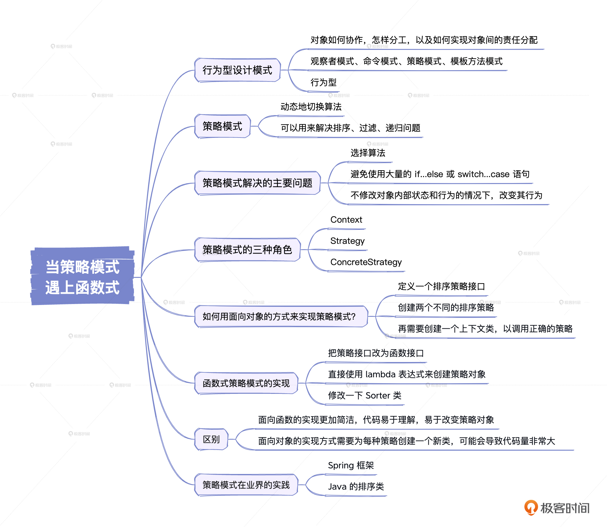

# 32｜当策略模式遇上函数式：打造一个函数式策略模式的程序
你好，我是康杨。今天我们一起聊下策略模式。

策略模式在许多开源框架中都有着广泛的应用，比如Spring，还有许多Java类库都有策略模式的身影。这是因为策略模式有着优秀的扩展能力，可以方便地添加新的策略而不改变原有代码。

策略模式通过定义一系列接口，将不同的行为或算法封装成具有相同接口的对象，便于它们之间互相替换，从而达到动态更换行为的目的。因此它属于我们上节课说的那三种设计模式中的行为型设计模式。

## 行为型设计模式

为了更好地了解策略模式，我们先来聊聊行为型设计模式是什么。在设计模式的大家族中，行为型设计模式是个非常重要的分支。这个分支主要关注的是对象之间的相互交互，也就是说，怎么样让各个对象在一起协同工作，高效地解决问题。

行为型设计模式里面包括好几个重要的成员。比如熟悉的观察者模式，还有命令模式、策略模式、模板方法模式、迭代器模式、责任链模式、中介者模式、备忘录模式、访问者模式、解释器模式、状态模式等等。

行为型设计模式主要解决的是对象如何协作，怎样分工，以及如何实现对象间的责任分配。比如一个项目的开发，可能会有非常多的对象同时运作，如果没有一些好的方法来管理他们，随着项目复杂度的增加，就会很容易陷入混乱。而行为型设计模式，就是给出了一系列的解决方案，方便我们在不改变对象自身的前提下，调整对象间的关系，实现复杂功能的高效完成。

这些模式在我们的编程过程中都有丰富的应用场景。比如，在我们开发一款聊天软件时，我们可以使用观察者模式实现用户间的消息提醒；再比如，开发一款策略游戏，我们可以使用命令模式来记录玩家的操作，稍后重播或者回滚；再比如，在一款电商网站中，我们可能会用到策略模式实现多种不同的促销策略，用模板方法模式定义商品的基本信息和详情信息等等。

行为型设计模式就像是我们的工具箱，它给我们提供了一系列丰富而精彩的工具，帮助我们更好地构建对象之间的交互关系，提升代码的可读性和可维护性，最大化地提升我们的开发效率！

## **策略模式**

策略模式在设计模式中是一种行为型模式，它为行为和算法定义了一个系列接口，在需要时可以动态地切换算法。在OOP中，策略模式经常被用来在运行时选择适当的算法。

策略模式是由GoF（Gang of Four）在1994年首次提出的，他们的目标是提供一种可以使代码在运行时改变行为的方法。策略模式在许多场景中被广泛应用，比如排序、过滤、递归问题。

### **策略模式解决的主要问题**

策略模式主要解决三个问题。

1. 当面临多种算法或行为时，如何在运行时选择最适合的一种？

2. 如何避免使用大量的 `if...else` 或 `switch...case` 语句？

3. 如何能够在不修改对象内部状态和行为的情况下，改变其行为？


### **策略模式的三种角色**

在策略模式中主要有三种角色，分别是Context（上下文）、Strategy（策略）和ConcreteStrategy（具体策略）。

- Context：维护一个指向具体策略对象的引用。
- Strategy：定义了一个公共接口，各种不同的策略类以不同的方式实现这个接口，Context使用这个接口来调用ConcreteStrategys定义的算法。
- ConcreteStrategy：实现了Strategy定义的接口。

## 如何用面向对象的方式来实现策略模式？

现在让我们先看一下如何用面向对象的方式来实现策略模式。假设我们需要开发一个排序程序，它要支持多种排序算法，比如冒泡排序、选择排序、希尔排序等。在这个例子里，我们需要的各种排序算法可以被看作是各种策略。首先我们定义一个排序策略接口。

```java
public interface SortStrategy {
void sort(int[] numbers); // 对数组进行排序
}

```

然后我们创建两个不同的排序策略。

```java
public class BubbleSortStrategy implements SortStrategy {
@Override
public void sort(int[] numbers) {
// 实现冒泡排序算法
}
}

public class SelectionSortStrategy implements SortStrategy {
@Override
public void sort(int[] numbers) {
// 实现选择排序算法
}
}

```

我们再需要创建一个上下文类，以调用正确的策略。

```java
public class Sorter {
private SortStrategy strategy;

public Sorter(SortStrategy strategy) {
this.strategy = strategy;
}

public void sort(int[] numbers) {
strategy.sort(numbers);
}
}

```

这样我们就可以灵活地使用不同的排序策略了。

```java
public class Main {
public static void main(String[] args) {
int[] numbers = {3, 1, 4, 1, 5, 9, 2, 6, 5, 3, 5};
Sorter sorter = new Sorter(new BubbleSortStrategy());
sorter.sort(numbers);

sorter = new Sorter(new SelectionSortStrategy());
sorter.sort(numbers);
}
}

```

### **函数式策略模式的实现**

现在让我们尝试用面向函数的方式来实现策略模式。在Java 8里，我们可以利用lamdba表达式和函数接口来实现。

我们先把策略接口改为函数接口。

```java
@FunctionalInterface
public interface SortStrategy {
void sort(int[] numbers); // 对数组进行排序
}

```

然后我们就可以直接使用lambda表达式来创建策略对象了。

```java
SortStrategy bubbleSort = (numbers) -> {
// 实现冒泡排序算法
};

SortStrategy selectionSort = (numbers) -> {
// 实现选择排序算法
};

```

在上述代码中，我们把复杂的算法实现隐藏到了lambda表达式里，使代码更加简洁且易于理解。接下来我们需要修改一下Sorter类。

```java
public class Sorter {
private SortStrategy strategy;

public Sorter(SortStrategy strategy) {
this.strategy = strategy;
}

public void sort(int[] numbers) {
strategy.sort(numbers);
}
}

```

使用方式和之前相同，但是更加灵活，因为我们可以直接在代码中创建新的排序算法。

```java
public class Main {
public static void main(String[] args) {
int[] numbers = {3, 1, 4, 1, 5, 9, 2, 6, 5, 3, 5};
Sorter sorter = new Sorter((numbers) -> {
// 实现冒泡排序算法
});
sorter.sort(numbers);

sorter = new Sorter((numbers) -> {
// 实现选择排序算法
});
sorter.sort(numbers);
}
}

```

### **策略模式的面向对象和面向函数实现的区别**

上述两种实现虽然都符合策略模式的定义，但是面向函数的实现更加简洁，代码易于理解，易于改变策略对象。而且它不需要为每种排序算法创建一个新类，可以直接在代码中定义新的算法。

然而，面向对象的实现方式则需要为每种策略创建一个新类，如果有很多种策略的话，可能会导致代码量非常大。另外，要改变策略的话可能需要修改大量代码。所以，面向函数的实现方式可以更好地适应代码的变化，更具有灵活性。

## **策略模式在业界的实践**

在业界，策略模式在许多软件和开源框架中有着广泛的应用。例如，在Spring框架中，策略模式被应用在资源访问策略、事务管理策略等地方。

除此之外，许多Java的排序类中，比如Arrays.sort和Collections.sort等方法都使用了策略模式。这些方法接收一个 `Comparator` 参数，这样我们就可以自定义排序方法。

总的来说，策略模式在Java编程中非常广泛的应用，是一个极其实用的设计模式。它可以让我们写出的代码更具有单一职责，使我们的代码更加清晰、容易维护。无论是面向对象还是面向函数的实现方式，都可以帮助我们更好地写出高质量的代码。

## 重点回顾



策略模式是一种非常实用的设计模式，它提供了一种策略或算法可以在运行时动态选择的能力，从而使代码更加灵活，更能适应变化。不论你是面向对象编程还是面向函数编程，策略模式都能发挥巨大的功效。

在面向对象编程中，策略模式需要为每一种策略创建一个新类。然而在面向函数编程中，尤其是在Java 8及以后的版本中，我们可以使用lambda表达式和函数接口来实现策略模式。这样做的好处是，我们无需为每一种策略创建一个新类，而是可以直接在代码中定义新的策略，这大大增加了代码的简洁性和灵活性。

总之，策略模式是一种强大的设计模式，它提供了一种优雅的方式来处理不同的行为和算法。善用策略模式，可以使你的代码更有力量，更具有生命力。

## 思考题

学而不思则罔，学完这节课之后，我给你留两个问题。

1. 什么是行为型设计模式？
2. 你能尝试用函数式方式重写一段策略模式代码？

希望你把自己的代码分享到评论区，我们一起讨论，如果有收获的话，也欢迎你把这节课的内容分享给需要的朋友，我们下节课再见！