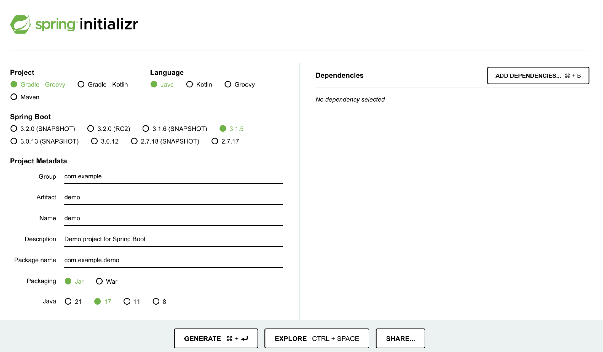

# 35｜实现：基于JDK 17、Spring Boot 3、Spring 6打造云原生Java应用
你好，我是康杨。

在当前云计算快速发展的背景下，云原生应用变得越来越受欢迎，这种应用程序需要具备高度可移植性、强大的可扩展性和高效的性能等特性。这也是Java语言在云原生应用开发中面临的挑战，例如需要更好地支持容器化、微服务架构和云原生技术等。

为了应对这些挑战，Java也作出了很多改变，比如利用JDK 17的稳定性、Spring Boot 3 和 Spring 6等现代化特性，来构建高效、可扩展的Java应用程序，来适应云原生环境的需求。这节课我就带你来看看Java的变化，为了让你体会更深刻，我还会手把手带你实现一个基于JDK 17、Spring Boot 3和Spring 6的云原生Java应用。

话不多说，我们马上开始吧！

## **原生时代Java生态面临的挑战**

云原生是现代软件开发的新趋势，它让我们的应用程序能够在多种云环境中运行，并且能够灵活地调整资源。在这样的环境下，我们的应用程序需要具备 **快速启动、安静掉线** 的特性，这对于Java生态来说是个挑战。我们都知道，Java应用程序的启动过程相对较长，这在一定程度上限制了它在云原生环境中的表现。

再者，Java应用常常会占用大量的内存。在云环境中，资源是有限的，特别是在微服务中，内存消耗可能会成为一个问题。我们需要寻找办法来 **优化Java应用程序的内存使用**，以适应云原生环境的需求。

此外，云原生环境强调开放性和平台独立性，所有服务都需要具备独立部署和运行的能力。这对于Java生态来说同样是个挑战。Java作为一个成熟的编程语言，它的生态系统非常庞大，但是这也带来了一些兼容性问题。我们需要找到方法来保证Java应用程序在云原生环境中的 **兼容性**。

云原生和Java生态面临的挑战主要在性能、内存消耗和兼容性这三个方面。我们需要通过技术创新和最佳实践，来克服这些挑战，让Java在云原生环境中发挥出更大的价值。

## **Java如何应对挑战？**

目前Java生态已经通过引入一系列新工具和方案来积极应对云原生挑战。

### JDK 17的新特性

JDK 17在性能和功能上都有显著的提升，为云原生环境提供了更好的支持。它引入了低延迟垃圾收集器，例如ZGC和Shenandoah（可以回顾 [第 16 讲](https://time.geekbang.org/column/article/703990)），这些收集器在不暂停应用的情况下进行垃圾回收，降低内存使用和启动时间。同时，JDK17提高垃圾回收器吞吐量，内置安全功能以支持加密算法和密码学，改进异常处理，提升JVM性能，从而增强了Java的安全性和稳定性。这些优化使在云原生环境中运行的Java应用程序更加安全可靠。

### Spring Boot 3和Spring 6的新特性

Spring Boot 3和Spring 6为云原生应用开发带来了许多有益的新特性。Spring 6框架提供了新的编程模型和API，包括响应式编程模型、模块化设计、改进的依赖注入、新的数据访问和集成API、微服务支持以及安全性改进。这些更新使得Java开发更加便捷、高效，满足现代应用程序的需求。

> 响应式编程简称RP（Reactive Programming）是一种面向数据流和变化传播的编程范式。这意味着可以在编程语言中很方便地表达静态或动态的数据流，而相关的计算模型会自动将变化的值通过数据流进行传播。

### 容器化和微服务

容器化和微服务架构是云原生的核心概念，Java生态系统需要适应这些技术，并把它整合到现有的开发流程中。容器化技术，比如Docker，可以使Java应用程序更轻松地部署、管理和扩展。微服务架构则鼓励将应用程序拆分为更小、更易于管理的服务，从而提高应用程序的可维护性和可扩展性。

Java为了适应微服务架构，采用了模块化设计、引入响应式编程模型、支持容器化技术、提供服务化框架以及支持云原生技术栈等一系列改进。这些措施使Java应用程序更易于拆分、可维护和扩展，帮助开发者轻松构建和部署微服务应用。

### 持续集成和持续交付（CI/CD）

云原生应用程序需要快速迭代和部署。Java生态系统需要支持持续集成和持续交付，以满足这一要求。通过使用自动化构建和测试工具，如 [Jenkins](https://www.jenkins.io/) 和 [Travis CI](https://www.travis-ci.com/)，可以确保代码的质量和稳定性。同时，通过使用容器编排工具，如Kubernetes，可以实现应用程序的自动化部署和扩展。

### 云原生安全性

在云原生环境中，数据和资源可能涉及敏感信息。Java生态系统需要加强安全性，确保应用程序和数据的安全。开发人员需要遵循安全编码实践，比如使用安全编程库、避免常见的安全漏洞等。同时，使用安全工具和监控，比如 [Spring Security](https://spring.io/projects/spring-security)、 [OAuth2](https://oauth.net/2/) 以及云原生环境中的安全监控和诊断工具，确保应用程序的安全性。

### 服务网格和分布式系统

为了更好地应对云原生的挑战，Java生态系统还需要关注服务网格和分布式系统。服务网格技术，如 [Istio](https://istio.io/)，可以实现服务之间的智能路由、负载均衡和故障注入，从而提高系统的可靠性和稳定性。分布式系统则可以通过数据分片和分布式存储、任务分发和负载均衡等技术，帮助Java应用程序更好地处理大规模数据和并发请求，提高系统的性能和可扩展性。

### 云原生监控和分析

云原生环境中，Java应用程序需要实现实时监控和分析，以快速发现和解决问题。通过使用云原生监控和分析工具，如 [Prometheus](https://prometheus.io/) 和 [Grafana](https://grafana.com/)，可以对系统性能、资源使用和应用程序运行状况进行实时监控，从而提高系统的可用性和可维护性。

Java生态在云原生趋势下面临着许多挑战，但通过引入JDK 17、Spring Boot 3和Spring 6等解决方案，Java已经准备好应对这些挑战。我们需要持续关注这些新的工具和方案，以充分利用Java在云原生环境中的优势。同时，我们还需要不断学习和掌握新的技术和方法，以适应云原生环境下的开发和运维需求。

## 实现一个云原生Java应用

下面我就手把手带你来实现一个基于JDK 17、Spring Boot 3、Spring 6的云原生Java应用，让你深入了解如何应对云原生应用开发面临的挑战，以及如何使用最新的技术和工具开发高质量的云原生应用程序。

### Step 1：创建一个基于 Spring Boot 3 和 Spring 6 的新项目

首先，我们需要安装 JDK 17，并配置环境变量。使用 [Spring Initializr](https://start.spring.io/) 创建一个新的 Spring Boot 项目，选择 Spring Boot 3 和 Spring 6 作为项目的依赖。

安装 JDK 17：

```java
# 使用 JDK 17 安装器安装 JDK 17
curl https://download.java.net/java/jdk/17.0.1/jdk-17.0.1_windows-x64_bin.zip -o jdk-17.0.1.zip
unzip jdk-17.0.1.zip
# 配置环境变量
echo 'JAVA_HOME=C:\Program Files\Java\jdk-17.0.1' >> %USERPROFILE%\.bashrc
echo 'PATH=$JAVA_HOME\bin:$PATH' >> %USERPROFILE%\.bashrc
# 使环境变量生效
source %USERPROFILE%\.bashrc

```

创建 Spring Boot 项目：



### Step 2：配置 JDK 17 进行项目开发

在项目的 pom.xml 文件中，我们可以配置 JDK 17 作为项目的编译和运行环境。同时，使用 JDK 17 中新增的 ZGC 特性，提高应用程序的性能。

#### 配置 JDK 17 环境

在项目的 pom.xml 文件中，添加以下配置，使项目使用 JDK 17 进行编译和运行。

```java
<build>
    <plugins>
        <plugin>
            <groupId>org.apache.maven.plugins</groupId>
            <artifactId>maven-compiler-plugin</artifactId>
            <version>3.8.1</version>
            <configuration>
                <source>17</source>
                <target>17</target>
            </configuration>
        </plugin>
    </plugins>
</build>

```

#### 使用 ZGC 特性

在项目的 src/main/resources 目录下，创建一个名为 zgc.properties 的文件，添加以下内容，启用 ZGC 特性。

```plain
spring.jvm.properties.zgc.mode=gc
spring.jvm.properties.zgc.gc.latency-threshold=100000

```

### Step 3：在项目中集成云原生特性

我们可以使用 Spring Cloud 工具，轻松地在项目中集成云原生特性，使用 Spring Cloud Config 实现配置管理，使用 Spring Cloud Discovery 实现服务发现。

#### 添加 Spring Cloud 依赖

在项目的 pom.xml 文件中，添加以下依赖，以集成 Spring Cloud 工具。

```java
<dependency>
    <groupId>org.springframework.cloud</groupId>
    <artifactId>spring-cloud-starter-config</artifactId>
</dependency>
<dependency>
    <groupId>org.springframework.cloud</groupId>
    <artifactId>spring-cloud-starter-netflix-eureka-client</artifactId>
</dependency>

```

#### 配置 Spring Cloud 特性

在项目的 src/main/resources 目录下，创建一个名为application.yml 的文件，添加以下内容，以配置 Spring Cloud 特性。

```java
spring:
  cloud:
    config:
      server:
        enabled: true
        discovery:
          enabled: true

```

### Step 4：在项目中实现反应式编程模型

反应式编程是一种编程范式，它允许开发者处理异步和事件驱动的程序。在 Spring Boot 项目中，我们可以使用 WebFlux 实现反应式编程模型。

#### 创建异步的 HTTP 请求处理器

在项目中创建一个名为 MyController 的类，使用 @RestController 注解标记该类。然后，创建一个名为 hello() 的方法，使用 Mono 类处理异步请求。

```plain
@RestController
public class MyController {

    @GetMapping("/hello")
    public Mono<String> hello() {
        return Mono.just("Hello, Reactive!");
    }
}

```

#### 配置 WebFlux

在项目的 src/main/resources 目录下，创建一个名为 application.yml 的文件，添加以下内容，来配置 WebFlux。

```java
spring:
  web:
    reactive:
      enabled: true

```

### Step 5：将项目打包为 Docker 镜像, 并在云环境中部署运行

我们可以使用 Dockerfile 文件，定义项目的镜像。然后，使用 docker build 命令，构建项目的镜像。最后，我们可以使用 docker run 命令，在云环境中部署运行项目。

#### 创建 Dockerfile

在项目的根目录下，创建一个名为 Dockerfile 的文件，添加以下内容，以定义项目的镜像。

```plain
FROM openjdk:17-jdk
ARG JAR_FILE=target/*.jar
COPY ${JAR_FILE} app.jar
ENTRYPOINT ["java","-jar","/app.jar"]

```

#### 构建 Docker 镜像

在项目根目录下，运行以下命令，构建项目的 Docker 镜像。

```java
docker build -t my-spring-boot-app .

```

#### 在云环境中部署运行项目

使用以下命令，在云环境中部署运行项目。

```java
docker run -p 8080:8080 --name my-spring-boot-app -d my-spring-boot-app

```

### Step 6：使用 Native Image 把 Java 应用转化成与操作系统无关的可执行文件

Native Image 是一个将 Java 应用程序编译为本地可执行文件的工具，它可以提高应用程序的启动速度和内存消耗。

#### 添加 Native Image 依赖

在项目的 pom.xml 文件中，添加以下依赖，以集成 Native Image 工具。

```java
<dependency>
    <groupId>org.springframework.boot</groupId>
    <artifactId>spring-boot-starter-native-image</artifactId>
</dependency>

```

#### 为 Native Image 配置启动参数

在项目的 src/main/resources 目录下，创建一个名为 native-image.properties 的文件，添加以下内容，以配置 Native Image 启动参数。

```plain
# 设置生成的可执行文件名称
spring.native.image.name=my-spring-boot-app
# 设置启动时传递的参数
spring.native.image.args=-Xshare -Xverify=none -Dspring.config.location=file:/path/to/application.yml

```

#### 生成 Native Image

在项目根目录下，运行以下命令，生成 Native Image。

```java
./mvnw spring-boot:build-image

```

这会在 `target/native-image` 目录下生成 Native Image。

#### 运行 Native Image

使用以下命令，运行 Native Image。

```plain
./target/my-spring-boot-app

```

应用程序将使用 Native Image 启动，具有更快的启动速度和更低的内存消耗。

通过这6个步骤，我们最终实现了一个云原生Java应用，这个应用良好地集成了JDK 17、Spinrg Boot 3和Spring 6的优秀特性，实现了一个Java的云原生应用。

## 重点回顾

在当前云计算的大背景下，Java语言为了适应云原生应用的需求，需要更好地支持容器化、微服务架构和云原生技术。然而，Java在性能、内存消耗和兼容性上面临着很大挑战。

为应对这些挑战，Java通过引入JDK 17、Spring Boot 3和Spring 6等现代化特性，来构建高效、可扩展的Java应用程序。除此之外，Java还利用响应式编程模型、容器化技术和微服务架构，使用自动化构建和测试工具、安全监控和诊断工具、服务网格和分布式系统等技术和方法，全方位优化应用程序，实现更高效地开发和运维。

通过一系列步骤，利用Spring Boot和Spring Cloud的新特性，以及使用Docker进行容器化部署，我们可以成功实现了一个基于JDK 17、Spring Boot 3和Spring 6的云原生Java应用程序，并能在云环境中高效运行。

## 思考题

这节课我们用的是版本JDK 17，如果你比较关注Java技术动态的话，应该知道最新的版本JDK 21已经发布，里面也包含了很多新特性，欢迎你在评论区分享你了解到的具体信息，我们一起探讨，同时也欢迎你把这节课的内容分享给需要的朋友，我们下节课再见！

## 相关阅读

1. [JDK 20 和 JDK 21 最新动态](https://www.infoq.cn/article/o4cLTZJXMgC7pJwfA8og?utm_campaign=geektime_search&utm_content=geektime_search&utm_medium=geektime_search&utm_source=geektime_search&utm_term=geektime_search)
2. [Java 近期新闻：JDK 21、面向 JDK 21 的 GraalVM、Apache Pinot 1.0 和 Eclipse Epicyro 3.0](https://www.infoq.cn/article/0hhqSZ0mg99KVNwGtzmG?utm_campaign=geek_search&utm_content=geek_search&utm_medium=geek_search&utm_source=geek_search&utm_term=geek_search)
3. [JEP 444：JDK 21 中出现虚拟线程，开创并发新纪元](https://www.infoq.cn/article/0hhqSZ0mg99KVNwGtzmG?utm_campaign=geek_search&utm_content=geek_search&utm_medium=geek_search&utm_source=geek_search&utm_term=geek_search)