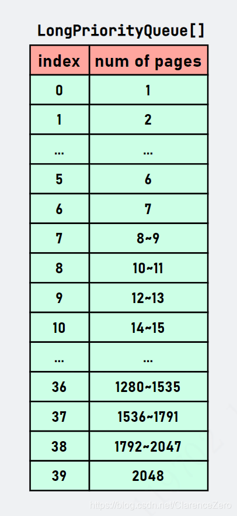

摘抄自：https://blog.csdn.net/ClarenceZero/article/details/113607481


## Netty源码之jemalloc4内存分配(4.1.58)


## 概述


在讲 jemalloc4 算法之前，我们先回顾 jemalloc3 内存分配算法: Netty 使用一棵满[二叉树](https://so.csdn.net/so/search?q=%E4%BA%8C%E5%8F%89%E6%A0%91&spm=1001.2101.3001.7020 "二叉树")管理不同规格的内存块，可将用户申请的内存大小划分四个级别，分别是 Tiny、Small、Normal 和 Huge，根据不同规格采取不同的分配策略。重新回顾 jemalloc3 内存规格图:


在分配内存之前，需要对用户申请的大小进行规格化处理并得到规格值。对于 Normal 级别，它是 PageSize（默认值: 8192Byte）的整数倍，可以在树中找到一个合适的节点与之对应，使用 long 型的句柄值记录节点信息。对于 Small 级别，它只有四种内存大小。当用户申请 Small 级别内存大小时，会找到一个空闲的页并等分之，把第 1 份用于此时的分配请求，其余份放入 PoolArena 的 subpage pool 池中等待下次申请同等大小的内存块时使用。Tiny 和 Small 类似，只不过它有 31 种内存大小，可以拆分更细的内存大小。[想了解更多关于 jemalloc3 算法分配请戳](https://juejin.cn/post/6922784424178221064 "想了解更多关于 jemalloc3 算法分配请戳")。虽然 jemalloc3 对内存规格进行的区域划分，目的也是为了减少内存碎片，但最坏的情况还是会出现 50% 内存浪费，内存碎片比想象中严重。比如我想分配 513Byte 的大小内存块，进行规格值计算后得到 1024，多出了 511 Byte 内存，浪费将近 50% 内存空间。因此，jemalloc4 通过构造复杂的 SizeClasses 让每个 size 的跨度变得小一点，从而达到减少内存碎片的目的，这一篇文章着重讲解 PoolChunk 相关的方法，至于和 jemalloc3 类似的就不再赘述了。顺便提一下，现在 jemalloc 最新版本为 5.2.1，jemalloc4 是在 2015 年发布，而 Netty 是在 2020 年将 jemalloc3 的算法重构为 jemalloc4，所以不知何时 Netty 会再次重构，挺期待的。


## 三个重要的数据结构


PoolChunk 对象中有两个重要的变量用来替换 jemalloc3 的树的结构，分别是`LongPriorityQueue[] runsAvail`和`LongLongHashMap runsAvailMap`，在了解 PoolChunk 内存分配算法之前，先对这两个数组结构有一个大致的认识。


### LongPriorityQueue


LongPriorityQueue 是 Netty 内部实现的关于 long 基本类型的优先队列，[关于 LongPriorityQueue 和 LongLongHashMap 的动机请看](https://github.com/netty/netty/commit/c41d46111dc37aaf9c8ee7aec162d87221df1d70 "关于 LongPriorityQueue 和 LongLongHashMap 的动机请看")，它是基于二叉堆实现。关于 Netty 如何使用二叉树实现优先队列在这里就不详细讲解了，这里我们只关注 LongPriorityQueue 存储着什么，可以用来做些什么?LongPriorityQueue 属于小顶堆，存储 long （非 Long）型的句柄值，通过`LongPriorityQueue#poll()`方法每次都能获取小顶堆内部的最小的 handle 值。这表示我们每次申请内存都是从最低位地址开始分配。而在 PoolChunk 内部有一个`LongPriorityQueue[]`数组，所有存储在 LongPriorityQueue 对象的 handle 都表示一个可用的 run，它的默认长度为 40，为什么是 40 会在源码讲解时解释。


### LongLongHashMap


这个是特殊的存储 long 原型的 HashMap，底层采用线性探测法。Netty 使用 LongLongHashMap 存储某个 run 的首页偏移量和句柄值的映射关系、最后一页偏移量和句柄值的映射关系。至于为什么这么存储，这是为了在向前、向后合并的过程中能通过 pageOffset 偏移量获取句柄值，进而判断是否可以进行向前合并操作。具体通过源码再详细说明。


### long handle


jemalloc4 的 handle 的含义与 jemalloc3 不同，具体如下图所示:


主要的区别是重新定义了高 32 位的含义。我们知道 PoolChunk 默认向 JVM 申请个 16MB 的大的内存块，并拆分成 2048 个 page。可以想象为每个 page 进行标号，从 0 开始一直到 2047。通过 pageOffset + pageSize 就能定位某一个 run 区域，它是由 pageSize 个 page 组成的，起始的 page 为 pageOffset。对 ByteBuffer 对象而言，内部会有一个 long 型的 memoryAddress 绝对地址，因此可以通过绝对地址+偏移量定位任意 page 的实际地址。我们之前说过，run 表示的是由若干个 page 组成的内存块。而 isUsed 则是标记当前 run 的使用状态。isSubpage 表示当前 run 是否用于 Small 级别内存分配。后 32 位表示 bitmap 的索引信息，与 jemalloc3 表示的含义一样。


## run


run 是由若干个连续的 page 组成的内存块的代称，可以被 long 型的 handle 表示。随着内存块的分配和回收，PoolChunk 会管理着若干个不连续的 run。


## 内存分配思路


Netty 是对底层内存分配算法进行重构，但总体的分配逻辑并没有发生改变: 首先尝试从本地缓存中分配，分配成功则返回，分配失败则委托 PoolArena 进行内存分配，PoolArena 最终还是委托 PoolChunk 进行内存分配，而 PoolChunk 就是 jemalloc4 算法的核心体现。Netty 在 jemalloc4 算法中取消了 Tiny，因此，只会有三种规格，分别是 Small、Normal 以及 Huge。先总述一下 jemalloc4（Netty 实现）的算法分配逻辑:


* Netty 默认一次性向 JVM 申请 16MB 大小的内存块，也是划分为 2048 个page，每个 page 大小为 8192（8KB）（和 jemalloc3 一样）。    
* 首先，根据用户申请的内存大小在 SizeClasses 查表得到确定的 index 索引值。    
* 通过判断 index 大小就可以知道采用什么策略。当 index<=38（对应 size<=28KB）时，表示当前分配 Small 级别大小的内存块，采用 Small 级别分配策略。对于 38<index<nSize(75)（对应 size取值范围为 (28KB, 16MB]）表示当前分配 Normal 级别大小的内存块，采用 Normal 级别分配策略。对于 index 的其他值，则对应 Huge 级别。    
* 先讲 Normal 级别的内存分配，它有一个特点就是所需要的内存大小是 pageSize 的整数倍，PoolChunk 会从能满足当前分配的 run（由 long 型的句柄表示，从 `LongPriorityQueue[]` 数组中搜索第一个最合适的 run） 中得到若干个 page。当某一个 run 分配若干个 page 之后，可会还会有剩余空闲的 page，那么它根据剩余的空闲 pages 数量会从 LongPriorityQueue[] 数组选取一个合适的 LongPriorityQueue 存放全新的 run（handle 表示）。    
* 对于 Small 级别的内存分配，经过 SizeClass 规格化后得到规格值 size，然后求得 size 和 pageSize 最小公倍数 j，j 一定是 pageSize 的整数倍。然后再按照 Normal 级别的内存分配方式从第一个适合的 run 中分配 (j/pageSize) 数量的 page。剩下的就和 jemalloc3 一样，将 page 所组成的内存块拆分成等分的 subpage，并使用 `long[]` 记录每份 subpage 的使用状态。


关于内存块回收逻辑，subpage 和 jemalloc3 并没有太大的区别，所以接下来不会对 subpage 内存块的回收进行讲解。但是对于 run 的回收可太不一样了。


* 在回收某一个 run 之前，先尝试向前搜索并合并相邻的空闲的 run，得到一个全新的 handle。    
* 然后再向后搜索并合并相邻的空闲的 run，得到一个全新的 handle。    
* 再把 handle 写回前面两个重要的数据结构中，以待下次分配时使用。


以上只是对 jemalloc4 算法思想的简述，更多的细节还需要通过源码的方式展示。


## 内存分配申请


通过 DEBUG，我们会进入到`PoolArena#allocate()`方法。这个方法主要是对用户申请的内存大小进行 SizeClasses**规格化**，获取在 SizeClasses 的索引，通过判断索引值的大小采取不同的分配策略:


```java
// io.netty.buffer.PoolArena#allocate
/**
 * 按不同规格类型采用不同的内存分配策略
 * @param cache			本地线程缓存
 * @param buf			ByteBuf对象，是byte[]或ByteBuffer的承载对象
 * @param reqCapacity	申请内存容量大小
 */
private void allocate(PoolThreadCache cache, PooledByteBuf<T> buf, final int reqCapacity) {
    
    // #1 根据申请容量大小查表确定对应数组下标序号。
    // 具体操作就是先确定 reqCapacity 在第几组，然后在组内的哪个位置。两者相加就是最后的值了
    final int sizeIdx = size2SizeIdx(reqCapacity);

    // #2 根据下标序号就可以得到对应的规格值
    if (sizeIdx <= smallMaxSizeIdx) { // size<=28KB
        // #2-1 下标序号<=「smallMaxSizeIdx」，表示申请容量大小<=pageSize，属于「Small」级别内存分配
        tcacheAllocateSmall(cache, buf, reqCapacity, sizeIdx);
    } else if (sizeIdx < nSizes) { // 28KB<size<=16MB
        // #2-2 下标序号<「nSizes」，表示申请容量大小介于pageSize和chunkSize之间，属于「Normal」级别内存分配
        tcacheAllocateNormal(cache, buf, reqCapacity, sizeIdx);
    } else {
        // #2-3 超出「ChunkSize」，属于「Huge」级别内存分配
        int normCapacity = directMemoryCacheAlignment > 0
              ? normalizeSize(reqCapacity) : reqCapacity;
        // Huge allocations are never served via the cache so just call allocateHuge
        allocateHuge(buf, normCapacity);
    }
}

```


### 分配 Normal 级别内存块


由于 Normal 级别内存分配相对来说比 Small 简单。首先，需要明确的一点是 Normal 的内存大小界限，PoolArena#allocate 方法写得很明显，当`smallMaxSizeIdx<sizeIdx<nSize`时就采用 Normal 级别内存分配策略，对应的 size 范围是`(28KB, 16MB]`。`tcacheAllocateNormal()`就是和 Normal 级别内存分配有关。


#### PoolArena#tcacheAllocateNormal


这个方法会配合本地线程缓存使用，从名字也可以看出来了。先尝试从本地线程缓存中分配内存，如果失败再才会委托 PoolChunk 完成内存分配。


```java
// io.netty.buffer.PoolArena#tcacheAllocateNormal
/**
 * 尝试先从本地线程缓存中分配内存，尝试失败，
 * 就会从不同使用率的「PoolChunkList」链表中寻找合适的内存空间并完成分配。
 * 如果这样还是不行，那就只能创建一个船新PoolChunk对象
 * @param cache         本地线程缓存，用来提高内存分配效率
 * @param buf           ByteBuf承载对象
 * @param reqCapacity    用户申请的内存大小
 * @param sizeIdx        对应{@link SizeClasses}的索引值，可以通过该值从{@link SizeClasses}中获取相应的规格值
 */
private void tcacheAllocateNormal(PoolThreadCache cache, PooledByteBuf<T> buf, final int reqCapacity,
                                  final int sizeIdx) {
    // #1 首先尝试从「本地线程缓存(线程私有变量，不需要加锁)」分配内存
    if (cache.allocateNormal(this, buf, reqCapacity, sizeIdx)) {
        // 尝试成功，直接返回。本地线程会完成对「ByteBuf」对象的初始化工作
        return;
    }
    
    // 因为对「PoolArena」对象来说，内部的PoolChunkList会存在线程竞争，需要加锁
    synchronized (this) {
        // #2 委托给「PoolChunk」对象完成内存分配
        allocateNormal(buf, reqCapacity, sizeIdx, cache);
        ++allocationsNormal;
    }
}

```


#### PoolArena#allocateNormal


PoolArena 内部有一个特殊的 PoolChunkList 链表结构，它是根据最低的使用率来决定在哪个链表中，可以根据名称（比如 q050 表示PoolChunk的使用率在 50%~100% 范围内）判断出来。 如果不能在 PoolChunkList 找到合适的 PoolChunk 的话，那就需要新建一个 PoolChunk 对象用于当前内存申请，并会把完成此次内存分配后的 PoolChunk 添加到合适的 PoolChunkList 中。


```java
// 
/**
 * 先从「PoolChunkList」链表中选取某一个「PoolChunk」进行内存分配，如果实在找不到合适的「PoolChunk」对象，
 * 那就只能新建一个船新的「PoolChunk」对象，在完成内存分配后需要添加到对应的PoolChunkList链表中。
 * 内部有多个「PoolChunkList」链表，q050、q025表示内部的「PoolChunk」最低的使用率。
 * Netty 会先从q050开始分配，并非从q000开始。
 * 这是因为如果从q000开始分配内存的话会导致有大部分的PoolChunk面临频繁的创建和销毁，造成内存分配的性能降低。
 *
 * @param buf         ByeBuf承载对象
 * @param reqCapacity 用户所需要真实的内存大小
 * @param sizeIdx     对应{@link SizeClasses}的索引值，可以通过该值从{@link SizeClasses}中获取相应的规格值
 * @param threadCache 本地线程缓存，这个缓存主要是为了初始化PooledByteBuf时填充对象内部的缓存变量
 */
private void allocateNormal(PooledByteBuf<T> buf, int reqCapacity, int sizeIdx, PoolThreadCache threadCache) {
    // #1 尝试从「PoolChunkList」链表中分配（寻找现有的「PoolChunk」进行内存分配）
    if (q050.allocate(buf, reqCapacity, sizeIdx, threadCache) ||
            q025.allocate(buf, reqCapacity, sizeIdx, threadCache) ||
            q000.allocate(buf, reqCapacity, sizeIdx, threadCache) ||
            qInit.allocate(buf, reqCapacity, sizeIdx, threadCache) ||
            q075.allocate(buf, reqCapacity, sizeIdx, threadCache)) {
        // 分配成功，直接返回
        return;
    }

    // #2 新建一个「PoolChunk」对象
    PoolChunk<T> c = newChunk(pageSize, nPSizes, pageShifts, chunkSize);

    // #3 使用新的「PoolChunk」完成内存分配
    boolean success = c.allocate(buf, reqCapacity, sizeIdx, threadCache);
    assert success;

    // #4 根据最低的添加到「PoolChunkList」节点中
    qInit.add(c);
}

```


#### PoolChunk#allocate


所以核心的内存分配是在 PoolChunk 完成。`PoolChunk#allocate`可以完成 Small&Normal 两种级别的内存分配，它是根据 sizeIdx 采用不同的分配策略。这个方法会有两条支路，一条是分配 Small 规格内存块，一条是分配 Normal 规格内存块，我们先讲 Normal 规格的。


```java
// io.netty.buffer.PoolChunk#allocate
/**
 * 内存分配。可以完成Small&Normal两种级别的内存分配
 * @param buf           ByteBuf承载对象
 * @param reqCapacity    用户所需真实的内存大小
 * @param sizeIdx       内存大小对应{@link SizeClasses} 数组的索引值
 * @param cache         本地线程缓存 
 * @return              {code true}: 内存分配成功，否则内存分配失败
 */
boolean allocate(PooledByteBuf<T> buf, int reqCapacity, int sizeIdx, PoolThreadCache cache) {
    // long型的handle表示分配成功的内存块的句柄值，它与jemalloc3所表示的含义不一下
    final long handle;
    
    // #1 当sizeIdx<=38（38是默认值）时，表示当前分配的内存规格是Small
    if (sizeIdx <= arena.smallMaxSizeIdx) {
        // #1-1 分配Small规格内存块
        handle = allocateSubpage(sizeIdx);
        if (handle < 0) {
            return false;
        }
        assert isSubpage(handle);
    } else {
        // #2 分配Normal级别内存块，runSize是pageSize的整数倍
        int runSize = arena.sizeIdx2size(sizeIdx);
        handle = allocateRun(runSize);
        if (handle < 0) {
            return false;
        }
    }

    // #3 尝试从cachedNioBuffers缓存中获取ByteBuffer对象并在ByteBuf对象初始化时使用
    ByteBuffer nioBuffer = cachedNioBuffers != null? cachedNioBuffers.pollLast() : null;
    
    // #4 初始化ByteBuf对象
    initBuf(buf, nioBuffer, handle, reqCapacity, cache);
    
    // #5 return
    return true;
}	

```


#### PoolChunk#allocateRun


`PoolChunk#allocateRun()`方法会从 run 分配若干个 page。我们先通过一张图描述该方法分配流程。下面这幅图表示用户共有 2 次内存申请，每次申请大小为 32KB。


从图中可以体会句柄值（handle）的作用，以及 runsAvailMap 和 runsAvail 这两个重要的数据结构的实际更新情况。当 PoolChunk 对象初始化，会向 runsAvailMap 和 runsAvail 写入一个句柄值，默认值是`35184372088832L`，它表示这么一个 run: 起始页偏移量为 0，共有 2048 个页，当前 run 未被使用且不属于 subpage。runsAvailMap 可以看成是一个 HashMap，它的 key 对应 pageOffset 偏移量，value 对应 run 的句柄值。它是用于存储首页和末页（首页和末页是通过偏移量表示）的句柄值（当偏移量为 0 时，会存储在内部一个特殊的字段中）。在每次 PoolChunk 分配内存时会动态更新或删除，runsAvailMap 用于 run 合并时通过偏移量快速定位到可用的 run。runsAvail 则是一个小顶堆，但是 PoolChunk 是维护一个`LongPriorityQueue[]`数组，用来存储空闲的 run 的 handle 值。那为什么是一个数组呢? 这也以空间换时间的想法，如果所有的可用的 run 存储在一个 LongPriorityQueue 对象中，每次查询时就会非常慢（比较每一个 handle 值是否满足）。因此，根据 handle 所管理的 page 数量进行划分，比如某个 run 所管理的空闲 page 数量为 2048，那就把它放入索引值为 39 的 LongPriorityQueue 对象里，具体如何计算是通过`SizeClasses#page2pageIdxFloor(num of pages)`方法完成。这个数组默认长度为 40，其实也是和 SizeClasses 中 isMultiPageSize=1 的行数一样，自己好好体会里面的对应关系。当 PoolChunk 为了满足用户申请的 32KB（4 个page）大小的内存，从初始的 handle 中拆分 4 个用于当前的内存分配，因此，原本只有一个 run 现在被拆分成两个，其中一个处于已使用状态的 run 的句柄值为`77309411328L`，它表示起始页偏移量为 0，包含 4 个可用的 page，当前使用状态为**已使用**。而另一个 run 的句柄值为`2286915466297344L`，它表示起始页偏移量为 4，包含 2024 个可用的 page，当前使用状态为**未使用**。而它的信息也会同步更新 runsAvailMap 和 runsAvail 两个数据结构中，以供后续分配时使用。这里并没有讲解如何确定可用的 run，那这个就是 runsAvail 的功劳了，具体在代码里面分析。


#### 如何确定 pageIdx


前面讲过 LongPriorityQueue 是一个小顶堆，而 Netty 在 PoolChunk 中维护的是一个数组的结构，具体长这样子的:


怎么理解这幅图呢? 首先第一列对应的是 LongPriorityQueue 索引，而第二列对应的是该 LongPriorityQueue 存储的 handle 能管理空闲的 page 的数量。比如当 index=1，存储的 handle 能管理的 page 数量为 1，index=8，存储的 handle 能管理空闲的 page 数量为 8 和 9。注意，这会有一个向上取整和向下取整的关系。当我们申请内存时会向上取整（值偏大），比如通过我需要 9 个 pages，通过`pages2pageIdx()`方法得到的 index=8。这样我们就可以从 index=8 的 LongPriorityQueue 开始向后找到第一个合适的 run 用于当前的内存分配，因为 index=8 以上的能够满足我 8 个 page 的内存申请请求。当我们把一个 run 拆分成两部分后，另一部分用于当前内存申请，而另一部分还需要写回 LongPriorityQueue 对象中。但选择哪个对象还是取决于 run 所管理的 page 数量，这时会通过`pages2pageIdxFloor()`方法向下取整（值偏小）获得 index，再把 run 的 handle 信息写入 LongPriorityQueue[index] 对象中。再回到`PoolChunk#allocateRun()`方法，我们就能对`LongPriorityQueue[]`数组有更深刻的认识。我们直接在源码中解释吧:


```java
// io.netty.buffer.PoolChunk#allocateRun
/**
 * 分配若干page
 *
 * @param runSize 规格值，该值是pageSize的整数倍
 * @return
 */
private long allocateRun(int runSize) {

    // #1 根据规格值计算所需「page」的数量，这个数量值很重要:
    // 	  我们需要通过page数量获得搜索「LongPriorityQueue」的起始位置，并不是盲目从头开始向下搜索，
    //    这样会导致性能较差，而是在一合理的范围内找到第一个且合适的run
    int pages = runSize >> pageShifts;

    // #2 根据page的数量确定page的起始索引，索引值对应「runsAvail[]」数组起始位置
    // 这里就是前面所说的向上取整，从拥有多一点的空闲页的run中分配准是没错的选择
    int pageIdx = arena.pages2pageIdx(pages);

    // runsAvail 属于并发变量，需要加锁
    synchronized (runsAvail) {

        // #3 从「LongPriorityQueue[]」数组中找到最合适的run用于当前的内存分配请求。
        // 起始位置为「pageIdx」，并向后遍历直到数组的末尾或找到合适的run
        // 如果没有找到，返回-1
        int queueIdx = runFirstBestFit(pageIdx);
        if (queueIdx == -1) {
            return -1;
        }

        // #4 获取「LongPriorityQueue」，该对象包含若干个可用的 run
        LongPriorityQueue queue = runsAvail[queueIdx];

        // #5 从「LongPriorityQueue」小顶堆中获取可用的 run（由handle表示）
        //    小顶堆能保证始终保持从低地址开始分配
        long handle = queue.poll();
        assert handle != LongPriorityQueue.NO_VALUE && !isUsed(handle) : "invalid handle: " + handle;

        // #5 先将「handle」从该小顶堆中移除，因为我们有可能需要对它进行修改
        removeAvailRun(queue, handle);

        if (handle != -1) {
            // #6 可能会把「run」拆分成两部分。为什么说可能呢?因为这个run可能刚好满足此次分配需求，所以不用拆分。
            // 一部分用于当前内存申请。
            // 另一部分则剩余空闲内存块，这一部分则会放到合适的LongPriorityQueue数组中，待下次分配时使用。
            // 返回的 handle 表示当前内存申请的句柄信息
            handle = splitLargeRun(handle, pages);
        }

        // #7 更新剩余空间值
        freeBytes -= runSize(pageShifts, handle);

        // #8 返回成功申请的句柄信息
        return handle;
    }
}

```


#### PoolChunk#runFirstBestFit


从pageIdx开始搜索 runsAvail 小顶堆数组寻找最合适的 run 用于此次内存分配。它很简单，从 pageIdx 不断遍历寻找即可。


```java
// io.netty.buffer.PoolChunk#runFirstBestFit
// 从pageIdx开始搜索最合适的run用于内存分配
private int runFirstBestFit(int pageIdx) {
    if (freeBytes == chunkSize) {
        return arena.nPSizes - 1;
    }
    // 比较简单，从pageIdx向后遍历，找到queue!=null且不为空的LongPriorityQueue
    for (int i = pageIdx; i < arena.nPSizes; i++) {
        LongPriorityQueue queue = runsAvail[i];
        if (queue != null && !queue.isEmpty()) {
            return i;
        }
    }
    return -1;
}

```


#### PoolChunk#splitLargeRun


这个方法其实并没有做太多的事情，它会根据所需要的页的数量计算各种所需要的信息，然后通过`toRunHandle()`方法生成 handle 句柄值并返回。其中，有一个比较重要步骤的是更新那两个重要的数据结构。


```java
// io.netty.buffer.PoolChunk#splitLargeRun
/**
 * 把「run」拆分成合适的两部分（如果这个run可能刚好满足此次分配需求，不用拆分，修改handle信息后直接返回）
 * @param handle       run的句柄变更
 * @param needPages    所需要page的数量
 * @return             用于当前分配申请的句柄值
 */
private long splitLargeRun(long handle, int needPages) {
    assert needPages > 0;

    // #1 获取run管理的空闲的page数量
    int totalPages = runPages(handle);
    assert needPages <= totalPages;

    // #2 计算剩余数量（总数-需要数量）
    int remPages = totalPages - needPages;

    // #3 如果还有剩余，需要重新生成run（由handle具象化）并写入两个重要的数据结构中
    // 一个是 LongLongHashMap runsAvailMap，另一个是 LongPriorityQueue[] runsAvail;
    if (remPages > 0) {
        // #3-1 获取偏移量
        int runOffset = runOffset(handle);

        // #3-2 剩余空闲页偏移量=旧的偏移量+分配页数
        int availOffset = runOffset + needPages;
        
        // #3-3 根据偏移量、页数量以及isUsed状态生成新的句柄变量，这个变量表示一个全新未使用的run
        long availRun = toRunHandle(availOffset, remPages, 0); 
        
        // #3-4 更新两个重要的数据结构
        insertAvailRun(availOffset, remPages, availRun); 
        
        // #3-5 生成用于此次分配的句柄变量
        return toRunHandle(runOffset, needPages, 1);
    }

    // #4 恰好满足，只需把handle的isUsed标志位置为1
    handle |= 1L << IS_USED_SHIFT;

    // #5 大功告成，返回
    return handle;
}

```


#### PoolChunk#insertAvailRun


从 runsAvail 数组中选择合适的 LongPriorityQueue 并写入。


```java
// io.netty.buffer.PoolChunk#insertAvailRun
/**
 * 更新 {@link PoolChunk#runsAvail} 和 {@link PoolChunk#runsAvailMap} 数据结构
 * @param runOffset 偏移量
 * @param pages     页数量
 * @param handle    句柄值
 */
private void insertAvailRun(int runOffset, int pages, long handle) {
    
    // #1 将句柄信息写入对应的小顶堆
    // 根据页数量向下取整，获得「pageIdxFloor」，这个值即将写入对应runsAvail数组索引的值
    int pageIdxFloor = arena.pages2pageIdxFloor(pages);  
    LongPriorityQueue queue = runsAvail[pageIdxFloor]; 
    queue.offer(handle);

    // #2 将首页和末页的偏移量和句柄值记录在runsAvailMap对象，待合并run时使用
    insertAvailRun0(runOffset, handle);
    if (pages > 1) {
        // 当页数量超过1时才会记录末页的偏移量和句柄值
        insertAvailRun0(lastPage(runOffset, pages), handle);
    }
}

private void insertAvailRun0(int runOffset, long handle) {
    long pre = runsAvailMap.put(runOffset, handle);
    assert pre == -1;
}

```


写到这里，已经把分配 Normal 级别的内存分配源码详解了一遍，配合图片食用更佳。其实，在理清 jemalloc4 的算法思想理清之后并发现没有特别难的地方，而且相对于 jemalloc3 而言发现存储的信息变得更少了，而且分配也变得更快速。jemalloc3 需要对二叉树进行搜索，虽然位运算加快了一点，但是源码阅读非常吃力，而 jemalloc4 算法思想足够简单，分配 Normal 主要步骤是搜索合适的 run，然后对 run 进行拆分并重新生成两个（如何恰好满足就直接修改 isUsed 标志位即可）handle，一个用于当前内存申请，另一个重新写入 runAvails 和 runsAvailMap。这样就完成一次 Normal 级别内存申请。所以关键的一步还是对 run 拆分，而这个是由 PoolChunk#splitLargeRun 完成，但其实也很简单，就是加减法，所以就没有详细讲解了。


### 分配 Small 级别内存块


分配 Small 级别的内存是比较有趣的一点，为什么呢? 因为它把 Small 级别的内存范围扩大了，现在的 Small 内存范围是`[16Byte, 28KB]`，而之前最多也就不能超过 8KB。那为什么这么设计呢? 除了减少内存碎片外，还方便内存管理。之前jemalloc3 只是等分其中的一个 page。而 jemalloc4 是等分 N 个 page，其中 N>=1。这个 N 的取值是拆分规格值和 pageSize 的最小公倍数再除以 pageSize。比如申请内存大小为 16Byte，则只需要等分 1 个page，而申请内存大小为 28KB，需要等分 7 个 page，因为它 28KB=28672 和 pageSize=8192 的最小公倍数为 57344（57344/8192=7）。这样就能满足类型 28KB 这种不是 2 的次幂的内存大小。对于如何管理 subpage 还是和 jemalloc3 没有太大的区别，还是构建一个 PoolSubpage 对象用于管理 Small 级别规格的内存块，它的底层内部还是通过 long[] 数组记录每一等分的使用状况。而我觉得有趣的一点是那个最小公倍数的想法。为了减少内存碎片，能让 28KB 这样的非 2 的次幂大小的内存块分配实属厉害。关于 Small 的内存逻辑这里不会详细的一行行代码解析了，基本思路是和 jemalloc3 一样，[详见 Subpage 章节](https://juejin.cn/post/6922784424178221064 "详见 Subpage 章节")。


#### PoolChunk#allocateSubpage


这是 PoolChunk 关于 Small 规格内存分配的核心逻辑，重点是前面所说的找到申请的 size 和 pageSize 的最小公倍数，这样就能调用`allocateRun()`方法分配若干个 page，然后创建 PoolSubpage 对象，最后委托 PoolSubpage 进行等分操作。.png&originHeight=1890&originWidth=2324&size=570556&status=done&style=none&width=2324)


```java
// io.netty.buffer.PoolChunk#allocateSubpage
/**
 * 创建/初始化一个新的「PoolSubpage」对象。
 * 任何新创建的「PoolSubpage」对象都会被添加到相应的subpagePool中
 *
 * @param sizeIdx  对应{@link SizeClasses} 索引值
 * @return         句柄值
 */
private long allocateSubpage(int sizeIdx) {

    // #1 从「PoolArena」获取索引对应的「PoolSubpage」。
    // 在「SizeClasses」中划分为 Small 级别的一共有 39 个，
    // 所以在 PoolArena#smallSubpagePools数组长度也为39，数组索引与sizeIdx一一对应
    PoolSubpage<T> head = arena.findSubpagePoolHead(sizeIdx);

    // PoolSubpage 链表是共享变量，需要加锁
    synchronized (head) {
        // #2 获取拆分规格值和pageSize的最小公倍数
        int runSize = calculateRunSize(sizeIdx);

        // #3 申请若干个page，runSize是pageSize的整数倍
        long runHandle = allocateRun(runSize);
        if (runHandle < 0) {
            // 分配失败
            return -1;
        }

        // #4 实例化「PoolSubpage」对象
        int runOffset = runOffset(runHandle);
        assert subpages[runOffset] == null;
        int elemSize = arena.sizeIdx2size(sizeIdx);

        PoolSubpage<T> subpage = new PoolSubpage<T>(head, this, pageShifts, runOffset,
                runSize(pageShifts, runHandle), elemSize);

        // #5 由PoolChunk记录新创建的PoolSubpage，数组索引值是首页的偏移量，这个值是唯一的，也是记录在句柄值中
        // 因此，在归还内存时会通过句柄值找到对应的PoolSubpge对象
        subpages[runOffset] = subpage;

        // #6 委托PoolSubpage分配内存
        return subpage.allocate();
    }
}	

```


关于 PoolSubpage 的源码分析就到这里，它的分配思路还是和 jemalloc3 异曲同工。如果想了解更多和 Subpage 分配和回收的信息麻烦移步[这里](https://juejin.cn/post/6922784424178221064 "这里")。


## 内存回收


jemalloc4 关于内存回收也做得比较简单。


### PoolChunk#free


这是对 subpage 和 run 回收的核心方法。对 subpage 回收是先回收到 PoolArena 对象的 subpage pool 池中，如果发现此时的 PoolSubpage 已经没有被任何对象使用（numAvail == maxNumElems），它首先会从 subpage pool 池中移出，然后再按照 run 策略回收（因为此刻的 handle 记录着偏移量和 page 数量，所以完全有足够的回收信息）。对于 run 回收，第一步会尝试不断向前合并相邻的空闲的 run，这一步会利用 runAvailMap 快速定位合适的 run，若合并成功，会重新生成 handle 句柄值，接着再向后不断合并相邻的空闲的 run 并得到新的 handle，最后再更新 {@link PoolChunk#runsAvail} 和 {@link PoolChunk#runsAvailMap} 两个数据结构，这样就完成了一次 run 的回收。


```java
// io.netty.buffer.PoolChunk#free
/**
 * 对subpage和run进行回收。
 *
 * @param handle 将要被回收的句柄值
 */
void free(long handle, int normCapacity, ByteBuffer nioBuffer) {

    // #1 回收subpage
    if (isSubpage(handle)) {
        // #1-1 根据容量大小获取index
        int sizeIdx = arena.size2SizeIdx(normCapacity);

        // #1-2 获取subpage pool索引对应的链表的头结点（记住，PoolSubpage可是一个链表的结构）
        // 我们可以把PoolArena中的PoolSubpage想象成一个大池子，这里面的PoolSubpage对象来自各个PoolChunk
        PoolSubpage<T> head = arena.findSubpagePoolHead(sizeIdx);

        // #1-3 获取偏移量
        int sIdx = runOffset(handle);

        // #1-4 通过偏移量定位 PoolChunk 内部的 PoolSubpage，而这个PoolSubpage只属于PoolChunk
        PoolSubpage<T> subpage = subpages[sIdx];
        assert subpage != null && subpage.doNotDestroy;

        // head是一个共享变量，需要加锁（可能删除或修改）
        synchronized (head) {
            // #1-5 委托「PoolSubpage」释放内存
            if (subpage.free(head, bitmapIdx(handle))) {
                // 返回「true」表示当前PoolSubpage对象还在使用，不需要被回收
                return;
            }
            assert !subpage.doNotDestroy;

            // 返回「flase」表示PoolSubpage已经没有被任何地方引用，需要回收
            subpages[sIdx] = null;
        }
    }

    // #2 回收run
    int pages = runPages(handle); // 获取page数量
    synchronized (runsAvail) {
        // #2-1 向前、后合并与当前run的pageOffset连续的run
        long finalRun = collapseRuns(handle);

        // #2-2 更新「isUsed」标志位为 0
        finalRun &= ~(1L << IS_USED_SHIFT);

        // #2-3 如果先前handle表示的是subpage，则需要清除标志位
        finalRun &= ~(1L << IS_SUBPAGE_SHIFT);

        // #2-4 更新 {@link PoolChunk#runsAvail} 和 {@link PoolChunk#runsAvailMap} 数据结构
        insertAvailRun(runOffset(finalRun), runPages(finalRun), finalRun);

        // 32-5 更新剩余空闲内存块大小
        freeBytes += pages << pageShifts;
    }

    // #3 回收ByteBuffer对象
    if (nioBuffer != null && cachedNioBuffers != null &&
            cachedNioBuffers.size() < PooledByteBufAllocator.DEFAULT_MAX_CACHED_BYTEBUFFERS_PER_CHUNK) {
        cachedNioBuffers.offer(nioBuffer);
    }
}

```


### PoolChunk#collapsePast


向前合并连续的 run。


```java
// io.netty.buffer.PoolChunk#collapsePast
/**
 * 向前合并相邻的 run
 * @param handle 回收句柄值
 * @return
 */
private long collapsePast(long handle) {
    // 不断向前合并，直到不能合并为止
    for (; ; ) {
        // #1 获取偏移量
        int runOffset = runOffset(handle);

        // #2 获取拥有的page数量
        int runPages = runPages(handle);

        // #3 根据「runOffset-1」末尾可用的run
        long pastRun = getAvailRunByOffset(runOffset - 1);
        if (pastRun == -1) {
            // #3-1 没有相邻的 run，直接返回
            return handle;
        }

        // #4 存在相邻的 run
        int pastOffset = runOffset(pastRun);
        int pastPages = runPages(pastRun);

        // #5 再一次判断是否是连续的: past的偏移量+页数量=run的偏移量
        if (pastRun != handle && pastOffset + pastPages == runOffset) {
            // #6 移除旧的run信息
            removeAvailRun(pastRun);

            // #7 生成新的handle
            handle = toRunHandle(pastOffset, pastPages + runPages, 0);
        } else {
            return handle;
        }
    }
}

```


### PoolChunk#collapseNext


向后合并 run。原理和向前合并 run 类似。


```java
// io.netty.buffer.PoolChunk#collapseNext
private long collapseNext(long handle) {
    for (; ; ) {
        int runOffset = runOffset(handle);
        int runPages = runPages(handle);

        long nextRun = getAvailRunByOffset(runOffset + runPages);
        if (nextRun == -1) {
            return handle;
        }

        int nextOffset = runOffset(nextRun);
        int nextPages = runPages(nextRun);

        //is continuous
        if (nextRun != handle && runOffset + runPages == nextOffset) {
            //remove next run
            removeAvailRun(nextRun);
            handle = toRunHandle(runOffset, runPages + nextPages, 0);
        } else {
            return handle;
        }
    }
}

```


## 本地线程缓存


jemalloc4 的本地线程相较于 jemalloc3 并没有做太多的修改，只是移除了与 Tiny 规格相关的 MemoryRegionCache，其它的保持不变。[具体见](https://juejin.cn/post/6922784660145569806 "具体见")。


## 总结


关于 Netty 对 jemallo4 重构的核心思想以及源码都已经讲解完，原理其实并不复杂。jemalloc4 目的是减少内存碎片，因此构造了一个 SizeClasses 类用来规格化用户申请的内存大小。PoolChunk 内部使用一个 long 型存储句柄信息，包括页偏移量、页数量、使用状态、是否为子页和子页 bitmap ，还有两个重要的数据结构 LongPriorityQueue 和 LongLongHashMap ，具体 Netty 如何使用都已经在上面通过源码的方式说清楚了。关于 subpage 和 本地线程缓存没有讲得太清楚是因为它相较 jemalloc3 改动不大，因此个人觉得没必要进一步详解。


文章知识点与官方知识档案匹配，可进一步学习相关知识


[Java技能树](https://edu.csdn.net/skill/java/?utm_source=csdn_ai_skill_tree_blog "Java技能树")[首页](https://edu.csdn.net/skill/java/?utm_source=csdn_ai_skill_tree_blog "首页")[概览](https://edu.csdn.net/skill/java/?utm_source=csdn_ai_skill_tree_blog "概览")131337人正在系统学习中


