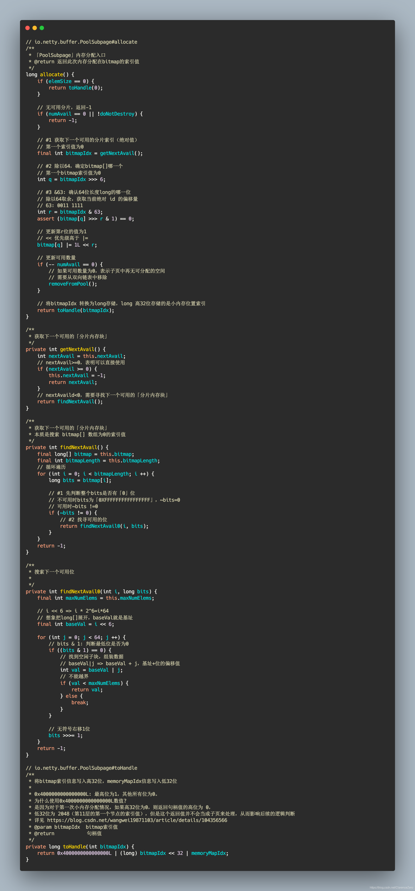
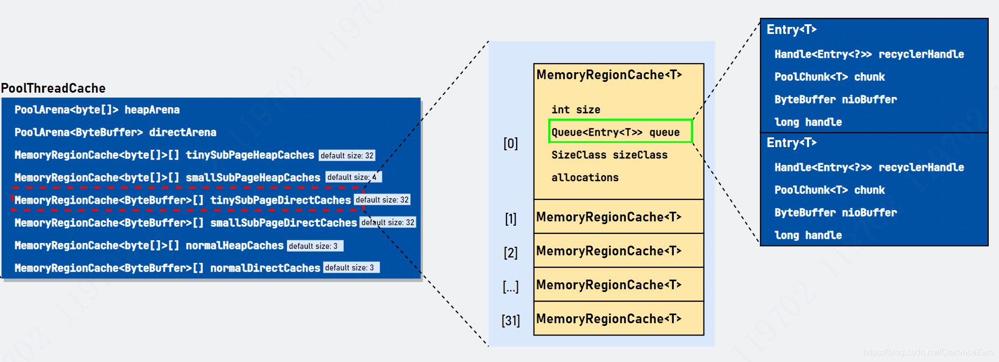

# Netty源码之内存管理(一)(4.1.44 )
摘抄自：https://blog.csdn.net/ClarenceZero/article/details/112971237


## Netty源码之内存管理(一)(4.1.44 )


`Netty`作为一款**高性能**的网络应用程序框架，拥有自己的内存分配。其思想源于[jemalloc github](https://github.com/jemalloc/jemalloc "jemalloc github")，可以说是`jemalloc`的 Java 版本。本章源码基于 Netty`4.1.44`版本，该版本是采用`jemalloc3.x`的算法思想，而`4.1.45`以后的版本则基于`jemalloc4.x`算法进行重构，两者差别还是挺大的。


## 高性能内存分配


`jemalloc`是由 Jason Evans 在 FreeBSD 项目中引入的新一代内存分配器。它是一个通用的[malloc](https://so.csdn.net/so/search?q=malloc&spm=1001.2101.3001.7020 "malloc")实现，侧重于减少内存碎片和提升高并发场景下内存的分配效率，其目标是能够替代`malloc`。`jemalloc`应用十分广泛，在 Firefox、Redis、Rust、Netty 等出名的产品或者编程语言中都有大量使用。具体细节可以参考 Jason Evans 发表的论文 [《A Scalable Concurrent malloc Implementation for FreeBSD》]。除了 jemalloc 之外，业界还有一些著名的高性能内存分配器实现，比如**ptmalloc**和**tcmalloc**。简单对比如下:


* **ptmalloc（per-thread malloc**） 基于 glibc 实现的内存分配器，由于是标准实现，兼容性较好。缺点是多线程之间内存无法实现共享，内存开销很大。    
* **tcmalloc（thread-caching malloc**） 是由 Google 开源，最大特点是带有线程缓存，目前在 Chrome、Safari 等产品中有所应用。tcmalloc 为每个线程分配一个局部缓存，可以从线程局部缓冲分配小内存对象，而对于大内存分配则使用自旋锁减少内存竞争，提高内存效率。    
* `jemalloc` 借鉴 tcmalloc 优秀的设计思路，所以在架构设计方面两者有很多相似之处，同样都包含线程缓存特性。但是 jemalloc 在设计上比 tcmalloc 要复杂。它将内存分配粒度划分为** Small、Large、Huge**，并记录了很多元数据，所以元数据占用空间高于 tcmalloc。


从上面了解到，他们的核心目标无外乎有两点:


* 高效的内存分配和回收，提升单线程或多线程场景下的性能。    
* 减少内存碎片，包括内存碎片和外部碎片。提高内存的有效利用率。


## 内存碎片


在 Linux 世界，物理内存会被划分成若干个`4KB`大小的**内存页(page)**，这是分配内存大小的最小粒度。分配和回收都是基于 page 完成的。page 内产生的碎片称为**内存碎片**，page 外产生的碎片称为**外部碎片**。**内存碎片**产生的原因是内存被分割成很小的块，虽然这些块是空闲且地址连续的，但却小到无法使用。随着内存的分配和释放次数的增加，内存将变得越来越不连续。最后，整个内存将只剩下碎片，即便有足够的空闲页框可以满足请求，但要分配一个大块的连续页框就无法满足，所以减少内存浪费的核心就是尽量避免产生内存碎片。


## 常见的内存分配器算法[wiki](https://en.wikipedia.org/wiki/Memory_management#ALLOCATION "wiki")


常见的内存分配器算法有:


* **动态内存分配**    
* **伙伴算法 [Wiki](https://en.wikipedia.org/wiki/Buddy_memory_allocation "Wiki")**    
* **Slab算法**


### 动态内存分配


全称**Dynamic memory allocation**，又称为**堆内存分配**，简单**DMA**。简单地说就是想要多少内存空间，操作系统就给你多少。在大部分场景下，只有在程序运行时才知道所需内存空间大小，提前分配的内存大小空间不好把控，分配太多造成空间浪费，分配太少造成程序崩溃。**DMA**就是从一整块内存中**按需分配**，对于已分配的内存会记录元数据，同时还会使用空闲分区维护空闲内存，便于在下次分配时快速查找可用的空闲分区。常见的有以下三种查找策略:


#### 首次适应算法（first fit）


* 空闲分区按内存地址从低到高的顺序以双向链表形式连接在一起。    
* 内存分配每次从低地址开始查找并分配。因此造成低地址使用率较高而高地址使用率很低。同时会产生较多的小内存。


#### 循环首次适应算法（next fit）


* 该算法是 **首次适应算法** 的变种，主要变化是第二次的分配是从下一个空闲分区开始查找。    
* 对于 **首次适应算法** ，该算法将内存分配得更加均匀，查找效率有所提升，但是这会导致严重的内存碎片。


#### 最佳适应算法（best fit）


* 空间分区链始终保持从小到大的递增顺序。当内存分配时，从开头开始查找适合的空间内存并分配，当完成分配请求后，空闲分区链重新按分区大小排序。    
* 此算法的空间利用率更高，但同样会有难以利用的小空间分区，究其原因是空闲内存块大小不变，并没有针对内存大小做优化分类，除非内存内存大小刚好等于空闲内存块的大小，空间利用率 100%。    
* 每次分配完后需要重新排序，因此存在 CPU 消耗。


#### 伙伴算法（Buddy memory allocation）[wiki](https://en.wikipedia.org/wiki/Buddy_memory_allocation "wiki")


伙伴内存分配技术是一种内存分配算法，它将内存划分为分区，以最合适的大小满足内存请求。于 1963 年 Harry Markowitz 发明。伙伴算法把所有的空闲页框分组成`11`个块链表，每一个块链表分别包含大小为1、2、4、8、16、32、64、128、256、512 和 1024 个连续的页框。最大内存请求大小为`4MB`，该内存是连续的。


* 伙伴算法即大小相同、地址连续。    
* **缺点**: 虽然伙伴算法有效减少了外部碎片，但最小粒度还是 **page**，因此有可能造成非常严重的内部碎片，最严重带来 50% 的内存碎片。


### Slab 算法


* **伙伴 算法** 在小内存场景下并不适用，因为每次都会分配一个 **page**，导致内存学杂费。而 **Slab 算法** 则是在 **伙伴算法** 的基础上对小内存分配场景做了专门的优化: 
  提供调整缓存机制存储内核对象，当内核需要再次分配内存时，基本上可以通过缓存中获取。    
* **Linux** 底层采用 **Slab 算法** 进行内存分配。


### jemalloc 算法


`jemalloc`是基于`Slab`而来，比 Slab 更加复杂。Slab 提升小内存分配场景下的速度和效率，jemalloc 通过`Arena`和`Thread Cache`在多线程场景下也有出色的内存分配效率。`Arena`是**分而治之**思想的体现，与其让一个人管理全部内存，到不如将任务派发给多个人，每个人独立管理，互不干涉（线程竞争）。`Thread Cache`是`tcmalloc`的核心思想，jemalloc 也把它借鉴过来。每个线程有自己的内存管理器，分配在这个线程内完成，就不需要和其他线程竞争。相关文档


* [Facebook Engineering post](http://www.facebook.com/notes/facebook-engineering/scalable-memory-allocation-using-jemalloc/480222803919 "Facebook Engineering post"): This article was written in 2011 and corresponds to jemalloc 2.1.0.    
* [jemalloc(3) manual page](http://jemalloc.net/jemalloc.3.html "jemalloc(3) manual page"): The manual page for the latest release fully describes the API and options supported by jemalloc, and includes a brief summary of its internals.


Netty 底层的内存分配是采用**jemalloc**算法思想。


## 内存规格


Netty 保留了对不同大小的内存采用不同的分配策略，具体规格如上图所示。在 Netty 中定义了`io.netty.buffer.PoolArena.SizeClass`枚举类，用于描述上图的内存规格类型，分别是**Tiny、Small 和 Normal。**当`>16MB`时，归为**Huge**类型。Netty 在每个区域内又定义了更细粒度的内存分配单位，分别是**Chunk、Page 和 Subpage。**


```java
// io.netty.buffer.PoolArena.SizeClass
enum SizeClass {
    Tiny,
    Small,
    Normal
}

```


## 内存规格化


Netty 需要对用户申请的内存大小进行**规格化**处理，目的是方便后续计算和内存分配。比如用户申请的内存大小为`31B`，如果不进行内存规格化，直接返回`31B`内存大小，那不就成 DMA 内存分配了么?通过内存规格化，将`31B`规格化为`32B`，将`15MB`规格化`16MB`。当然，对于不同类型的内存策略不同。从上图可以看出一些端倪:


* 对于 `Huge` 级别的内存大小，用户申请多少内存就返回多少内存（如有必要，需要内存对齐）。    
* 对于 `tiny` 、`small` 、`normal` 级别的内存，以 `512B` 为分界线有: 
  当 `>=512B`时，返回最接近 2且大于用户申请内存的大小的值。比如申请内存大小为 `513B`，则返回 `1024B`。当 `<512B` 时，返回最接近 `16` 的倍数且大于用户申请内存的大小的值。比如申请内存大小为 `17B`，则返回 `32B`; 申请内存大小为 `46B`，返回 `48B`。


**内存规格化**核心源码在`io.netty.buffer.PoolArena`对象中，`PoolArena`是 Netty 管理内存最重要的一个类:


### 获取最接近 2^n 的数


我们需要对申请的内存进行**规格化**，**便于计算和管理。**下面是将`1025`进行规格化的过程:上面一连串的**位移**计算，看得眼花缭乱。其实最主要的目的是找到最接近 2且大于用户申请内存的大小的值。思路是把二进制`0100 0000 0001(1025)`变成`0111 1111 1111(2048)`。记初始值为`i`，原始值的二进制最高位为`1`的序号记为`j`，具体执行过程描述如下:


* 先执行 `i-1` 操作，目的是解决当值为 2时也能得到本身，而非 2。    
* 再执行 `i |= i>>>1` 运算，目的是赋值第 `j-1` 位的值为 `1`。已经第 `j` 位位置确定为 `1`，那么无符号右移一位后第 `j-1` 也为 `1`。再与原值进行 `|` 运算后更新第 `j-1` 的值。此时，原值的第 `j`、`j-1` 都确定为 `1`，那么接下来就可以无符号右移两倍，让 `j-2`、`j-3` 赋值为 `1`。由于 `int` 类型有 32 位，所以只需要进行 `5` 次运算，每次分别无符号右移1、2、4、8、16 就可让小于 `i` 的所有位都赋值为 `1`。


### 获取最近的下一个16的倍数值


其实思路很简单，先把低四位的值抹去（变成0），再加上`16`就得到了目标值。


```java
(reqCapacity & ~15) + 16;
// 0000 0000 0000 0000 0000 0000 0010 1100 (44)(原始值)
// 0000 0000 0000 0000 0000 0000 0000 1111 (15)(15)
// 1111 1111 1111 1111 1111 1111 1111 0000 (-16)(~15) 				  // ~15
// 0000 0000 0000 0000 0000 0000 0010 0000 (32)(reqCapacity& ~15) 	  // 抹去低4位
// 0000 0000 0000 0000 0000 0000 0011 0000 (48)		  			      // +16，补值 

```


### 小结


* `Netty` 通过大量的**位运算**来提升性能，但代码的**可读性不太好**。因此，大家可以通过一边网上搜索一边通过模拟位运算体会各个位之间的变化过程。    
* 位运算的使用技巧，可以看看 [位运算简介及实用技巧](http://www.matrix67.com/blog/archives/263 "位运算简介及实用技巧")，里面讲得十分详细。    
* Netty 和内存规格化的位运算技巧展示了三个: 
  一是找到离分配内存最近且大于分配内存的 2 值。二是找到离分配内存最近且大于分配内存的16 倍的值。三是通过掩码判断是否大于某个数。    
* 内存规格化的单位是**字节(byte)，**而非**字(bit)。**


## Netty 内存池分配整体思路


* 首先，`Netty` 会向 `操作系统` 申请一整块 **连续内存，**称为 **chunk（数据块）**，除非申请 `Huge` 级别大小的内存，否则一般大小为 `16MB`，使用 `io.netty.buffer.PoolChunk` 对象包装。具体长这样子:


* **Netty**将**chunk**进一步拆分为多个**page**，每个 **page** 默认大小为 `8KB`，因此每个 **chunk **包含 `2048` 个 **page**。为了对**小内存**进行精细化管理，减少内存碎片，提高内存使用率，Netty 对 **page **进一步拆分若干 **subpage**，subpage 的大小是动态变化的，最小为 `16Byte`。    
* **计算**: 当请求内存分配时，将所需要内存大小进行**内存规格化**，获得合适的内存值。根据值确认准确的树的高度。    
* **搜索**: 在该分组大小的相应**高度**中**从左至右**搜寻空闲分组并进行分配。    
* **标记**: 分组被标记为**全部已使用，**且通过循环更新其**父节点**标记信息。父节点的标记值取两个子节点标记值的最小的一个。


当然，上面说的只是整体思路，一时看还云里雾里的。相信经过下面的讲述能帮助你拔云见日。


### Huge 分配逻辑概述


大内存分配比其他类型的内存分配稍微简单一点，操作的内存单元是`PoolChunk`，它的容量大小是用户申请的容量（可满足内存对齐要求）。Netty 对`Huge`对象的内存块采用非池化管理策略，在每次请求分配内存时单独创建特殊的非池化`PoolChunk`对象，当对象内存释放时整个`PoolChunk`内存也会被释放。大内存的分配逻辑是在`io.netty.buffer.PoolArena#allocateHuge`完成。


### Normal 分配逻辑


Normal 级别分配的大小范围是`[4097B, 16M)`。核心思想是将`PoolChunk`拆分成`2048`个`page`，这是`Normal`分配的最小单位。每个 page 等大（pageSize=8KB），并在逻辑上通过一棵满二叉树管理这些 page 对象。我们申请的内存本质是组合若干个`page`。`Normal`的分配核心逻辑是在`PoolChunk#allocateRun(int)`完成。


### Small 分配逻辑


Small 级别分配的大小范围是`(496B, 4096B]`。核心是把一个`page`拆分若干个`Subpage`，`PoolSubpage`就是这些若干个`Subpage`的化身，有效解决小内存场景造成内存碎片的问题。一个 page 大小为`8192B`，有且只有四种大小:`512B`、`1024B`、`2048B`和`4096B`，以`2`倍递增。当申请的内存大小在`496B~4096B`范围内时，就能确定这四种中的一种。当进行内存分配时，先在树的最底层找到一个空闲的`page`，拆分成若干个`subpage`，并构造一个`PoolSubpage`进行管理。选择第一个`subpage`用于此次申请，标记为已使用，并将`PoolSubpage`放置在`PoolSubpage[] smallSubpagePools`数组所对应的链表中。等下次申请等大容量内存时就可从`PoolSubpage[]`直接分配从链表中分配内存。


### Tiny 分配逻辑


Tiny 级别分配的大小范围是`(0B, 496B]`。分配逻辑与`Small`类似，先找到空闲的`Page`然后将其拆分若干个`Subpage`并构造一个`PoolSubpage`对它们进行管理。随后选择第一个`subpage`用于此次申请，并将对象`PoolSubpage`放置在`PoolSubpage[] tinySubpagePools`数组所对应的链表中。等待下次分配时使用。区别在于如何定义**若干个?**Tiny 给出的定义逻辑是获取最接近`16*N`的且大于规格值的大小。比如申请内存大小为`31B`，找到最接近的下一个`16*1`的倍数且大于`31`的值是`32`，因此，就把`Page`拆分成`8192/32=256`个 subpage，这里的若干个就是根据规格值确定的，它是可变的值。


## PoolArena


上面讲述了针对不同级别 Netty 是如何完成内存分配的。接下来，我们先对一些类进行认识，为后续源码解读打下基础。`PoolArena`是进行**池化**内存分配的核心类，采用固定数量的多个`Arena`进行内存分配，默认与 CPU 核心数量有关，它是**线程共享**的对象，每个线程只会绑定一个`PoolArena`，线程和`PoolArena`是**多对一**的关系。当某个线程首次申请内存分配时，会通过**轮询（Round-Robin）**方式得到一个 Arena，在该线程的整个生命周期内只和这个 Arena 打交道，前面也说过，`PoolArena`是分治思想的体现，在多线程场景下有出色的表现。`PoolArena`提供`DirectArena`和`HeapArena`子类，这是因为底层容器类型不同所以需要子类区分。但核心逻辑是在`PoolArena`完成的。`PoolArena`的数据结构大致（除去监测指标数据）可分为两大类: 存储`PoolChunk`的`6`个`PoolChunkList`和 存储`PoolSubpage`的`2`个数组。`PoolArena`构造器初始化也做了很多重要的工作，包含串联`PoolChunkList`以及初始化`PoolSubpage[]`。


### 初始化 PoolChunkList


`q000`、`q025`、`q050`、`q075`、`q100`表示最低内存使用率。如下图所示


任意`PoolChunkList`都有内存使用率的上下限:`minUsag`、`maxUsage`。如果使用率超过`maxUsage`，那么`PoolChunk`会从当前`PoolChunkList`移除，并移动到**下一个**`PoolChunkList`。同理，如果使用率小于`minUsage`，那么`PoolChunk`会从当前`PoolChunkList`移除，并移动到**前一个**`PoolChunkList`。每个`PoolChunkList`的上下限都有交叉重叠的部分，因为`PoolChunk`需要在`PoolChunkList`不断移动，如果临界值恰好衔接的，则会导致`PoolChunk`在两个`PoolChunkList`不断移动，造成性能损耗。`PoolChunkList`适用于`Chunk`场景下的内存分配，`PoolArena`初始化`6`个`PoolChunkList`并按上图首尾相连，形成双向链表，唯独`q000`这个`PoolChunkList`是没有前向节点，是因为当其余`PoolChunkList`没有合适的`PoolChunk`可以分配内存时，会创建一个新的`PoolChunk`放入`pInit`中，然后根据用户申请内存大小分配内存。而在`p000`中的`PoolChunk`，如果因为内存归还的原因，使用率下降到`0%`，则不需要放入`pInit`，直接执行销毁方法，将整个内存块的内存释放掉。这样，内存池中的内存就有生成/销毁等完成生命周期流程，避免了在没有使用情况下还占用内存。


### 初始化 PoolSubpage[]


`PoolSubpage`是对某一个`page`的化身，由于`Page`还可以按`elemSize`拆分成若干个`subpage`，在 PoolArena 使用`PoolSubpage[]`数组来存储`PoolSubpage`对象，经过`PoolArena`后如下图所示:


还记得这幅图么:


对于`Small`它拥有四种不同大小的规格，因此`smallSupbagePools`的数组长度为`4`，`smallSubpagePools[0]`表示`elemSize=512B`的`PoolSubpage`对象的链表，`smallSubpagePols[1]`表示`elemSize=1024B`的`PoolSubpages`对象的链表。以此类推，`tinySubpagePools`原理一样，只不过划分的粒度（步长）比较少，以`16`的倍数递增。因此，由于`Tiny`大小限制，总共可分为`32`类，因此`tinySubpagePools`数组长度为`32`。数组下标所对应的`size`容量不一样，且每个数组都对应一组双向链表。这两个数组用来存储`PoolSubpage`对象且按`PoolSubpage#elemSize`确定索引的位置`index`，最后将它们构造双向链表。


### 源码


### 子类实现


继承体系如下图所示:


* `PoolArenaMetric`: 定义与 `PoolArena` 相关监控接口。    
* `PoolArena`: 抽象类。定义了主要的核心变量和部分内存分配逻辑。由于存储**数据容器**不同，创建和销毁逻辑也有所不一样。因此它有两个子类，分别是 DirectArena、HeapArena。


抽象类`PoolArena`有几个子类必须实现的接口:这些抽象方法就是`DirectArena`和`HeapArena`实现类的区别，具体细节就不再描述了。


## PoolChunkList


`PoolChunkList`是一个双向链表，用来存储`PoolChunk`对象，它指向`PoolChunk`链表的头结点。而对于`PoolChunkList`节点本身来说，它与其他`PoolChunkList`也构成一个双向链表。如上图所示。`PoolChunkList`内部定义比较简单:


## PoolChunk


`PoolChunk`是 Netty 对`jemalloc3.x`算法思想的描述，它是 Netty 内存分配的最核心的类。


### 文档翻译


#### 概述描述


`page`是`Chunk`可分配的最小内存单元，`Chunk`是`page`的集合，`Chunk`大小的计算公式为`chunkSize = 2^{maxOrder} * pageSize`。首先，我们分配一个`size = chunkSize`的字节数组，当需要创建一个给定大小的`ByteBuf`时，我们搜索字节数组中的第一个位置，该位置有足够的空闲空间来容纳请求的大小，并返回一个 long 类型的句柄值来编码这个**偏移量信息**(这个内存段然后被标记为保留，所以它总是由一个 ByteBuf 使用，而不是多个)。为了简单起见，所有用户申请内存的大小都按`PoolArena#normalizecapacity`方法法进行**规格化处理**。这确保了当我们请求大小 >= pageSize 的内存段时，规格化容量等于下一个最近的2的次幂。为了获取请求大小可用的第一个偏移量，我们构造了一棵 满二叉树(Compelte balanced binary) 从而加快搜索速度。使用数组`memoryMap`存储这棵树的信息。这棵树看起来看是这样的（括号中的表示每个节点的大小）


* depth=0 1 node (chunkSize)    
* depth=1 2 nodes (chunkSize/2)    
* …    
* depth=d 2^d nodes (chunkSize/2^d)    
* …    
* depth=maxOrder 2^maxOrder nodes (chunkSize/2^{maxOrder} = pageSize)


当`depth=maxOrder`时，叶子节点是由`page`组成。


#### 搜索算法


用符号在`memoryMap`中编码满二叉树。


* `memoryMap` 类型是 `byte[]`，用来记录树的分配情况。初始值为对应节点所在的树的深度。    
* `memoryMap[id] = depth_of_id` => 空闲/完全未分配。    
* `memoryMap[id] > depth_of_id` => 至少有一个子节点已经被分配了，但其他子节点仍然可分配。    
* `memoryMap[id] = maxOrder + 1` => 当前节点已经完成分配了，即当前节点处于不可用状态。


#### allocateNode(d)


目标是在对应深度从左到右找到第一个空闲的可分配的节点。参数`d`表示`depth`。


* 从头结点开始。（depth=0 或 id=1）    
* 如果 `memoryMap[1] > d` 表示这个 `Chunk` 无可用分配内存。    
* 如果左节点的值 `<=h`，我们可以从左子树进行分配，重复直到找到空闲节点。    
* 否则深度右子树并重复直到找到空闲节点。


#### allocateRun(size)


分配一组`page`。参数`size`表示规格化后的内存大小。


* 计算 `size` 所对应的深度。公式 `d = log_2(chunkSize/size)`。    
* 返回 `allocateNode(d)`


#### allocateSubpage(size)


创建/初始化一个`normcacity`大小的新`PoolSubpage`。创建/初始化任意`PoolSubpage`都会添加到拥有这个`PoolChunk`的`PoolArena`的子页内存池中。


* 使用 `allocateNode(maxOrder)` 找到任意空闲的页子节点，返回一个 `handle` 变量。    
* 使用 `handle` 构建 `PoolSubpage` 对象并添加到 `PoolArena` 的 `subpagePool` 内存池中。


### 源码


`PoolChunk`源码相对比较复杂，首先需要把定义的变量理解清楚，为后续内存分配源码分析打下基础。


相关方法一览:


这是只是为了让大家留有印象，等到源码分析时可以来这里看看对应的变量和方法到底做了些什么事情。


## PoolSubpage


`PoolSubpage`是`Small`、`Tiny`级别分配内存时所使用到的对象。一个`PoolSubpage`对象对应一个 page。因此，一个`PoolSubpage`管理的内存大小为`8KB`。相关变量解释如下:


`PoolSubpage`管理小内存也是十分有技巧，待后面做详细解读。


## 再讲池化内存分配


在[ByteBuf](https://blog.csdn.net/ClarenceZero/article/details/112861889 "ByteBuf")这一章节中我们讲过`ByteBufAllocator`分配器体系。但那里是从整个分配器体系讲解，与池化分配器相关的`PooledByteBufAllocator`只是简单的描述了初始化流程。现在我们继续从这里当做切入点，理清各个类之间如何分配和管理的。首先我们要知道`PooledByteBufAllocator`是线程安全的类，我们可以通过`PooledByteBufAllocator.DEFAULT`获得一个`io.netty.buffer.PooledByteBufAllocator`池化分配器，这也是 Netty 推荐的做法之一。我们也了解到，`PooledByteBufAllocator`会初始两个重要的数组，分别是`heapArenas`和`directArenas`，所有的与内存分配相关的操作都会委托给 heapArenas 或 directArenas 处理，数组长度一般是通过`2*CPU_CORE`计算得到。这里体现 Netty（准确地说应该是 jemalloc 算法思想） 内存分配设计理念，通过增加多个`Arenas`减少内存竞争，提高在多线程环境下分配内存的速度以及效率。数组`arenas`是由上面我们讲过的`PoolArena`对象构成，它是内存分配的中心枢纽，一位大管家。包括管理`PoolChunk`对象、管理`PoolSubpage`对象、分配内存对象的核心逻辑、管理本地对象缓存池、内存池销毁等等，它的侧重点在于管理**已分配**的内存对象。而`PoolChunk`是 jemalloc 算法思想的化身，它知道如何有效分配内存，你只需要调用对应方法就能获取想要大小的内存块，它只专注管理物理内存这件事情，至于分配后的事情，它一概不知，也一概不管，反正`PoolArena`这个大管家会操心的。接下来，我们会通过`PooledByteBufAllocator`相关方法为入口，通过源码带你走进 Netty 分配内存的世界。


### 堆外内存分配源码实现


堆外内存底层数据存储容器是`java.nio.ByteBuffer`对象。一般通过`io.netty.buffer.AbstractByteBufAllocator#directBuffer(int)`得到一个池化的堆外内存 ByteBuf 对象。跟踪方法，它会通过抽象类`io.netty.buffer.AbstractByteBufAllocator#newDirectBuffer`交给子类实现，这里是使用池化的分配器`PooledByteBufAllocator`实现。相关源码如下:


```java
// io.netty.buffer.PooledByteBufAllocator#newDirectBuffer
/**
 * 获取一个堆外内存的「ByteBuf」对象
 */
@Override
protected ByteBuf newDirectBuffer(int initialCapacity, int maxCapacity) {
    // #1 从本地线程缓存中获取「PoolThreadCache」对象
    PoolThreadCache cache = threadCache.get();
    
    // #2 从缓存对象中获取「directArena」，根据存储类型不同选取对应的「Arena」
    PoolArena<ByteBuffer> directArena = cache.directArena;

    final ByteBuf buf;
    if (directArena != null) {
        // #3-1 委托「directArena」完成内存分配
        buf = directArena.allocate(cache, initialCapacity, maxCapacity);
    } else {
        // #3-2 兜底方案
        buf = PlatformDependent.hasUnsafe() ?
            UnsafeByteBufUtil.newUnsafeDirectByteBuf(this, initialCapacity, maxCapacity) :
            new UnpooledDirectByteBuf(this, initialCapacity, maxCapacity);
    }
    
    // #4 包装生成好的「ByteBuf」对象，用于内存泄漏检查
    return toLeakAwareBuffer(buf);
}

```


上面就是分配器分配一个池化 ByteBuf 对象的核心源码。是不是感觉很简单，因此内存分配委托`directArena`完成的。之前说过，每个线程只能绑定一个`PoolArena`对象，在整个线程的生命周期内只和这个`PoolArena`打交道，而这个引用是存放在`PoolThreadCache`本地线程缓存里面，某个线程想要分配内存，调用`threadCache.get()`会初始化相关变量，一般 Netty 默认开始本地线程缓存，因此，从`cache`获得`directArena`对象不为空。这个`PoolThreadCache`可有用了! 它持有`PoolArena`对象，通过`MemoryRegionCache`缓存部分`ByteBuffer`或`byte[]`信息，这里我们只需要知道是从`PoolThreadCache`本地缓存中获取其中一个`dicrectArena`对象，通过比较`PoolByteBufAllocator`中每一个`PoolArena#numThreadCaches`大小，返回最小值的`PoolArena`对象。每个线程都拥有`PoolThreadCache`。关于`PoolThreadCache`会在新的章节详细介绍。继续跟着主线，现在执行到`PoolArena#allocate(PoolThreadCache, int, int)`。那我们看看`PoolArena`作了些什么:


#### 阶段一: 初始化一个 ByteBuf 实例对象


通过**对象池**加速`ByteBuf`对象的内存和释放，但不好的一面是有如果对 Netty 底层不了解的开发人员的程序可能导致内存泄漏。如果对象池没有，则直接根据相应规则创建。


```java
// io.netty.buffer.PoolArena#allocate(io.netty.buffer.PoolThreadCache, int, int)
/**
 * 获取池化的「ByteBuf」实例
 */
PooledByteBuf<T> allocate(PoolThreadCache cache, int reqCapacity, int maxCapacity) {
    
    // #1 获取一个「ByteBuf」实例对象。可能直接生成，也有可能从对象池中获取。
    // 它是「PoolArena」抽象类，需要子类实现，这里是「PoolArena」实现类
    PooledByteBuf<T> buf = newByteBuf(maxCapacity);
    
    // #2 为「buf」填充物理内存信息
    allocate(cache, buf, reqCapacity);
    
    // #3 返回
    return buf;
}

// io.netty.buffer.PoolArena.DirectArena#newByteBuf
/**
 * 获取一个「ByteBuf」实例对象。
 */
@Override
protected PooledByteBuf<ByteBuffer> newByteBuf(int maxCapacity) {
    if (HAS_UNSAFE) {
        
        // #1 带有「Unsafe」的「ByteBuf」，一般在服务器中都支持 Unsafe
        // 所以我们仔细看看这个方法是如何实现的
        return PooledUnsafeDirectByteBuf.newInstance(maxCapacity);
    } else {
        
        // #2 「非Unsafe」的「ByteBuf」
        return PooledDirectByteBuf.newInstance(maxCapacity);
    }
}

```


```java
// io.netty.buffer.PooledUnsafeDirectByteBuf
/**
 * 「PooledUnsafeDirectByteBuf」没有被「public」修饰，它是包可见对象，因此，我们不能通过分配器获得此类型实例。
 * 这个「ByteBuf」拥有「ObjectPool」对象池，可加速对象的分配效率。
 * 还有一个和它类型的，叫「io.netty.buffer.PooledDirectByteBuf」，内部也使用「ObjectPool」对象池。
 * 具体区别是「PooledUnsafeDirectByteBuf」内部维护「memoryAddress」变量，这是「Unsafe」操作的必要变量。
 */
final class PooledUnsafeDirectByteBuf extends PooledByteBuf<ByteBuffer> {
    // 对象池
    private static final ObjectPool<PooledUnsafeDirectByteBuf> RECYCLER = ObjectPool.newPool(
            new ObjectCreator<PooledUnsafeDirectByteBuf>() {
        @Override
        public PooledUnsafeDirectByteBuf newObject(Handle<PooledUnsafeDirectByteBuf> handle) {
            return new PooledUnsafeDirectByteBuf(handle, 0);
        }
    });

    static PooledUnsafeDirectByteBuf newInstance(int maxCapacity) {
        // #1 从对象池中获取「ByteBuf」实例
        PooledUnsafeDirectByteBuf buf = RECYCLER.get();
        
        // #2 重置
        buf.reuse(maxCapacity);
        
        // 返回
        return buf;
    }

    private long memoryAddress;
    
    // 重置所有指针变量
    final void reuse(int maxCapacity) {
        maxCapacity(maxCapacity);
        resetRefCnt();
        setIndex0(0, 0);
        discardMarks();
    }

    // ...
}

```


#### 阶段二: 为 ByteBuf 填充内存信息


这个阶段的核心方法属于`io.netty.buffer.PoolArena#allocate(io.netty.buffer.PoolThreadCache, io.netty.buffer.PooledByteBuf<T>, int)`，`PoolArena`依据申请内存大小采用不同的内存分配策略，并把内存信息写入`ByteBuf`对象。前面我们对`PoolSubpage<T>[] tinySubpagePools`和 PoolSubpage[] smallSubpagePools 这两个变量有所了解，会在分配`tiny&small`级别内存时使用到。待下次请求分配同等大小的内存时就可以通过现成的`PoolSubpage<T>[]`进行分配。从源码好好休会一下:


现在**总结**一下堆外内存分配逻辑:


* 首先，对申请容量进行**规格化处理**。获取最接近且大于原值的2的幂次方的值，称为**规范值。**    
* 根据规范值选择合适的分配策略。从大方向讲，有 `3` 种分配策略，分别是 `tiny&small`、`normal` 以及 `Huge`。    
* `Huge` 进行内存分配并不会尝试从本地线程缓存分配，也不会对它进行池化管理，直接创建 `PoolChunk` 对象并返回。    
* 当 `Normal` 进行内存分配，会按 `q050->q025->q000->qInit->q075` 顺序进行分配，从 `q050` 开始分配是因为这是一个折中的分配方案，如果从 `q000` 分配的话，会有大部分的 `PoolChunk` 面临频繁的创建和销毁，造成内存分配的性能降低。如果从 `q050` 开始，会使 `PoolChunk` 的使用率范围保持在中间水平，既降低了 `PoolChunkList` 被回收的概率，也兼顾了性能。如果分配成功，则计算该 `PoolChunk` 的使用率，使用率超过了 `PoolChunkList` 的上限时，移动到下一个 `PoolChunkList` 链表中。如果分配失败，则会创建一个新的内存块进行内存，如果分配成功添加到 `qInit` 链表。    
* 对于 `Tiny&Small` 级别，会尝试通过 `PoolSubpage` 分配，如果分配成功则返回。如果分配失败，则还是按 `Normal` 那套分配逻辑进行分配。


总的来说，`PoolArena#allocate`方法是`PoolArena`对象分配内存的核心逻辑，会根据规范值选择合适的分配策略。而且通过本地线程缓存加速内存分配，通过对象池加速`ByteBuf`对象分配，并减少 GC。


### 堆内内存分配概述


堆内内存和堆外内存分配逻辑大致相同，不同点在于:


* 使用 `PoolArena` 的子类 `HeapArena` 完成分配工作。    
* 底层数据容器为 `byte[]`，而 `DirectArena` 是 `java.nio.ByteBuffer` 对象。


## 内存回收


内存回收需要分清楚主语是谁?我们知道，Netty 通过`Thead Cache`缓存部分已分配的内存，那么它是如何进行内存回收呢?这里的主语是`Thread Cache`。而对于大管家`PoolArena`，它是如何管理内存的回收?众所周期，通过`BytBuf#release()`释放`ByteBuf`对象，这个 API 只会让引用计数值`-1`，并非直接回收物理内存。只有当引用计数值为`0`再进行物理内存回收动作。`ByteBuf#release()`调用过程概述如下:我们通过`Update`对象更新引用计数，如果引用计数为0，则需要释放内存。如果所属的「PoolChunk」不支持池化，则直接释放。对于可池化的「PoolChunk」，首先看能不能通过本地线程缓存待回收的内存信息，如果本地线程缓存成功，则返回。否则交给「PoolArena」处理内存回收。「PoolArena」会交给所在的「PoolChunkList」链表进行处理。处理逻辑相对简单: 找到「PoolChunk」回收内存，判断「PoolChunk」是否满足 minUsage，不满足则移动前向节点。至此，这就是内存回收大致情况。


```java
// io.netty.buffer.AbstractReferenceCountedByteBuf#release()
@Override
public boolean release() {
    // #1 首先通过 updater 更新「refCnt」的值，refCnt=refCnt-2
    // 如果旧值「refCnt」==2，则update.release(this)会返回true，表示当前「ByteBuf」引用计数为0了，
    // 是时候需要释放了
    // #2 释放内存
    return handleRelease(updater.release(this));
}

// io.netty.buffer.AbstractReferenceCountedByteBuf#handleRelease
private boolean handleRelease(boolean result) {
    if (result) {
        // 释放内存
        deallocate();
    }
    return result;
}

// io.netty.buffer.PooledByteBuf#deallocate
@Override
protected final void deallocate() {
    // 判断句柄变量是否>=0
    if (handle >= 0) {
        final long handle = this.handle;
        this.handle = -1;
        memory = null;
        
        // △ 使用「PoolArena#free」释放
        chunk.arena.free(chunk, tmpNioBuf, handle, maxLength, cache);
        tmpNioBuf = null;
        chunk = null;
        // 回收「ByteBuf」对象
        recycle();
    }
}

// io.netty.buffer.PoolArena#free
/**
 * 由「PoolArena」定义「释放」二字
 * @param chunk			「ByteBuf」所以的「PoolChunk」
 * @param nioBuffer		「ByteBuf」内部的临时「ByteBuffer」对象
 * @param handle		 句柄变量值
 * @param normCapacity	 申请内存值
 * @param cache		     线程缓存
 */
void free(PoolChunk<T> chunk, 
          ByteBuffer nioBuffer, 
          long handle, int normCapacity, PoolThreadCache cache) {
    
    if (chunk.unpooled) {
        
        // #1 待回收「ByteBuf」所属的「Chunk」为非池化，直接销毁
        // 根据底层实现方式不同采取不同销毁策略。
        // 如果是「ByteBuf」对象，根据有无「Cleaner」分类，采取不同的销毁方法
        // 如果是「byte[]」，不做任何处理，JVM GC 会回收这部分内存
        int size = chunk.chunkSize();
        destroyChunk(chunk);
        activeBytesHuge.add(-size);
        deallocationsHuge.increment();
    } else {
        
        // #2 对于池化的「Chunk」
        SizeClass sizeClass = sizeClass(normCapacity);
        if (cache != null &&
            // 尝试添加到本地缓存，至于如何添加，会在另一章节详细说明
            // 内部会使用「MermoryRegionCache」缓存内存信息，比如句柄值，容量大小、属于哪个「chunk」等
            // 待后面这个线程申请等容量大小时就可以从本地线程中分配
			// 那有人会说，有借不还么?那是不可能的，PoolThreadCache会维持添加计数，达到某个阈值则会触发
            // 回收动作，并不会造成内存泄漏
            cache.add(this, chunk, nioBuffer, handle, normCapacity, sizeClass)) {
            return;
        }
		
        // 本地缓存添加失败，那就交给由「PoolArena」完成释放
        freeChunk(chunk, handle, sizeClass, nioBuffer, false);
    }
}

// io.netty.buffer.PoolArena#freeChunk
/**
 * 释放「ByteBuf」对象
 * @param chunk
 * @param handle
 * @param sizeClass
 * @param nioBuffer
 * @param finalizer
 */
void freeChunk(PoolChunk<T> chunk, 
               long handle, 
               SizeClass sizeClass, 
               ByteBuffer nioBuffer, boolean finalizer) {
    final boolean destroyChunk;
    synchronized (this) {
        // We only call this if freeChunk is not called because of the PoolThreadCache finalizer as otherwise this
        // may fail due lazy class-loading in for example tomcat.
        // 这里应对懒加载所做出的判断。比如「Tomcat」卸载某个应用时，会把对应的「ClassLoader」卸载掉，
        // 但对于线程回收finalizer而言可能需要这个类加载器的类信息，因此这里判断一下
        if (!finalizer) {
            switch (sizeClass) {
                case Normal:
                    ++deallocationsNormal;
                    break;
                case Small:
                    ++deallocationsSmall;
                    break;
                case Tiny:
                    ++deallocationsTiny;
                    break;
                default:
                    throw new Error();
            }
        }
        // 调用PoolChunkList#free方法归还内存
        destroyChunk = !chunk.parent.free(chunk, handle, nioBuffer);
    }
    if (destroyChunk) {
        // destroyChunk not need to be called while holding the synchronized lock.
        destroyChunk(chunk);
    }
}

// io.netty.buffer.PoolChunkList#free
boolean free(PoolChunk<T> chunk, long handle, ByteBuffer nioBuffer) {
    
    // #1 先通过「PoolChunk#free」回收内存块
    // 「handle」记录树的位置信息
    // 「PoolChunk」会缓存nioBuffer对象，用于下次体时使用
    chunk.free(handle, nioBuffer);
    
    // #2 判断当前「PoolChunk」的使用率，是否需要移到前一个节点链表中
    if (chunk.usage() < minUsage) {
        remove(chunk);
        // Move the PoolChunk down the PoolChunkList linked-list.
        return move0(chunk);
    }
    return true;
}

```


## 总结


以上是我们迈向 Netty 内存的一小步，也是熟悉 Netty 内存的一大步。2333，希望通过对特定的类、结构的分析让大家对整个内存流程有大致的了解。等熟悉这些过程后，我们再深究细节。


文章知识点与官方知识档案匹配，可进一步学习相关知识


[Java技能树](https://edu.csdn.net/skill/java/?utm_source=csdn_ai_skill_tree_blog "Java技能树")[首页](https://edu.csdn.net/skill/java/?utm_source=csdn_ai_skill_tree_blog "首页")[概览](https://edu.csdn.net/skill/java/?utm_source=csdn_ai_skill_tree_blog "概览")131337人正在系统学习中


# Netty源码之内存管理(二)(4.1.44)
摘抄自：https://blog.csdn.net/ClarenceZero/article/details/112999320


## Netty源码之内存管理(二)(4.1.44)


前面做了很多铺垫（[Netty源码之内存管理(一)](https://blog.csdn.net/ClarenceZero/article/details/112971237 "Netty源码之内存管理(一)")），带着大家熟悉了与内存分配相关的类的定义和分配逻辑。但并没有真正落实到 jemalloc 思想在源码是如何体现的。本章就是对`PoolChunk`逐字解析，死扣细节。在分析源码之前我们需要对分配的内存级别有一个清晰的定位，当分配`Huge`级别对象，直接使用`PoolChunk`包装，并没有复杂的分配逻辑。而对于`tiny&small&normal`级别来说，进行精细化的内存管理十分有必要的。开局一张图:


`PoolChunk`本质就是维护这一棵满二叉树，这棵树默认管理`16MB`内存（这个值是可以手动设置）。`memoryMap[]`是可变的数组，Netty 在这个数组上逻辑构建一棵满二叉树（当然也可以用链表之类的数据结构，但是随机索引效率不高，我们可以根据数组索引快速定位到某一层的第一个节点。但链表是不能做到的），`depthMap[]`表示每个节点对应的深度，这是不可变的。一个`Long`型被分成高、低两部分，高 32 位记录**小内存**分配信息，低 32 位记录**节点**下标值。当分配`normal`级别内存时，只有低 32 位信息有用，它的值表示节点序号（起始值为 1），当分配`tiny&normal`级别内存时，高、低两部分确定某个`page`下的某个`subpage`。还有一个比较有意思的是任意节点所管理的内存大小都是 2 的次幂，因此 Netty 会对用户申请的内存大小进行**规格化**的原因就在这里。任意规格值（当然不能超过`PoolChunkSize`）都能找到合适的节点，除非没有节点可满足当前内存申请，那只能新创建一个`PoolChunk`。还有另外一个疑问就是如何更新`memoryMap[]`数组呢，请看大屏幕:


index 表示节点索引，value 表示对应 memoryMap[index] 。用户第一次申请 4MB 大小内存，由于内存大小确定，因此所在的层的位置也可以通过`maxOrder - (log2(normCapacity) - pageShifts)`确定，4MB 对应层数（也可理解为深度）为 2。内存分配过程如下，其实对应方法`allocateNode(int)`实现逻辑: 首先判断节点 1 的使用状态: memoryMap[1](0 "1")!= unusable(12) 表示节点 1 可用，但由于层数不匹配，所以获取子树节点 2，同时判断使用状态，发现 != 12 且层数不匹配，那就继续获取子节点 4，发现 !=12 且层数匹配，所以节点 4 就用作此次内存分配的节点，并更新 memoryMap[4]=12 表示节点 4 已使用，变量`handle`的低 32 位记录子节点位置信息，同时循环更新父节点的 memoryMap，父节点的值是子节点的 memoryMap 的最小值，所以 memoryMap[2]=2，memoryMap[1] =1。这样，第一次申请 4MB 大小内存就算完成了。第二次申请 4MB 大小内存，当在第 2 层判断节点 4 的 memoryMap 值等于 12，会判断兄弟节点 5 是否满足分配。大家好好体会。


## PoolChunk 内存分配


PoolChunk 是 jemalloc3.x 算法思想的体现，里面以`allocate`开头的 API 就是内存分配算法的实现。入口方法是`allocate(PooledByteBuf, int, int)`。


### allocate(PooledByteBuf, int, int)


这个方法做的事情有:


* 根据申请内存大小选择合适的分配策略。具体为如果 >=pageSize，使用 `allocateRun()` 方法分配，否则使用 `allocateSubpage()` 分配，它们都会返回句柄值 handle。    
* 初始化 `ByteBuf`。


源码如下:


```java
// io.netty.buffer.PoolChunk#allocate
/**
 * 
 * @param buf			「ByteBuf」对象，它是物理内存的承托
 * @param reqCapacity    用户所需内存大小
 * @param normCapacity	 规格值
 * @return
 */
boolean allocate(PooledByteBuf<T> buf, int reqCapacity, int normCapacity) {
    
    // 低32位: 节点索引
    // 高32位: 位图索引
    final long handle;
    // 位操作判断大小
    if ((normCapacity & subpageOverflowMask) != 0) { 
        // #1 申请>=8KB
        handle =  allocateRun(normCapacity);
    } else {
        // #2 申请<8KB
        handle = allocateSubpage(normCapacity);
    }

    if (handle < 0) {
        return false;
    }
    
    // #3 如果「PoolChunk」存在缓存的「ByteBuffer」就复用
    ByteBuffer nioBuffer = cachedNioBuffers != null ? cachedNioBuffers.pollLast() : null;
    
    // #4 初始化ByteBuf内存相关信息
    initBuf(buf, nioBuffer, handle, reqCapacity);
    return true;
}

```


### allocateRun(int)


方法 allocateRun(int) 做的事情也不多，主要有:


* 根据规格值计算所对应的深度 `d`    
* 调用 `allocateNode(d)` 完成内存分配    
* 更新剩余空闲值


```java
// io.netty.buffer.PoolChunk#allocateRun
/**
 * 申请大小为「norCapacity」的内存块
 */
private long allocateRun(int normCapacity) {
    // #1 计算当前规格值所对应树的深度d
    // log2(normCapacity): 获取当前值所对应最高位1的序号，
    // pageShifts: 默认值为 13，也就是 pageSize=8192 最高位为1的序号，因为这里分配的是 >=8192，
    // 			   所以需要减去它的偏移量，即从0开始。
    // maxOrder: 默认值为 11，maxOrder - 偏移量 = 确切（合适）的树高度
    // 可以想象normCapacity 从 8192 不断向上增长，那树的高度也不断变小
    int d = maxOrder - (log2(normCapacity) - pageShifts);
    
    // #2 △在深度d的节点中寻找空闲节点并分配内存
    int id = allocateNode(d);
    if (id < 0) {
        return id;
    }
    
    // #3 更新剩余空闲值
    freeBytes -= runLength(id);
    
    // #4 返回信息
    return id;
}

private static final int INTEGER_SIZE_MINUS_ONE = Integer.SIZE - 1; // 31
/**
 * 获取以2为底的对数值
 * 思路是数有多少个0
 */
private static int log2(int val) {
    // compute the (0-based, with lsb = 0) position of highest set bit i.e, log2
    // Integer.numberOfLeadingZeros(int): 返回无符号整型的最高非零位前面的0的个数（包括符号位在内）
    // 31-0位数量=非0位数量，比如 0000...1000 Integer.numberOfLeadingZeros(0000...1000) = 28，
    // 31-28=3，其实就是获取最高位1的序号（从右至左，起始序号为0）
    return INTEGER_SIZE_MINUS_ONE - Integer.numberOfLeadingZeros(val);
}

```


### allocateNode(int)


终于到了内存分配的重头戏，它属于节点粒度的分配逻辑。整体思路并不难，前面也通过图解讲述过，但由于采用了太多位运算所以看起来有点头晕。所以我们先熟悉一下部分位运算公式，规定


* `id^=1`: id 为奇数则 -1，id 为偶数则 +1。这里用来获取偶数的兄弟节点。比如 id=2，则其兄弟节点为 id^=1 = 3。    
* `id<<=1`: 相当于 `id=id*2`，目的是跳转到节点 id 的左子节点。比如 id = 2，它的左子节点值为 4。    
* `1<<d`: 表示 1*2 。对在任意深度为d的节点，节点的索引值在 2 到 2-1 范围内。比如深度为 1，则索引值在 [2, 3]，当深度为 2，索引值在 [4, 7] 范围内。    
* `initial=-(1 << d)`: 对 2取反，目的是用来判断与目标深度值 d 是否匹配，可以把 initial 可以看成是掩码。当匹配目标深度，有 id & initial == initial，若当前深度<目标深度，有 id & initial ==0。比如目标深度为 2，那 initial=-4，当id=1时，id&initial=0，说明还没有到达目标深度，获取最左子节点（id=id*2）2，此时 2 & initial=0，说明还没有到达目标深度，继续获取最左子节点 4，此时 4&-4=4，此时就找到了目标深度。然后就可以从左到右找寻空闲节点并进行内存分配。


`allocateNode(int depth)`目标是在深度 d 中找到空闲的节点并，如果存在按规则更新 memoryMap 相应节点的值并返回节点序号。思路也是比较清晰，从头结点开始判断，如果可分配但深度不匹配则获取左子节点，如果不可分配就返回 -1。继续判断左子节点是否可分配以及深度是否匹配，如果都不匹配，继续重复上面步骤。如果深度匹配但当前节点不可分配（val>d=true），那就获取兄弟节点继续重复上述步骤。如果深度匹配且当前节点可分配，则该节点就是此次申请的目标节点，并将它设置为 unusable 不可用状态，同时，按公式 memoryMap[父节点] = Min(子节点1，子节点2) 循环更新 memoryMap。还有一个有意思的点需要注意，就是 memoryMap 存储的值，它是这棵树的核心。初始化的值以及后续更新也做得非常巧妙，我说不上来，大家慢慢休会吧。通过内存分配示意图再来休会一下上面的文字描述:


相关源码解析如下


`allocateNode(int depth)`是分配`Normal`级别的核心方法，本质是维护`memoryMap[]`数组，遍历树查找空闲内存满足本次内存申请。


### allocateSubpage(int)


这个方法是申请`Tiny&Small`级别内存。上一章节讲过对该内存分配的思想: 简单一句话，将某个空闲的 page 拆分成若干个 subpage，使用对象`PoolSubpage`对这些若干个 subpage 进行管理。


这里对`allocateSubpage(int)`源码做个小总结: 这个方法主要的目的是创建一个`PoolSubpage`对象，然后委托这个对象完成`tiny&small`级别内存分配。PoolChunk 在内部使用 PoolSubage[] 数组保存 PoolSubpage 对象引用。PoolSubage[] 长度和二叉树的叶子节点个数相同，它们一一对应。PoolSubpage 对象是 page 的化身，它拥有管理 pageSize 大小内存的能力。PoolChunk 只需管理 page，两者分工明确。


## PoolSubpage 内存分配


PoolSubpage 内部相关变量之前已经解释过，[在这里解释的](https://blog.csdn.net/ClarenceZero/article/details/112971237 "在这里解释的")。它管理内存的逻辑是将 pageSize 大小的内存块等分成若干个子块，子块个数是根据本次申请内存大小所决定，比如申请 1KB 内存，那么会找到一个空闲的 page 并将其拆分成 8 等份（8KB/1KB=8）。并使用位图记录每份子块的使用状态，1 表示已使用，0 表示未使用。最多可分为 512 等份，底层使用 long[] 数组存储位图信息。64 位的句柄值的高 32 位存储位信息，低 32 位存储储节点索引值。因此，核心的问题是如何使用 long[] 数组记录使用情况呢?源码之下无秘密:





[bitmap](https://so.csdn.net/so/search?q=bitmap&spm=1001.2101.3001.7020 "bitmap")填充示意图


小结上面的源码: PoolSubpage 使用 8 个 long 值存储子块的使用情况，句柄高 32 位存储位图索引值，低 32 位存储 节点索引值。通过大量的位运算提高了性能，通过源码阅读，也提升了位编程应用技巧。这有一个关于 PoolSubpage 的是如何和 PoolArena 配合使用，因为我们知道，PoolArena 也存有 PoolSubpage[] 数组对象，这些数组对象是怎么被添加的呢?答案在在初始化 PoolSubpage 时就添加到对应的 PoolArena#poolsubpage[] 中了。源码如下:


```java
// io.netty.buffer.PoolSubpage
/**
 * 「PoolSubpage」构造器
 * @param head           从「PoolArena」对象中获取「PoolSubpage」结点做头结点
 * @param chunk          当前「PoolSubpage」属性的「PoolChunk」对象
 * @param memoryMapIdx   所属的「Page」的节点值
 * @param runOffset      对存储容器为「byte[]」有用，表示偏移量
 * @param pageSize       页大小，默认值为: 8KB
 * @param elemSize       元素个数
 */
PoolSubpage(PoolSubpage<T> head, 
            PoolChunk<T> chunk, 
            int memoryMapIdx, int runOffset, int pageSize, int elemSize) {
    this.chunk = chunk;
    this.memoryMapIdx = memoryMapIdx;
    this.runOffset = runOffset;
    this.pageSize = pageSize;
    bitmap = new long[pageSize >>> 10]; // pageSize / 16 / 64
    
    // 添加到「head」链表中
    init(head, elemSize);
}

// 初始化「PoolSubpage」
void init(PoolSubpage<T> head, int elemSize) {
    doNotDestroy = true;
    this.elemSize = elemSize;
    if (elemSize != 0) {
        // 初始化各类参数
        maxNumElems = numAvail = pageSize / elemSize;
        nextAvail = 0;
        // 根据元素个数确定所需要bitmap个数，即确认「bitmapLength」值
        bitmapLength = maxNumElems >>> 6;
        if ((maxNumElems & 63) != 0) {
            bitmapLength ++;
        }

        for (int i = 0; i < bitmapLength; i ++) {
            bitmap[i] = 0;
        }
    }
    // 添加至双向链表中，供后续分配使用
    addToPool(head);
}

private void addToPool(PoolSubpage<T> head) {
    assert prev == null && next == null;
    prev = head;
    next = head.next;
    next.prev = this;
    head.next = this;
}

```


以上，就是对 PoolSubpage 内存分析的源码解析，理清思路，功能拆解之后并不困难。


## PoolChunk 如何回收内存


讲完了物理内存分配，还没有讲 PoolChunk 是如何回收内存。


```java
// io.netty.buffer.PoolChunk#free
/**
 * 「PoolChunk」释放「handle」表示的内存块。
 * 本质是修改对应节点的「memoryMap」值。
 * 参数「nioByteBuf」如果不为空，则会放入「Deque」队列中缓存，减少GC
 */
void free(long handle, ByteBuffer nioBuffer) {
    
    // #1 获取句柄「handle」低32位数值，该值表示节点id
    int memoryMapIdx = memoryMapIdx(handle);
    
    // #2 获取句柄「handle」高32位数值，该值表示bitmap索引值
    int bitmapIdx = bitmapIdx(handle);
	
    // #3 如果bitmqpIdx不为0，说明当前属于subpage释放
    if (bitmapIdx != 0) { // free a subpage
        PoolSubpage<T> subpage = subpages[subpageIdx(memoryMapIdx)];
        assert subpage != null && subpage.doNotDestroy;

        // #4 别忘记，「PoolArena」对象中也存有「PoolSubpage」的引用哦
        PoolSubpage<T> head = arena.findSubpagePoolHead(subpage.elemSize);
        synchronized (head) {
            // 交给「PoolSubpage」专业人员释放吧
            // 0x3FFFFFFF: 0011 1111 1111 1111 1111 1111 1111 1111，
            // bitmapIdx & 0x3FFFFFFF: 保留低30位的值
            // 为什么要抹去最高2位呢?因为生成handle是通过 |0x4000000000000000L 操作
            if (subpage.free(head, bitmapIdx & 0x3FFFFFFF)) {
                return;
            }
        }
    }
    
    // #5 更新空闲内存信息
    freeBytes += runLength(memoryMapIdx);
    
    // #6 更新memoryMap信息
    setValue(memoryMapIdx, depth(memoryMapIdx));
    
    // #6 循环更新父节点的值
    // 注意: 当更新父节点值时，有可能遇到两个兄弟节点的值都为初始值，
    // 此时，父节点的值也为初始化而非两者之中最小值
    updateParentsFree(memoryMapIdx);

    // #7 缓存「ByteBuffer」对象
    if (nioBuffer != null && cachedNioBuffers != null &&
        cachedNioBuffers.size() < PooledByteBufAllocator.DEFAULT_MAX_CACHED_BYTEBUFFERS_PER_CHUNK) {
        cachedNioBuffers.offer(nioBuffer);
    }
}

// 无符号右移32位即可
private static int bitmapIdx(long handle) {
    return (int) (handle >>> Integer.SIZE);
}

```


从源码可看出，PoolChunk 回收一块内存十分简单。回收 PoolSubpage 稍微麻烦一点，因为还需要和 PoolArena 中的 PoolSubpage 保持同步。


##


PoolSubpage 如何回收内存


```java
// io.netty.buffer.PoolSubpage#free
/**
 *「PoolSubpage」释放内存块
 * 目标是修改相应「bitmap」的值
 * 
 * @param head 来自「PooArena#PoolSubpage[]」数组的head节点
 * @param bitmapIdx bitmap索引值
 */
boolean free(PoolSubpage<T> head, int bitmapIdx) {
    if (elemSize == 0) {
        return true;
    }
    
    // 确认bitmap[] 数组索引值
    int q = bitmapIdx >>> 6;
    // 确认在64位中的哪一位
    int r = bitmapIdx & 63;
    assert (bitmap[q] >>> r & 1) != 0;
    
    // 修改对应位为0
    bitmap[q] ^= 1L << r;

    // 设置可用位信息，待下次分配时直接使用
    setNextAvail(bitmapIdx);
	
    // 因为当numAvail=0时，表示无可用内存块，则会从「PoolArena#PoolSubpage[]」数组中移除
    // 这次添加后就可以从新回到「PoolArena[]」队列中
    if (numAvail ++ == 0) {
        // 添加队列
        addToPool(head);
        return true;
    }
	
    if (numAvail != maxNumElems) {
        // 还没有到达饱和，即完成这次分配后还有可用空闲，那直接返回
        return true;
    } else {
        // 达到饱和，无内存块可用
        if (prev == next) {
            // 如果当前链表只有这么一个PoolSubpage对象，就不移除了
            return true;
        }
		
        // 移除链表
        doNotDestroy = false;
        removeFromPool();
        return false;
    }
}

```


PoolSubpage 需要照顾到 PoolArena 的 PoolSubpage[] 变量，所以稍微代码量多一点。但逻辑十分清楚。看代码就十分明白，我就不强行总结了。


## 如何回收整个 PoolChunk


核心代码在`PoolArena`，根据有无`Cleaner`释放内存`memory`对象即可。


```java
// io.netty.buffer.PoolArena.DirectArena#destroyChunk
@Override
protected void destroyChunk(PoolChunk<ByteBuffer> chunk) {
    if (PlatformDependent.useDirectBufferNoCleaner()) {
        PlatformDependent.freeDirectNoCleaner(chunk.memory);
    } else {
        PlatformDependent.freeDirectBuffer(chunk.memory);
    }
}

```


## 小结

Netty 的内存回收是庞大的，两篇文章从 ByteBuf 体系结构讲到源码级的内存分配实现，似乎还是没有讲全讲透。这里只不过把最核心的代码拧出来给大家口味，最终还是希望看到这些文章的各位 DEBUG 调试走一遍。我深知自己的知识能力水平有限，文章部分地方的表达能力欠缺，有些简单的地方描述过于复杂，而恰恰需要讲清楚的地方一笔带过，敬请读者斧正。


文章知识点与官方知识档案匹配，可进一步学习相关知识


[Java技能树](https://edu.csdn.net/skill/java/?utm_source=csdn_ai_skill_tree_blog "Java技能树")[首页](https://edu.csdn.net/skill/java/?utm_source=csdn_ai_skill_tree_blog "首页")[概览](https://edu.csdn.net/skill/java/?utm_source=csdn_ai_skill_tree_blog "概览")131337人正在系统学习中

# Netty源码之内存管理(三)(4.1.44)
摘抄自：https://blog.csdn.net/ClarenceZero/article/details/113354484


## Netty源码之内存管理(三)(4.1.44)


## 概述


这是我们解读 Netty 内存管理的第三篇文章，前面两篇重点介绍了 ByteBuf 对象以及内存的分配和管理。比如利用分治思想创建多个 PoolArena 提供内存分配的能力、使用满[二叉树](https://so.csdn.net/so/search?q=%E4%BA%8C%E5%8F%89%E6%A0%91&spm=1001.2101.3001.7020 "二叉树")数据结构管理内存的分配和回收等。但还有一个重要的东西我们没有讲，就是 jemalloc 从 tcmalloc 借鉴的本地线程缓存思想，这一篇就结合源码讲解 Netty 是如何利用本地线程缓存进一步提升 Netty 内存分配效率。


## 内存分配入口


回顾与**池化**内存分配的入口对象`PooledByteBufAllocator`，内部有一个和今天主题相关的变量`PoolThreadLocalCache threadCache`，它继承 FastThreadLocal，属于本地线程缓存变量。每个线程都可以（这个说法不绝对，因为可以修改默认配置不使用缓存）从本地线程缓存变量中获取 PoolThreadCache 对象，这个对象才是每个线程真正缓存内存的地方。具体关系图简单描述如下:


PooledByteBufAllocator 持有 PoolThreadLocalCache（功能和 ThreadLocal 相同，详见[Netty源码之FastThreadLocalThread](https://blog.csdn.net/ClarenceZero/article/details/113107995 "Netty源码之FastThreadLocalThread")）对象，因此每个线程拥有属于属于自己的 PoolThreadCache（线程私有）。当我们需要申请内存时，首先从 PoolThreadCache 中尝试获取（根据规范值在对应数组中查找即可），如果 PoolThreadCache 对象存在适配的内存块，直接返回，没有才委托 PoolArena 进行内存分配操作。相当于在线程和 PoolArena 对象之间加了一道缓存，从而进一步提升内存分配的效率。当线程用完某段内存块，它并不直接归还至 PoolChunk，而是使用 PoolThreadCache 缓存起来。那有人问，PoolThreadCache 会一直在缓存着 PoolChunk 分配给线程的内存块么? 这个你不用担心，PoolThreadCache 在分配次数（allocations）超过阈值（freeSweepAllocationThreshold，默认值: 8192）之后，就会触发释放内存动作，将多余的空闲内存归还给 PoolArena，正所谓: 有借有还，再借不难嘛。在阅读源码之前，我们先对用到的类进行了解。


## 认识相关的类


### PoolThreadLocalCache


这个类继承 FastThreadLocal，[查看这里了解更多关于FastThreadLocal](https://blog.csdn.net/ClarenceZero/article/details/113107995 "查看这里了解更多关于FastThreadLocal")。内部有一个重要的初始化方法，它说明了一件事情: 每个线程只会绑定其中一个 PoolArena（具体分为 heapArena 和 directArena），在整个线程生命周期内只与这个 PoolArena 打交道。这也是 jemalloc 的算法思想（分而治之）的体现（可以提升多线程内存分配的性能）。找到特定的 PoolArena 还是有讲究的: 通过比对每个 PoolArena 绑定的线程数量，选择最小值的 PoolArena 和当前进行内存申请的线程进行绑定。具体源码如下:


```java
// io.netty.buffer.PooledByteBufAllocator#freeThreadLocalCache
final class PoolThreadLocalCache extends FastThreadLocal<PoolThreadCache> {
    private final boolean useCacheForAllThreads;

    PoolThreadLocalCache(boolean useCacheForAllThreads) {
        this.useCacheForAllThreads = useCacheForAllThreads;
    }
	
    // 每次初始化「FastThreadLocal」都会调用
    // 可以用来做一些初始化工作，在这里是初始化heapArena和directArena两个对象
    @Override
    protected synchronized PoolThreadCache initialValue() {
        final PoolArena<byte[]> heapArena = leastUsedArena(heapArenas);
        final PoolArena<ByteBuffer> directArena = leastUsedArena(directArenas);

        final Thread current = Thread.currentThread();
        if (useCacheForAllThreads || current instanceof FastThreadLocalThread) {
            final PoolThreadCache cache = new PoolThreadCache(
                heapArena, directArena, tinyCacheSize, smallCacheSize, normalCacheSize,
                DEFAULT_MAX_CACHED_BUFFER_CAPACITY, DEFAULT_CACHE_TRIM_INTERVAL);

            if (DEFAULT_CACHE_TRIM_INTERVAL_MILLIS > 0) {
                final EventExecutor executor = ThreadExecutorMap.currentExecutor();
                if (executor != null) {
                    executor.scheduleAtFixedRate(trimTask, DEFAULT_CACHE_TRIM_INTERVAL_MILLIS,
                                                 DEFAULT_CACHE_TRIM_INTERVAL_MILLIS, TimeUnit.MILLISECONDS);
                }
            }
            return cache;
        }
        // No caching so just use 0 as sizes.
        return new PoolThreadCache(heapArena, directArena, 0, 0, 0, 0, 0);
    }

    @Override
    protected void onRemoval(PoolThreadCache threadCache) {
        threadCache.free(false);
    }
	
    // 比较每个PoolArena的numThreadCaches的值，选择最小的那个与线程进行绑定
    private <T> PoolArena<T> leastUsedArena(PoolArena<T>[] arenas) {
        if (arenas == null || arenas.length == 0) {
            return null;
        }

        PoolArena<T> minArena = arenas[0];
        for (int i = 1; i < arenas.length; i++) {
            PoolArena<T> arena = arenas[i];
            if (arena.numThreadCaches.get() < minArena.numThreadCaches.get()) {
                minArena = arena;
            }
        }

        return minArena;
    }
}

```


PoolThreadLocalCache 的泛型是 PoolThreadCache 类型，因此可以通过`PoolThreadLocalCache#get()`获得 PoolThreadCache 对象，这个对象就是存放内存信息的地方。


### PoolThreadCache


这个对象就是今天的重头戏了，它是缓存内存的核心类。相关变量我们已经在前面看过了，这里回顾一下:


对相关变量进行解释:heapArena 和 directArena 是在`PoolThreadLocalCache#initialValue()`初始化的，具体见上一节。剩余变量是这么分类的，一是根据**数据容器类型**分类: 存在两类数据容器，分别为`byte[]`和`ByteBuffer`。二是根据内存规格分类，缓存**tiny&small&normal**级别内存，忽略 Huge。还有一个注意的点是 default size，我也在图中标注出来了，表示数组长度的默认大小，这些大小是依据什么呢? 先回顾下面的内存规格图（chunkSize 默认大小为 16MB）:


从上图可以看出，数组大小是和上面标注的 length 是一样的（Tiny 会多出 0，所以加在一起长度是 32），以上只是默认分配大小（ChunkSize默认大小为16MB，长度会根据ChunkSize大小不断变化，但一般不会被修改）。注意对于 Normal 级别数组长度只有 3，这是因为 PoolThreadLocalCache 只会缓存 8K、16KB 和 32KB 大小的内存块，而大于 32KB 的内存会直接归还给 PoolArena。下图是规格值和数组索引的对应关系图。


相关变量解析如下


```java
// io.netty.buffer.PoolThreadCache
/**
 * 本地缓存缓存缓存内存块信息对象
 */
final class PoolThreadCache {

	// 每一个线程都与一个「heapArena」和「directArena」对象绑定
    final PoolArena<byte[]> heapArena;
    final PoolArena<ByteBuffer> directArena;

	// 根据数据容器分类
    private final MemoryRegionCache<byte[]>[] tinySubPageHeapCaches;
    private final MemoryRegionCache<byte[]>[] smallSubPageHeapCaches;
    private final MemoryRegionCache<byte[]>[] normalHeapCaches;
	
    // 根据内存规则分类
    private final MemoryRegionCache<ByteBuffer>[] tinySubPageDirectCaches;
    private final MemoryRegionCache<ByteBuffer>[] smallSubPageDirectCaches;
    private final MemoryRegionCache<ByteBuffer>[] normalDirectCaches;

    // 用于计算偏移值
    private final int numShiftsNormalDirect;
    private final int numShiftsNormalHeap;
    
    // 触发释放部分内存块阈值
    private final int freeSweepAllocationThreshold;
    
    // 当前「PoolThreadCache」是否需要被释放
    private final AtomicBoolean freed = new AtomicBoolean();
	
    // 从本地线程缓存中分配的次数
    // 当超过freeSweepAllocationThreshold时会重置为0
    private int allocations;
    
    // ...
}

```


PoolThreadCache 定义了缓存内存块的规则，其实和 PoolArena 类似，使用数组缓存内存信息，数组序号与内存块大小一一对应，这样就可以通过规格值直接找到对应的序号判断是否有可用内存块了。这里出现了一个 MemoryRegionCache 对象，不用想，肯定是记录内存块信息的包装类。下面详细解析。


### MemoryRegionCache


MemoryRegionCache 是记录缓存内存信息的核心类。相关核心属性解释如下


```java
// io.netty.buffer.PoolThreadCache.MemoryRegionCache
private abstract static class MemoryRegionCache<T> {
    
    // 缓存数量
    private final int size;
    
    // 存放内存信息（利用Entry对象包装）队列。
    // 这个队列有意思，是多生产单消费者队列，会单独讲。
    private final Queue<Entry<T>> queue;
    
    // 「MemoryRegionCache」管理的内存规格
    private final SizeClass sizeClass;
    
    // 「MemoryRegionCache」成功分配次数，这个和「PoolThreadCache」是有区别的
    private int allocations;
    
    MemoryRegionCache(int size, SizeClass sizeClass) {
        // 初始化
        this.size = MathUtil.safeFindNextPositivePowerOfTwo(size);
        queue = PlatformDependent.newFixedMpscQueue(this.size);
        this.sizeClass = sizeClass;
    }
}

```


内部的 Size 与内存规格值匹配，表示缓存队列的大小值。比如 Tiny 级别的 size 值为 512，Small 级别的 size 值为256（具体看 PooledByteBufAllocator cache size，可配置）。`Queue<Entry<T>>`是来自**jctools**的多生产者单消费者队列，我们使用 Entry 对象封装内存信息（ PoolChunk、nioBuffer 以及 handle 等信息）并放入 Queue 队列，待后续进行内存申请时可直接从队列弹出。allocations 记录着从 MemoryRegionCache 成功申请内存块的次数，这个 allocation 与 MemoryRegionCache 释放部分内存块相关。


## 本地线程回收内存块


当调用`ByteBuf#release()`会让引用计数 -1，当引用计数为 0 时就意味着该 ByteBuf 对象需要被回收，ByteBuf 对象进入对象池，ByteBuf 对象所管理的内存块进行内存池。但是 PoolThreadCache 内存内存块进入内存池之前截胡了，把待回收内存块放入本地线程缓存中，待后续本线程申请时使用。具体源码分析如下:


### PoolArena#free


我们可以通过 DEBUG 来到`PoolArena#free`，其他的调用方法省略。在调用`freeChunk()`方法之前会让 cache 进行回收。


```java
// io.netty.buffer.PoolArena#free
void free(PoolChunk<T> chunk, 
          ByteBuffer nioBuffer, 
          long handle, int normCapacity, PoolThreadCache cache) {
    if (chunk.unpooled) {
        int size = chunk.chunkSize();
        destroyChunk(chunk);
        activeBytesHuge.add(-size);
        deallocationsHuge.increment();
    } else {
        SizeClass sizeClass = sizeClass(normCapacity);
        
        // 先让本地线程缓存尝试回收
        if (cache != null && cache.add(this, chunk, nioBuffer, handle, normCapacity, sizeClass)) {
            // cached so not free it.
            return;
        }

        freeChunk(chunk, handle, sizeClass, nioBuffer, false);
    }
}

```


### PoolThreadCache#add


PoolThreadCache 是本地缓存缓存变量，属于线程私有。方法`add()`尝试回收内存块，因为可能回收失败（比如容量超出），这个方法并没有做太多事情，就是根据规格值和规格类型确定 MemoryRegionCache 对象，如果匹配失败，可能容量超出不允许回收，这种类型的内存块只能通过 PoolChunk 回收了。


```java
// io.netty.buffer.PoolThreadCache#add
/**
 * 本地缓存回收内存块
 * @param area			当前内存块所属的「PoolArena」
 * @param chunk			当前内存块所属的「PoolChunk」
 * @param nioBuffer		当前内存块包装的「ByteBuffer」对象
 * @param handle		当前内存块句柄值
 * @param normCapacity	容量规格值
 * @param sizeClass		容量规格类型
 * @return				true: 本地线程回收成功
 */
boolean add(PoolArena<?> area, 
            PoolChunk chunk, 
            ByteBuffer nioBuffer,
            long handle, 
            int normCapacity, 
            SizeClass sizeClass) {
    // #1 根据规格类型和规格值获取「MemoryRegionCache」对象
    MemoryRegionCache<?> cache = cache(area, normCapacity, sizeClass);
    
   	// #2 没有适配的「MemoryRegionCache」请回
    if (cache == null) {
        return false;
    }
    
    // #3 回收缓存
    return cache.add(chunk, nioBuffer, handle);
}

// 根据规格类型和规格值获取「MemoryRegionCache」对象
// io.netty.buffer.PoolThreadCache#cache
private MemoryRegionCache<?> cache(PoolArena<?> area, int normCapacity, SizeClass sizeClass) {
    switch (sizeClass) {
        case Normal:
            return cacheForNormal(area, normCapacity);
        case Small:
            return cacheForSmall(area, normCapacity);
        case Tiny:
            return cacheForTiny(area, normCapacity);
        default:
            throw new Error();
    }
}

```


### MemoryRegionCache#add


最终还是委托 MemoryRegionCache 把内存块信息添加到内部的 Queue 队列中。添加过程也是十分简洁，使用内部类 Entry 封装内存块信息，然后入队就完事了。当`Queue#offer()`方法添加失败时，需要立即回收 Entry 对象，可能会造成内存泄漏。Entry 对象使用对象池化技术。


```java
// io.netty.buffer.PoolThreadCache.MemoryRegionCache#add
/**
 * 包装内存块信息并写入队列
 * @param chunk     内存块所属PoolChunk
 * @param nioBuffer 可能为空，若非空，则缓存ByteBuffer对象待下次使用，减少GC
 * @param handle    内存句柄
 * @return false    队列已满，添加失败
 */
@SuppressWarnings("unchecked")
public final boolean add(PoolChunk<T> chunk, ByteBuffer nioBuffer, long handle) {
    
    // #1 创建「Entry」对象，包装内存块详情
    Entry<T> entry = newEntry(chunk, nioBuffer, handle);
    
    // #2 入队
    boolean queued = queue.offer(entry);
    if (!queued) {
        // 入队失败，立即回收Entry对象，否则会造成内存泄漏
        entry.recycle();
    }
	
    // #3 返回缓存结果
    return queued;
}

// 构造Entry对象
private static Entry newEntry(PoolChunk<?> chunk, ByteBuffer nioBuffer, long handle) {
    
    // #1 从对象缓存池中获取Entry对象
    Entry entry = RECYCLER.get();
    
    // #2 封装内存信息
    entry.chunk = chunk;
    entry.nioBuffer = nioBuffer;
    entry.handle = handle;
    
    // #3 返回
    return entry;
}

// 创建一个对象缓存池
@SuppressWarnings("rawtypes")
private static final ObjectPool<Entry> RECYCLER = ObjectPool.newPool(new ObjectCreator<Entry>() {
    @SuppressWarnings("unchecked")
    @Override
    public Entry newObject(Handle<Entry> handle) {
        return new Entry(handle);
    }
});

```


到这里，本地线程回收内存块的整个逻辑都已经解释清楚了。本质就是使用 Entry 对象封装内存块信息，然后写入对应 MemoryRegionCache[] 数组中。MemoryRegionCache 对象内部维护一个队列，该队列是存放 Entry 对象的地方。


## 从缓存中尝试申请内存


当通过分配器进行内存申请时，对于 Tiny&Small 两种级别的内存规格会先尝试从本地线程缓存中申请。相关源码如下:


```java
// io.netty.buffer.PoolArena#allocate
private void allocate(PoolThreadCache cache, PooledByteBuf<T> buf, final int reqCapacity) {
    final int normCapacity = normalizeCapacity(reqCapacity);
    if (isTinyOrSmall(normCapacity)) { // capacity < pageSize
        int tableIdx;
        PoolSubpage<T>[] table;
        boolean tiny = isTiny(normCapacity);
        if (tiny) { // < 512
            // 尝试使用本地缓存申请
            if (cache.allocateTiny(this, buf, reqCapacity, normCapacity)) {
                // was able to allocate out of the cache so move on
                return;
            }
            tableIdx = tinyIdx(normCapacity);
            table = tinySubpagePools;
        } else {
            // 尝试使用本地缓存申请
            if (cache.allocateSmall(this, buf, reqCapacity, normCapacity)) {
                // was able to allocate out of the cache so move on
                return;
            }
            tableIdx = smallIdx(normCapacity);
            table = smallSubpagePools;
        }
        // ...
    }
    //...
}

```


### PoolThreadCache#allocateTiny


`PoolThreadCache#allocateTiny()`方法尝试申请 Tiny 规格内存。`PoolThreadCache#allocateSmall()`其实也是一样，这里就不重复解释了。


```java
// 尝试分配 Tiny 级别内存并初始化PooledByteBuf对象
// io.netty.buffer.PoolThreadCache#allocateTiny
boolean allocateTiny(PoolArena<?> area, PooledByteBuf<?> buf, int reqCapacity, int normCapacity) {
    return allocate(cacheForTiny(area, normCapacity), buf, reqCapacity);
}

/**
 * 根据数据容器以及规格值获取对应的MemoryRegionCache对象
 */
// io.netty.buffer.PoolThreadCache#cacheForTiny
private MemoryRegionCache<?> cacheForTiny(PoolArena<?> area, int normCapacity) {
    // #1 根据规格值确定数组索引值
    int idx = PoolArena.tinyIdx(normCapacity);
    
    // #2 根据数据容器从不同数组中获取对应的MemoryRegionCache对象
    if (area.isDirect()) {
        return cache(tinySubPageDirectCaches, idx);
    }
    return cache(tinySubPageHeapCaches, idx);
}

// 返回对应cache下标的MemoryRegionCache对象
// io.netty.buffer.PoolThreadCache#cache
private static <T> MemoryRegionCache<T> cache(MemoryRegionCache<T>[] cache, int idx) {
    if (cache == null || idx > cache.length - 1) {
        return null;
    }
    return cache[idx];
}

```


### PoolThreadCache#allocate


这个方法比较简单，就是委托 MemoryRegionCache 对象分配内存。然后再判断当前分配总数是否超过阈值，如果超过了需要对所有的 MemoryRegionCache 数组进行清理工作。


```java
// io.netty.buffer.PoolThreadCache#allocate
/**
 * 这个方法比较简单，就是委托「MemoryRegionCache」分配内存
 * 如果「MemoryRegionCache」对象为空，表示本地线程缓存匹配失败，直接返回false即可
 */
private boolean allocate(MemoryRegionCache<?> cache, PooledByteBuf buf, int reqCapacity) {
    if (cache == null) {
        // no cache found so just return false here
        return false;
    }
    
    // 委托「MemoryRegionCache」分配内存
    boolean allocated = cache.allocate(buf, reqCapacity);
    
    // 如果分配次数超过阈值，需要清理「部分」已缓存的内存信息
    if (++ allocations >= freeSweepAllocationThreshold) {
        allocations = 0;
        // 清理
        trim();
    }
    
    // 返回
    return allocated;
}

```


### MemoryRegionCache#allocate


终于到了真正内存分配的地方了，逻辑也十分清楚，从 Queue 弹出一个 Entry 对象，里面包含了我们需要的内存信息，如果弹出对象为空，那此次分配失败，返回false，如果有，那就通过 init() 方法初始化 ByteBuf 对象，并把 Entry 对象回收。


```java
// io.netty.buffer.PoolThreadCache.MemoryRegionCache#allocate
/**
 * 分配适当的内存并初始化ByteBuf对象
 * @param buf			ByteBuf对象，原始对象，内部并没有内存块信息
 * @param reqCapacity	用户申请内存真实值
 * @return
 */
public final boolean allocate(PooledByteBuf<T> buf, int reqCapacity) {
    
    // #1 从队列中获取「Entry」对象
    Entry<T> entry = queue.poll();
    
    // #2 既然没有，那只能返回了
    if (entry == null) {
        return false;
    }
    
    // #3 还真有缓存，捡到宝了，那就把内存信息写入ByteBuf对象吧
    initBuf(entry.chunk, entry.nioBuffer, entry.handle, buf, reqCapacity);
    
    // #4 把用了的Entry对象也回收吧，放入对象池中
    entry.recycle();

    // #5 分配次数+1，当分配次数超过阈值时就需要清理了
    ++ allocations;
    
    // #6 分配成功，不错不错
    return true;
}

```


步骤 3 的方法其实是一个抽象方法，MemoryRegionCache 其实是一个抽象类，它还有另外两个子类的实现:


两个子类就只实现`initBuf`这个抽象方法，在子类实现中分别调用不同的初始化方法。初始化 ByteBuf 逻辑主要区别是计算`offset`和`maxLength`逻辑不同，其它都是相同的。相关源码如下:


```java
private static final class SubPageMemoryRegionCache<T> extends MemoryRegionCache<T> {
    SubPageMemoryRegionCache(int size, SizeClass sizeClass) {
        super(size, sizeClass);
    }

    @Override
    protected void initBuf(PoolChunk<T> chunk, 
                           ByteBuffer nioBuffer, 
                           long handle, 
                           PooledByteBuf<T> buf, 
                           int reqCapacity) {
        chunk.initBufWithSubpage(buf, nioBuffer, handle, reqCapacity);
    }
}

private static final class NormalMemoryRegionCache<T> extends MemoryRegionCache<T> {
    NormalMemoryRegionCache(int size) {
        super(size, SizeClass.Normal);
    }

    @Override
    protected void initBuf(PoolChunk<T> chunk, 
                           ByteBuffer nioBuffer, 
                           long handle, 
                           PooledByteBuf<T> buf, 
                           int reqCapacity) {
        chunk.initBuf(buf, nioBuffer, handle, reqCapacity);
    }
}

// io.netty.buffer.PoolChunk#initBuf
buf.init(this, nioBuffer, handle, runOffset(memoryMapIdx) + offset,
                    reqCapacity, runLength(memoryMapIdx), arena.parent.threadCache());

// io.netty.buffer.PoolChunk#initBufWithSubpage()
private void initBufWithSubpage(PooledByteBuf<T> buf, ByteBuffer nioBuffer,
                                long handle, int bitmapIdx, int reqCapacity) {
    assert bitmapIdx != 0;

    int memoryMapIdx = memoryMapIdx(handle);

    PoolSubpage<T> subpage = subpages[subpageIdx(memoryMapIdx)];
    assert subpage.doNotDestroy;
    assert reqCapacity <= subpage.elemSize;

    buf.init(
        this, nioBuffer, handle,
        runOffset(memoryMapIdx) + (bitmapIdx & 0x3FFFFFFF) * subpage.elemSize + offset,
        reqCapacity, subpage.elemSize, arena.parent.threadCache());
}

```


## 释放缓存中的内存块


正所谓有借有还，在借不难嘛，我们应该在适当的时候归还部分内存块，不能被一个线程独占，毕竟还有其他线程需要内存块嘛。触发释放缓存中的内存块的时机前面已经提到过，就是当分配次数大于**释放阈值（默认值: 8192）**时就进行释放操作。.png&originHeight=1416&originWidth=2326&size=326627&status=done&style=none&width=2326)


```java
// 释放所有「MemoryRegionCache」数组的部分内存
// io.netty.buffer.PoolThreadCache#trim()
void trim() {
    trim(tinySubPageDirectCaches);
    trim(smallSubPageDirectCaches);
    trim(normalDirectCaches);
    trim(tinySubPageHeapCaches);
    trim(smallSubPageHeapCaches);
    trim(normalHeapCaches);
}

private static void trim(MemoryRegionCache<?>[] caches) {
    if (caches == null) {
        return;
    }
    // 遍历数组，挨个清除
    for (MemoryRegionCache<?> c: caches) {
        trim(c);
    }
}

private static void trim(MemoryRegionCache<?> cache) {
    if (cache == null) {
        return;
    }
    
    // 调用MemoryRegionCache完成清理
    cache.trim();
}

```


### MemoryRegionCache#trim


简单计算了需要释放的最大数量。


```java
/* trim() 这个方法会在这样的时机被调用:
 * ① 定时任务trimTask，默认不开启，可以通过设置 io.netty.allocation.cacheTrimIntervalMillis开启，时间单位:TimeUnit.MILLISECONDS 
 * ② 在分配次数>=freeSweepAllocationThreshold（默认值:8192）时才会触发回收
 */
// io.netty.buffer.PoolThreadCache.MemoryRegionCache#trim
public final void trim() {
    // #1 这个free可以这个理解，分配次数少，回收多，分配次数多，回收就少
    int free = size - allocations;
    allocations = 0;

	// 当free>0表明队列中存在数据，需要回收free个数的内存
    // 这里并非全部释放队列的中所有内存信息，它有一个最大值free限制
    if (free > 0) {
        free(free, false);
    }
}

```


### MemoryRegionCache#free(int, boolean)


最多可能会回收 max 个对象。


```java
// io.netty.buffer.PoolThreadCache.MemoryRegionCache#free
// 释放内存
private int free(int max, boolean finalizer) {
    int numFreed = 0;
    // 循环Queue内存
    for (; numFreed < max; numFreed++) {
        // 弹出
        Entry<T> entry = queue.poll();
        if (entry != null) {
            // 回收
            freeEntry(entry, finalizer);
        } else {
            // all cleared
            return numFreed;
        }
    }
    return numFreed;
}

```


### MemoryRegionCache#freeEntry


这个方法会根据是否从 Object#finalizer() 调用来判断是否需要对 Entry 对象回收。如果为 true，表明此时进行的时线程销毁动作，调用 PoolThreadCache#finalize() 方法会回收所有只与此线程相关的数据，比如 Entry、ObjectPool 等对象，线程销毁这些对象就会自动销毁了。但是平常的释放动作不同，虽然调用 entry.crecycle() 对象，假设此时 PoolChunk 对象只有 Entry 这么一个引用指向它，如果不调用这个方法就会造成 PoolChunk 一直被强引用，无法被回收，从而造成内存泄漏，个人愚见，如有错误，麻烦指出。


```java
// io.netty.buffer.PoolThreadCache.MemoryRegionCache#freeEntry
/**
 * 释放内存，归还给PoolChunk
 * @param entry		封装内存信息对象
 * @param finalizer 是否由 Object#finalize()方法调用
 */
private  void freeEntry(Entry entry, boolean finalizer) {
    // #1 内存信息
    PoolChunk chunk = entry.chunk;
    long handle = entry.handle;
    ByteBuffer nioBuffer = entry.nioBuffer;

    if (!finalizer) {
		// 回收Entry对象，以便后面的PoolChunk对象可以GC。
        // 这不会在Oejct#finalize()方法中进行这一步操作
        entry.recycle();
    }
	
    // #2 归还内存
    chunk.arena.freeChunk(chunk, handle, sizeClass, nioBuffer, finalizer);
}

```


## 总结


Netty 为每个线程都会分配 PoolThreadCache 用来本地缓存内存信息，当申请内存分配时首先尝试从本地缓存中分配，如果底层容器类型以及内存规格值在 MemoryRegionCache 匹配成功，则直接从队列获取一份内存块信息并初始化 ByteBuf 对象返回，否则还是向 PoolArena 申请内存分配。当 ByteBuf 释放内存时，并不会把内存块信息归还给 PoolChunk，而是利用 PoolThreadCache 本地缓存下来，使用 Entry 对象包装内存块信息并放入队列，待下次分配时使用。PoolThreadCache 并不会一味缓存线程释放的内存块，当分配次数超过 freeSweepAllocationThreshold（默认值: 8192） 阈值后就会触发本地缓存回收动作，根据分配次数回收部分（也可能全部）缓存。


文章知识点与官方知识档案匹配，可进一步学习相关知识


[Java技能树](https://edu.csdn.net/skill/java/?utm_source=csdn_ai_skill_tree_blog "Java技能树")[首页](https://edu.csdn.net/skill/java/?utm_source=csdn_ai_skill_tree_blog "首页")[概览](https://edu.csdn.net/skill/java/?utm_source=csdn_ai_skill_tree_blog "概览")131337人正在系统学习中


