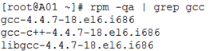
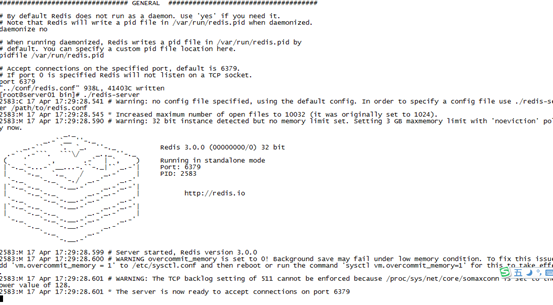
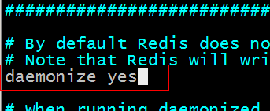

# Redis安装配置
## 一、Redis下载
官网地址：http://redis.io/  
下载地址：http://download.redis.io/releases/redis-3.0.0.tar.gz  

在Linux中使用wget下载到linux或者下载到window在上传到linux
```
wget http://download.redis.io/releases/redis-3.0.0.tar.gz
```

## 二、Redis安装
### Centos下安装
Redis是C语言开发，建议在linux上运行，本教程使用Centos6.5作为安装环境。

第一步：在VMware中安装CentOS

第二步：在Linux下安装gcc环境（该步骤可以省略，CentOS中默认自带C环境，有的也可能没有）
```
#yum install gcc-c++
```

可以通过rpm -qa | grep gcc 来查询是否已经安装了gcc
```
[hadoop@hadoop01 ~]$ rpm -qa | grep gcc
gcc-c++-4.4.7-23.el6.x86_64
libgcc-4.4.7-23.el6.x86_64
gcc-4.4.7-23.el6.x86_64
```


第三步：将下载的Redis源码包上传到Linux服务器中【如果是linux直接下载的，就省略这个步骤】

第四步：解压缩Redis源码包
```
# tar -zxf redis-3.0.0.tar.gz 【直接解压到当前文件夹】
```

第五步：编译redis源码
```
# cd redis-3.0.0
# make
```

第六步：安装redis(安装到/usr/local/redis目录下)
```
# make install PREFIX=/usr/local/redis
```

## 三、Redis启动
### 1、前端启动
**启动方式**：
直接运行bin/redis-server将以前端模式启动。【bin目录是在/usr/local/redis/bin】
```
# ./redis-server
```

启动缺点：
ssh命令窗口关闭则redis-server程序结束，不推荐使用此方法

启动图例：


**前端启动的关闭**：ctrl+c

### 2、后端启动
第一步：将redis源码包中的redis.conf配置文件复制到/usr/local/redis/bin/下
```
# cd /root/redis-3.0.0
# cp redis.conf /usr/local/redis/bin/
```

第二步：修改redis.conf，将daemonize由no改为yes
```
# vi redis.conf
```


第三步：**执行命令**
```
# ./redis-server redis.conf
```

**后端启动的关闭方式**   
非正常关闭（不推荐使用）：
```
# kill 5528
```

**正常关闭**：
```
# ./redis-cli shutdown
```

### 三、Redis 配置文件
Redis 的配置文件位于 Redis 安装目录下，文件名为 redis.conf(Windows 名为 redis.windows.conf)。