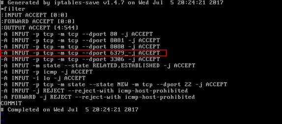
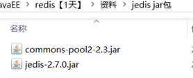

# Redis客户端
## 一、Redis自带的客户端


**指定主机和端口登录**
```
# ./redis-cli -h 127.0.0.1 -p 6379
127.0.0.1:6379> exit 【退出】
```

-h：redis服务器的ip地址
-p：redis实例的端口号


**如果不指定主机和端口也可以**
```
# ./redis-cli
```
默认主机地址是127.0.0.1 

默认端口是6379

注意：
**默认一共是16个数据库，每个数据库之间是相互隔离。数据库的数量是在redis.conf中配置的。**


切换数据库使用命令：select 数据库编号
例如：select 1【相当于mysql 的use databasename】


## 二、图形界面客户端（了解）
前提：需要安装图形界面管理器【redis-desktop-manager-0.8.0.3841.exe】


### 连接超时解决
远程连接redis服务，需要关闭或者修改防火墙配置。
```
2.将修改后的端口添加到防火墙中.
/sbin/iptables -I INPUT -p tcp --dport 8081 -j ACCEPT
/etc/rc.d/init.d/iptables save
```

第一步：编辑iptables /etc/sysconfig/iptables
```
#vim
```
**在命令模式下，选定要复制的那一行的末尾，然后点击键盘yyp，就完成复制，然后修改。**


第二步：重启防火墙
```
# service iptables restart
```


## 三、Java客户端Jedis
### jedis介绍
Redis不仅是使用命令来操作，现在基本上主流的语言都有客户端支持，比如java、C、C#、C++、php、Node.js、Go等。 

在官方网站里列一些Java的客户端，有**Jedis**、Redisson、Jredis、JDBC-Redis、等其中官方推荐使用Jedis和Redisson。 在企业中用的最多的就是Jedis，下面我们就重点学习下Jedis。 Jedis同样也是托管在github上，地址：https://github.com/xetorthio/jedis

### 添加jar包


### 单实例连接
```java
@Test
public void testJedis() {
    jedis.select(1);//设置数据库
//创建一个Jedis的连接
    Jedis jedis = new Jedis("127.0.0.1", 6379);
    //执行redis命令
    jedis.set("mytest", "hello world, this is jedis client!");
    //从redis中取值
    String result = jedis.get("mytest");
    //打印结果
    System.out.println(result);
    //关闭连接
    jedis.close();	
}
```

### 连接池连接
```java
@Test
public void testJedisPool() {
    //创建一连接池对象
    JedisPool jedisPool = new JedisPool("127.0.0.1", 6379);
    //从连接池中获得连接
    Jedis jedis = jedisPool.getResource();
    String result = jedis.get("mytest");
    System.out.println(result);
    //关闭连接
    jedis.close();
    
    //关闭连接池
    jedisPool.close();
}
```

### Spring整合jedisPool（自学）
添加spring的jar包

配置spring配置文件applicationContext.xml
```xml
<?xml version="1.0" encoding="UTF-8"?>
<beans xmlns="http://www.springframework.org/schema/beans"
	xmlns:xsi="http://www.w3.org/2001/XMLSchema-instance" xmlns:mvc="http://www.springframework.org/schema/mvc"
	xmlns:context="http://www.springframework.org/schema/context"
	xmlns:aop="http://www.springframework.org/schema/aop" xmlns:tx="http://www.springframework.org/schema/tx"
	xsi:schemaLocation="http://www.springframework.org/schema/beans 
		http://www.springframework.org/schema/beans/spring-beans-3.2.xsd 
		http://www.springframework.org/schema/mvc 
		http://www.springframework.org/schema/mvc/spring-mvc-3.2.xsd 
		http://www.springframework.org/schema/context 
		http://www.springframework.org/schema/context/spring-context-3.2.xsd 
		http://www.springframework.org/schema/aop 
		http://www.springframework.org/schema/aop/spring-aop-3.2.xsd 
		http://www.springframework.org/schema/tx 
		http://www.springframework.org/schema/tx/spring-tx-3.2.xsd ">

	<!-- 连接池配置 -->
	<bean id="jedisPoolConfig" class="redis.clients.jedis.JedisPoolConfig">
		<!-- 最大连接数 -->
		<property name="maxTotal" value="30" />
		<!-- 最大空闲连接数 -->
		<property name="maxIdle" value="10" />
		<!-- 每次释放连接的最大数目 -->
		<property name="numTestsPerEvictionRun" value="1024" />
		<!-- 释放连接的扫描间隔（毫秒） -->
		<property name="timeBetweenEvictionRunsMillis" value="30000" />
		<!-- 连接最小空闲时间 -->
		<property name="minEvictableIdleTimeMillis" value="1800000" />
		<!-- 连接空闲多久后释放, 当空闲时间>该值 且 空闲连接>最大空闲连接数 时直接释放 -->
		<property name="softMinEvictableIdleTimeMillis" value="10000" />
		<!-- 获取连接时的最大等待毫秒数,小于零:阻塞不确定的时间,默认-1 -->
		<property name="maxWaitMillis" value="1500" />
		<!-- 在获取连接的时候检查有效性, 默认false -->
		<property name="testOnBorrow" value="false" />
		<!-- 在空闲时检查有效性, 默认false -->
		<property name="testWhileIdle" value="true" />
		<!-- 连接耗尽时是否阻塞, false报异常,ture阻塞直到超时, 默认true -->
		<property name="blockWhenExhausted" value="false" />
	</bean>

	<!-- redis单机 通过连接池 -->
	<bean id="jedisPool" class="redis.clients.jedis.JedisPool"
		destroy-method="close">
		<constructor-arg name="poolConfig" ref="jedisPoolConfig" />
		<constructor-arg name="host" value="192.168.242.130" />
		<constructor-arg name="port" value="6379" />
	</bean>
</beans>
```

测试代码
```java
@Test
public void testJedisPool() {
	JedisPool pool = (JedisPool) applicationContext.getBean("jedisPool");
	Jedis jedis = null;
	try {
		jedis = pool.getResource();

		jedis.set("name", "lisi");
		String name = jedis.get("name");
		System.out.println(name);
	} catch (Exception ex) {
		ex.printStackTrace();
	} finally {
		if (jedis != null) {
			// 关闭连接
			jedis.close();
		}
	}
}
```
