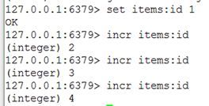
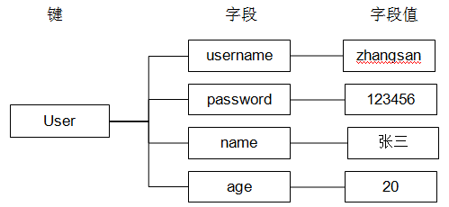
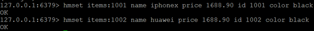
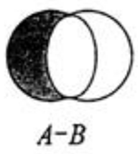

# Redis数据类型
Mysql:声明字段有哪些：int,varchar,char,datetime.....

Redis中存储数据是通过key-value存储的，对于value的类型有以下几种：  
* 字符串  
* Hash类型  
* List  
* Set  
* SortedSet（zset）  

PS：
**在redis中的命令语句中，命令是忽略大小写的，而key是不忽略大小写的。**

## 一、String类型
### 命令 
#### 1、赋值
语法：SET key value
```
127.0.0.1:6379> set test 123
OK
```

#### 2、取值
语法：GET key
```
127.0.0.1:6379> get test
"123“
```

#### 3、设置/获取多个键值 
语法：
    MSET key value [key value …]
    MGET key [key …]

```
127.0.0.1:6379> mset k1 v1 k2 v2 k3 v3
OK
127.0.0.1:6379> get k1
"v1"
127.0.0.1:6379> mget k1 k3
1) "v1"
2) "v3"
```

#### 4、取值并赋值
语法：GETSET key value
```
127.0.0.1:6379> getset s2 222
"111"
127.0.0.1:6379> get s2
"222"
```

#### 5、删除
语法：DEL key
```
127.0.0.1:6379> del test
(integer) 1
```

#### 6、数值增减
**递增数字**
 
当存储的字符串是整数时，Redis提供了一个实用的命令INCR，其作用是让当前键值递增，并返回递增后的值。

语法：INCR key
```
127.0.0.1:6379> incr num
(integer) 1
127.0.0.1:6379> incr num
(integer) 2
127.0.0.1:6379> incr num
(integer) 3
```

**增加指定的整数**

语法：INCRBY key increment
```
127.0.0.1:6379> incrby num 2
(integer) 5
127.0.0.1:6379> incrby num 2
(integer) 7
127.0.0.1:6379> incrby num 2
(integer) 9
```

**递减数值**

语法：DECR key
```
127.0.0.1:6379> decr num
(integer) 9
127.0.0.1:6379> decr num
(integer) 8
```

**减少指定的整数**

语法：DECRBY key decrement
```
127.0.0.1:6379> decr num
(integer) 6
127.0.0.1:6379> decr num
(integer) 5
127.0.0.1:6379> decrby num 3
(integer) 2
127.0.0.1:6379> decrby num 3
(integer) -1
```

#### 7、向尾部追加值
APPEND的作用是向键值的末尾追加value。如果键不存在则将该键的值设置为value，即相当于 SET key value。返回值是追加后字符串的总长度。 

语法：APPEND key value
```
127.0.0.1:6379> set str hello
OK
127.0.0.1:6379> append str " world!"
(integer) 12
127.0.0.1:6379> get str 
"hello world!"
```

#### 8、获取字符串长度 
STRLEN命令返回键值的长度，如果键不存在则返回0。

语法：STRLEN key
```
127.0.0.1:6379> strlen str 
(integer) 0
127.0.0.1:6379> set str hello
OK
127.0.0.1:6379> strlen str 
(integer) 5
```

### 应用 
#### 1、自增主键
商品编号、订单号采用string的递增数字特性生成。

定义商品编号key：items:id
```
192.168.101.3:7003> INCR items:id
(integer) 2
192.168.101.3:7003> INCR items:id
(integer) 3
```


## 二、Hashg类型
### 1、使用string的问题
假设有User对象以JSON序列化的形式存储到Redis中，User对象有id，username、password、age、name等属性，存储的过程如下： 
保存、更新： 

User对象 -> json(string) -> redis

如果在业务上只是更新age属性，其他的属性并不做更新我应该怎么做呢？ 如果仍然采用上边的方法在传输、处理时会造成资源浪费，下边讲的hash可以很好的解决这个问题。

User “{“username”:”gyf”,”age”:”80”}”

### 2、redis hash介绍
Redis hash 是一个string类型的field和value的映射表，hash特别适合用于存储对象。

Redis 中每个 hash 可以存储 232 - 1 键值对（40多亿）。

hash叫散列类型，它提供了字段和字段值的映射。字段值只能是字符串类型，不支持散列类型、集合类型等其它类型。如下：



### 3、命令 
实例
```
127.0.0.1:6379>  HMSET runoobkey name "redis tutorial" description "redis basic commands for caching" likes 20 visitors 23000
OK
127.0.0.1:6379>  HGETALL runoobkey
1) "name"
2) "redis tutorial"
3) "description"
4) "redis basic commands for caching"
5) "likes"
6) "20"
7) "visitors"
8) "23000"
```
在以上实例中，我们设置了 redis 的一些描述信息(name, description, likes, visitors) 到哈希表的 runoobkey 中。

#### 1、赋值
HSET命令不区分插入和更新操作，当执行插入操作时HSET命令返回1，当执行更新操作时返回0

**一次只能设置一个字段值**

语法：HSET key field value	
```
127.0.0.1:6379> hset user username zhangsan 
(integer) 1
```

**一次可以设置多个字段值**

语法：HMSET key field value [field value ...]
```
127.0.0.1:6379> hmset user age 20 username lisi 
OK
```

**当字段不存在时赋值，类似HSET，区别在于如果字段存在，该命令不执行任何操作**

语法：HSETNX key field value
```
127.0.0.1:6379> hsetnx user age 30	如果user中没有age字段则设置age值为30，否则不做任何操作
(integer) 0
```

#### 2、取值 
**一次只能获取一个字段值**

语法：HGET key field	
```		
127.0.0.1:6379> hget user username
"zhangsan“
```

**一次可以获取多个字段值**

语法：HMGET key field [field ...]	
```		
127.0.0.1:6379> hmget user age username
1) "20"
2) "lisi"
```

**获取所有字段值**

语法：HGETALL key
```
127.0.0.1:6379> hgetall user
1) "age"
2) "20"
3) "username"
4) "lisi"
```

#### 3、	删除字段
可以删除一个或多个字段，返回值是被删除的字段个数 

语法：HDEL key field [field ...]
```
127.0.0.1:6379> hdel user age
(integer) 1
127.0.0.1:6379> hdel user age name
(integer) 0
127.0.0.1:6379> hdel user age username
(integer) 1 
```

#### 4、增加数字 
语法：HINCRBY key field increment
```
127.0.0.1:6379> hincrby user age 2	将用户的年龄加2
(integer) 22
127.0.0.1:6379> hget user age		获取用户的年龄
"22“
```

#### 5、判断字段是否存在
语法：HEXISTS key field
```
127.0.0.1:6379> hexists user age		查看user中是否有age字段
(integer) 1
127.0.0.1:6379> hexists user name	查看user中是否有name字段
(integer) 0
```

#### 6、只获取字段名或字段值
语法：  
HKEYS key  
HVALS key  
```
127.0.0.1:6379> hmset user age 20 name lisi 
OK
127.0.0.1:6379> hkeys user
1) "age"
2) "name"
127.0.0.1:6379> hvals user
1) "20"
2) "lisi"
```

#### 7、获取字段数量 
语法：HLEN key
```
127.0.0.1:6379> hlen user
(integer) 2
```

### 4、应用
#### 1、存储商品信息
**商品字段**
【商品id、商品名称、商品描述、商品库存、商品好评】

**定义商品信息的key**
商品1001的信息在 Redis中的key为：[items:1001]

**存储商品信息**
```
192.168.101.3:7003> HMSET items:1001 id 3 name apple price 999.9
OK
```


**获取商品信息**
```
192.168.101.3:7003> HGET items:1001 id
"3"
192.168.101.3:7003> HGETALL items:1001
1) "id"
2) "3"
3) "name"
4) "apple"
5) "price"
6) "999.9"
```

## 三、List类型
### 1、redis list介绍
列表类型（list）可以存储一个有序的字符串列表，常用的操作是向列表两端添加元素，或者获得列表的某一个片段。

列表类型内部是使用双向链表（double linked list）实现的，所以向列表两端添加元素的时间复杂度为0(1)，获取越接近两端的元素速度就越快。这意味着即使是一个有几千万个元素的列表，获取头部或尾部的10条记录也是极快的。

一个列表最多可以包含 232 - 1 个元素 (4294967295, 每个列表超过40亿个元素)。

### 2、命令 
实例
```
redis 127.0.0.1:6379> LPUSH runoobkey redis
(integer) 1
redis 127.0.0.1:6379> LPUSH runoobkey mongodb
(integer) 2
redis 127.0.0.1:6379> LPUSH runoobkey mysql
(integer) 3
redis 127.0.0.1:6379> LRANGE runoobkey 0 10
1) "mysql"
2) "mongodb"
3) "redis"
```
在以上实例中我们使用了 LPUSH 将三个值插入了名为 runoobkey 的列表当中。

#### 1、向列表两端增加元素
**向列表左边增加元素**
 
语法：LPUSH key value [value ...]
```
127.0.0.1:6379> lpush list:1 1 2 3
(integer) 3
```

**向列表右边增加元素**

语法：RPUSH key value [value ...]
```
127.0.0.1:6379> rpush list:1 4 5 6
(integer) 3
```

#### 2、查看列表 
LRANGE命令是列表类型最常用的命令之一，获取列表中的某一片段，将返回start、stop之间的所有元素（包含两端的元素），索引从0开始。索引可以是负数，如：“-1”代表最后边的一个元素。

语法：LRANGE key start stop
```
127.0.0.1:6379> lrange list:1 0 2
1) "2"
2) "1"
3) "4"
```

#### 3、从列表两端弹出元素 
LPOP命令从列表左边弹出一个元素，会分两步完成：
第一步是将列表左边的元素从列表中移除
第二步是返回被移除的元素值。

语法：
LPOP key
RPOP key
```
127.0.0.1:6379> lpop list:1
"3“
127.0.0.1:6379> rpop list:1
"6“
```

#### 4、获取列表中元素的个数 
语法：LLEN key
```
127.0.0.1:6379> llen list:1
(integer) 2
```

#### 5、删除列表中指定的值 
LREM命令会删除列表中前count个值为value的元素，返回实际删除的元素个数。根据count值的不同，该命令的执行方式会有所不同：   
* 当count>0时， LREM会从列表左边开始删除。   
* 当count<0时， LREM会从列表后边开始删除。   
* 当count=0时， LREM删除所有值为value的元素。   

语法：LREM key count value

#### 6、获得/设置指定索引的元素值 
**获得指定索引的元素值**

语法：LINDEX key index
```
127.0.0.1:6379> lindex l:list 2
"1"
```

**设置指定索引的元素值**

语法：LSET key index value
```
127.0.0.1:6379> lset l:list 2 2
OK
127.0.0.1:6379> lrange l:list 0 -1
1) "6"
2) "5"
3) "2"
4) "2"
```

#### 7、只保留列表指定片段
指定范围和LRANGE一致 

语法：LTRIM key start stop
```
127.0.0.1:6379> lrange l:list 0 -1
1) "6"
2) "5"
3) "0"
4) "2"
127.0.0.1:6379> ltrim l:list 0 2
OK
127.0.0.1:6379> lrange l:list 0 -1
1) "6"
2) "5"
3) "0"
```

#### 8、向列表中插入元素 
该命令首先会在列表中从左到右查找值为pivot的元素，然后根据第二个参数是BEFORE还是AFTER来决定将value插入到该元素的前面还是后面。 

语法：LINSERT key BEFORE|AFTER pivot value
```
127.0.0.1:6379> lrange list 0 -1
1) "3"
2) "2"
3) "1"
127.0.0.1:6379> linsert list after 3 4
(integer) 4
127.0.0.1:6379> lrange list 0 -1
1) "3"
2) "4"
3) "2"
4) "1"
```

#### 9、移除列表的最后一个元素，并将该元素添加到另一个列表并返回
语法：RPOPLPUSH source destination
```
127.0.0.1:6379> rpoplpush list newlist 
"1"
127.0.0.1:6379> lrange newlist 0 -1
1) "1"
127.0.0.1:6379> lrange list 0 -1
1) "3"
2) "4"
3) "2"
```

### 3、应用
#### 1、商品评论列表
思路：
在Redis中创建商品评论列表
用户发布商品评论，将评论信息转成json存储到list中。
用户在页面查询评论列表，从redis中取出json数据展示到页面。

定义商品评论列表key：
商品编号为1001的商品评论key【items: comment:1001】
```
192.168.101.3:7001> LPUSH items:comment:1001 '{"id":1,"name":"商品不错，很好！！","date":1430295077289}'
```

## 四、Set类型
### 1、redis set介绍
Redis 的 Set 是 String 类型的无序集合。集合成员是唯一的，这就意味着集合中不能出现重复的数据。集合类型的常用操作是向集合中加入或删除元素、判断某个元素是否存在等。

Redis 中集合是通过哈希表实现的，所以添加，删除，查找的复杂度都是 O(1)。

集合中最大的成员数为 232 - 1 (4294967295, 每个集合可存储40多亿个成员)。

Redis还提供了多个集合之间的交集、并集、差集的运算。

### 2、命令
#### 1、增加/删除元素 
语法：SADD key member [member ...]
```
127.0.0.1:6379> sadd set a b c
(integer) 3
127.0.0.1:6379> sadd set a
(integer) 0
```

语法：SREM key member [member ...]
```
127.0.0.1:6379> srem set c d
(integer) 1
```

#### 2、获得集合中的所有元素 
语法：SMEMBERS key
```
127.0.0.1:6379> smembers set
1) "b"
2) "a”
```

#### 3、判断元素是否在集合中
语法：SISMEMBER key member
```
127.0.0.1:6379> sismember set a
(integer) 1
127.0.0.1:6379> sismember set h
(integer) 0
```

#### 4、获得集合中元素的个数 
语法：SCARD key
```
127.0.0.1:6379> smembers setA 
1) "1"
2) "2"
3) "3"
127.0.0.1:6379> scard setA 
(integer) 3
```

#### 5、从集合中弹出一个元素
注意：由于集合是无序的，所有SPOP命令会从集合中随机选择一个元素弹出 

语法：SPOP key
```
127.0.0.1:6379> spop setA 
"1“
```

#### 6、集合的差集运算 A-B
属于A并且不属于B的元素构成的集合。 


语法：SDIFF key [key ...]
```
127.0.0.1:6379> sadd setA 1 2 3
(integer) 3
127.0.0.1:6379> sadd setB 2 3 4
(integer) 3
127.0.0.1:6379> sdiff setA setB 
1) "1"
127.0.0.1:6379> sdiff setB setA 
1) "4"
```

#### 7、集合的交集运算 A ∩ B
属于A且属于B的元素构成的集合。 


语法：SINTER key [key ...]
```
127.0.0.1:6379> sinter setA setB 
1) "2"
2) "3"
```

#### 8、集合的并集运算 A ∪ B
属于A或者属于B的元素构成的集合


语法：SUNION key [key ...]
```
127.0.0.1:6379> sunion setA setB
1) "1"
2) "2"
3) "3"
4) "4"
```

## 五、SortedSet类型zset
### 1、redis sorted set介绍
Redis 有序集合和集合一样也是string类型元素的集合,且不允许重复的成员。

不同的是每个元素都会关联一个double类型的分数。redis正是通过分数来为集合中的成员进行从小到大的排序。

有序集合的成员是唯一的,但分数(score)却可以重复。

sorted set多了一个权重参数score,集合中的元素能够按score进行排列。可以做排行榜应用，取TOP N操作。

### 2、命令
#### 1、增加元素
向有序集合中加入一个元素和该元素的分数，如果该元素已经存在则会用新的分数替换原有的分数。返回值是新加入到集合中的元素个数，不包含之前已经存在的元素。 

语法：ZADD key score member [score member ...]
```
127.0.0.1:6379> zadd scoreboard 80 zhangsan 89 lisi 94 wangwu 
(integer) 3
127.0.0.1:6379> zadd scoreboard 97 lisi 
(integer) 0
```

#### 2、获取元素的分数 
语法：ZSCORE key member
```
127.0.0.1:6379> zscore scoreboard lisi 
"97"
```

#### 3、删除元素
移除有序集key中的一个或多个成员，不存在的成员将被忽略。
当key存在但不是有序集类型时，返回一个错误。

语法：ZREM key member [member ...]
```
127.0.0.1:6379> zrem scoreboard lisi
(integer) 1
```

#### 4、获得排名在某个范围的元素列表
获得排名在某个范围的元素列表 

按照元素分数**从小到大**的顺序返回索引从start到stop之间的所有元素（包含两端的元素）

语法：ZRANGE key start stop [WITHSCORES]	
```
127.0.0.1:6379> zrange scoreboard 0 2
1) "zhangsan"
2) "wangwu"
3) "lisi“
```

按照元素分数**从大到小**的顺序返回索引从start到stop之间的所有元素（包含两端的元素）

语法：ZREVRANGE key start stop [WITHSCORES]	
```
127.0.0.1:6379> zrevrange scoreboard 0 2
1) " lisi "
2) "wangwu"
3) " zhangsan “
```

如果需要**获得元素的分数**的可以在命令尾部加上WITHSCORES参数 
```
127.0.0.1:6379> zrange scoreboard 0 1 WITHSCORES
1) "zhangsan"
2) "80"
3) "wangwu"
4) "94"
```

#### 5、获得指定分数范围的元素 
语法：ZRANGEBYSCORE key min max [WITHSCORES] [LIMIT offset count]
```
127.0.0.1:6379> ZRANGEBYSCORE scoreboard 90 97 WITHSCORES
1) "wangwu"
2) "94"
3) "lisi"
4) "97"
127.0.0.1:6379> ZRANGEBYSCORE scoreboard 70 100 limit 1 2
1) "wangwu"
2) "lisi"
```

#### 6、增加某个元素的分数
返回值是更改后的分数 

语法：ZINCRBY  key increment member
```
127.0.0.1:6379> ZINCRBY scoreboard 4 lisi 
"101“
```

#### 7、获得集合中元素的数量 
语法：ZCARD key
```
127.0.0.1:6379> ZCARD scoreboard
(integer) 3
```

#### 8、获得指定分数范围内的元素个数 
语法：ZCOUNT key min max
```
127.0.0.1:6379> ZCOUNT scoreboard 80 90
(integer) 1
```

#### 9、按照排名范围删除元素 
语法：ZREMRANGEBYRANK key start stop
```
127.0.0.1:6379> ZREMRANGEBYRANK scoreboard 0 1
(integer) 2 
127.0.0.1:6379> ZRANGE scoreboard 0 -1
1) "lisi"
```

#### 10、按照分数范围删除元素 
语法：ZREMRANGEBYSCORE key min max
```
127.0.0.1:6379> zadd scoreboard 84 zhangsan	
(integer) 1
127.0.0.1:6379> ZREMRANGEBYSCORE scoreboard 80 100
(integer) 1
```

#### 11、获取元素的排名 
**从小到大**

语法：ZRANK key member
```
127.0.0.1:6379> ZRANK scoreboard lisi 
(integer) 0
```

**从大到小**

语法：ZREVRANK key member
```
127.0.0.1:6379> ZREVRANK scoreboard zhangsan 
(integer) 1
```

### 3、应用
#### 1、商品销售排行榜
需求：根据商品销售量对商品进行排行显示
思路：定义商品销售排行榜（sorted set集合），Key为items:sellsort，分数为商品销售量。

写入商品销售量：
商品编号1001的销量是9，商品编号1002的销量是10
```
192.168.101.3:7007> ZADD items:sellsort 9 1001 10 1002
```

商品编号1001的销量加1
```
192.168.101.3:7001> ZINCRBY items:sellsort 1 1001
```

商品销量前10名：
```
192.168.101.3:7001> ZRANGE items:sellsort 0 9 withscores
```


