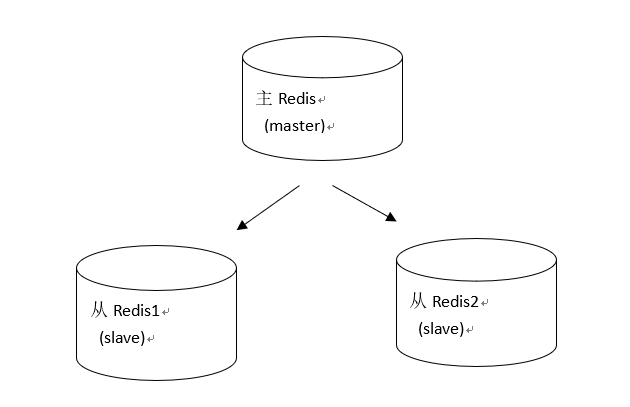
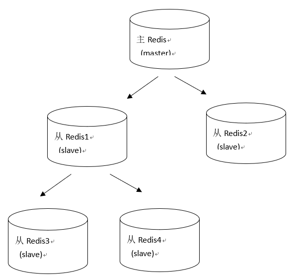
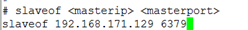
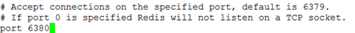
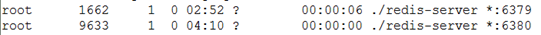

# Redis的主从复制
## 一、什么是主从复制
持久化保证了即使redis服务重启也不会丢失数据，因为redis服务重启后会将硬盘上持久化的数据恢复到内存中，但是当redis服务器的硬盘损坏了可能会导致数据丢失，如果**通过redis的主从复制机制就可以避免这种单点故障**，如下图：



说明：  
* 主redis中的数据有两个副本（replication）即从redis1和从redis2，即使一台redis服务器宕机其它两台redis服务也可以继续提供服务。  
* 主redis中的数据和从redis上的数据保持实时同步，当主redis写入数据时通过主从复制机制会复制到两个从redis服务上。  
* 只有一个主redis，可以有多个从redis。  
* 主从复制不会阻塞master，在同步数据时，master 可以继续处理client 请求  
* 一个redis可以即是主又是从，如下图：  


## 二、主从配置
### 1、主redis配置
无需特殊配置。

### 2、从机redis配置
第一步：复制出一个从机
```
cp bin/ bin2 –r
```

第二步：修改从机的redis.conf,配置slaveof 为主机的ip地址和端口号



第三步：修改从机的port地址为6380
在redis.conf中修改


第四步：清除从机中的持久化文件
```
rm -rf appendonly.aof dump.rdb
```

第五步：启动从机【一定要使用配置文件启动,否则还是使用默认的端口】,如图，有两个redis服务启动
```
./redis-server redis.conf
```


第六步：启动6380的客户端【不指定端口，默认访问的还是6379的服务】
```
# ./redis-cli -p 6380  
```

**注意**：
主机一旦发生增删改操作，那么主机会将数据同步到从机中
从机不能执行写操作
```
127.0.0.1:6380> set s2 222
(error) READONLY You can't write against a read only slave.
```


