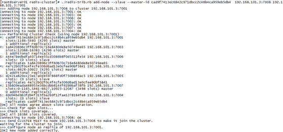

# Redis集群
## 一、redis-cluster【集群】架构图


架构细节:
```
(1)所有的redis节点彼此互联(PING-PONG机制),内部使用二进制协议优化传输速度和带宽.
(2)节点的fail是通过集群中超过半数的节点检测失效时才生效.
(3)客户端与redis节点直连,不需要中间proxy层.客户端不需要连接集群所有节点,连接集群中任何一个可用节点即可
(4)redis-cluster把所有的物理节点映射到[0-16383]slot槽上,cluster 负责维护node<->slot<->value
```

Redis 集群中内置了 16384 个哈希槽，当需要在 Redis 集群中放置一个 key-value 时，redis 先对 key 使用 crc16 算法算出一个结果，然后把结果对 16384 求余数，这样每个 key 都会对应一个编号在 0-16383 之间的哈希槽，redis 会根据节点数量大致均等的将哈希槽映射到不同的节点

示例如下：


## 二、redis-cluster投票:容错


(1)集群中所有master参与投票,如果半数以上master节点与其中一个master节点通信超时(cluster-node-timeout),认为该master节点挂掉.

(2):什么时候整个集群不可用(cluster_state:fail)? 
如果集群任意master挂掉,且当前master没有slave，则集群进入fail状态。也可以理解成集群的[0-16383]slot映射不完全时进入fail状态。

如果集群超过半数以上master挂掉，无论是否有slave，集群进入fail状态。

## 三、搭建Ruby环境
redis集群管理工具redis-trib.rb依赖ruby环境，首先需要安装ruby环境。

安装ruby
```
# yum install ruby
# yum install rubygems
```

使用工具上传redis-3.0.0.gem至/usr/local下

安装ruby和redis的接口程序
```
# gem install /usr/local/redis-3.0.0.gem
```

将Redis集群搭建脚本文件复制到/usr/local/redis/redis-cluster目录下
```
# cd /root/redis-3.0.0/src/
# ll *.rb【查看rb文件】
```

 
```
# cp redis-trib.rb /usr/local/redis/rediscluster/ -r
```


## 四、集群的搭建过程
搭建集群最少也得需要3台主机，如果每台主机再配置一台从机的话，则最少需要6台机器。
端口设计如下：7001-7006

第一步：复制出一个7001机器
```
[root@A001 redis]# cp bin ./redis-cluster/7001 –r
```

第二步：如果存在持久化文件，则删除
```
[root@A001 7001]# rm -rf appendonly.aof dump.rdb
```

第三步：设置集群参数


第四步：修改端口


第五步：复制出7002-7006机器
```
[root@A001 redis-cluster]# cp 7001/ 7002 -r
[root@A001 redis-cluster]# cp 7001/ 7003 -r
[root@A001 redis-cluster]# cp 7001/ 7004 -r
[root@A001 redis-cluster]# cp 7001/ 7005 -r
[root@A001 redis-cluster]# cp 7001/ 7006 –r
```

第六步：修改7002-7006机器的端口

第七步：启动7001-7006这六台机器

```
[root@A001redis-cluster]#vi startall.sh 【然后输入上面的内容，保存并退出】
```

第八步：修改startall.sh文件的权限
```
[root@A001 redis-cluster]# chmod u+x startall.sh
[root@A001 redis-cluster]# ./startall.sh
```


第九步：创建集群

### 1、主redis配置
无需特殊配置。

### 2、从机redis配置
```sh
[root@A001 redis-cluster]# ./redis-trib.rb create --replicas 1 192.168.242.137:7001 192.168.242.137:7002 192.168.242.137:7003 192.168.242.137:7004 192.168.242.137:7005  192.168.242.137:7006
>>> Creating cluster
Connecting to node 192.168.242.137:7001: OK
Connecting to node 192.168.242.137:7002: OK
Connecting to node 192.168.242.137:7003: OK
Connecting to node 192.168.242.137:7004: OK
Connecting to node 192.168.242.137:7005: OK
Connecting to node 192.168.242.137:7006: OK
>>> Performing hash slots allocation on 6 nodes...
Using 3 masters:
192.168.242.137:7001
192.168.242.137:7002
192.168.242.137:7003
Adding replica 192.168.242.137:7004 to 192.168.242.137:7001
Adding replica 192.168.242.137:7005 to 192.168.242.137:7002
Adding replica 192.168.242.137:7006 to 192.168.242.137:7003
M: 8240cd0fe6d6f842faa42b0174fe7c5ddcf7ae24 192.168.242.137:7001
   slots:0-5460 (5461 slots) master
M: 4f52a974f64343fd9f1ee0388490b3c0647a4db7 192.168.242.137:7002
   slots:5461-10922 (5462 slots) master
M: cb7c5def8f61df2016b38972396a8d1f349208c2 192.168.242.137:7003
   slots:10923-16383 (5461 slots) master
S: 66adf006fed43b3b5e499ce2ff1949a756504a16 192.168.242.137:7004
   replicates 8240cd0fe6d6f842faa42b0174fe7c5ddcf7ae24
S: cbb0c9bc4b27dd85511a7ef2d01bec90e692793b 192.168.242.137:7005
   replicates 4f52a974f64343fd9f1ee0388490b3c0647a4db7
S: a908736eadd1cd06e86fdff8b2749a6f46b38c00 192.168.242.137:7006
   replicates cb7c5def8f61df2016b38972396a8d1f349208c2
Can I set the above configuration? (type 'yes' to accept): yes
>>> Nodes configuration updated
>>> Assign a different config epoch to each node
>>> Sending CLUSTER MEET messages to join the cluster
Waiting for the cluster to join..
>>> Performing Cluster Check (using node 192.168.242.137:7001)
M: 8240cd0fe6d6f842faa42b0174fe7c5ddcf7ae24 192.168.242.137:7001
   slots:0-5460 (5461 slots) master
M: 4f52a974f64343fd9f1ee0388490b3c0647a4db7 192.168.242.137:7002
   slots:5461-10922 (5462 slots) master
M: cb7c5def8f61df2016b38972396a8d1f349208c2 192.168.242.137:7003
   slots:10923-16383 (5461 slots) master
M: 66adf006fed43b3b5e499ce2ff1949a756504a16 192.168.242.137:7004
   slots: (0 slots) master
   replicates 8240cd0fe6d6f842faa42b0174fe7c5ddcf7ae24
M: cbb0c9bc4b27dd85511a7ef2d01bec90e692793b 192.168.242.137:7005
   slots: (0 slots) master
   replicates 4f52a974f64343fd9f1ee0388490b3c0647a4db7
M: a908736eadd1cd06e86fdff8b2749a6f46b38c00 192.168.242.137:7006
   slots: (0 slots) master
   replicates cb7c5def8f61df2016b38972396a8d1f349208c2
[OK] All nodes agree about slots configuration.
>>> Check for open slots...
>>> Check slots coverage...
[OK] All 16384 slots covered.
[root@A001 redis-cluster]#
```

## 五、连接集群
命令：./redis-cli –h 127.0.0.1 –p 7001 -c【c表示集群方式连接】


## 六、查看集群的命令
查看集群状态
```
127.0.0.1:7003> cluster info
cluster_state:ok
cluster_slots_assigned:16384
cluster_slots_ok:16384
cluster_slots_pfail:0
cluster_slots_fail:0
cluster_known_nodes:6
cluster_size:3
cluster_current_epoch:6
cluster_my_epoch:3
cluster_stats_messages_sent:926
cluster_stats_messages_received:926
```

查看集群中的节点：【可以杀死一个节点，来看节点的数据】
```
127.0.0.1:7003> cluster nodes
7a12bc730ddc939c84a156f276c446c28acf798c 127.0.0.1:7002 master - 0 1443601739754 2 connected 5461-10922
93f73d2424a796657948c660928b71edd3db881f 127.0.0.1:7003 myself,master - 0 0 3 connected 10923-16383
d8f6a0e3192c905f0aad411946f3ef9305350420 127.0.0.1:7001 master - 0 1443601741267 1 connected 0-5460
4170a68ba6b7757e914056e2857bb84c5e10950e 127.0.0.1:7006 slave 93f73d2424a796657948c660928b71edd3db881f 0 1443601739250 6 connected
f79802d3da6b58ef6f9f30c903db7b2f79664e61 127.0.0.1:7004 slave d8f6a0e3192c905f0aad411946f3ef9305350420 0 1443601742277 4 connected
0bc78702413eb88eb6d7982833a6e040c6af05be 127.0.0.1:7005 slave 7a12bc730ddc939c84a156f276c446c28acf798c 0 1443601740259 5 connected
127.0.0.1:7003>
```

## 七、维护节点（自学）
### 1、添加主节点
集群创建成功后可以向集群中添加节点，下面是添加一个master主节点 

添加7007结点作为新节点
```
执行命令：./redis-trib.rb add-node 127.0.0.1:7007 127.0.0.1:7001
```


查看集群结点发现7007已添加到集群中


### 2、hash槽重新分配
添加完主节点需要对主节点进行hash槽分配，这样该主节才可以存储数据。

查看集群中槽占用情况
redis集群有16384个槽，集群中的每个结点分配自已槽，通过查看集群结点可以看到槽占用情况。


给刚添加的7007结点分配槽
第一步：连接上集群（连接集群中任意一个可用结点都行）
```
[root@A001 redis]# ./redis-trib.rb reshard 192.168.101.3:7001
```

第二步：输入要分配的槽数量

输入：500，表示要分配500个槽

第三步：输入接收槽的结点id

输入：15b809eadae88955e36bcdbb8144f61bbbaf38fb
PS：这里准备给7007分配槽，通过cluster nodes查看7007结点id为：
15b809eadae88955e36bcdbb8144f61bbbaf38fb

第四步：输入源结点id

输入：all

第五步：输入yes开始移动槽到目标结点id

输入：yes

### 3、添加从节点
集群创建成功后可以向集群中添加节点，下面是添加一个slave从节点。

添加7008从结点，将7008作为7007的从结点

命令：./redis-trib.rb add-node --slave --master-id 主节点id 新节点的ip和端口 旧节点ip和端口

执行如下命令：
```
./redis-trib.rb add-node --slave --master-id cad9f7413ec6842c971dbcc2c48b4ca959eb5db4  192.168.101.3:7008 192.168.101.3:7001
```
cad9f7413ec6842c971dbcc2c48b4ca959eb5db4  是7007结点的id，可通过cluster nodes查看。



注意：如果原来该结点在集群中的配置信息已经生成到cluster-config-file指定的配置文件中（如果cluster-config-file没有指定则默认为nodes.conf），这时可能会报错：
```
[ERR] Node XXXXXX is not empty. Either the node already knows other nodes (check with CLUSTER NODES) or contains some key in database 0
```

解决方法是删除生成的配置文件nodes.conf，删除后再执行./redis-trib.rb add-node指令

查看集群中的结点，刚添加的7008为7007的从节点：


### 4、删除结点
命令：./redis-trib.rb del-node 127.0.0.1:7005 4b45eb75c8b428fbd77ab979b85080146a9bc017


删除已经占有hash槽的结点会失败，报错如下：
```
[ERR] Node 127.0.0.1:7005 is not empty! Reshard data away and try again.
```

需要将该结点占用的hash槽分配出去（参考hash槽重新分配章节）。

## 八、Jedis连接集群
### 1、删除结点防火墙配置
```
[root@localhost-0723 bin]# service iptables stop
-A INPUT -m state --state ESTABLISHED,RELATED -j ACCEPT
-A INPUT -p icmp -j ACCEPT
-A INPUT -i lo -j ACCEPT
-A INPUT -m state --state NEW -m tcp -p tcp --dport 22 -j ACCEPT
-A INPUT -m state --state NEW -m tcp -p tcp --dport 8080 -j ACCEPT
-A INPUT -m state --state NEW -m tcp -p tcp --dport 6379 -j ACCEPT
-A INPUT -m state --state NEW -m tcp -p tcp --dport 6380 -j ACCEPT
-A INPUT -m state --state NEW -m tcp -p tcp --dport 7001 -j ACCEPT
-A INPUT -m state --state NEW -m tcp -p tcp --dport 7002 -j ACCEPT
-A INPUT -m state --state NEW -m tcp -p tcp --dport 7003 -j ACCEPT
-A INPUT -m state --state NEW -m tcp -p tcp --dport 7004 -j ACCEPT
-A INPUT -m state --state NEW -m tcp -p tcp --dport 7005 -j ACCEPT
-A INPUT -m state --state NEW -m tcp -p tcp --dport 7006 -j ACCEPT
-A INPUT -j REJECT --reject-with icmp-host-prohibited
-A FORWARD -j REJECT --reject-with icmp-host-prohibited
COMMIT
~                                                                               
"/etc/sysconfig/iptables" 22L, 1079C 已写入                   
[root@localhost-0723 bin]# service iptables restart
iptables：应用防火墙规则：                                 [确定]
[root@localhost-0723 bin]#
```

### 2、代码实现
创建JedisCluster类连接redis集群。
```java
@Test
public void testJedisCluster() throws Exception {
	//创建一连接，JedisCluster对象,在系统中是单例存在
	Set<HostAndPort> nodes = new HashSet<>();
	nodes.add(new HostAndPort("127.0.0.1", 7001));
	nodes.add(new HostAndPort("127.0.0.1", 7002));
	nodes.add(new HostAndPort("127.0.0.1", 7003));
	nodes.add(new HostAndPort("127.0.0.1", 7004));
	nodes.add(new HostAndPort("127.0.0.1", 7005));
	nodes.add(new HostAndPort("127.0.0.1", 7006));
	JedisCluster cluster = new JedisCluster(nodes);
	//执行JedisCluster对象中的方法，方法和redis一一对应。
	cluster.set("cluster-test", "my jedis cluster test");
	String result = cluster.get("cluster-test");
	System.out.println(result);
	//程序结束时需要关闭JedisCluster对象
	cluster.close();
}
```

### 3、使用spring
配置applicationContext.xml
```xml
<!-- 连接池配置 -->
<bean id="jedisPoolConfig" class="redis.clients.jedis.JedisPoolConfig">
	<!-- 最大连接数 -->
	<property name="maxTotal" value="30" />
	<!-- 最大空闲连接数 -->
	<property name="maxIdle" value="10" />
	<!-- 每次释放连接的最大数目 -->
	<property name="numTestsPerEvictionRun" value="1024" />
	<!-- 释放连接的扫描间隔（毫秒） -->
	<property name="timeBetweenEvictionRunsMillis" value="30000" />
	<!-- 连接最小空闲时间 -->
	<property name="minEvictableIdleTimeMillis" value="1800000" />
	<!-- 连接空闲多久后释放, 当空闲时间>该值 且 空闲连接>最大空闲连接数 时直接释放 -->
	<property name="softMinEvictableIdleTimeMillis" value="10000" />
	<!-- 获取连接时的最大等待毫秒数,小于零:阻塞不确定的时间,默认-1 -->
	<property name="maxWaitMillis" value="1500" />
	<!-- 在获取连接的时候检查有效性, 默认false -->
	<property name="testOnBorrow" value="true" />
	<!-- 在空闲时检查有效性, 默认false -->
	<property name="testWhileIdle" value="true" />
	<!-- 连接耗尽时是否阻塞, false报异常,ture阻塞直到超时, 默认true -->
	<property name="blockWhenExhausted" value="false" />
</bean>
<!-- redis集群 -->
<bean id="jedisCluster" class="redis.clients.jedis.JedisCluster">
	<constructor-arg index="0">
		<set>
			<bean class="redis.clients.jedis.HostAndPort">
				<constructor-arg index="0" value="192.168.101.3"></constructor-arg>
				<constructor-arg index="1" value="7001"></constructor-arg>
			</bean>
			<bean class="redis.clients.jedis.HostAndPort">
				<constructor-arg index="0" value="192.168.101.3"></constructor-arg>
				<constructor-arg index="1" value="7002"></constructor-arg>
			</bean>
			<bean class="redis.clients.jedis.HostAndPort">
				<constructor-arg index="0" value="192.168.101.3"></constructor-arg>
				<constructor-arg index="1" value="7003"></constructor-arg>
			</bean>
			<bean class="redis.clients.jedis.HostAndPort">
				<constructor-arg index="0" value="192.168.101.3"></constructor-arg>
				<constructor-arg index="1" value="7004"></constructor-arg>
			</bean>
			<bean class="redis.clients.jedis.HostAndPort">
				<constructor-arg index="0" value="192.168.101.3"></constructor-arg>
				<constructor-arg index="1" value="7005"></constructor-arg>
			</bean>
			<bean class="redis.clients.jedis.HostAndPort">
				<constructor-arg index="0" value="192.168.101.3"></constructor-arg>
				<constructor-arg index="1" value="7006"></constructor-arg>
			</bean>
		</set>
	</constructor-arg>
	<constructor-arg index="1" ref="jedisPoolConfig"></constructor-arg>
</bean>
```

测试代码
```java
    private ApplicationContext applicationContext;
	@Before
	public void init() {
		applicationContext = new ClassPathXmlApplicationContext(
				"classpath:applicationContext.xml");
	}

	// redis集群
	@Test
	public void testJedisCluster() {
		JedisCluster jedisCluster = (JedisCluster) applicationContext
				.getBean("jedisCluster");
		jedisCluster.set("name", "zhangsan");
		String value = jedisCluster.get("name");
		System.out.println(value);
	}
```