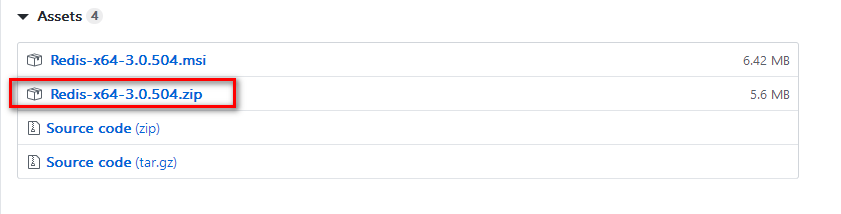
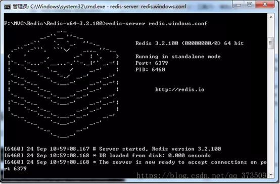
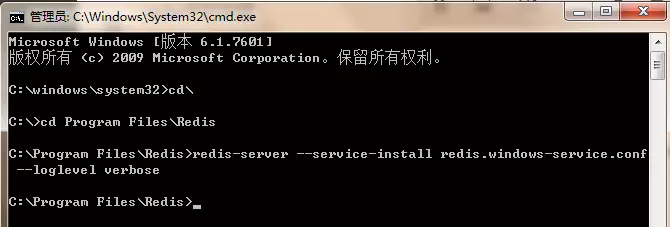
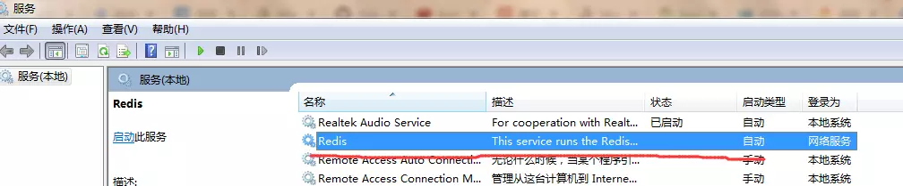
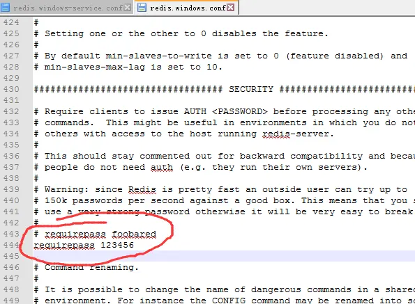
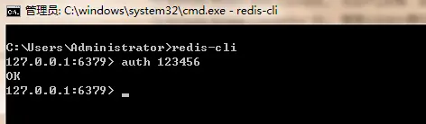

## windows下redis安装

### 一、获取安装包
redis下载链接：https://github.com/MicrosoftArchive/redis/releases
下载64位


### 二、安装
zip直接解压就可以了。

### 三、运行redis

有两种方式运行，一种是以windows服务的方式运行，另一种是不以服务的方式运行（CMD启动），后者在CMD中运行，当关闭CMD窗口，则redis服务就关闭。

在redis目录中有redis.windows-service.conf 和 redis.windows.conf 两个文件，前者是用于windows服务运行，后者是不以服务运行。

#### 不以服务的方式运行（CMD启动）
进入CMD，进入redis的目录，执行如下命令

redis-server redis.windows.conf，出现下图显示表示启动成功了


#### windows服务的方式
进入CMD，进入redis的目录，执行如下命令将redis加入到windows服务列表中，然后再服务列表中去启动即可，如果需要卸载服务，则执行 redis-server.exe --service-uninstall即可从服务列表中删除redis服务 
```
redis-server --service-install redis.windows-service.conf --loglevel verbose
```



如果不在服务中去启动，也可以cmd执行如下命令启动
```
redis-server.exe --service-start --service-name redis
```

### 四、设置密码
在redis目录中找到redis.windows-service.conf 和 redis.windows.conf 两个文件

都打开找到requirepass，加一行：requirepass 123456，123456是密码，保存重新运行redis，访问redis就需要密码了。


### 五、客户端连接redis
CMD并进入redis目录，执行如下命令，执行前请保证redis服务已启动
```
redis-cli -h localhost -p 6379 -a 123456 
```

或者


这样就登录了redis，可以进行redis数据库操作了。


