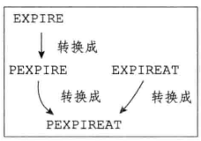
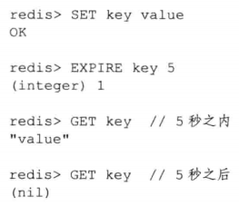
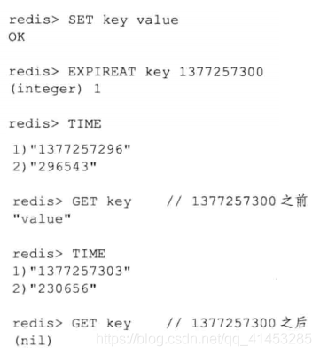
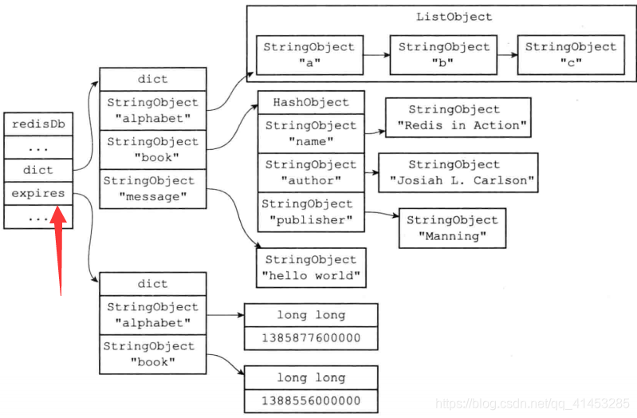
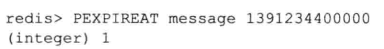
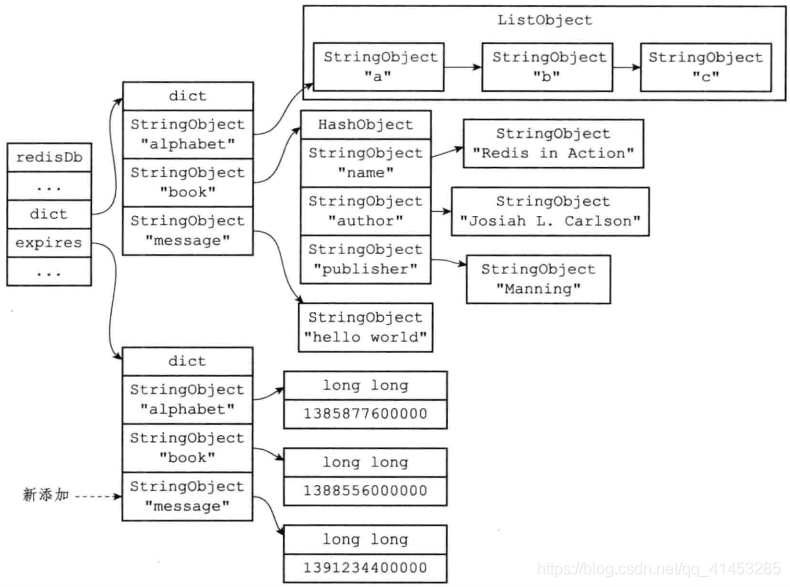
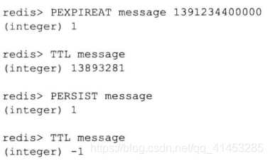
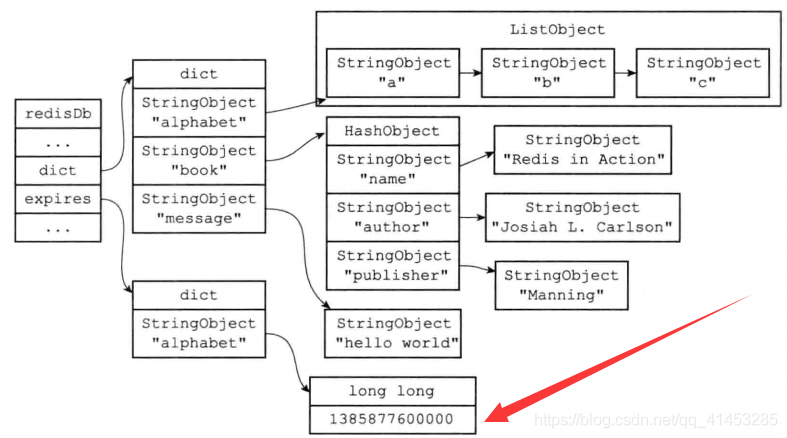

# Redis键的生存时间、过期时间
摘抄自：https://blog.csdn.net/qq_41453285/article/details/103246086

## 键的生存时间或过期时间介绍


* **生存时间（Time To Live，TTL）**：在经过指定的秒数或者毫秒数之后，服务器就会**自动删除生存时间为0的键**    
* **过期时间（expire time）：**是一个UNIX时间戳，当键的过期时间来临时，服务器就会**自动从数据库中删除这个键**


# 一、设置键生存/过期时间(EXPIRE、PEXPIRE、EXPIREAT、PEXPIREAT)


* **设置生存时间：**EXPIRE <key> <ttl>：用于将键key的生存时间**设置为ttl秒**PEXPIRE <key> <ttl>：用于将键key的生存时间**设置为ttl毫秒**    
* **设置过期时间：**EXPIREAT <key> <timestamp>：用于将键key的过期时间设置为timestamp所**指定的秒数时间戳**PEXPIREAT <key> <timestamp>：用于将键key的过期时间设置为timestamp所**指定的毫秒数时间戳**    
* **备注：****SETEX命令可以在设置一个字符串键的同时为键设置过期时间**，因为这个命令是一个类 型限定的命令（只能用于字符串键），本文不会对这个命令进行介绍，但SETEX命令设置过期时间的原理和本文介绍的EXPIRE命令设置过期时间的原理是完全一样的


## 命令之间的转换


* 虽然有多种不同单位和不同形式的设置命令，但实际上EXPIRE、PEXPIRE、 EXPIREAT三个命令都是使用PEXPIREAT命令来实现的：无论客户端执行的是以上四个命令中的哪一个，经过转换之后，**最终的执行效果都和执行PEXPIREAT命令一样（重点）**


* 首先，EXPIRE命令可以转换成PEXPIRE命令：

```java
def EXPIRE(key,ttl_in_sec):    # 将TTL从秒转换成毫秒    ttl_in_ms = sec_to_ms(ttl_in_sec)    PEXPIRE(key, ttl_in_ms)
```

* 接着，PEXPIRE命令又可以转换成PEXPIREAT命令：

```java
def PEXPIRE(key,ttl_in_ms):    # 获取以毫秒计算的当前UNIX 时间戳    now_ms = get_current_unix_timestamp_in_ms()    # 当前时间加上TTL ，得出毫秒格式的键过期时间    PEXPIREAT(key,now_ms+ttl_in_ms)
```

* 并且，EXPIREAT命令也可以转换成PEXPIREAT命令：

```java
def EXPIREAT(key,expire_time_in_sec):    # 将过期时间从秒转换为毫秒    expire_time_in_ms = sec_to_ms(expire_time_in_sec)    PEXPIREAT(key, expire_time_in_ms)
```

* 最终，EXPIRE、PEXPIRE和EXPIREAT三个命令都会转换成PEXPIREAT命令来执行





## 命令演示案例








# 二、过期时间的保存(struct dict)


* redisDb结构的expires字典保存了数据库中所有键的过期时间，我们称这个字典为**过期字典：**过期字典的**键是一个指针**，这个指针指向键空间中的某个键对象（也即是某个数据库键）过期字典的**值是一个long long类型的整数**，这个整数保存了键所指向的数据库键的过期时间——一个毫秒精度的UNIX时间戳

```java
typedef struct redisDb {    // ...    dict *expires;//过期字典，保存着键的过期时间    // ...} redisDb;
```

## 图解


* 下图展示了一个带有过期字典的数据库例子，在这个例子中，键空间保存了数据库中的所有键值对，而**过期字典则保存了数据库键的过期时间**    
* **下图中的过期字典保存了两个键值对：**第一个键值对的键为alphabet键对象，值为1385877600000，这表示数据库键alphabet的 过期时间为1385877600000（2013年12月1日零时）第二个键值对的键为book键对象，值为1388556000000，这表示数据库键book的过期时 间为1388556000000（2014年1月1日零时）    
* **备注（重点）：**为了展示方便，下图的键空间和过期字典中重复出现了两次alphabet键对象和book键对 象。**在实际中，键空间的键和过期字典的键都指向同一个键对象**，所以**不会出现任何重复对 象**，也不会浪费任何空间





* 另外再举个例子，如果数据库当前的状态如上图所示，那么在服务器执行以下命令之后：





* 过期字典将新增一个键值对，其中键为message键对象，而值则为1391234400000（2014 年2月1日零时），如下图所示





* 下面是PEXPIREAT命令的伪代码

```java
def PEXPIREAT(key, expire_time_in_ms):    # 如果给定的键不存在于键空间，那么不能设置过期时间    if key not in redisDb.dict:        return0        # 在过期字典中关联键和过期时间    redisDb.expires[key] = expire_time_in_ms        # 过期时间设置成功    return 1
```

# 三、移除过期时间(PERSIST)


* PERSIST命令可以**移除一个键的过期时间**    
* PERSIST命令就是PEXPIREAT命令的反操作：PERSIST命令在过期字典中查找给定的键，并**解除键和值（过期时间）在过期字典中的关联**





* 以下是PERSIST命令的伪代码定义：

```java
def PERSIST(key):    # 如果键不存在，或者键没有设置过期时间，那么直接返回    if key not in redisDb.expires:        return0        # 移除过期字典中给定键的键值对关联    redisDb.expires.remove(key)        # 键的过期时间移除成功    return 1
```

# 四、计算并返回剩余生存时间(TTL、PTTL)


* **命令：**TTL命令以**秒为单位**返回键的剩余生存时间PTTL命令则**以毫秒为单位**返回键的剩余生存时间    
* TTL和PTTL两个命令都是**通过计算键的过期时间和当前时间之间的差**来实现的。以下是 这两个命令的伪代码实现：

```java
def PTTL(key):    # 键不存在于数据库    if key not in redisDb.dict:        return-2     # 尝试取得键的过期时间    #如果键没有设置过期时间，那么 expire_time_in_ms 将为 None    expire_time_in_ms = redisDb.expires.get(key)     # 键没有设置过期时间    if expire_time_in_ms is None:        return -1     # 获得当前时间    now_ms = get_current_unix_timestamp_in_ms()     # 过期时间减去当前时间，得出的差就是键的剩余生存时间    return(expire_time_in_ms - now_ms)
``````java
def TTL(key):    # 获取以毫秒为单位的剩余生存时间    ttl_in_ms = PTTL(key)     if ttl_in_ms < 0:        # 处理返回值为-2 和-1 的情况        return ttl_in_ms    else:        # 将毫秒转换为秒        return ms_to_sec(ttl_in_ms)
```

## 演示案例





* 举个例子，对于一个过期时间为1385877600000（2013年12月1日零时）的键alphabet来说：如果当前时间为1383282000000（2013年11月1日零时），那么对键alphabet执行PTTL命 令将返回2595600000，这个值是通过用alphabet键的过期时间减去当前时间计算得出的： 1385877600000-1383282000000=2595600000另一方面，如果当前时间为1383282000000（2013年11月1日零时），那么对键alphabet 执行TTL命令将返回2595600，这个值是通过计算alphabet键的过期时间减去当前时间的差， 然后将差值从毫秒转换为秒之后得出的


# 五、过期键的判定


* 通过过期字典，**程序可以用以下步骤检查一个给定键是否过期：**检查给定键是否存在于过期字典：如果存在，那么取得键的过期时间检查当前UNIX时间戳是否大于键的过期时间：如果是的话，那么键已经过期；否则 的话，键未过期    
* **注意：**实现过期键判定的另一种方法**是使用TTL命令或者PTTL命令**，比如说，如果对某个键执 行TTL命令，并且命令返回的值大于等于0，那么说明该键未过期。在实际中，Redis检查键是否过期的方法和下面的is_expired函数所描述的方法一致，因为直接访问字典比执行一个命令稍微快一些    
* 可以用伪代码来描述这一过程：

```java
def is_expired(key):    # 取得键的过期时间    expire_time_in_ms = redisDb.expires.get(key)     # 键没有设置过期时间    if expire_time_in_ms is None:        return False    # 取得当前时间的UNIX 时间戳    now_ms = get_current_unix_timestamp_in_ms()    # 检查当前时间是否大于键的过期时间    if now_ms > expire_time_in_ms:        # 是，键已经过期        return True    else:        # 否，键未过期        return False
```

## 演示案例


* 举个例子，对于一个过期时间为1385877600000（2013年12月1日零时）的键alphabet来说：如果当前时间为1383282000000（2013年11月1日零时），那么调用 is_expired（alphabet）将返回False，因为当前时间小于alphabet键的过期时间。另一方面，如果当前时间为1385964000000（2013年12月2日零时），那么调用 is_expired（alphabet）将返回True，因为当前时间大于alphabet键的过期时间


