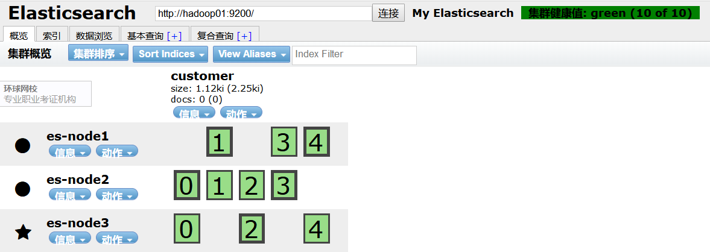

# Elasticsearch http接口Getting started

## cluster, node信息

### 检查es版本信息
检查es版本信息，检查Elasticsearch是否正在运行：

```
http://hadoop01:9200/
```
```js
{
  "name" : "es-node1",
  "cluster_name" : "My Elasticsearch",
  "cluster_uuid" : "mNm0xSMrSBmtuet0jas5ww",
  "version" : {
    "number" : "6.5.3",
    "build_flavor" : "default",
    "build_type" : "tar",
    "build_hash" : "159a78a",
    "build_date" : "2018-12-06T20:11:28.826501Z",
    "build_snapshot" : false,
    "lucene_version" : "7.5.0",
    "minimum_wire_compatibility_version" : "5.6.0",
    "minimum_index_compatibility_version" : "5.0.0"
  },
  "tagline" : "You Know, for Search"
}
```

### 查看集群是否健康
查看集群是否健康
```
GET /_cat/health?v
```
```
epoch      timestamp cluster          status node.total node.data shards pri relo init unassign pending_tasks max_task_wait_time active_shards_percent
1582420993 01:23:13  My Elasticsearch green           3         3      0   0    0    0        0             0                  -                100.0%
```

我们可以看到，我们命名为“elasticsearch”的集群现在是green状态。

无论何时我们请求集群健康时，我们会得到green, yellow, 或者 red 这三种状态。

* Green ： everything is good（一切都很好）（所有功能正常）    
* Yellow ： 所有数据都是可用的，但有些副本还没有分配（所有功能正常）    
* Red ： 有些数据不可用（部分功能正常）  

从上面的响应中我们可以看到，集群"elasticsearch"总共有3个节点，0个分片因为还没有数据。


### 查看集群的节点列表
We can also get a list of nodes in our cluster as follows:
```
GET /_cat/nodes?v
```
```
ip              heap.percent ram.percent cpu load_1m load_5m load_15m node.role master name
192.168.216.113           19          44   0    0.00    0.00     0.00 mdi       *      es-node3
192.168.216.112           16          44   0    0.00    0.00     0.00 mdi       -      es-node2
192.168.216.111           18          47   0    0.00    0.00     0.00 mdi       -      es-node1
```

## 索引

### 查看全部索引
List All Indices

Now let’s take a peek at our indices:
```
GET /_cat/indices?v
```
```
health status index uuid pri rep docs.count docs.deleted store.size pri.store.size
```
Which simply means we have no indices yet in the cluster.

这就意味着我们在集群中还没有索引。


### 创建一个索引
Create an Index 

Now let’s create an index named "customer" and then list all the indexes again:

现在让我们创建一个名为“ customer”的索引，然后再次列出所有的索引:
```
PUT /customer?pretty
```
```js
{
    "acknowledged": true,
    "shards_acknowledged": true,
    "index": "customer"
}
```
The first command creates the index named "customer" using the PUT verb. We simply append pretty to the end of the call to tell it to pretty-print the JSON response (if any).

第一个命令使用 PUT 动词创建名为“ customer”的索引。 我们只需在调用的结尾附加 pretty，告诉它优化打印 JSON 响应(如果有的话)。

```
GET /_cat/indices?v
```
```
health status index    uuid                   pri rep docs.count docs.deleted store.size pri.store.size
green  open   customer AeCsuHAaTaaDAoCROE7s-A   5   1          0            0      2.2kb          1.1kb
```

The results of the second command tells us that we now have 1 index named customer and it has 5 primary shards and 1 replica (the defaults) and it contains 0 documents in it.

第二个命令的结果告诉我们，我们现在有一个名为 customer 的索引，它有5个主碎片和1个副本(缺省值) ，其中包含0个文档。




### 索引中添加文档和查询
Index and Query a Document 

Let’s now put something into our customer index. We’ll index a simple customer document into the customer index, with an ID of 1 as follows:

现在，让我们在客户索引中添加一些内容。 我们将一个简单的客户文档索引到客户索引中，ID 为1，如下所示:
```js
PUT /customer/doc/1
{
  "name": "John Doe"
}
```
```js
{
    "_index": "customer",
    "_type": "doc",
    "_id": "1",
    "_version": 1,
    "result": "created",
    "_shards": {
        "total": 2,
        "successful": 2,
        "failed": 0
    },
    "_seq_no": 0,
    "_primary_term": 1
}
```

From the above, we can see that a new customer document was successfully created inside the customer index. The document also has an internal id of 1 which we specified at index time.

从上面我们可以看到，在客户索引中成功地创建了一个新的客户文档。 文档还有一个内部 id 为1，我们在索引时指定了这个 id。

It is important to note that Elasticsearch does not require you to explicitly create an index first before you can index documents into it. In the previous example, Elasticsearch will automatically create the customer index if it didn’t already exist beforehand.

**需要注意的是，Elasticsearch 并不要求您在将文档索引到其中之前先显式创建索引。 在前面的示例中，Elasticsearch 将自动创建客户索引，如果它事先不存在的话。**

Let’s now retrieve that document that we just indexed:

现在让我们检索刚才索引的文档:
```js
GET /customer/doc/1
```
```js
{
    "_index": "customer",
    "_type": "doc",
    "_id": "1",
    "_version": 1,
    "found": true,
    "_source": {
        "name": "John Doe"
    }
}
```

### 删除一个索引
Delete an Index

Now let’s delete the index that we just created and then list all the indexes again:

现在让我们删除刚刚创建的索引，然后再次列出所有的索引:
```js
DELETE /customer
```
```js
{
    "acknowledged": true
}
```

接下来，查看一下
```
GET /_cat/indices?v
```
```js
health status index uuid pri rep docs.count docs.deleted store.size pri.store.size
```

Which means that the index was deleted successfully and we are now back to where we started with nothing in our cluster.

这意味着索引被成功删除，我们现在回到了集群中没有任何内容的开始位置。

Before we move on, let’s take a closer look again at some of the API commands that we have learned so far:

在我们继续之前，让我们再次仔细研究一下到目前为止我们已经学到的一些 API 命令:
```
PUT /customer
PUT /customer/doc/1
{
  "name": "John Doe"
}
GET /customer/doc/1
DELETE /customer
```

If we study the above commands carefully, we can actually see a pattern of how we access data in Elasticsearch. That pattern can be summarized as follows:

如果我们仔细研究上面的命令，我们实际上可以看到一个模式，我们如何访问数据在 Elasticsearch。 这种模式可以概括如下:
```
<REST Verb> /<Index>/<Type>/<ID>
```

This REST access pattern is so pervasive throughout all the API commands that if you can simply remember it, you will have a good head start at mastering Elasticsearch.

这种 REST 访问模式在所有的 API 命令中都非常普遍，如果您能够简单地记住它，那么您就可以很好地开始掌握 Elasticsearch。

## Documents
### 创建和替换文档
先创建文档
```
PUT /customer/doc/1
{
  "name": "John Doe"
}
```
```js
{
    "_index": "customer",
    "_type": "doc",
    "_id": "1",
    "_version": 1,
    "result": "created",
    "_shards": {
        "total": 2,
        "successful": 2,
        "failed": 0
    },
    "_seq_no": 0,
    "_primary_term": 1
}
```

**增加和替换都可以使用这个接口。id不存在时就新增**

事实上，**每当我们执行替换时，Elasticsearch就会删除旧文档，然后索引一个新的文档**。

更新替换上面id为1的文档
```
PUT /customer/doc/1
{
  "name": "Jane Doe"
}
```
```js
{
    "_index": "customer",
    "_type": "doc",
    "_id": "1",
    "_version": 2,
    "result": "updated",
    "_shards": {
        "total": 2,
        "successful": 2,
        "failed": 0
    },
    "_seq_no": 1,
    "_primary_term": 1
}
```

新增时也可以不指定id，Elasticsearch 将生成一个随机 ID（**这个接口只能用POST**）。
```
POST /customer/doc?pretty
{
  "name": "Jane Doe"
}
```
```js
{
    "_index": "customer",
    "_type": "doc",
    "_id": "rgPlb3ABameqYJhzH91M",
    "_version": 1,
    "result": "created",
    "_shards": {
        "total": 2,
        "successful": 2,
        "failed": 0
    },
    "_seq_no": 2,
    "_primary_term": 1
}
```

### 更新文档
Updating Documents

In addition to being able to index and replace documents, we can also update documents. Note though that Elasticsearch does not actually do in-place updates under the hood. Whenever we do an update, Elasticsearch deletes the old document and then indexes a new document with the update applied to it in one shot.

除了能够索引和替换文档，我们还可以更新文档。 但是请注意 Elasticsearch 实际上并不在引擎盖下进行就地更新。 每当我们进行更新时，Elasticsearch 都会删除旧文档，然后索引一个新文档，并一次性应用更新。

This example shows how to update our previous document (ID of 1) by changing the name field to "Jane Doe":

这个示例演示如何通过将 name 字段更改为“ Jane Doe”来更新前一个文档(ID 为1) :
```
POST /customer/doc/1/_update
{
  "doc": { "name": "Jane Doe" }
}
```

This example shows how to update our previous document (ID of 1) by changing the name field to "Jane Doe" and at the same time add an age field to it:

这个例子展示了如何更新我们之前的文档(ID 为1) ，方法是将 name 字段更改为“ Jane Doe” ，同时向其添加一个 age 字段:
```
POST /customer/doc/1/_update
{
  "doc": { "name": "Jane Doe", "age": 20 }
}
```

**只能使用POST，这个接口和上面接口不同的是这更新相应的字段，而不是替换整个文档**


Updates can also be performed by using simple scripts. This example uses a script to increment the age by 5:

还可以使用简单的脚本执行更新。 这个例子使用一个脚本将年龄增加5:
```
POST /customer/doc/1/_update?pretty
{
  "script" : "ctx._source.age += 5"
}
```
在上面例子中，ctx._source引用的是当前源文档

### 删除文档
Deleting Documents

```
DELETE /customer/doc/2?pretty
```
```js
{
    "_index": "customer",
    "_type": "doc",
    "_id": "2",
    "_version": 3,
    "result": "deleted",
    "_shards": {
        "total": 2,
        "successful": 2,
        "failed": 0
    },
    "_seq_no": 2,
    "_primary_term": 1
}
```

### 批处理
Batch Processing

In addition to being able to index, update, and delete individual documents, Elasticsearch also provides the ability to perform any of the above operations in batches using the _bulk API. This functionality is important in that it provides a very efficient mechanism to do multiple operations as fast as possible with as few network roundtrips as possible.

除了能够索引、更新和删除单个文档之外，Elasticsearch 还提供了使用批量 API 批量执行上述任何操作的能力。 这个功能很重要，因为它提供了一个非常有效的机制，可以在尽可能少的网络往返情况下尽可能快地执行多个操作。

As a quick example, the following call indexes two documents (ID 1 - John Doe and ID 2 - Jane Doe) in one bulk operation:

作为一个简单的示例，下面的调用在一个批量操作中索引两个文档(ID 1-John Doe 和 ID 2-Jane Doe) :
```
POST /customer/doc/_bulk
{"index":{"_id":"1"}}
{"name": "John Doe" }
{"index":{"_id":"2"}}
{"name": "Jane Doe" }
```
```
curl -X POST "hadoop01:9200/customer/doc/_bulk?pretty" -H 'Content-Type: application/json' -d'
{"index":{"_id":"1"}}
{"name": "John Doe" }
{"index":{"_id":"2"}}
{"name": "Jane Doe" }
'
```
```js
{
  "took" : 21,
  "errors" : false,
  "items" : [
    {
      "index" : {
        "_index" : "customer",
        "_type" : "doc",
        "_id" : "1",
        "_version" : 8,
        "result" : "updated",
        "_shards" : {
          "total" : 2,
          "successful" : 2,
          "failed" : 0
        },
        "_seq_no" : 8,
        "_primary_term" : 1,
        "status" : 200
      }
    },
    {
      "index" : {
        "_index" : "customer",
        "_type" : "doc",
        "_id" : "2",
        "_version" : 1,
        "result" : "created",
        "_shards" : {
          "total" : 2,
          "successful" : 2,
          "failed" : 0
        },
        "_seq_no" : 3,
        "_primary_term" : 1,
        "status" : 201
      }
    }
  ]
}
```

This example updates the first document (ID of 1) and then deletes the second document (ID of 2) in one bulk operation:

此示例更新第一个文档(ID 为1) ，然后在一个批量操作中删除第二个文档(ID 为2) :

```
POST /customer/doc/_bulk?pretty
{"update":{"_id":"1"}}
{"doc": { "name": "John Doe becomes Jane Doe" } }
{"delete":{"_id":"2"}}
```
```
curl -X POST "hadoop01:9200/customer/doc/_bulk?pretty" -H 'Content-Type: application/json' -d'
{"update":{"_id":"1"}}
{"doc": { "name": "John Doe becomes Jane Doe" } }
{"delete":{"_id":"2"}}
'
```
```js
{
  "took" : 15,
  "errors" : false,
  "items" : [
    {
      "update" : {
        "_index" : "customer",
        "_type" : "doc",
        "_id" : "1",
        "_version" : 9,
        "result" : "updated",
        "_shards" : {
          "total" : 2,
          "successful" : 2,
          "failed" : 0
        },
        "_seq_no" : 9,
        "_primary_term" : 1,
        "status" : 200
      }
    },
    {
      "delete" : {
        "_index" : "customer",
        "_type" : "doc",
        "_id" : "2",
        "_version" : 2,
        "result" : "deleted",
        "_shards" : {
          "total" : 2,
          "successful" : 2,
          "failed" : 0
        },
        "_seq_no" : 4,
        "_primary_term" : 1,
        "status" : 200
      }
    }
  ]
}
```

Note above that for the delete action, there is no corresponding source document after it since deletes only require the ID of the document to be deleted.

上面注意，对于 delete 操作，删除之后没有相应的源文档，因为只需要删除文档的 ID 即可。

The Bulk API does not fail due to failures in one of the actions. If a single action fails for whatever reason, it will continue to process the remainder of the actions after it. When the bulk API returns, it will provide a status for each action (in the same order it was sent in) so that you can check if a specific action failed or not.

**批量 API 不会因为某个操作失败而失败。 如果单个操作因为某种原因失败，它将继续处理之后的其余操作。 当大容量 API 返回时，它将为每个操作提供一个状态(与它发送的顺序相同) ，以便您可以检查特定操作是否失败。**

##  探索数据
Exploring Your Data

### 样本数据集
Sample Dataset

Now that we’ve gotten a glimpse of the basics, let’s try to work on a more realistic dataset. I’ve prepared a sample of fictitious JSON documents of customer bank account information. Each document has the following schema:

现在我们已经了解了一些基本知识，接下来让我们尝试使用一个更加真实的数据集。 我准备了一个虚构的客户银行账户信息 JSON 文档样本。 每个文档都有以下模式:
```js
{
    "account_number": 0,
    "balance": 16623,
    "firstname": "Bradshaw",
    "lastname": "Mckenzie",
    "age": 29,
    "gender": "F",
    "address": "244 Columbus Place",
    "employer": "Euron",
    "email": "bradshawmckenzie@euron.com",
    "city": "Hobucken",
    "state": "CO"
}
```
For the curious, this data was generated using www.json-generator.com/, so please ignore the actual values and semantics of the data as these are all randomly generated.

出于好奇，这些数据是使用 www.json-generator.com/ 生成的，所以请忽略数据的实际值和语义，因为这些都是随机生成的。

Loading the Sample Dataset 
加载样本数据集

You can download the sample dataset (accounts.json) from here. Extract it to our current directory and let’s load it into our cluster as follows:

您可以从这里下载样本数据集(accounts.json)。 将其提取到我们的工作目录集群中，然后将其加载到集群中，如下所示:
```
curl -H "Content-Type: application/json" -XPOST 'hadoop01:9200/bank/account/_bulk?pretty&refresh' --data-binary "@accounts.json"
```
查询
```
curl 'hadoop01:9200/_cat/indices?v'
```
```
health status index    uuid                   pri rep docs.count docs.deleted store.size pri.store.size
green  open   customer hw8QeNyRR8qQ6zG8TmB3pw   5   1          2            0     15.7kb          7.8kb
green  open   bank     e-E2eLawSY6tquKY_MsMSA   5   1       1000            0    290.7kb           690b
```

Which means that we just successfully bulk indexed 1000 documents into the bank index (under the account type).

这意味着我们刚刚成功地将1000份文件批量索引到银行索引中(在帐户类型下)。


### The Search API
Now let’s start with some simple searches. There are two basic ways to run searches: one is by sending search parameters through the REST request URI and the other by sending them through the REST request body. The request body method allows you to be more expressive and also to define your searches in a more readable JSON format. We’ll try one example of the request URI method but for the remainder of this tutorial, we will exclusively be using the request body method.

现在让我们从一些简单的搜索开始。 运行搜索有两种基本方法: 一种是通过 REST 请求 URI 发送搜索参数，另一种是通过 REST 请求主体发送搜索参数。 Request body 方法允许您更具表达性，并且可以使用更具可读性的 JSON 格式定义搜索。 我们将尝试使用 request URI 方法的一个示例，但在本教程的其余部分中，我们将只使用 request body 方法。

The REST API for search is accessible from the _search endpoint. This example returns all documents in the bank index:

可以从搜索端点访问用于搜索的 restapi。 这个例子返回银行索引中的所有文档:
```
GET /bank/_search?q=*&sort=account_number:asc&pretty
```

Let’s first dissect the search call. We are searching (_search endpoint) in the bank index, and the q=* parameter instructs Elasticsearch to match all documents in the index. The sort=account_number:asc parameter indicates to sort the results using the account_number field of each document in an ascending order. The pretty parameter, again, just tells Elasticsearch to return pretty-printed JSON results.

让我们首先剖析一下搜索调用。 我们正在银行索引中搜索(搜索端点) ，q * 参数指示 Elasticsearch 匹配索引中的所有文档。 Asc 参数指示使用每个文档的 account number 字段按升序对结果进行排序。 漂亮的参数同样告诉 Elasticsearch 返回漂亮的 JSON 结果。

And the response (partially shown):

回应(部分显示) :
```js
{
  "took" : 63,
  "timed_out" : false,
  "_shards" : {
    "total" : 5,
    "successful" : 5,
    "skipped" : 0,
    "failed" : 0
  },
  "hits" : {
    "total" : 1000,
    "max_score" : null,
    "hits" : [ {
      "_index" : "bank",
      "_type" : "account",
      "_id" : "0",
      "sort": [0],
      "_score" : null,
      "_source" : {"account_number":0,"balance":16623,"firstname":"Bradshaw","lastname":"Mckenzie","age":29,"gender":"F","address":"244 Columbus Place","employer":"Euron","email":"bradshawmckenzie@euron.com","city":"Hobucken","state":"CO"}
    }, {
      "_index" : "bank",
      "_type" : "account",
      "_id" : "1",
      "sort": [1],
      "_score" : null,
      "_source" : {"account_number":1,"balance":39225,"firstname":"Amber","lastname":"Duke","age":32,"gender":"M","address":"880 Holmes Lane","employer":"Pyrami","email":"amberduke@pyrami.com","city":"Brogan","state":"IL"}
    }, ...
    ]
  }
}
```

As for the response, we see the following parts:

至于回应方面，我们可参考以下部分:

* took – time in milliseconds for Elasticsearch to execute the search Elasticsearch 执行搜索的时间(毫秒)    
* timed_out – tells us if the search timed out or not 告诉我们搜索是否超时    
* _shards – tells us how many shards were searched, as well as a count of the successful/failed searched shards - 告诉我们搜索了多少碎片，以及成功 / 失败搜索碎片的数量    
* hits – search results - 搜寻结果    
* hits.total – total number of documents matching our search criteria - 符合搜寻准则的文件总数    
* hits.hits – actual array of search results (defaults to first 10 documents) - 搜索结果的实际数组(默认为前10个文档)    
* hits.sort - sort key for results (missing if sorting by score) - 排序关键的结果(缺失，如果按分数排序)    
* hits._score and 及max_score - ignore these fields for now - 暂时忽略这些字段   


Here is the same exact search above using the alternative request body method:

下面是上面使用替换请求主体方法进行的完全相同的搜索:
```
POST /bank/_search
{
  "query": { "match_all": {} },
  "sort": [
    { "account_number": "asc" }
  ]
}
```

Each search request is self-contained: Elasticsearch does not maintain any state information across requests. To page through the search hits, specify the from and size parameters in your request.

每个搜索请求都是自包含的: Elasticsearch 不维护跨请求的任何状态信息。 若要浏览搜索结果，请在请求中指定 from 和 size 参数。

For example, the following request gets hits 10 through 19:

例如，下面的请求会得到从10到19的结果:
```
POST /bank/_search
{
  "query": { "match_all": {} },
  "sort": [
    { "account_number": "asc" }
  ],
  "from": 10,
  "size": 10
}
```

Now that you’ve seen how to submit a basic search request, you can start to construct queries that are a bit more interesting than match_all.

现在您已经了解了如何提交基本的搜索请求，接下来可以开始构建比全部匹配更有趣的查询。

To search for specific terms within a field, you can use a match query. For example, the following request searches the address field to find customers whose addresses contain mill or lane:

若要在字段中搜索特定术语，可以使用匹配查询。 例如，下面的请求搜索地址字段，找到地址包含 mill 或 lane 的客户:

```
POST /bank/_search
{
  "query": { "match": { "address": "mill lane" } }
}
```

To perform a phrase search rather than matching individual terms, you use match_phrase instead of match. For example, the following request only matches addresses that contain the phrase mill lane:

要执行短语搜索而不是匹配单个术语，可以使用match_phrase而不是match。 例如，下面的请求只匹配包含短语 mill lane 的地址:
```
POST /bank/_search
{
  "query": { "match_phrase": { "address": "mill lane" } }
}
```

To construct more complex queries, you can use a bool query to combine multiple query criteria. You can designate criteria as required (must match), desirable (should match), or undesirable (must not match).

要构造更复杂的查询，可以使用 bool 查询来组合多个查询条件。 您可以将标准指定为必需的(必须匹配)、可取的(应该匹配)或不可取的(必须不匹配)。

For example, the following request searches the bank index for accounts that belong to customers who are 40 years old, but excludes anyone who lives in Idaho (ID):

例如，下面的请求在银行索引中搜索属于40岁客户的账户，但不包括住在爱达荷州的任何人(ID) :
```
POST /bank/_search
{
  "query": {
    "bool": {
      "must": [
        { "match": { "age": "40" } }
      ],
      "must_not": [
        { "match": { "state": "ID" } }
      ]
    }
  }
}
```

Each must, should, and must_not element in a Boolean query is referred to as a query clause. How well a document meets the criteria in each must or should clause contributes to the document’s relevance score. The higher the score, the better the document matches your search criteria. By default, Elasticsearch returns documents ranked by these relevance scores.

布尔查询中的每个元素都必须、应该和不能被称为查询子句。 文档满足每个必须或应该条款中的标准的程度决定了文档的相关性得分。 得分越高，文档就越符合你的搜索条件。 默认情况下，Elasticsearch 返回按照相关性得分排序的文档。

The criteria in a must_not clause is treated as a filter. It affects whether or not the document is included in the results, but does not contribute to how documents are scored. You can also explicitly specify arbitrary filters to include or exclude documents based on structured data.

“绝对不能”子句中的条件被视为筛选器。 它影响文档是否包含在结果中，但不影响如何对文档进行评分。 还可以根据结构化数据显式指定任意筛选器，以包含或排除文档。

For example, the following request uses a range filter to limit the results to accounts with a balance between $20,000 and $30,000 (inclusive).

例如，下面的请求使用范围过滤器将结果限制为余额在 $20,000和 $30,000之间的帐户。
```
POST /bank/_search
{
  "query": {
    "bool": {
      "must": { "match_all": {} },
      "filter": {
        "range": {
          "balance": {
            "gte": 20000,
            "lte": 30000
          }
        }
      }
    }
  }
}
```

### aggregationsedit
Analyze results with aggregationsedit

Elasticsearch aggregations enable you to get meta-information about your search results and answer questions like, "How many account holders are in Texas?" or "What’s the average balance of accounts in Tennessee?" You can search documents, filter hits, and use aggregations to analyze the results all in one request.

Elasticsearch 聚合使您能够获得关于搜索结果的元信息，并回答诸如“德克萨斯州有多少帐户持有人? ” 或者“田纳西州的平均账户余额是多少? ” 您可以在一个请求中搜索文档、筛选命中，并使用聚合来分析所有结果。

For example, the following request uses a terms aggregation to group all of the accounts in the bank index by state, and returns the ten states with the most accounts in descending order:

例如，下面的请求使用一个术语聚合按州对银行索引中的所有账户进行分组，并按降序返回账户最多的10个州:
```
POST /bank/_search
{
  "size": 0,
  "aggs": {
    "group_by_state": {
      "terms": {
        "field": "state.keyword"
      }
    }
  }
}
```
```js
{
  "took": 29,
  "timed_out": false,
  "_shards": {
    "total": 5,
    "successful": 5,
    "skipped" : 0,
    "failed": 0
  },
  "hits" : {
     "total" : 1000,
    "max_score" : 0.0,
    "hits" : [ ]
  },
  "aggregations" : {
    "group_by_state" : {
      "doc_count_error_upper_bound": 20,
      "sum_other_doc_count": 770,
      "buckets" : [ {
        "key" : "ID",
        "doc_count" : 27
      }, {
        "key" : "TX",
        "doc_count" : 27
      }, {
        "key" : "AL",
        "doc_count" : 25
      }, {
        "key" : "MD",
        "doc_count" : 25
      }, {
        "key" : "TN",
        "doc_count" : 23
      }, {
        "key" : "MA",
        "doc_count" : 21
      }, {
        "key" : "NC",
        "doc_count" : 21
      }, {
        "key" : "ND",
        "doc_count" : 21
      }, {
        "key" : "ME",
        "doc_count" : 20
      }, {
        "key" : "MO",
        "doc_count" : 20
      } ]
    }
  }
}
```

这个示例按state对所有帐户进行分组，然后按照count数降序（默认）返回前10条（默认）

The buckets in the response are the values of the state field. The doc_count shows the number of accounts in each state. For example, you can see that there are 27 accounts in ID (Idaho). Because the request set size=0, the response only contains the aggregation results.

响应中的 bucket 是 state 字段的值。 Doc 计数显示每个州的帐户数量。 例如，您可以看到 ID (Idaho)中有27个帐户。 因为请求集大小为0，响应仅包含聚合结果。


You can combine aggregations to build more complex summaries of your data. For example, the following request nests an avg aggregation within the previous group_by_state aggregation to calculate the average account balances for each state.

您可以组合聚合来构建更复杂的数据摘要。 例如，下面的请求按状态聚合在前一个组中嵌套平均聚合，以计算每个状态的平均帐户余额。

```
POST /bank/_search
{
  "size": 0,
  "aggs": {
    "group_by_state": {
      "terms": {
        "field": "state.keyword"
      },
      "aggs": {
        "average_balance": {
          "avg": {
            "field": "balance"
          }
        }
      }
    }
  }
}
```
```js
{
    "took": 28,
    "timed_out": false,
    "_shards": {
        "total": 5,
        "successful": 5,
        "skipped": 0,
        "failed": 0
    },
    "hits": {
        "total": 1000,
        "max_score": 0,
        "hits": []
    },
    "aggregations": {
        "group_by_state": {
            "doc_count_error_upper_bound": 20,
            "sum_other_doc_count": 770,
            "buckets": [
                {
                    "key": "ID",
                    "doc_count": 27,
                    "average_balance": {
                        "value": 24368.777777777777
                    }
                },
                {
                    "key": "TX",
                    "doc_count": 27,
                    "average_balance": {
                        "value": 27462.925925925927
                    }
                },
                {
                    "key": "AL",
                    "doc_count": 25,
                    "average_balance": {
                        "value": 25739.56
                    }
                },
                {
                    "key": "MD",
                    "doc_count": 25,
                    "average_balance": {
                        "value": 24963.52
                    }
                },
                {
                    "key": "TN",
                    "doc_count": 23,
                    "average_balance": {
                        "value": 29796.782608695652
                    }
                },
                {
                    "key": "MA",
                    "doc_count": 21,
                    "average_balance": {
                        "value": 29726.47619047619
                    }
                },
                {
                    "key": "NC",
                    "doc_count": 21,
                    "average_balance": {
                        "value": 26785.428571428572
                    }
                },
                {
                    "key": "ND",
                    "doc_count": 21,
                    "average_balance": {
                        "value": 26303.333333333332
                    }
                },
                {
                    "key": "ME",
                    "doc_count": 20,
                    "average_balance": {
                        "value": 19575.05
                    }
                },
                {
                    "key": "MO",
                    "doc_count": 20,
                    "average_balance": {
                        "value": 24151.8
                    }
                }
            ]
        }
    }
}
```

nstead of sorting the results by count, you could sort using the result of the nested aggregation by specifying the order within the terms aggregation:

你可以通过在术语聚合中指定顺序来使用嵌套聚合的结果进行排序，而不是通过计数来对结果进行排序:
```
POST /bank/_search
{
  "size": 0,
  "aggs": {
    "group_by_state": {
      "terms": {
        "field": "state.keyword",
        "order": {
          "average_balance": "desc"
        }
      },
      "aggs": {
        "average_balance": {
          "avg": {
            "field": "balance"
          }
        }
      }
    }
  }
}
```
```js
{
    "took": 42,
    "timed_out": false,
    "_shards": {
        "total": 5,
        "successful": 5,
        "skipped": 0,
        "failed": 0
    },
    "hits": {
        "total": 1000,
        "max_score": 0,
        "hits": []
    },
    "aggregations": {
        "group_by_state": {
            "doc_count_error_upper_bound": -1,
            "sum_other_doc_count": 918,
            "buckets": [
                {
                    "key": "AL",
                    "doc_count": 6,
                    "average_balance": {
                        "value": 41418.166666666664
                    }
                },
                {
                    "key": "SC",
                    "doc_count": 1,
                    "average_balance": {
                        "value": 40019
                    }
                },
                {
                    "key": "AZ",
                    "doc_count": 10,
                    "average_balance": {
                        "value": 36847.4
                    }
                },
                {
                    "key": "VA",
                    "doc_count": 13,
                    "average_balance": {
                        "value": 35418.846153846156
                    }
                },
                {
                    "key": "DE",
                    "doc_count": 8,
                    "average_balance": {
                        "value": 35135.375
                    }
                },
                {
                    "key": "WA",
                    "doc_count": 7,
                    "average_balance": {
                        "value": 34787.142857142855
                    }
                },
                {
                    "key": "ME",
                    "doc_count": 3,
                    "average_balance": {
                        "value": 34539.666666666664
                    }
                },
                {
                    "key": "OK",
                    "doc_count": 9,
                    "average_balance": {
                        "value": 34529.77777777778
                    }
                },
                {
                    "key": "CO",
                    "doc_count": 13,
                    "average_balance": {
                        "value": 33379.769230769234
                    }
                },
                {
                    "key": "MI",
                    "doc_count": 12,
                    "average_balance": {
                        "value": 32905.916666666664
                    }
                }
            ]
        }
    }
}
```
In addition to basic bucketing and metrics aggregations like these, Elasticsearch provides specialized aggregations for operating on multiple fields and analyzing particular types of data such as dates, IP addresses, and geo data. You can also feed the results of individual aggregations into pipeline aggregations for further analysis.

除了基本的分类和度量聚合之外，Elasticsearch 还提供了专门的聚合，用于操作多个领域和分析特定类型的数据，如日期、 IP 地址和地理数据。 您还可以将各个聚合的结果提供给管道聚合，以便进一步分析。

The core analysis capabilities provided by aggregations enable advanced features such as using machine learning to detect anomalies.

聚合提供的核心分析能力支持使用机器学习检测异常等高级特性。


```

```
```js

```