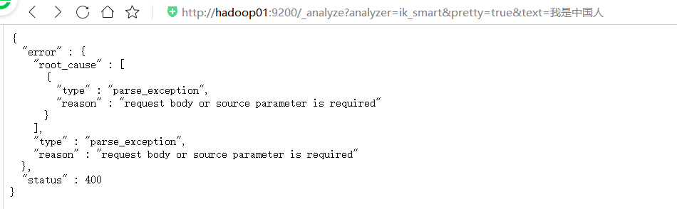

# Elasticsearch安装与环境配置

实际上ES的安装配置是非常简单的，没有繁琐的安装配置，可以称之为零配置，开箱即用。 说明一点：ES新版本的操作必须要在普通用户下面进行操作 ES安装配置

下载地址 https://www.elastic.co/downloads/past-releases/elasticsearch-6-5-3 或者再github官网elastic项目下载都可以下载到各个版本的es https://github.com/elastic/elasticsearch

安装要求 JDK版本最低1.8(5.x以后都要求jdk1.8)

安装 同一个安装包既可以在windows下使用，也可以在linux下使用（bin下面windows、linux的命令文件都有）。

## 安装
直接解压就行
```
tar -zxf elasticsearch-6.5.3.tar.gz -C apps/
```

启动
```sh
# 阻塞启动
bin/elasticsearch
# 后台启动
bin/elasticsearch -d
```

查看是否启动
```
[hadoop@hadoop01 elasticsearch-6.5.3]$ jps
3492 Elasticsearch
3596 Jps
```


**注意：9300是tcp通讯端口，集群间和TCPClient都执行该端口，9200是http协议的RESTful接口 。**

检查Elasticsearch是否正在运行：
```
[hadoop@hadoop01 elasticsearch-6.5.3]$ curl -XGET 'http://127.0.0.1:9200'
{
  "name" : "X4jtz6q",
  "cluster_name" : "elasticsearch",
  "cluster_uuid" : "mNm0xSMrSBmtuet0jas5ww",
  "version" : {
    "number" : "6.5.3",
    "build_flavor" : "default",
    "build_type" : "tar",
    "build_hash" : "159a78a",
    "build_date" : "2018-12-06T20:11:28.826501Z",
    "build_snapshot" : false,
    "lucene_version" : "7.5.0",
    "minimum_wire_compatibility_version" : "5.6.0",
    "minimum_index_compatibility_version" : "5.0.0"
  },
  "tagline" : "You Know, for Search"
}
```


**es服务器允许别的插件服务访问，需要配置允许跨域**：
```yml
# es服务器允许别的插件服务访问，需要配置允许跨域
http.cors.enabled: true
http.cors.allow-origin: "*"
```


### linux安装elasticsearch-head插件 
需要nodejs环境，nodejs的安装只需要从官网下载linux版本的文件解压配置环境变量即可
```sh
[root@hadoop01 hadoop]# tar -zxf  node-v12.16.1-linux-x64.tar.xz -C /usr/local/
gzip: stdin: not in gzip format
tar: Child returned status 1
tar: Error is not recoverable: exiting now
[root@hadoop01 hadoop]# tar -xf  node-v12.16.1-linux-x64.tar.xz -C /usr/local/ 
[root@hadoop01 hadoop]# ll /usr/local/
total 64
drwxr-xr-x. 2 root root 4096 Sep 23  2011 bin
drwxr-xr-x. 2 root root 4096 Sep 23  2011 etc
drwxr-xr-x. 2 root root 4096 Sep 23  2011 games
drwxr-xr-x. 2 root root 4096 Sep 23  2011 include
drwxr-xr-x. 8 uucp  143 4096 Apr 11  2015 jdk1.7.0_79
drwxr-xr-x. 7 uucp  143 4096 Jul  7  2018 jdk1.8.0_181
drwxr-xr-x. 2 root root 4096 Sep 23  2011 lib
drwxr-xr-x. 2 root root 4096 Sep 23  2011 lib64
drwxr-xr-x. 2 root root 4096 Sep 23  2011 libexec
drwxr-xr-x. 2 root root 4096 May  1  2019 mysql
drwxr-xr-x  6 1001 1001 4096 Feb 18 12:35 node-v12.16.1-linux-x64
drwxr-xr-x  3 root root 4096 Aug 10  2019 redis
drwxr-xr-x. 2 root root 4096 Sep 23  2011 sbin
drwxrwxr-x. 6 1001 1001 4096 Mar  4  2016 scala-2.11.8
drwxr-xr-x. 5 root root 4096 Sep 23  2018 share
drwxr-xr-x. 2 root root 4096 Sep 23  2011 src
```

从https://github.com/mobz/elasticsearch-head下载插件，按照官网的提示执行命令即可
```
Running with built in server
git clone git://github.com/mobz/elasticsearch-head.git
cd elasticsearch-head
npm install
npm run start
open http://localhost:9100/
```

### 安装IK分词器
 下载分词器：`https://github.com/medcl/elasticsearch-analysis-ik/releases`

在elasticsearch-6.5.3/plugins/新建文件夹analysis-ik，解压插件到此目录即可（压缩包没有根目录）。

重新启动ElasticSearch，即可加载IK分词器


#### IK分词器测试
IK提供了两个分词算法iksmart 和 ikmax_word

其中 iksmart 为最少切分，ikmax_word为最细粒度划分

我们分别来试一下

注意在5.x的时候可以使用
```
http://hadoop01:9200/_analyze?analyzer=ik_smart&pretty=true&text=我是中国人
```

6.x的时候不可以


**必须把参数写到请求体中：**

最小切分：


最细切分：


### linux 安装nodejs环境
于 gcc 动态库版本过低，导致报错如下
```
node: /usr/lib64/libstdc++.so.6: version `GLIBCXX_3.4.14' not found (required by node)
node: /usr/lib64/libstdc++.so.6: version `GLIBCXX_3.4.18' not found (required by node)
node: /usr/lib64/libstdc++.so.6: version `CXXABI_1.3.5' not found (required by node)
node: /usr/lib64/libstdc++.so.6: version `GLIBCXX_3.4.15' not found (required by node)
node: /lib64/libc.so.6: version `GLIBC_2.17' not found (required by node)
node: /lib64/libc.so.6: version `GLIBC_2.16' not found (required by node)
node: /lib64/libc.so.6: version `GLIBC_2.14' not found (required by node)
```

#### gcc5.2安装
`https://blog.csdn.net/libinemail/article/details/100152017`
`https://www.cnblogs.com/lzpong/p/5755678.html`

gcc安装文件下载完成后，执行以下命令解压文件：
```
tar -xf gcc-5.2.0.tar.bz2
```

解压完成后，执行以下命令进入工作目录：
```
cd gcc-5.2.0
```

执行download_prerequisites脚本，下载gcc依赖文件和库：
```
./contrib/download_prerequisites
```

建立一个输出目录，编译时所有生成的中间文件都放到该目录下：
```
mkdir gcc-temp
```

工作目录切换至输出目录，并在其中执行配置和安装：
```
cd gcc-temp
```

执行configure配置安装文件：
```
../configure --enable-checking=release --enable-languages=c,c++ --disable-multilib
```

配置完成后，执行以下命令，编译gcc：
```
make
```

注意：编译gcc时间较长，我用了近1个小才编译完成。

编译完成后，安装gcc：
```
make install
```

安装完成后还需要替换系统默认的gcc，执行以下命令，查找5.2版本的安装文件：
```
ls /usr/local/bin | grep gcc
```

输出如下：
```
gcc
gcc-ar
gcc-nm
gcc-ranlib
x86_64-unknown-linux-gnu-gcc
x86_64-unknown-linux-gnu-gcc-5.2.0    //就是这个
x86_64-unknown-linux-gnu-gcc-ar
x86_64-unknown-linux-gnu-gcc-nm
x86_64-unknown-linux-gnu-gcc-ranlib
```

执行升级命令：
```
/usr/sbin/update-alternatives --install  /usr/bin/gcc gcc /usr/local/bin/x86_64-unknown-linux-gnu-gcc-5.2.0 52
```

执行以下命令查看gcc版本：
```
gcc -v
```

#### 替换老版本gcc的动态库
源码编译升级安装了gcc后，编译程序或运行其它程序时，有时会出现类似/usr/lib64/libstdc++.so.6: version `GLIBCXX_3.4.21' not found的问题。这是因为升级gcc时，生成的动态库没有替换老版本gcc的动态库导致的，将gcc最新版本的动态库替换系统中老版本的动态库即可解决。


运行以下命令检查动态库：
```
strings /usr/lib64/libstdc++.so.6 | grep GLIBC
```
从输出可以看出，gcc的动态库还是旧版本的。说明出现这些问题，是因为升级gcc时，生成的动态库没有替换老版本gcc的动态库。


执行以下命令，查找编译gcc时生成的最新动态库：
```
find / -name "libstdc++.so*"
```

删除原来软连接，将默认库的软连接指向最新动态库：
```
rm -rf /usr/lib64/libstdc++.so.6
ln -s /usr/local/lib64/libstdc++.so.6 /usr/lib64/libstdc++.so.6
```

默认动态库升级完成。重新运行以下命令检查动态库：
```
strings /usr/lib64/libstdc++.so.6 | grep GLIBC
```

完成

#### /lib64/libc.so.6 升级
升级了gcc也没找到，从网上查到了libc.so.6 升级命令,升级到18，包含之间的版本

```
curl -O http://ftp.gnu.org/gnu/glibc/glibc-2.18.tar.gz 
tar zxf glibc-2.18.tar.gz 
cd glibc-2.18/ 
mkdir build 
cd build/ 
../configure --prefix=/usr 
make -j2 
make install
```

终于:
```
[hadoop@hadoop01 ~]$ node -v
v12.16.1
```

## 配置
### 启动报警告：unable to install syscall filter

ElasticSearch启动报警告：unable to install syscall filter:


使用的是centos6，其linux内核版本为2.6。而Elasticsearch的插件要求至少3.5以上版本 ，禁用这个插件即可。其实不管也行只是一个警告，不影响使用。

修改elasticsearch.yml文件，在最下面添加如下配置：
```
bootstrap.system_call_filter: false
```
然后重启Elasticsearch


### linux 资源限制修改
启动报这些信息
```
[3] bootstrap checks failed
[1]: max file descriptors [4096] for elasticsearch process is too low, increase to at least [65536]
[2]: max number of threads [1024] for user [hadoop] is too low, increase to at least [4096]
[3]: max virtual memory areas vm.max_map_count [65530] is too low, increase to at least [262144]
```

在root用户下修改

**max file**

每个进程最大同时打开文件数太小

修改/etc/security/limits.conf文件，增加配置，用户退出后重新登录生效
```
*               soft    nofile          65536
*               hard    nofile          65536
*               soft    nproc           65536
*               hard    nproc           65536
```


**max number of threads**

vi /etc/security/limits.d/90-nproc.conf
```
*          soft    nproc     unlimited
root       soft    nproc     unlimited
```


**max virtual memory**
 
vi /etc/sysctl.conf
```
vm.max_map_count=262144
```
执行sysctl -p生效
```
sysctl -p
```

### 集群配置
hadoop01
```yml
#es集群名称
cluster.name: My Elasticsearch
#es节点名称，每个节点的名称不能相同
node.name: es-node1
#指定该节点是否有资格被选举成为master，默认是true
node.master: true
#指定该节点是否存储索引数据，默认为true。
node.data: true
#节点的ip地址
network.host: hadoop01
#设置集群中master节点的初始列表，可以通过这些节点来自动发现新加入集群的节点
discovery.zen.ping.unicast.hosts: ["hadoop01", "hadoop02", "hadoop03"]


# 不显示警告：seccomp unavailable: requires kernel 3.5+ centos
bootstrap.system_call_filter: false

# es服务器允许别的插件服务访问，需要配置允许跨域
http.cors.enabled: true
http.cors.allow-origin: "*"

# 允许别的电脑访问，不配置的话只能http://127.0.0.1:9200/访问
# network.host: 0.0.0.0
```

hadoop02
```yml
#es集群名称
cluster.name: My Elasticsearch
#es节点名称，每个节点的名称不能相同
node.name: es-node1
#指定该节点是否有资格被选举成为master，默认是true
node.master: true
#指定该节点是否存储索引数据，默认为true。
node.data: true
#节点的ip地址
network.host: hadoop02
#设置集群中master节点的初始列表，可以通过这些节点来自动发现新加入集群的节点
discovery.zen.ping.unicast.hosts: ["hadoop01", "hadoop02", "hadoop03"]


# 不显示警告：seccomp unavailable: requires kernel 3.5+ centos
bootstrap.system_call_filter: false

# es服务器允许别的插件服务访问，需要配置允许跨域
http.cors.enabled: true
http.cors.allow-origin: "*"

# 允许别的电脑访问，不配置的话只能http://127.0.0.1:9200/访问
# network.host: 0.0.0.0
```

hadoop03
```yml
#es集群名称
cluster.name: My Elasticsearch
#es节点名称，每个节点的名称不能相同
node.name: es-node1
#指定该节点是否有资格被选举成为master，默认是true
node.master: true
#指定该节点是否存储索引数据，默认为true。
node.data: true
#节点的ip地址
network.host: hadoop03
#设置集群中master节点的初始列表，可以通过这些节点来自动发现新加入集群的节点
discovery.zen.ping.unicast.hosts: ["hadoop01", "hadoop02", "hadoop03"]


# 不显示警告：seccomp unavailable: requires kernel 3.5+ centos
bootstrap.system_call_filter: false

# es服务器允许别的插件服务访问，需要配置允许跨域
http.cors.enabled: true
http.cors.allow-origin: "*"

# 允许别的电脑访问，不配置的话只能http://127.0.0.1:9200/访问
# network.host: 0.0.0.0
```


```

```
