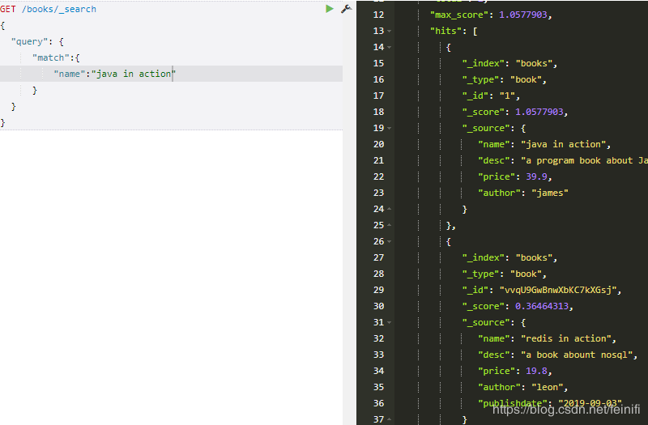
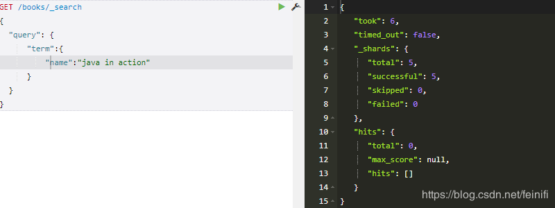
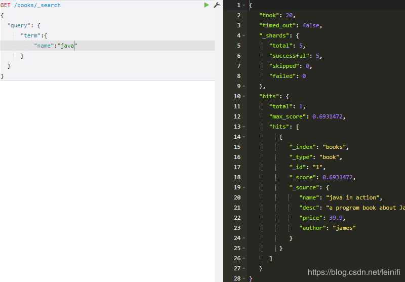
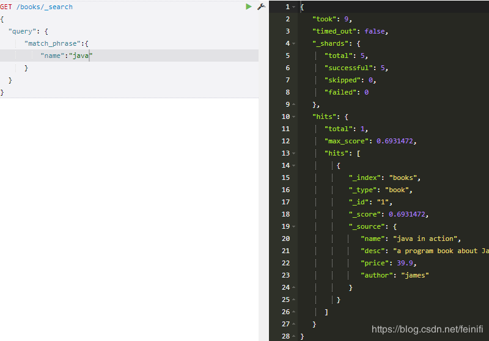
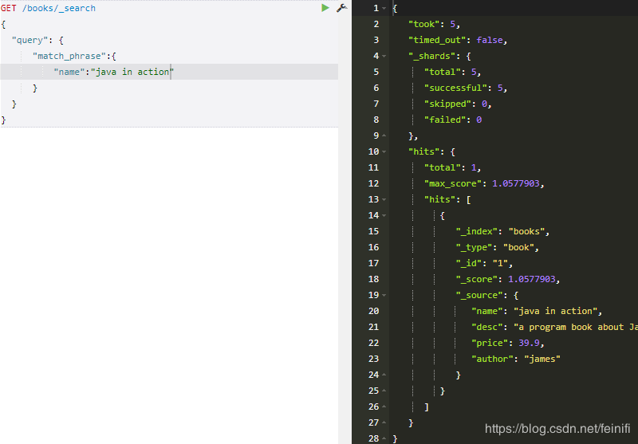
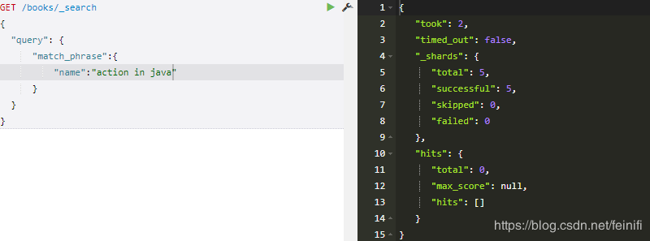
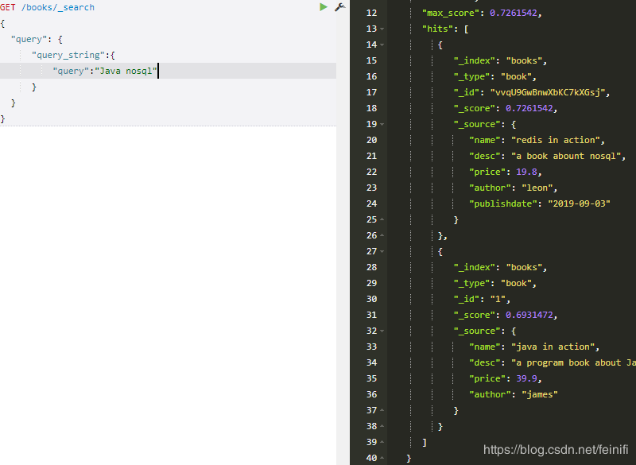

## 实例演示ElasticSearch索引查询term,match,match_phase,query_string之间的区别
`https://blog.csdn.net/feinifi/article/details/100512058`

通常在面试elasticsearch中，面试官会问一个关于查询的问题，就是term查询和match查询有什么区别？如果你对这两个查询不清楚，面试官会认为你没有用过elasticsearch，或者就是用了也不是很深入。

下面通过实例来演示索引检索时term,match他们之间的区别

### match
match：模糊匹配，需要指定字段名，但是输入会进行分词，比如"hello world"会进行拆分为hello和world，然后匹配，如果字段中包含hello或者world，或者都包含的结果都会被查询出来，也就是说match是一个部分匹配的模糊查询。查询条件相对来说比较宽松。

### term
term：这种查询和match在有些时候是等价的，比如我们查询单个的词hello，那么会和match查询结果一样，但是如果查询"hello world"，结果就相差很大，因为这个输入不会进行分词，就是说查询的时候，是查询字段分词结果中是否有"hello world"的字样，而不是查询字段中包含"hello world"的字样，我们知道elasticsearch会对字段内容进行分词，"hello world"会被分成hello和world，不存在"hello world"，因此这里的查询结果会为空。这也是term查询和match的区别。

虽然books中有name="java in action"的book,但是term查询还是查询不出来结果。只有使用单个词做索引才能查询出结果：

### match_phase
match_phase：会对输入做分词，但是需要结果中也包含所有的分词，而且顺序要求一样。以"hello world"为例，要求结果中必须包含hello和world，而且还要求他们是连着的，顺序也是固定的，hello that word不满足，world hello也不满足条件。

增加分词：

将查询分词顺序打乱，就查询不出结果了：

###  query_string
query_string：和match类似，但是match需要指定字段名，query_string默认是在所有字段中搜索，范围更广泛。可以指定字段，这样就和match差不多了。

不仅查询了desc中包含了nosql，还查询了desc包含Java的结果。所以说query_string是条件最宽泛，查询结果最广泛的查询。

如果想使用精确查询，而且想要匹配的更多，可以使用match_phase，在使用term查询的时候一定要注意最好不要使用多个单词来查找，这种情况很容易造成误查找。

