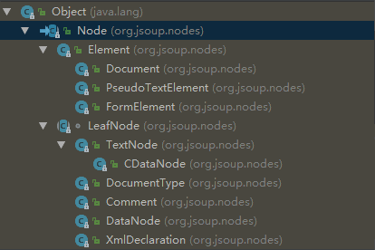

## jsoup概述
Jsoup是一款比较好的Java版HTML解析器。可直接解析某个URL地址、HTML文本内容。它提供了一套非常省力的API，可通过DOM，CSS以及类似于jQuery的操作方法来取出和操作数据。

Jsoup可以说是最好的解析HTML的工具了，元素节点、文本节点、注释节点、data节点(css、js)都被解析出来了，提够了可读性非常好的api(css选择器、链式调用、方法选择器、节点遍历，文本节点处理)，解析htｍl十分精确，再配合上java8甚至scala会让解析更加灵活方便。

Jsoup不依赖于任何库，源代码也比较容易看懂，对于用在python中一些用xpath提取文本不方便的地方，在Jsoup中我们可以自己定制实现。python库的源代码不容易看，一是因为一些实现使用c实现的，二是因为动态脚本语言在函数中追踪不到函数(不确定对象的类型)除非用debug的方式(但是debug的方式对应一些异步多线程的代码也不好追踪查找)，三是可能我用python还是比较少、看代码调试的功力不够。

jsoup的官方文档写的也比较清楚，而且有中文文档，快速看一下基本就会用jsoup了。

## jsoup主要的类
Jsoup 这个类提供了几个静态的方法用于从字符串、文件、url解析html，这个类比较简单，但基本是使用Jsoup的第一步。

比较重要的几个类当然是关于dom文档节点的几个类了，其中最重要的有**Element**、**Elements**、**TextNode**。

看一下Jsoup中关于描述dom节点类的继承结构：


最重要的是Element和TextNode其他的用的很少。

解释一些几个类：

```java
/**
 The base, abstract Node model. Elements, Documents, Comments etc are all Node instances.
 节点的基础类。
*/
public abstract class Node implements Cloneable {
    static final String EmptyString = "";
    Node parentNode;//父节点
    int siblingIndex;//在同辈节点中的索引
}

/**
 * A HTML element consists of a tag name, attributes, and child nodes (including text nodes and other elements).
 * 一个HTML节点、包含标签名、属性、和子节点（包括子HTML节点、文本节点、DataNode等）。
 * 
 * From an Element, you can extract data, traverse the node graph, and manipulate the HTML.
 * 从Element，可以提取数据、遍历节点、操作修改HTML。
 * 
 */
public class Element extends Node {
    private static final List<Node> EMPTY_NODES = Collections.emptyList();
    //html class的分割符，值编译一次
    private static final Pattern classSplit = Pattern.compile("\\s+");
    private Tag tag;//标签对象，标签的名称，是否是块标签、表单标签等
    //子Element的弱引用，这里面不包含DataNode
    private WeakReference<List<Element>> shadowChildrenRef; // points to child elements shadowed from node children
    List<Node> childNodes;//childNodes
    private Attributes attributes;
    private String baseUri;
}

/**
 A text node.
 注意文本几点的text()和getWholeText()方法，text()会对空格格式化。
 不仅TextNode，Element、Elements的text()和getWholeText()也是类似。
*/
public class TextNode extends LeafNode {
    /**
     * Get the text content of this text node.
     * @return Unencoded, normalised text.
     */
    public String text() {
        return StringUtil.normaliseWhitespace(getWholeText());
    }
    
    /**
     Get the (unencoded) text of this text node, including any newlines and spaces present in the original.
     @return text
     */
    public String getWholeText() {
        return coreValue();
    }
}

/**
 A list of {@link Element}s, with methods that act on every element in the list.
 对Elements的method都会作用到每个Element上，选择器的方法返回的都是Elements对象。
 To get an {@code Elements} object, use the {@link Element#select(String)} method.
*/
public class Elements extends ArrayList<Element> {
}
```


