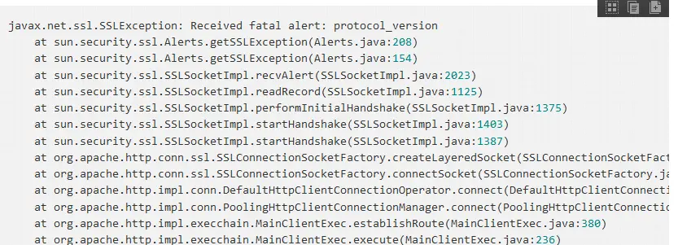
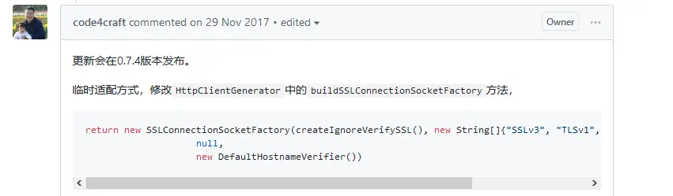

## webMagic 测试例子报错（avax.net.ssl.SSLException: Received fatal alert: protocol_version）
当我们创建一个maven项目，引入webMagic的依赖，然后满怀信心去测试如下作者给的代码会发现如下问题：

作者已经给出了解决方法，github上的此bug已经修复，但是maven仓库的还没有上传。

0.7.3版本对SSL的并不完全，如果是直接从Maven中央仓库下载依赖，在爬取只支持SSL v1.2的网站会有SSL的异常抛出。

解决方案：

* 1.等作者的0.7.4的版本发布    
* 2.直接从github上下载最新的代码，安装到本地仓库    

