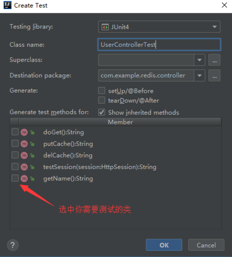

## Springboot整合JUnit
如果是Spring Boot项目默认已经加入了JUnit框架支持，可在pom.xml中查看：
```xml
<dependency>
    <groupId>org.springframework.boot</groupId>
    <artifactId>spring-boot-starter-test</artifactId>
    <scope>test</scope>
</dependency>
```
如果Maven项目中没有添加JUnit依赖，可参照如上代码，手动添加。

### 基础使用
简单的测试代码如下：
```java
package com.poetry.service;

import com.poetry.dao.PoemRepository;
import com.poetry.pojo.Poem;
import org.jsoup.Jsoup;
import org.jsoup.nodes.Document;
import org.jsoup.select.Elements;
import org.junit.Test;
import org.junit.runner.RunWith;
import org.springframework.beans.factory.annotation.Autowired;
import org.springframework.boot.test.context.SpringBootTest;
import org.springframework.data.domain.Example;
import org.springframework.test.context.junit4.SpringRunner;

import java.util.List;
import java.util.regex.Pattern;
import java.util.stream.Collectors;

@RunWith(SpringRunner.class)
@SpringBootTest
public class PoemServiceTest {
    @Autowired
    private PoemService poemService;
    @Autowired
    private PoemRepository poemRepository;

    @Test
    public void save() {
    }

    @Test
    public void exists() {
        Poem poem = new Poem();
        poem.setId("e13e655b4579");
        boolean exists = poemService.exists(poem);
        System.out.println(exists);
    }

    @Test
    public void findById() {
        Poem poem = poemService.findById("e13e655b4579");
        System.out.println(poem);
    }

    @Test
    public void updateContents() {
        /*List<Poem> poems = poemRepository.findAll();
        System.out.println(System.currentTimeMillis());
        for (Poem poem : poems) {
            List<String> contents = JsoupUtils.getTextNodeStrings(Jsoup.parse(poem.getCont()).body());
            poem.setContents(contents);
            poemRepository.save(poem);
        }
        System.out.println(System.currentTimeMillis());*/
        Poem p = new Poem();
        p.setAuthor("王安石");
        List<Poem> poems = poemRepository.findAll(Example.of(p));
        for (Poem poem : poems) {
            System.out.println(poem.getTitle());
            System.out.println(poem.getBackgrounds());
        }
    }

    @Test
    public void updateBackgrounds() throws Exception {
        final Pattern linkaPattern = Pattern.compile("<a.+?>(.+?)</a>");
        /*Poem p = new Poem();
        p.setAuthor("王安石");
        List<Poem> poems = poemRepository.findAll(Example.of(p));*/
        List<Poem> poems = poemRepository.findAll();
        for (Poem poem : poems) {
            Document document = Jsoup.connect("https://so.gushiwen.org/shiwenv_" + poem.getId() + ".aspx").get();
            List<String> backgrounds = document.select("div.contyishang").stream().filter(e -> e.select("h2:contains(背景),h2:contains(解说)").size() > 0)
                    .map(e -> {
                        Elements ps = e.select("> p");
                        if (!ps.isEmpty()) {
                            return linkaPattern.matcher(ps.outerHtml()).replaceAll("$1");
                        } else {
                            return e.text();
                        }

                    }).collect(Collectors.toList());
            poem.setBackgrounds(backgrounds);
            //poemRepository.save(poem);
            //Thread.sleep(100);
        }
    }

}
```

### 注解说明
* @RunWith：标识为JUnit的运行环境；    
* @SpringBootTest：获取启动类、加载配置，确定装载Spring Boot；    
* @Test：声明需要测试的方法；    
* @BeforeClass：针对所有测试，只执行一次，且必须为static void；    
* @AfterClass：针对所有测试，只执行一次，且必须为static void；    
* @Before：每个测试方法前都会执行的方法；    
* @After：每个测试方法前都会执行的方法；  

### 断言测试
断言测试也就是期望值测试，是单元测试的核心也就是决定测试结果的表达式，Assert对象中的断言方法：

* Assert.assertEquals 对比两个值相等    
* Assert.assertNotEquals 对比两个值不相等    
* Assert.assertSame 对比两个对象的引用相等    
* Assert.assertArrayEquals 对比两个数组相等    
* Assert.assertTrue 验证返回是否为真    
* Assert.assertFlase 验证返回是否为假    
* Assert.assertNull 验证null    
* Assert.assertNotNull 验证非null  

### Web模拟测试
在Spring Boot项目里面可以直接使用JUnit对web项目进行测试，Spring 提供了“TestRestTemplate”对象，使用这个对象可以很方便的进行模拟请求。

Web测试只需要进行两步操作：

* 在@SpringBootTest注解上设置“ebEnvironment = SpringBootTest.WebEnvironment.RANDOM_PORT”随机端口；    
* 使用TestRestTemplate进行post或get请求；

示例代码如下：
```java
@RunWith(SpringRunner.class)
@SpringBootTest(webEnvironment = SpringBootTest.WebEnvironment.RANDOM_PORT)
public class UserControllerTest {
    @Autowired
    private TestRestTemplate restTemplate;
    @Test
    public void getName() {
        String name = restTemplate.getForObject("/name", String.class);
        System.out.println(name);
        Assert.assertEquals("Adam", name);
    }
}
```

其中getForObject的含义代表执行get请求，并返回Object结果，第二个参数设置返回结果为String类型，更多的请求方法：

* getForEntity：Get请求，返回实体对象（可以是集合）；    
* postForEntity：Post请求，返回实体对象（可以是集合）；    
* postForObject：Post请求，返回对象；


### 数据库测试
在测试数据操作的时候，我们不想让测试污染数据库，也是可以实现的，只需要添加给测试类上添加“@Transactional”即可，这样既可以测试数据操作方法，又不会污染数据库了。

示例代码如下：
```java
@Test
@Transactional
public void saveTest() {
    User user = new User();
    user.setName("Adam");
    user.setAge(19);
    user.setPwd("123456");
    userRepository.save(user);
    System.out.println("userId:" + user.getId());
    Assert.assertTrue(user.getId()>0);
}
```

我们可以看到Id有了，也测试通过了，说明数据是添加是正常的，但查看数据库发现数据里面是没有这条数据的。

如果把“@Transactional”去掉的话，数据库就会正常插入了。

### Idea快速开启测试
在Idea里面可以快速的添加测试的方法，只需要在要测试的类里面右键选择“GoTo”点击“Test”，选择你需要测试的代码，点击生成即可，也可以在要测试的类上`alt + enter` 生成测试类，如果是Windows 用户可以使用默认快捷键“Ctrl + Shift + T”，效果如下图：


