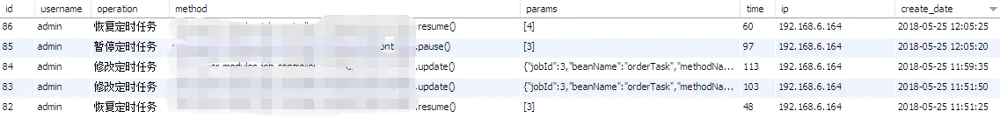

# spring aop的应用

[toc]

## 网上的例子

### Spring Boot中使用AOP记录请求日志
`https://www.cnblogs.com/junjiang3/p/9033038.html`

#### 一、AOP简介

AOP为Aspect Oriented Programming的缩写，意为：面向切面编程，通过预编译方式和运行期动态代理实现程序功能的统一维护的一种技术。AOP是Spring框架中的一个重要内容，

它通过对既有程序定义一个切入点，然后在其前后切入不同的执行内容，比如常见的有：打开数据库连接/关闭数据库连接、打开事务/关闭事务、记录日志等。基于AOP不会破坏原

来程序逻辑，因此它可以很好的对业务逻辑的各个部分进行隔离，从而使得业务逻辑各部分之间的耦合度降低，提高程序的可重用性，同时提高了开发的效率。

下面主要讲两个内容，一个是如何在Spring Boot中引入Aop功能，二是如何使用Aop做切面去统一处理Web请求的日志。

#### 二、准备工作
因为需要对web请求做切面来记录日志，所以先引入web模块，并创建一个简单的hello请求的处理。

pom.xml中引入web模块
```xml
<dependency>
    <groupId>org.springframework.boot</groupId>
    <artifactId>spring-boot-starter-web</artifactId>
</dependency>
```

实现一个简单请求处理：通过传入name参数，返回“hello xxx”的功能。
```java
@RestController
public class HelloController {

    @RequestMapping(value = "/hello", method = RequestMethod.GET)
    @ResponseBody
    public String hello(@RequestParam String name) {
        return "Hello " + name;
    }

}
```

下面，我们可以对上面的/hello请求，进行切面日志记录。

在Spring Boot中引入AOP就跟引入其他模块一样，非常简单，只需要在pom.xml中加入如下依赖：
```xml
<dependency>
    <groupId>org.springframework.boot</groupId>
    <artifactId>spring-boot-starter-aop</artifactId>
</dependency>
```

可以看下面关于AOP的默认配置属性，其中spring.aop.auto属性默认是开启的，也就是说只要引入了AOP依赖后，默认已经增加了@EnableAspectJAutoProxy。在完成了引入AOP

依赖包后，一般来说并不需要去做其他配置。也许在Spring中使用过注解配置方式的人会问是否需要在程序主类中增加@EnableAspectJAutoProxy来启用，实际并不需要。

```
# AOP
spring.aop.auto=true # Add @EnableAspectJAutoProxy.
spring.aop.proxy-target-class=false # Whether subclass-based (CGLIB) proxies are to be created (true) as
opposed to standard Java interface-based proxies (false).
```

#### 三、实现Web层的日志切面

而当我们需要使用CGLIB来实现AOP的时候，需要配置spring.aop.proxy-target-class=true，不然默认使用的是标准Java的实现。

实现AOP的切面主要有以下几个要素：
```
使用@Aspect注解将一个java类定义为切面类
使用@Pointcut定义一个切入点，可以是一个规则表达式，比如下例中某个package下的所有函数，也可以是一个注解等。
根据需要在切入点不同位置的切入内容
    使用@Before在切入点开始处切入内容
    使用@After在切入点结尾处切入内容
    使用@AfterReturning在切入点return内容之后切入内容（可以用来对处理返回值做一些加工处理）
    使用@Around在切入点前后切入内容，并自己控制何时执行切入点自身的内容
    使用@AfterThrowing用来处理当切入内容部分抛出异常之后的处理逻辑
```

```java
@Aspect
@Component
public class WebLogAspect {

    private Logger logger = Logger.getLogger(getClass());

    @Pointcut("execution(public * com.didispace.web..*.*(..))")
    public void webLog(){}

    @Before("webLog()")
    public void doBefore(JoinPoint joinPoint) throws Throwable {
        // 接收到请求，记录请求内容
        ServletRequestAttributes attributes = (ServletRequestAttributes) RequestContextHolder.getRequestAttributes();
        HttpServletRequest request = attributes.getRequest();

        // 记录下请求内容
        logger.info("URL : " + request.getRequestURL().toString());
        logger.info("HTTP_METHOD : " + request.getMethod());
        logger.info("IP : " + request.getRemoteAddr());
        logger.info("CLASS_METHOD : " + joinPoint.getSignature().getDeclaringTypeName() + "." + joinPoint.getSignature().getName());
        logger.info("ARGS : " + Arrays.toString(joinPoint.getArgs()));

    }

    @AfterReturning(returning = "ret", pointcut = "webLog()")
    public void doAfterReturning(Object ret) throws Throwable {
        // 处理完请求，返回内容
        logger.info("RESPONSE : " + ret);
    }

}
```

通过运行程序并访问：http://localhost:8080/hello?name=didi，可以获得下面的日志输出可以看上面的例子，通过@Pointcut定义的切入点为com.didispace.web包下的所有函数

（对web层所有请求处理做切入点），然后通过@Before实现，对请求内容的日志记录（本文只是说明过程，可以根据需要调整内容），最后通过@AfterReturning记录请求返回的对象。

```
2016-05-19 13:42:13,156  INFO WebLogAspect:41 - URL : http://localhost:8080/hello
2016-05-19 13:42:13,156  INFO WebLogAspect:42 - HTTP_METHOD : http://localhost:8080/hello
2016-05-19 13:42:13,157  INFO WebLogAspect:43 - IP : 0:0:0:0:0:0:0:1
2016-05-19 13:42:13,160  INFO WebLogAspect:44 - CLASS_METHOD : com.didispace.web.HelloController.hello
2016-05-19 13:42:13,160  INFO WebLogAspect:45 - ARGS : [didi]
2016-05-19 13:42:13,170  INFO WebLogAspect:52 - RESPONSE:Hello didi
```

#### 四、优化：AOP切面中的同步问题
在WebLogAspect切面中，分别通过doBefore和doAfterReturning两个独立函数实现了切点头部和切点返回后执行的内容，若我们想统计请求的处理时间，就需要在doBefore处记

录时间，并在doAfterReturning处通过当前时间与开始处记录的时间计算得到请求处理的消耗时间。

那么我们是否可以在WebLogAspect切面中定义一个成员变量来给doBefore和doAfterReturning一起访问呢？是否会有同步问题呢？

的确，直接在这里定义基本类型会有同步问题，所以我们可以引入ThreadLocal对象，像下面这样进行记录：

```java
@Aspect
@Component
public class WebLogAspect {

    private Logger logger = Logger.getLogger(getClass());

    ThreadLocal<Long> startTime = new ThreadLocal<>();

    @Pointcut("execution(public * com.didispace.web..*.*(..))")
    public void webLog(){}

    @Before("webLog()")
    public void doBefore(JoinPoint joinPoint) throws Throwable {
        startTime.set(System.currentTimeMillis());

        // 省略日志记录内容
    }

    @AfterReturning(returning = "ret", pointcut = "webLog()")
    public void doAfterReturning(Object ret) throws Throwable {
        // 处理完请求，返回内容
        logger.info("RESPONSE : " + ret);
        logger.info("SPEND TIME : " + (System.currentTimeMillis() - startTime.get()));
    }


}
```

#### 五、优化：AOP切面的优先级
由于通过AOP实现，程序得到了很好的解耦，但是也会带来一些问题，比如：我们可能会对Web层做多个切面，校验用户，校验头信息等等，这个时候经常会碰到切面的处理顺序问题。

所以，我们需要定义每个切面的优先级，我们需要@Order(i)注解来标识切面的优先级。i的值越小，优先级越高。假设我们还有一个切面是CheckNameAspect用来校验name必须为didi，

我们为其设置@Order(10)，而上文中WebLogAspect设置为@Order(5)，所以WebLogAspect有更高的优先级，这个时候执行顺序是这样的：

* 在@Before中优先执行@Order(5)的内容，再执行@Order(10)的内容   
* 在@After和@AfterReturning中优先执行@Order(10)的内容，再执行@Order(5)的内容  

所以我们可以这样子总结：

* 在切入点前的操作，按order的值由小到大执行  
* 在切入点后的操作，按order的值由大到小执行  

### springboot 自定义注解做权限验证
`https://www.phpsong.com/3866.html`

在做接口开发的时候，经常会遇到有些接口要处理权限验证，有些有不需要，一种方式是在filter去判断这个链接是否需要授权才能方式，今天用自定注解来处理一下

自定义注解ValidHeader
```java
@Target({ElementType.METHOD})
@Retention(RetentionPolicy.RUNTIME)
@Documented
public @interface ValidHeader {
}
```

写一个切片，使用切面对用户访问进行拦截，主要是拦截`execution(public * com.example.demo.controller.*.*(..))`并且包含了`@annotation(com.example.demo.annotation.ValidHeader)` 注解

```java
@Slf4j
@Aspect
@Component
public class ValidHeaderAspect {
 
    @Pointcut("execution(public * com.example.demo.controller.*.*(..)) && " +
            "@annotation(com.example.demo.annotation.ValidHeader)")
    public void valid() {
    }
 
    @Around("valid()")
    public Object Interceptor(ProceedingJoinPoint pjp) throws Throwable{
        log.info("权限校验-Around start");
        HttpServletRequest request = ((ServletRequestAttributes) RequestContextHolder.getRequestAttributes()).getRequest();
        String role = request.getParameter("role");
        if (StringUtils.isEmpty(role)) {
            throw new DemoException(ResultEnum.PARM_ERROR);
        }
        Object result = null;
 
        //放行到before方法
        result = pjp.proceed();
 
 
        log.info("权限校验-Around end");
        return result;
    }
 
/*    @Before("valid()")
    public void before(JoinPoint joinPoint) {
        Object[] args = joinPoint.getArgs();
        log.info("权限校验-before: arg={}",args);
    }
 
    @After("valid()")
    public void after(JoinPoint joinPoint) {
        Object[] args = joinPoint.getArgs();
        log.info("权限校验-after: arg={}",args);
    }*/
 
}
```

控制器使用,直接在要使用的请求上添加@ValidHeader注解
```java
@ValidHeader
@PostMapping("/test1")
public DemoVO test1(){
    return ResultUtil.success();
}
```
哪个请求上要添加授权就添加这个注解，比如电商平台，商品列表详情就不需要授权，订单用户模块就需要授权才能访问

完整的代码
https://github.com/QiuCarson/ValidHeader/tree/master

### JAVA自定义注解和AOP配合使用
`https://www.jianshu.com/p/309cc4fa348e`

```xml
// 对数据源进行管理
<tx:advice id="txAdvice" transaction-manager="transactionManager">
  <tx:attributes>
      <tx:method name="add*"     propagation="REQUIRED"  rollback-for="Exception" />
      <tx:method name="save*"    propagation="REQUIRED"  rollback-for="Exception" />
      <tx:method name="insert*"  propagation="REQUIRED"  rollback-for="Exception" />
      <tx:method name="update*"  propagation="REQUIRED"  rollback-for="Exception" />
      <tx:method name="modify*"  propagation="REQUIRED"  rollback-for="Exception" />
      <tx:method name="delete*"  propagation="REQUIRED"  rollback-for="Exception" />
      <tx:method name="remove*"  propagation="REQUIRED"  rollback-for="Exception" />
  </tx:attributes>
</tx:advice>

  <aop:config proxy-target-class="true">
      <aop:advisor pointcut="execution(* com.etc..service.impl.*ServiceImpl.*(..))" advice-ref="txAdvice" />
  </aop:config>
```

通过上面的配置，可以实现事务的处理，但是这个配置却非常不灵活，他限制了类必须在service层，其次，方法名必须以add、save、insert等开头，才能被切面管理到，如果不符合这些规则改怎么办呢？

新的需求：

在曾经的开发中遇到这样一个需求，系统中的部分业务方法在被调用到时，需要向log表插入日志，业务方法名没有规律，你不可能把所有的业务方法名都配置到上面，那么问题就来了，是否有一种语法可以在每个需要记录日志的方法中进行标识，让Spring AOP感知到，这就是下面要讲解的–自定义注解。

**以下是具体具体实现**

#### 注解代码
```java
package com.esurer.common.annotation;

import java.lang.annotation.Documented;
import java.lang.annotation.ElementType;
import java.lang.annotation.Retention;
import java.lang.annotation.RetentionPolicy;
import java.lang.annotation.Target;
/**
 * 系统日志注解
 * ClassName SysLog
 * @Function TODO
 * @date 2017年12月1日
 */
@Target(ElementType.METHOD)
@Retention(RetentionPolicy.RUNTIME)
@Documented
public @interface SysLog {

    String value() default "";
}

```

#### 切面代码
```java
package com.esurer.common.aspect;

import com.google.gson.Gson;
import com.esurer.common.annotation.SysLog;
import com.esurer.common.utils.HttpContextUtils;
import com.esurer.common.utils.IPUtils;
import com.esurer.modules.sys.entity.SysLogEntity;
import com.esurer.modules.sys.entity.SysUserEntity;
import com.esurer.modules.sys.service.SysLogService;
import org.apache.shiro.SecurityUtils;
import org.aspectj.lang.ProceedingJoinPoint;
import org.aspectj.lang.annotation.Around;
import org.aspectj.lang.annotation.Aspect;
import org.aspectj.lang.annotation.Pointcut;
import org.aspectj.lang.reflect.MethodSignature;
import org.springframework.beans.factory.annotation.Autowired;
import org.springframework.stereotype.Component;

import javax.servlet.http.HttpServletRequest;
import java.lang.reflect.Method;
import java.util.Date;
/**
 * 系统日志，切面处理类
 * ClassName SysLogAspect
 * @Function TODO
 * @date 2017年12月1日
 */
@Aspect
@Component
public class SysLogAspect {
    @Autowired
    private SysLogService sysLogService;
    
    @Pointcut("@annotation(com.esurer.common.annotation.SysLog)")
    public void logPointCut() { 
        
    }

    @Around("logPointCut()")
    public Object around(ProceedingJoinPoint point) throws Throwable {
        long beginTime = System.currentTimeMillis();
        //执行方法
        Object result = point.proceed();
        //执行时长(毫秒)
        long time = System.currentTimeMillis() - beginTime;

        //保存日志
        saveSysLog(point, time);

        return result;
    }

    private void saveSysLog(ProceedingJoinPoint joinPoint, long time) {
        MethodSignature signature = (MethodSignature) joinPoint.getSignature();
        Method method = signature.getMethod();

        SysLogEntity sysLog = new SysLogEntity();
        SysLog syslog = method.getAnnotation(SysLog.class);
        if(syslog != null){
            //注解上的描述
            sysLog.setOperation(syslog.value());
        }

        //请求的方法名
        String className = joinPoint.getTarget().getClass().getName();
        String methodName = signature.getName();
        sysLog.setMethod(className + "." + methodName + "()");

        //请求的参数
        Object[] args = joinPoint.getArgs();
        try{
            String params = new Gson().toJson(args[0]);
            sysLog.setParams(params);
        }catch (Exception e){

        }

        //获取request
        HttpServletRequest request = HttpContextUtils.getHttpServletRequest();
        //设置IP地址
        sysLog.setIp(IPUtils.getIpAddr(request));

        //用户名
        String username = ((SysUserEntity) SecurityUtils.getSubject().getPrincipal()).getUsername();
        sysLog.setUsername(username);

        sysLog.setTime(time);
        sysLog.setCreateDate(new Date());
        //保存系统日志
        sysLogService.save(sysLog);
    }
}
```

#### 使用切面的代码
```java
    /**
     * 修改登录用户密码
     */
    @SysLog("修改密码")
    @RequestMapping("/password")
    public R password(String password, String newPassword){
        Assert.isBlank(newPassword, "新密码不为能空");
        
        //sha256加密
        password = new Sha256Hash(password, getUser().getSalt()).toHex();
        //sha256加密
        newPassword = new Sha256Hash(newPassword, getUser().getSalt()).toHex();
                
        //更新密码
        int count = sysUserService.updatePassword(getUserId(), password, newPassword);
        if(count == 0){
            return R.error("原密码不正确");
        }
        
        return R.ok();
    }
```

数据库日志记录:


#### 总结
通过上面代码，我们可以看到，只要我们在期望记录日志的方法上增加@LogOperation注解，该方法的动作就会被记录进日志表，不管方法叫什么名字，类在什么位置，都可以轻松的解决，而且没有代码入侵，期望本篇博客对大家有所帮助。

## 我的aop测试

### 使用execution拦截所有controller
```java
package com.poetry.config;

import org.aspectj.lang.JoinPoint;
import org.aspectj.lang.ProceedingJoinPoint;
import org.aspectj.lang.annotation.*;
import org.slf4j.Logger;
import org.slf4j.LoggerFactory;
import org.springframework.stereotype.Component;
import org.springframework.web.context.request.RequestContextHolder;
import org.springframework.web.context.request.ServletRequestAttributes;

import javax.servlet.http.HttpServletRequest;
import java.util.Arrays;

//测试aop：使用aop记录每一个请求
@Aspect
@Component
public class HttpAspect {
    private static final Logger logger = LoggerFactory.getLogger(HttpAspect.class);
    private ThreadLocal<Long> startTime = new ThreadLocal<>();

    @Pointcut("execution(public * com.poetry.controller.*.*(..))")
    public void log() {

    }

    @Before("log()")
    public void doBefore(JoinPoint joinPoint) {
        startTime.set(System.currentTimeMillis());
        ServletRequestAttributes attributes = (ServletRequestAttributes) RequestContextHolder.getRequestAttributes();
        HttpServletRequest request = attributes.getRequest();
        //url
        logger.warn("url:{}", request.getRequestURL());
        //method
        logger.warn("method:{}", request.getMethod());
        //ip
        logger.warn("ip:{}", request.getRemoteAddr());
        //类方法
        logger.warn("class_method:{}", joinPoint.getSignature().getDeclaringTypeName() + "." + joinPoint.getSignature().getName());
        //参数(joinPoint.getArgs()返回一个参数数组)
        logger.warn("args:{}", Arrays.asList(joinPoint.getArgs()));
    }

    @AfterReturning(returning = "object", pointcut = "log()")
    public void doAfterReturning(Object object) {
        logger.warn("response:{}", object.toString());
        logger.warn("SPEND TIME : " + (System.currentTimeMillis() - startTime.get()));
    }

    @Around("log()")
    public Object doAround(ProceedingJoinPoint pjp) throws Throwable{
        long begin = System.currentTimeMillis();

        ServletRequestAttributes attributes = (ServletRequestAttributes) RequestContextHolder.getRequestAttributes();
        HttpServletRequest request = attributes.getRequest();

        //url
        logger.warn("url:{}", request.getRequestURL());
        //method
        logger.warn("method:{}", request.getMethod());
        //ip
        logger.warn("ip:{}", request.getRemoteAddr());
        //类方法
        logger.warn("class_method:{}", pjp.getSignature().getDeclaringTypeName() + "." + pjp.getSignature().getName());
        //参数(joinPoint.getArgs()返回一个参数数组)
        logger.warn("args:{}", Arrays.asList(pjp.getArgs()));


        // 如果需要使用异常捕获AfterThrowing，此处的异常一改抛出，不能try catch
        Object result = pjp.proceed();
        //此处对返回值的修改是有效的
        //result = new Result(StatusCode.OK, true, "查询成功");

        logger.warn("response:{}", result.toString());
        logger.warn("SPEND TIME : " + (System.currentTimeMillis() - begin));

        return result;
    }

}
```

### 自定义注解拦截特定方法
#### 自定义注解
```java
package com.poetry.annotation;

import java.lang.annotation.*;

@Target(ElementType.METHOD)
@Retention(RetentionPolicy.RUNTIME)
@Documented
public @interface SysLog {
    String value() default "";
}
```

#### 切面
```java
package com.poetry.config;

import com.poetry.annotation.SysLog;
import org.aspectj.lang.ProceedingJoinPoint;
import org.aspectj.lang.Signature;
import org.aspectj.lang.annotation.Around;
import org.aspectj.lang.annotation.Aspect;
import org.aspectj.lang.annotation.Pointcut;
import org.aspectj.lang.reflect.MethodSignature;
import org.slf4j.Logger;
import org.slf4j.LoggerFactory;
import org.springframework.stereotype.Component;

import java.lang.reflect.Method;

//测试aop：基于自定义注解
@Aspect
@Component
public class SysLogAspect {
    private static final Logger logger = LoggerFactory.getLogger(SysLogAspect.class);

    @Pointcut("@annotation(com.poetry.annotation.SysLog)")
    public void logPointCut() {

    }

    @Around("logPointCut()")
    public Object around(ProceedingJoinPoint point) throws Throwable {
        long beginTime = System.currentTimeMillis();
        //执行方法
        Object result = point.proceed();
        //执行时长(毫秒)
        long time = System.currentTimeMillis() - beginTime;

        //保存日志
        saveSysLog(point, time);

        return result;
    }

    private void saveSysLog(ProceedingJoinPoint joinPoint, long time) {
        Signature signature = joinPoint.getSignature();
        MethodSignature methodSignature = (MethodSignature) signature;
        Method method = methodSignature.getMethod();
        SysLog syslog = method.getAnnotation(SysLog.class);
        String desc = "";
        if(syslog != null){
            //注解上的描述
            desc = syslog.value();
        }

        //请求的方法名
        //String className = joinPoint.getTarget().getClass().getName();
        String className = signature.getDeclaringTypeName();
        String methodName = signature.getName();

        //请求的参数
        //Object[] args = joinPoint.getArgs();

        logger.warn("执行操作：{}({}),耗时：{}", desc, className + "." + methodName, time);
        System.out.println(String.format("执行操作：%s(%s),耗时：%d",desc, joinPoint.getTarget().getClass().getName() + "." + methodName, time));
    }
}
```

#### 使用注解
```java
package com.poetry.service;

import com.common.entity.PageResult;
import com.poetry.annotation.SysLog;
import com.poetry.dao.PoemRepository;
import com.poetry.pojo.Poem;
import com.poetry.spider.CollectSpider;
import org.springframework.beans.factory.annotation.Autowired;
import org.springframework.data.domain.Example;
import org.springframework.data.domain.Page;
import org.springframework.data.domain.PageRequest;
import org.springframework.stereotype.Service;

import java.util.List;
import java.util.Optional;

@Service
public class PoemService {

    @Autowired
    private PoemRepository poemRepository;
    
    ...

    @SysLog("分页查询Poem")
    public PageResult<Poem> findPageByExample(Poem poem, int page, int size) {
        Example<Poem> example = Example.of(poem);
        PageRequest pageRequest = PageRequest.of(page - 1, size);
        Page<Poem> pageBean = poemRepository.findAll(example, pageRequest);
        return new PageResult<>(pageBean.getTotalElements(), pageBean.getContent());
    }

    @SysLog("通过作者查询Poem")
    public List<Poem> findByAuthor(String auther){
        return poemRepository.findByAuthor(auther);
    }

    ...
}
```


```xml

```

```java

```

