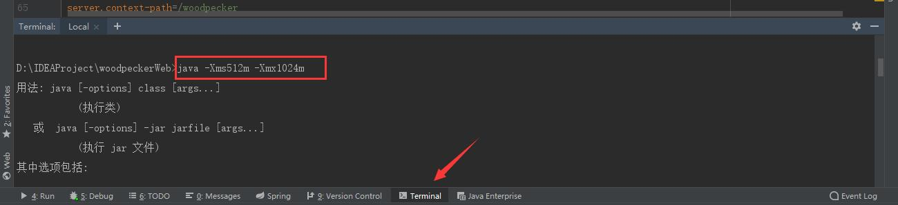

# 文件上传
https://blog.csdn.net/qq_24065713/article/details/87194041

## 一、要求


1、表单的提交方式为post


2、表单的enctype必须设置为multipart/form-data


3、每一个文件控件的必须有一个name属性


4、文件上传的目标一般为服务器的web-info或者服务器所在主机磁盘（非项目目录）


## 二、Smartupload，


文件上传时，是直接将文件加载在内存中，所以上传大文件时很容易内存溢出


## 三、Commons-Filupload，


是Apache开源项目，利用磁盘指定位置作为临时文件，而不是一次性加载内存中，上传完成后会清空文件，common-fileupload为推荐上传组件（strus2框架默认支持，servlet3.0作为一个模块）


非servlet3.0的项目使用时，需要导包。


## 四、servlet3.0方式


```java
@WebServlet(urlPatterns = "/test/UploadServlet")
 
@MultipartConfig(location = "D:\\test"
 
// ，fileSizeThreshold = 10240,
 
// maxFileSize = 10240000L,
 
// maxRequestSize = 102400000000L
 
)
```


//设置临时文件的存储目录，内存缓存最大限制，允许上传的单个文件最大值，允许提交的表单数据总大小


```java
public class UploadServlet extends HttpServlet {
 
    protected void doPost(HttpServletRequest request, HttpServletResponse response) throws ServletException, IOException {
 
        Part part=request.getPart("myfile");//表单的file组件的name属性,
 
        String fname = part.getSubmittedFileName();//获得上传文件名称
 
        part.write("D:\\test\\"+fname);//将数据保存到指定文件中
 
    }
 
    protected void doGet(HttpServletRequest request, HttpServletResponse response) throws ServletException, IOException {
 
        doPost(request,response);
 
    }
 
}
```


//=========================


```java
<form action="/test/UploadServlet" method="post" id="f" enctype="multipart/form-data" name="myform">
 
<div class="input-group">
 
<input type="file" name="myfile">
 
</div>
 
<button class="btn-primary">提交</button>
 
</form>
 
```

# 上传文件导致OOM
https://blog.csdn.net/u013813491/article/details/121018333

背景：使用hutool工具进行文件上传。

直接上代码：


```java
	<dependency>
       <groupId>cn.hutool</groupId>
        <artifactId>hutool-all</artifactId>
        <version>5.1.0</version>
    </dependency>

```

```java
	import cn.hutool.http.HttpRequest;
	import java.io.File;
	import java.util.*;
	//……
	String urlString = "……/upload";
	Map<String, Object> paramMap = new HashMap<>();
	File file = new File("D:\\soft\\Anaconda3-2021.05-Windows-x86_64.exe");
	paramMap.put("file", file);
	HttpRequest.post(urlString).form(paramMap).timeout(60*1000).execute().body();

```


当文件比较大的时候，就引发了OOM异常。


经过查阅HttpRequest源码发现它有一个字段：blockSize（Chuncked块大小，0或小于0表示不设置Chuncked模式），最终是设置到java.net.HttpURLConnection的chunkLength字段中。


Chuncked模式，即分块传输模式，


因此设置该值大于0即可解决该OOM问题。


附测试demo：

pom.xml:


```java
<?xml version="1.0" encoding="UTF-8"?>
<project xmlns="http://maven.apache.org/POM/4.0.0"
         xmlns:xsi="http://www.w3.org/2001/XMLSchema-instance"
         xsi:schemaLocation="http://maven.apache.org/POM/4.0.0 http://maven.apache.org/xsd/maven-4.0.0.xsd">
    <modelVersion>4.0.0</modelVersion>

    <groupId>cn.sky</groupId>
    <artifactId>mytest</artifactId>
    <version>1.0-SNAPSHOT</version>

    <properties>
        <maven.compiler.source>8</maven.compiler.source>
        <maven.compiler.target>8</maven.compiler.target>
    </properties>
    <parent>
        <groupId>org.springframework.boot</groupId>
        <artifactId>spring-boot-starter-parent</artifactId>
        <version>2.1.3.RELEASE</version>
    </parent>

    <dependencies>
        <dependency>
            <groupId>org.springframework.boot</groupId>
            <artifactId>spring-boot-starter-web</artifactId>
            <version>2.2.2.RELEASE</version>
        </dependency>
        <dependency>
            <groupId>cn.hutool</groupId>
            <artifactId>hutool-all</artifactId>
            <version>5.1.0</version>
        </dependency>
        <dependency>
            <groupId>com.konghq</groupId>
            <artifactId>unirest-java</artifactId>
            <version>3.11.12</version>
        </dependency>
        <dependency>
            <groupId>com.alibaba</groupId>
            <artifactId>fastjson</artifactId>
            <version>1.2.78</version>
        </dependency>
        <dependency>
            <groupId>com.squareup.okhttp3</groupId>
            <artifactId>okhttp</artifactId>
            <version>3.13.1</version>
        </dependency>
    </dependencies>
</project>

```


MyController:


```java
package cn.sky.mytest.controller;

import cn.hutool.http.HttpRequest;
import com.alibaba.fastjson.JSON;
import kong.unirest.HttpResponse;
import kong.unirest.Unirest;
import okhttp3.*;
import okhttp3.RequestBody;
import org.springframework.web.bind.annotation.*;
import org.springframework.web.multipart.MultipartFile;

import java.io.File;
import java.io.IOException;
import java.util.*;

@RequestMapping("/myController")
@RestController
public class MyController {

    @PostMapping("/upload")
    public Object upload(@RequestParam(value = "file") MultipartFile file){
        System.out.println(file.getOriginalFilename()+":"+(file.getSize()/1024/1024)+"M");
        return "ok";
    }

    @GetMapping("/test")
    public Object test(int type) throws IOException {
        String urlString = "http://localhost:8080/myController/upload";
        Map<String, Object> paramMap = new HashMap<>();
        File file = new File("D:\\soft\\Anaconda3-2021.05-Windows-x86_64.exe");
        paramMap.put("file", file);
        if(type==1) {
            int blockSize = 1024*10;
            String body = HttpRequest.post(urlString)
                    /**
                     * 采用流方式上传数据，无需本地缓存数据。
                     * HttpUrlConnection默认是将所有数据读到本地缓存，然后再发送给服务器，这样上传大文件时就会导致内存溢出。
                     * blockSize – 块大小（bytes数），0或小于0表示不设置Chuncked模式
                     */
                    .setChunkedStreamingMode(blockSize)
                    .form(paramMap).timeout(60*1000).execute().body();
            System.out.println(body);
        }else if(type==2){
            String body = HttpRequest.post(urlString).form(paramMap).timeout(60*1000).execute().body();
            System.out.println(body);
        }else if(type==3){
            HttpResponse<String> stringHttpResponse = Unirest.post(urlString).fields(paramMap).asString();
            System.out.println(stringHttpResponse.getStatus()+":"+stringHttpResponse.getBody());
        }else if(type==4){
            OkHttpClient client = new OkHttpClient().newBuilder()
                    .build();
            MediaType mediaType = MediaType.parse("text/plain");
            RequestBody body = new MultipartBody.Builder().setType(MultipartBody.FORM)
                    .addFormDataPart("file",file.getName(),RequestBody.create(MediaType.parse("application/octet-stream"),file))
                    .build();
            Request request = new Request.Builder()
                    .url(urlString)
                    .method("POST", body)
                    .build();
            Response response = client.newCall(request).execute();
            System.out.println(JSON.toJSONString(response));
        }
        return "ok";
    }

}


```


application.properties:


```java
server.port=8080
#需要设置这个，否则文件太大会上传失败
spring.servlet.multipart.max-file-size = 1073741824
spring.servlet.multipart.max-request-size = 1073741824

```


启动脚本（限制内存为100M）：


```java
mvn spring-boot:run -Dspring-boot.run.jvmArguments="-Xmx100M -Xms100M"


```


访问地址：http://localhost:8080/myController/test?type=

type可为1,2,3,4，堆内存使用情况如下（文件为477M）：

type=1:


type=2:


type=3:


type=4:


# 记使用MULTIPARTFILE上传文件引发的OOM错误
https://www.freesion.com/article/84701100960/

## 异常情况


上传50M左右的文件时正常，当文件较大到100M时引发oom。异常如下：


```java
异常org.springframework.web.util.NestedServletException: Handler dispatch failed; nested exception is java.lang.OutOfMemoryError: Java heap space
```


由异常可知，触发的异常是堆栈溢出。简单点说就是超过了jvm的运行内存。经过代码跟踪发现有一下两种解决办法。


## 解决1


这种办法只是一种治标办法，既然是堆栈溢出，我们可以通过调整jvm的运行空间大小，配合后端和前端的文件上传大小限制达到避免异常。


调整jvm（我的项目使用的是springboot）（xms表示初始大小，xmx表示最大，根据具体需求设置）。





或者


## 解决2


问题代码：


问题跟踪发现主要是上面标记的代码getBytes()这里，这里获取整个文件大小的字节数，当文件较大时就容易造成oom。所以应该使用MultipartFile的transferTo方法，该方法直接转存到了某个路径（emmm没错就是菜，走弯路）。修正后的代码：


测试后发现300左右的文件正常上传，没有测太大的文件，业务需求这个大小够了，就把文件大小限制在了200M。

# 记一次生产环境因 SpringBoot 大文件下载导致的 OOM 事故

## 一、事故发生


上周五下午运营人员反馈，笔者所负责的后台系统从 14 点以后就卡卡的，虽然页面能够正常加载，但是一直处于数据加载中，数据也提交不了，怀疑笔者的系统有 BUG，当听到运营人员的反馈我的第一反应是这不可能啊，这么简单的一个后台系统，还能出事故？


## 二、处理流程


### 1. 摘除其中一台服务器用于保留现场，其他服务器先重启，保证系统可用。


### 2. 下载 GC 日志，系统 dump 文件用于分析


## 三、GC log 分析


系统启动参数，JVM 内存分配：-Xmx4096m -Xms4096m -Xmn2560m


观察日志可知系统每隔 40S 发生一次 Full GC，耗时 200 毫秒，回收以后系统老年代占用也不大，才 15M，但是新生代回收完还有 2 个 G。


有点不可思议，竟然不是老年代塞满了数据，而是新生代塞满了数据。

> 
初步推测是新生代数据要晋升到老年代，结果放不进去而引起的 Full GC。


## 四、使用 EclipseMAT 对 Dump 文件进行分析

> 

通过总图可以看出来目前系统内存占用超过 2 个 G


> 

点击 Histogram 进行进一步分析，看出系统中占用最多的是 byte []


> 

点击 List Objects 进入 income 引用统计界面


> 

层层点开，发现 byte [] 被 ResponseEntity 对象所引用，且数量不小


## 五、翻阅代码


### 1. 在系统中找到唯一 ResponseEntity 有关的代码


### 2. 这代码看似没什么问题啊，这不是很正常的文件下载么？？？我去看看用户下载了啥，跑到目录文件查看一下下。


我的天，用户下载的是一份**2.4G**的大文件，代码中 FileUtils.readFileToByteArray (file) 的方式是把整个文件读取到内存再输出流里写入，此时内存不够分配，又塞不进老年代，只能是 Full GC 了。


### 3. 成功破案了，用户下载了一份大文件，文件先加载到内存才往外写，抹泪。。。。


## 六、解决方案


### 1. 使用 FileSystemResource


```java
@GetMapping("/down")
public ResponseEntity<FileSystemResource> download(@RequestParam("uri") String uri) throws IOException {
    File file = new File(uri);
    if (!file.isFile()) {
        throw new ServiceException("文件不存在");
    }

	String filename = FilenameUtils.getName(uri);
    HttpHeaders headers = new HttpHeaders();
    headers.add("Content-Disposition", "attachment;filename=" + URLEncoder.encode(filename, "UTF-8"));
    HttpStatus status = HttpStatus.OK;
    return new ResponseEntity<>(new FileSystemResource(file), headers, status);
}

```


### 2. 使用缓存流，边读边写


```
@GetMapping("/down")
public void download(@RequestParam("uri") String uri, HttpServletResponse response) throws IOException {
    File file = new File(uri);
    if (!file.isFile()) {
        throw new ServiceException("文件不存在");
    }

    String filename = FilenameUtils.getName(uri);
    response.setHeader("Content-Disposition", "attachment;filename=" + URLEncoder.encode(filename, "UTF-8"));

    try (FileInputStream fileInputStream = new FileInputStream(file);
         BufferedInputStream bufferedInputStream = new BufferedInputStream(fileInputStream);
         BufferedOutputStream bufferedOutputStream = new BufferedOutputStream(response.getOutputStream())) {
        FileCopyUtils.copy(bufferedInputStream, bufferedOutputStream);
    } finally {
        // 使用的是try-with-resources
    }
}

```


### 3. 文件存储到 oss 或者是七牛云，绕过服务器下载等方式


## 七、复盘

> 
慎重的提醒大家，不要小看文件上传下载！


# 关于SpringBoot大文件RestTemplate下载解决方案
近期基于项目上使用到的RestTemplate下载文件流，遇到1G以上的大文件，下载需要3-4分钟，因为调用API接口没有做分片与多线程， 文件流全部采用同步方式加载，性能很慢。最近结合网上案例及自己总结，写了一个分片下载tuling/fileServer项目： 1.包含同步下载文件流在浏览器加载输出相关代码； 2.包含分片多线程下载分片文件及合并文件相关代码；

另外在DownloadThread项目中使用代码完成了一个远程RestUrl请求去获取一个远端资源大文件进行多线程分片下载 到本地的一个案例，可以下载一些诸如.mp4/.avi等视频类大文件。相关代码也一并打包上传。

同步下载，支持分片下载Range主要代码：

```java
@Controller
public class DownLoadController {
    private static final String UTF8 = "UTF-8";
    @RequestMapping("/download")
    public void downLoadFile(HttpServletRequest request, HttpServletResponse response) throws IOException {
        File file = new File("D:\\DevTools\\ideaIU-2021.1.3.exe");
        response.setCharacterEncoding(UTF8);
        InputStream is = null;
        OutputStream os = null;
        try {
            // 分片下载 Range表示方式 bytes=100-1000  100-
            long fSize = file.length();
            response.setContentType("application/x-download");
            String fileName = URLEncoder.encode(file.getName(), UTF8);
            response.addHeader("Content-Disposition", "attachment;filename=" + fileName);
            // 支持分片下载
            response.setHeader("Accept-Range", "bytes");
            response.setHeader("fSize", String.valueOf(fSize));
            response.setHeader("fName", fileName);
 
            long pos = 0, last = fSize - 1, sum = 0;
            if (null != request.getHeader("Range")) {
                response.setStatus(HttpServletResponse.SC_PARTIAL_CONTENT);
                String numberRange = request.getHeader("Range").replaceAll("bytes=", "");
                String[] strRange = numberRange.split("-");
                if (strRange.length == 2) {
                    pos = Long.parseLong(strRange[0].trim());
                    last = Long.parseLong(strRange[1].trim());
                    if (last > fSize-1) {
                        last = fSize - 1;
                    }
                } else {
                    pos = Long.parseLong(numberRange.replaceAll("-", "").trim());
                }
            }
            long rangeLength = last - pos + 1;
            String contentRange = new StringBuffer("bytes").append(pos).append("-").append(last).append("/").append(fSize).toString();
            response.setHeader("Content-Range", contentRange);
            response.setHeader("Content-Length", String.valueOf(rangeLength));
 
            os = new BufferedOutputStream(response.getOutputStream());
            is = new BufferedInputStream(new FileInputStream(file));
            is.skip(pos);
            byte[] buffer = new byte[1024];
            int length = 0;
            while (sum < rangeLength) {
                int readLength = (int) (rangeLength - sum);
                length = is.read(buffer, 0, (rangeLength - sum) <= buffer.length ? readLength : buffer.length);
                sum += length;
                os.write(buffer,0, length);
            }
            System.out.println("下载完成");
        }finally {
            if (is != null){
                is.close();
            }
            if (os != null){
                os.close();
            }
        }
    }
}
```

多线程分片下载分片文件，下载完成之后合并分片主要代码：
```java
@RestController
public class DownloadClient {
    private static final Logger LOGGER = LoggerFactory.getLogger(DownloadClient.class);
    private final static long PER_PAGE = 1024L * 1024L * 50L;
    private final static String DOWN_PATH = "F:\\fileItem";
    ExecutorService taskExecutor = Executors.newFixedThreadPool(10);
 
    @RequestMapping("/downloadFile")
    public String downloadFile() {
        // 探测下载
        FileInfo fileInfo = download(0, 10, -1, null);
        if (fileInfo != null) {
            long pages =  fileInfo.fSize / PER_PAGE;
            for (long i = 0; i <= pages; i++) {
                Future<FileInfo> future = taskExecutor.submit(new DownloadThread(i * PER_PAGE, (i + 1) * PER_PAGE - 1, i, fileInfo.fName));
                if (!future.isCancelled()) {
                    try {
                        fileInfo = future.get();
                    } catch (InterruptedException | ExecutionException e) {
                        e.printStackTrace();
                    }
                }
            }
            return System.getProperty("user.home") + "\\Downloads\\" + fileInfo.fName;
        }
        return null;
    }
 
    class FileInfo {
        long fSize;
        String fName;
 
        public FileInfo(long fSize, String fName) {
            this.fSize = fSize;
            this.fName = fName;
        }
    }
 
    /**
     * 根据开始位置/结束位置
     * 分片下载文件，临时存储文件分片
     * 文件大小=结束位置-开始位置
     *
     * @return
     */
    private FileInfo download(long start, long end, long page, String fName) {
        File dir = new File(DOWN_PATH);
        if (!dir.exists()) {
            dir.mkdirs();
        }
        // 断点下载
        File file = new File(DOWN_PATH, page + "-" + fName);
        if (file.exists() && page != -1 && file.length() == PER_PAGE) {
            return null;
        }
        try {
            HttpClient client = HttpClients.createDefault();
            HttpGet httpGet = new HttpGet("http://127.0.0.1:8080/download");
            httpGet.setHeader("Range", "bytes=" + start + "-" + end);
            HttpResponse response = client.execute(httpGet);
            String fSize = response.getFirstHeader("fSize").getValue();
            fName = URLDecoder.decode(response.getFirstHeader("fName").getValue(), "UTF-8");
            HttpEntity entity = response.getEntity();
            InputStream is = entity.getContent();
            FileOutputStream fos = new FileOutputStream(file);
            byte[] buffer = new byte[1024];
            int ch;
            while ((ch = is.read(buffer)) != -1) {
                fos.write(buffer, 0, ch);
            }
            is.close();
            fos.flush();
            fos.close();
            // 最后一个分片
            if (end - Long.parseLong(fSize) > 0) {
                // 开始合并文件
                mergeFile(fName, page);
            }
 
            return new FileInfo(Long.parseLong(fSize), fName);
        } catch (IOException e) {
            e.printStackTrace();
        }
        return null;
    }
 
    private void mergeFile(String fName, long page) {
        File file = new File(DOWN_PATH, fName);
        try {
            BufferedOutputStream os = new BufferedOutputStream(new FileOutputStream(file));
            for (long i = 0; i <= page; i++) {
                File tempFile = new File(DOWN_PATH, i + "-" + fName);
                while (!file.exists() || (i != page && tempFile.length() < PER_PAGE)) {
                    try {
                        Thread.sleep(100);
                    } catch (InterruptedException e) {
                        e.printStackTrace();
                    }
                }
                byte[] bytes = FileUtils.readFileToByteArray(tempFile);
                os.write(bytes);
                os.flush();
                tempFile.delete();
            }
            File testFile = new File(DOWN_PATH, -1 + "-null");
            testFile.delete();
            os.flush();
            os.close();
        } catch (IOException e) {
            e.printStackTrace();
        }
    }
 
    /**
     * 获取远程文件尺寸
     */
    private long getRemoteFileSize(String remoteFileUrl) throws IOException {
        long fileSize = 0;
        HttpURLConnection httpConnection = (HttpURLConnection) new URL(remoteFileUrl).openConnection();
        //使用HEAD方法
        httpConnection.setRequestMethod("HEAD");
        int responseCode = httpConnection.getResponseCode();
        if (responseCode >= 400) {
            LOGGER.debug("Web服务器响应错误!");
            return 0;
        }
        String sHeader;
        for (int i = 1;; i++) {
            sHeader = httpConnection.getHeaderFieldKey(i);
            if (sHeader != null && sHeader.equals("Content-Length")) {
                LOGGER.debug("文件大小ContentLength:" + httpConnection.getContentLength());
                fileSize = Long.parseLong(httpConnection.getHeaderField(sHeader));
                break;
            }
        }
        return fileSize;
    }
 
    class DownloadThread implements Callable<FileInfo> {
        long start;
        long end;
        long page;
        String fName;
 
        public DownloadThread(long start, long end, long page, String fName) {
            this.start = start;
            this.end = end;
            this.page = page;
            this.fName = fName;
        }
 
        @Override
        public FileInfo call() {
            return download(start, end, page, fName);
        }
    }
}
```

代码都在本地亲测（已修复Bug）可用，目前比较欠缺的是没有实现在分片下载时对应浏览器进行下载展示，需要暂存在本地磁盘目录。 目前将代码开源，希望能有更好解决方案的Coder Fork支持！也欢迎Star捧场。


博文参考了图灵学院相关的分片下载案例教程，并修改了部分代码实现：


[WebUploader--基于SpringBoot搭建，Java文件上传下载高阶实战](https://www.bilibili.com/video/BV1Cb4y1y7tT?p=7 "WebUploader--基于SpringBoot搭建，Java文件上传下载高阶实战")


本文代码已上传至GitHub：


[BurstDownload](https://github.com/devyf/BurstDownload "BurstDownload")


到此这篇关于SpringBoot大文件RestTemplate下载解决方案的文章就介绍到这了,更多相关SpringBoot RestTemplate下载内容请搜索我们以前的文章或继续浏览下面的相关文章希望大家以后多多支持我们！
