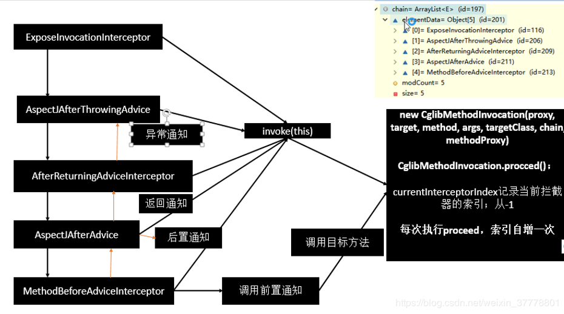
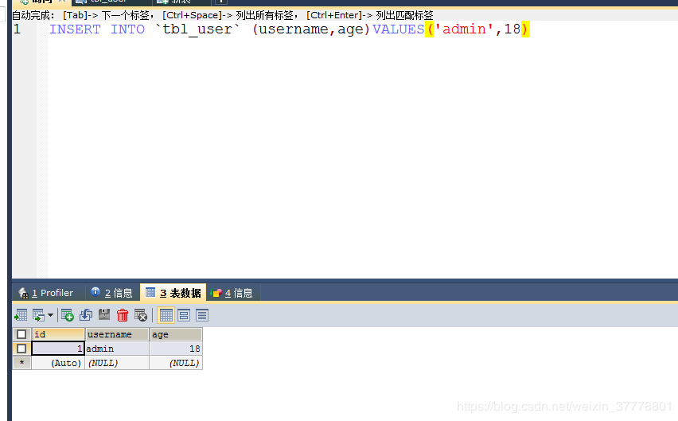
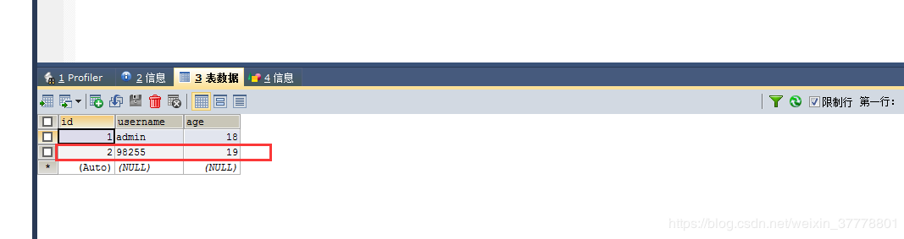
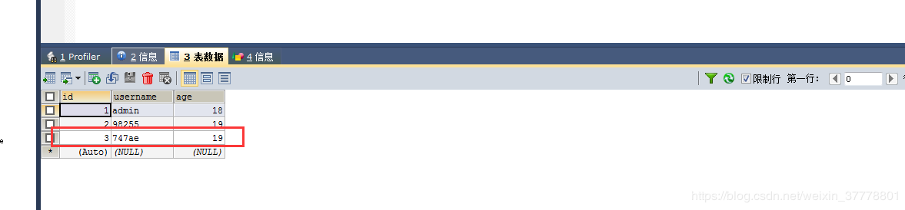

# Spring注解驱动开发（四）

## AOP-AOP功能测试
AOP:【动态代理】
能在程序运行期间动态的将某段代码片段切入到指定的方法指定位置进行运行的编程方式；

```
1、导入aop模块，Spring AOP：(spring-aspects)
2、定义一个业务逻辑类（MathCalculator），在业务逻辑运行的时候将日志进行打印（方法之前、方法运行结束、包括方法出现异常等等）
3、定义一个日志切面类（LogAspects）：切面类里面的方法需要动态感知MathCalculator.div运行到哪里了然后执行
切面类里面的方法就是通知方法：
    （1）前置通知（@Before）：logStart，在目标方法（div）运行之前运行
    （2）后置通知（@After）：logEnd，在目标方法（div）运行之前运行
    （3）返回通知（@AfterReturning）：logReturn，在目标方法（div）执行返回（无论是正常返回还是异常返回）之后运行
    （4）异常通知（@AfterThrowing）：logException，在目标方法（div）出现异常之后运行
    （5）环绕通知（@Around）：动态代理，手动推进目标方法运行（joinPoint.procced()）
4、给切面类的目标方法标注何时何地运行（通知注解）
5、将切面类和业务逻辑类（目标方法所在的类）都加入到容器中；
6、必须要告诉Spring哪一个类是切面类（只要给切面类上加上一个注解：@Aspect）
7、给配置类中加入@EnableAspectJAutoProxy：开启基于注解的aop模式
```

加入AOP核心jar包：
```xml
<dependency>
    <groupId>org.springframework</groupId>
    <artifactId>spring-aspects</artifactId>
    <version>4.3.12.RELEASE</version>
</dependency>
```

首先，我们要写一个目标类：
```java
public class MathCalculator {
    //除法
    public int div(int i, int j) {
        System.out.println("MathCalculator...div...");
        return i / j;
    }
}
```

再来一个切面类：
```java
//告诉Spring当前类是一个切面类
@Aspect
public class LogAspects {

    //抽取公共的切入点表达式
    //本类引用：pointCut()
    //其他的切面类要引用
    @Pointcut("execution(public int com.ldc.aop.MathCalculator.*(..))")
    public void pointCut() {

    }

    //@Before在目标方法之前切入：切入点表达式（指定在哪个方法切入）
    @Before("pointCut()")
    public void logStart() {
        System.out.println("除法运行...参数列表是：{}");
    }

    @After("pointCut()")
    public void logEnd() {
        System.out.println("除法结束...");
    }

    @AfterReturning("pointCut()")
    public void logReturn() {
        System.out.println("除法正常返回...运行结果为：{}");
    }
    @AfterThrowing("pointCut()")
    public void logException() {
        System.out.println("除法异常...异常信息为：{}");
    }
}
```

我们再来写一个配置类 ，把上面这两个类加入到IOC容器中，并且通过@EnableAspectJAutoProxy注解开启基于注解的aop模式
```java
/**
 *  AOP:【动态代理】
 *      能在程序运行期间动态的将某段代码片段切入到指定的方法指定位置进行运行的编程方式；
 *
 *  1、导入aop模块，Spring AOP：(spring-aspects)
 *  2、定义一个业务逻辑类（MathCalculator），在业务逻辑运行的时候将日志进行打印（方法之前、方法运行结束、包括方法出现异常等等）
 *  3、定义一个日志切面类（LogAspects）：切面类里面的方法需要动态感知MathCalculator.div运行到哪里了然后执行
 *      切面类里面的方法就是通知方法：
 *      （1）前置通知（@Before）：logStart，在目标方法（div）运行之前运行
 *      （2）后置通知（@After）：logEnd，在目标方法（div）运行之前运行
 *      （3）返回通知（@AfterReturning）：logReturn，在目标方法（div）执行返回（无论是正常返回还是异常返回）之后运行
 *      （4）异常通知（@AfterThrowing）：logException，在目标方法（div）出现异常之后运行
 *      （5）环绕通知（@Around）：动态代理，手动推进目标方法运行（joinPoint.procced()）
 *  4、给切面类的目标方法标注何时何地运行（通知注解）
 *  5、将切面类和业务逻辑类（目标方法所在的类）都加入到容器中；
 *  6、必须要告诉Spring哪一个类是切面类（只要给切面类上加上一个注解：@Aspect）
 *  【7】、给配置类中加入@EnableAspectJAutoProxy：开启基于注解的aop模式
 */
@EnableAspectJAutoProxy
@Configuration
public class MainConfigOfAOP {

    //将业务逻辑类加入到容器中
    @Bean
    public MathCalculator mathCalculator() {
        return new MathCalculator();
    }

    //将切面类加入到容器中
    @Bean
    public LogAspects logAspects() {
        return new LogAspects();
    }
}
```

测试方法：
```java
@Test
public void test01() {
    AnnotationConfigApplicationContext applicationContext = new AnnotationConfigApplicationContext(MainConfigOfAOP.class);
    //1.不要自己创建对象
    //MathCalculator mathCalculator = new MathCalculator();
    //mathCalculator.div(1, 1);
    //我们要中容器中获取组件
    MathCalculator mathCalculator = applicationContext.getBean(MathCalculator.class);
    mathCalculator.div(1, 1);
}
```

运行结果为：
```
除法运行…参数列表是：{}
MathCalculator…div…
除法结束…
除法正常返回…运行结果为：{}
```

我们可以在切面里面的通知方法里面获取方法名、参数、返回值以及异常等等：
```java
//告诉Spring当前类是一个切面类
@Aspect
public class LogAspects {

    //抽取公共的切入点表达式
    //本类引用：pointCut()
    //其他的切面类要引用
    @Pointcut("execution(public int com.ldc.aop.MathCalculator.*(..))")
    public void pointCut() {

    }

    //@Before在目标方法之前切入：切入点表达式（指定在哪个方法切入）
    @Before("pointCut()")
    public void logStart(JoinPoint joinPoint) {
        System.out.println(joinPoint.getSignature().getName()+"除法运行...参数列表是：{"+ Arrays.asList(joinPoint.getArgs()) +"}");
    }

    @After("pointCut()")
    public void logEnd(JoinPoint joinPoint) {
        System.out.println(joinPoint.getSignature().getName()+"除法结束...");
    }

    @AfterReturning(value = "pointCut()",returning = "result")
    public void logReturn(Object result) {
        System.out.println("除法正常返回...运行结果为：{"+result+"}");
    }
	
	//JoinPoint这个参数一定要出现在参数列表的第一位
    @AfterThrowing(value = "pointCut()",throwing = "exception")
    public void logException(JoinPoint joinPoint,Exception exception) {
        System.out.println(joinPoint.getSignature().getName()+"除法异常...异常信息为：{}");
    }
}
```

**我们要注意：如果我们要写JoinPoint这个参数，那么这个参数一定要写在参数列表的第一位；**

主要把握三步：
```
一、将业务逻辑组件和切面类都加入到IOC容器中，并且告诉Spring哪一个是切面类（@Aspect）
二、在切面类上的每一个通知方法标注通知注解：告诉Spring何时何地运行（写好切入点表达式）
三、开启基于注解的AOP模式：@EnableAspectJAutoProxy
```

AOP原理-链式调用通知方法
```
5）、拦截器链的触发过程;
    1)、如果没有拦截器执行执行目标方法，或者拦截器的索引和拦截器数组-1大小一样（指定到了最后一个拦截器）执行目标方法；
    2)、链式获取每一个拦截器，拦截器执行invoke方法，每一个拦截器等待下一个拦截器执行完成返回以后再来执行；
        拦截器链的机制，保证通知方法与目标方法的执行顺序；
```



AOP-原理总结：
```
总结：
    1）、 @EnableAspectJAutoProxy 开启AOP功能
    2）、 @EnableAspectJAutoProxy 会给容器中注册一个组件 AnnotationAwareAspectJAutoProxyCreator
    3）、AnnotationAwareAspectJAutoProxyCreator是一个后置处理器；
    4）、容器的创建流程：
        1）、registerBeanPostProcessors（）注册后置处理器；创建AnnotationAwareAspectJAutoProxyCreator对象
        2）、finishBeanFactoryInitialization（）初始化剩下的单实例bean
            1）、创建业务逻辑组件和切面组件
            2）、AnnotationAwareAspectJAutoProxyCreator拦截组件的创建过程
            3）、组件创建完之后，判断组件是否需要增强
                是：切面的通知方法，包装成增强器（Advisor）;给业务逻辑组件创建一个代理对象（cglib）；
    5）、执行目标方法：
        1）、代理对象执行目标方法
        2）、CglibAopProxy.intercept()；
            1）、得到目标方法的拦截器链（增强器包装成拦截器MethodInterceptor）
            2）、利用拦截器的链式机制，依次进入每一个拦截器进行执行；
            3）、效果：
                正常执行：前置通知-》目标方法-》后置通知-》返回通知
                出现异常：前置通知-》目标方法-》后置通知-》异常通知

```

## 声明式事务-环境搭建
导入相关依赖：数据源、数据库驱动、Spring-jdbc模块
```xml
<!-- https://mvnrepository.com/artifact/org.springframework/spring-context -->
<dependency>
    <groupId>org.springframework</groupId>
    <artifactId>spring-context</artifactId>
    <version>4.3.12.RELEASE</version>
</dependency>

<dependency>
    <groupId>org.springframework</groupId>
    <artifactId>spring-aspects</artifactId>
    <version>4.3.12.RELEASE</version>
</dependency>

<dependency>
    <groupId>org.springframework</groupId>
    <artifactId>spring-jdbc</artifactId>
    <version>4.3.12.RELEASE</version>
</dependency>
```

配置数据源、JdbcTemplate（Spring提供简化数据库操作的工具）操作数据
```java
@PropertySource({"classpath:dbconfig.properties"})
@Configuration
public class TxConfig {

    //数据源
    @Bean
    public DataSource dataSource() throws PropertyVetoException {
        ComboPooledDataSource dataSource = new ComboPooledDataSource();
        dataSource.setUser("root");
        dataSource.setPassword("12358");
        dataSource.setDriverClass("com.mysql.jdbc.Driver");
        dataSource.setJdbcUrl("jdbc:mysql://localhost:3306/test");
        return dataSource;
    }

    @Bean
    public JdbcTemplate jdbcTemplate() throws PropertyVetoException {
        //Spring会的@Configuration类会做特殊的处理：给容器中添加组件，多次调用都是从容器中找组件
        JdbcTemplate jdbcTemplate = new JdbcTemplate(dataSource());
        return jdbcTemplate;
    }

}
```

在mysql数据库中创建一张表


创建配置类：
```java
/**
     声明式事务：

    环境搭建：
        1.导入相关依赖：数据源、数据库驱动、Spring-jdbc模块
        2.配置数据源、JdbcTemplate（Spring提供简化数据库操作的工具）操作数据
 */
@ComponentScan({"com.ldc.tx"})
@PropertySource({"classpath:dbconfig.properties"})
@Configuration
public class TxConfig {

    //数据源
    @Bean
    public DataSource dataSource() throws PropertyVetoException {
        ComboPooledDataSource dataSource = new ComboPooledDataSource();
        dataSource.setUser("root");
        dataSource.setPassword("12358");
        dataSource.setDriverClass("com.mysql.jdbc.Driver");
        dataSource.setJdbcUrl("jdbc:mysql://localhost:3306/test");
        return dataSource;
    }

    @Bean
    public JdbcTemplate jdbcTemplate() throws PropertyVetoException {
        //Spring会的@Configuration类会做特殊的处理：给容器中添加组件，多次调用都是从容器中找组件
        JdbcTemplate jdbcTemplate = new JdbcTemplate(dataSource());
        return jdbcTemplate;
    }

}
```

创建UserService类：
```java
@Service
public class UserService {

    @Autowired
    private UserDao userDao;

    public void insertUser() {
        userDao.insert();
        System.out.println("插入完成...");
    }

}
```

创建UserDao
```java
@Repository
public class UserDao {

    @Autowired
    private JdbcTemplate jdbcTemplate;

    public void insert() {
        String sql = "INSERT INTO `tbl_user` (username,age)VALUES(?,?)";
        String username = UUID.randomUUID().toString().substring(0, 5);
        jdbcTemplate.update(sql, username, 19);
    }

}
```

我们来测试一下：
```java
@Test
public void test01() {
    AnnotationConfigApplicationContext applicationContext = new AnnotationConfigApplicationContext(TxConfig.class);
    UserService userService = applicationContext.getBean(UserService.class);
    userService.insertUser();
}
```

测试结果为：
```xml
插入完成…
```

此时数据也进来了：



此时默认是没有事务的：这里int i = 10/0;会出现异常，此时没有事务，插入的方法也不会回滚；
```java
@Service
public class UserService {

    @Autowired
    private UserDao userDao;

    public void insertUser() {
        userDao.insert();
        System.out.println("插入完成...");
        int i = 10 / 0;
    }

}
```
我们重新来运行一下测试方法：
虽然出现了异常，但是数据还是插入进来了：


## 声明式事务-测试成功
我们可以给方法上面加入@Transactional这个注解：
```java
@Service
public class UserService {

    @Autowired
    private UserDao userDao;

    @Transactional
    public void insertUser() {
        userDao.insert();
        System.out.println("插入完成...");
        int i = 10 / 0;
    }

}
```

但是只是加上这样的一个注解还是不行的，我们还需要：
```
@EnableTransactionManagement 开启基于注解的事务管理功能；
配置事务管理器来控制事务
```

```java
/**
     声明式事务：

    环境搭建：
        1.导入相关依赖：数据源、数据库驱动、Spring-jdbc模块
        2.配置数据源、JdbcTemplate（Spring提供简化数据库操作的工具）操作数据
        3.给方法上标注@Transactional注解表示当前的方法是一个事务方法；
        4.@EnableTransactionManagement 开启基于注解的事务管理功能；
        5.配置事务管理器来控制事务
 */
@ComponentScan({"com.ldc.tx"})
@PropertySource({"classpath:dbconfig.properties"})
@Configuration
@EnableTransactionManagement
public class TxConfig {

    //数据源
    @Bean
    public DataSource dataSource() throws PropertyVetoException {
        ComboPooledDataSource dataSource = new ComboPooledDataSource();
        dataSource.setUser("root");
        dataSource.setPassword("12358");
        dataSource.setDriverClass("com.mysql.jdbc.Driver");
        dataSource.setJdbcUrl("jdbc:mysql://localhost:3306/test");
        return dataSource;
    }

    @Bean
    public JdbcTemplate jdbcTemplate() throws PropertyVetoException {
        //Spring会的@Configuration类会做特殊的处理：给容器中添加组件，多次调用都是从容器中找组件
        JdbcTemplate jdbcTemplate = new JdbcTemplate(dataSource());
        return jdbcTemplate;
    }

    //注册事务管理器在容器中
    @Bean
    public PlatformTransactionManager transactionManager() throws PropertyVetoException {
        return new DataSourceTransactionManager(dataSource());
    }

}
```

这个时候，我们再来运行测试方法，数据就没有插入成功了，事务就已经生效了；
```
声明式事务：

环境搭建：
   1.导入相关依赖：数据源、数据库驱动、Spring-jdbc模块
   2.配置数据源、JdbcTemplate（Spring提供简化数据库操作的工具）操作数据
   3.给方法上标注@Transactional注解表示当前的方法是一个事务方法；
   4.@EnableTransactionManagement 开启基于注解的事务管理功能；
   5.配置事务管理器来控制事务（必须要有这一步）
    //注册事务管理器在容器中
    @Bean
    public PlatformTransactionManager transactionManager() throws PropertyVetoException {
    return new DataSourceTransactionManager(dataSource());
    }
```

## 声明式事务-源码分析
```
声明式事务：

环境搭建：
1、导入相关依赖
      数据源、数据库驱动、Spring-jdbc模块
2、配置数据源、JdbcTemplate（Spring提供的简化数据库操作的工具）操作数据
3、给方法上标注 @Transactional 表示当前方法是一个事务方法；
4、 @EnableTransactionManagement 开启基于注解的事务管理功能；
      @EnableXXX
5、配置事务管理器来控制事务;
      @Bean
      public PlatformTransactionManager transactionManager()


原理：
1）、@EnableTransactionManagement
          利用TransactionManagementConfigurationSelector给容器中会导入组件
          导入两个组件
          AutoProxyRegistrar
          ProxyTransactionManagementConfiguration
2）、AutoProxyRegistrar：
          给容器中注册一个 InfrastructureAdvisorAutoProxyCreator 组件；
          InfrastructureAdvisorAutoProxyCreator：？
          利用后置处理器机制在对象创建以后，包装对象，返回一个代理对象（增强器），代理对象执行方法利用拦截器链进行调用；

3）、ProxyTransactionManagementConfiguration 做了什么？
          1、给容器中注册事务增强器；
              1）、事务增强器要用事务注解的信息，AnnotationTransactionAttributeSource解析事务注解
              2）、事务拦截器：
                  TransactionInterceptor；保存了事务属性信息，事务管理器；
                  他是一个 MethodInterceptor；
                  在目标方法执行的时候；
                      执行拦截器链；
                      事务拦截器：
                          1）、先获取事务相关的属性
                          2）、再获取PlatformTransactionManager，如果事先没有添加指定任何transactionmanger
                              最终会从容器中按照类型获取一个PlatformTransactionManager；
                          3）、执行目标方法
                              如果异常，获取到事务管理器，利用事务管理回滚操作；
                              如果正常，利用事务管理器，提交事务

```


```xml

```

```java

```