# Spring注解驱动开发（五）

## servlet3.0-简介&测试
现在，我们来说说注解版的web，我们以前来写web的三大组件：Servlet、Filter、Listener，包括SpringMVC的前端控制器DispatcherServlet都需要在web.xml文件中来进行注册；而在Servlet3.0标准以后，就给我们提供了方便的注解的方式来完成我们这些组件的注册以及添加，提供了运行时的可插拔的插件能力；、

说明：**Servlet3.0及以上的标准是需要Tomcat7及以上的支持**；

创建一个动态的web工程：
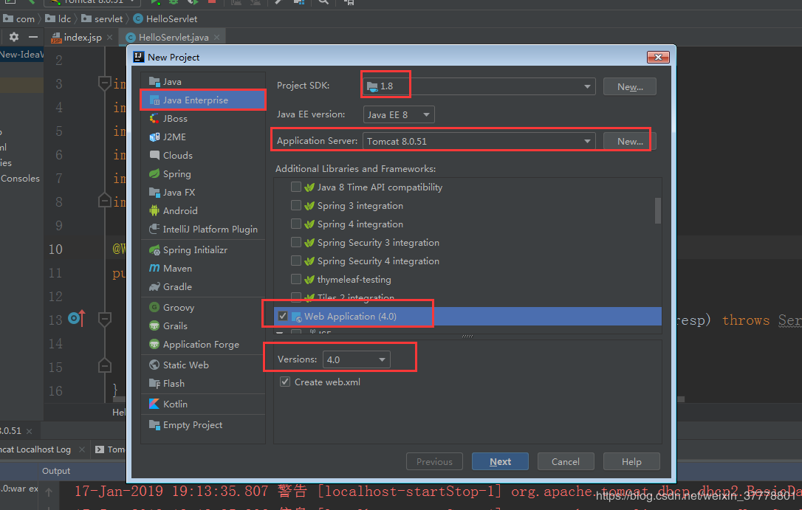

我们来写上一个jsp页面：
```jsp
<%@ page contentType="text/html;charset=UTF-8" language="java" %>
<html>
  <head>
    <title>$Title$</title>
  </head>
  <body>
    <a href="hello">hello</a>
  </body>
</html>
```

我们再来写上一个servlet，并且用@WebServlet("/hello")来标注，并且指明要拦截哪些路径：
```java
package com.ldc.servlet;

import javax.servlet.ServletException;
import javax.servlet.annotation.WebServlet;
import javax.servlet.http.HttpServlet;
import javax.servlet.http.HttpServletRequest;
import javax.servlet.http.HttpServletResponse;
import java.io.IOException;

@WebServlet("/hello")
public class HelloServlet extends HttpServlet {
    @Override
    protected void doGet(HttpServletRequest req, HttpServletResponse resp) throws ServletException, IOException {
        resp.getWriter().write("hello...");
    }
}
```

启动Tomcat服务器：运行成功
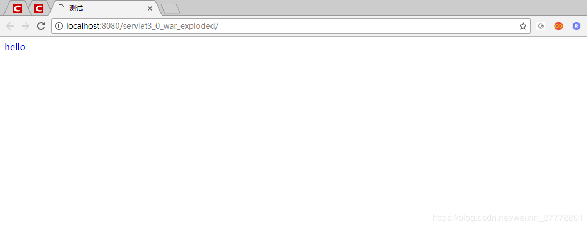


点进这个链接也会打印字符串：
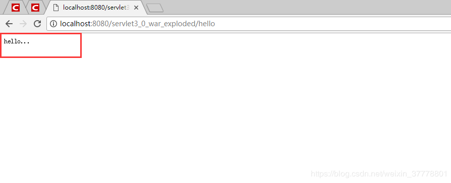

同样，要注册Filter用@WebFilter注解、注册Listener用@WebListener注解；如果在注册的时候，需要一些初始化参数，我们就可以用@WebInitParam注解；

## servlet3.0-ServletContainerInitializer
```xml
Shared libraries（共享库） / runtimes pluggability（运行时插件能力）

1、Servlet容器启动会扫描，当前应用里面每一个jar包的ServletContainerInitializer的实现
2、提供ServletContainerInitializer的实现类；
	必须绑定在，META-INF/services/javax.servlet.ServletContainerInitializer
	文件的内容就是ServletContainerInitializer实现类的全类名；

总结：容器在启动应用的时候，会扫描当前应用每一个jar包里面
META-INF/services/javax.servlet.ServletContainerInitializer
指定的实现类，启动并运行这个实现类的方法；传入感兴趣的类型；


ServletContainerInitializer；
@HandlesTypes；

```

第一步：我们写一个MyServletContainerInitializer 类实现ServletContainerInitializer 接口
```java
//容器启动的时候会将@HandlesTypes指定的这个类型下面的子类（实现类或者子接口等）传递过来
//传入感兴趣的类型
@HandlesTypes(value = {HelloService.class})
public class MyServletContainerInitializer implements ServletContainerInitializer {
    /**
     * 在应用启动的时候，会运行onStartup方法；
     * Set<Class<?>> ：感兴趣的类型的所有子类型；
     * ServletContext 代表当前的web应用的ServletContext对象，一个web应用相当于是一个ServletContext
     * @throws ServletException
     */
    @Override
    public void onStartup(Set<Class<?>> set, ServletContext servletContext) throws ServletException {
        System.out.println("感兴趣的类型：");
        set.forEach(System.out::println);
    }
}
```


第二步：在这个路径下新建一个文件
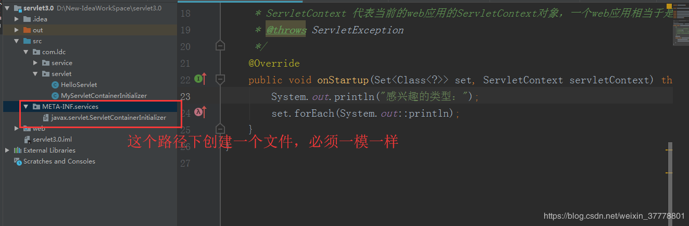

文件的内容就写我们实现ServletContainerInitializer 这个接口的类MyServletContainerInitializer 的全类名：
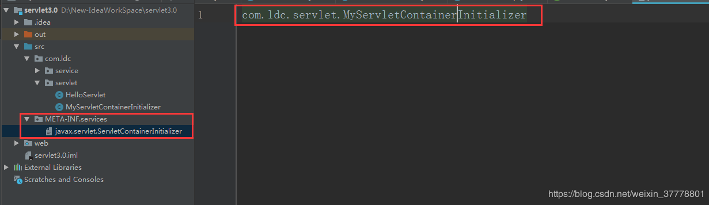
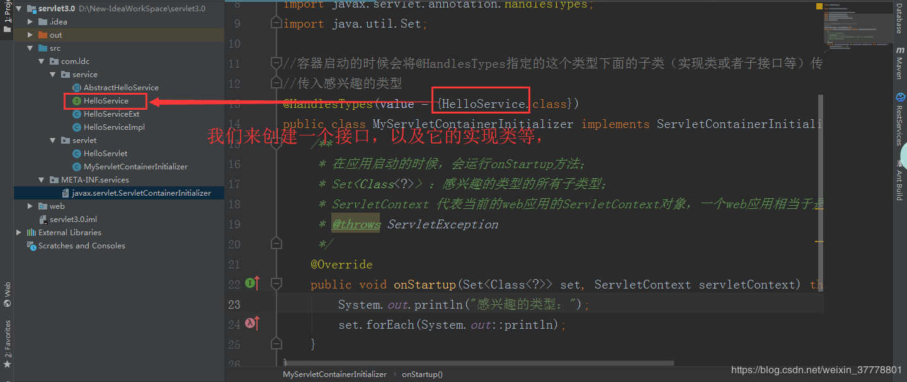

最后，我们运行起来，运行结果为：
```
感兴趣的类型：
class com.ldc.service.HelloServiceExt
class com.ldc.service.AbstractHelloService
class com.ldc.service.HelloServiceImpl
```

## servlet3.0-ServletContext注册三大组件
首先我们写一个Servlet：
```java
public class UserServlet extends HttpServlet {
    @Override
    protected void doGet(HttpServletRequest req, HttpServletResponse resp) throws ServletException, IOException {
        resp.getWriter().write("tomcat...");
        System.out.println("UserServlet...doGet...");
    }
}
```


再来一个Filter：
```java
public class UserFilter implements Filter {
    @Override
    public void init(FilterConfig filterConfig) throws ServletException {

    }

    @Override
    public void doFilter(ServletRequest servletRequest, ServletResponse servletResponse, FilterChain filterChain) throws IOException, ServletException {
        //过滤请求
        System.out.println("UserFilter...doFilter...");
        //放行
        filterChain.doFilter(servletRequest,servletResponse);
    }

    @Override
    public void destroy() {

    }
}
```


最后，再写一个Listener：
```java
/**
 * 监听项目的启动和停止
 */
public class UserListener implements ServletContextListener {
    //监听ServletContextEvent的启动初始化
    @Override
    public void contextInitialized(ServletContextEvent servletContextEvent) {
        System.out.println("UserListener...contextInitialized");
    }
    //监听ServletContextEvent销毁
    @Override
    public void contextDestroyed(ServletContextEvent servletContextEvent) {
        System.out.println("UserListener...contextDestroyed");
    }
}
```

最后，我们来用ServletContext来进行注册三大组件：
```java
//容器启动的时候会将@HandlesTypes指定的这个类型下面的子类（实现类或者子接口等）传递过来
//传入感兴趣的类型
@HandlesTypes(value = {HelloService.class})
public class MyServletContainerInitializer implements ServletContainerInitializer {
    /**
     * 在应用启动的时候，会运行onStartup方法；
     * Set<Class<?>> ：感兴趣的类型的所有子类型；
     * ServletContext 代表当前的web应用的ServletContext对象，一个web应用相当于是一个ServletContext
     * 1）、使用ServletContext注册Web组件（Servlet、Filter、Listener）
     * 2）、使用编码的方式，在项目启动的时候给ServletContext添加组件
     * 必须在项目启动的时候来添加
     *  （1）ServletContainerInitializer得到ServletContext对象来注册；
     *  （2）ServletContextListener的方法的参数里面的ServletContextEvent对象可以获取ServletContext对象
     */
    @Override
    public void onStartup(Set<Class<?>> set, ServletContext servletContext) throws ServletException {
        System.out.println("感兴趣的类型：");
        set.forEach(System.out::println);

        //注册组件
        Dynamic servlet = servletContext.addServlet("userServlet", new UserServlet());
        //配置servlet的映射信息
        servlet.addMapping("/user");

        //注册Listener
        servletContext.addListener(UserListener.class);

        //注册Filter
        FilterRegistration.Dynamic filter = servletContext.addFilter("userFilter", UserFilter.class);
        filter.addMappingForUrlPatterns(EnumSet.of(DispatcherType.REQUEST),true,"/*");
    }
}
```

我们启动，然后再浏览器上进行访问：
```
感兴趣的类型：
class com.ldc.service.AbstractHelloService
class com.ldc.service.HelloServiceImpl
class com.ldc.service.HelloServiceExt
UserListener…contextInitialized
UserFilter…doFilter…
UserFilter…doFilter…
UserFilter…doFilter…
UserServlet…doGet…
```

如果服务器停止了，监听器也是能监听得到：
```
UserListener…contextDestroyed
```

## servlet3.0-与SpringMVC整合分析
Spring5.2.0 WebServlet官方文档:https://docs.spring.io/spring/docs/5.2.0.BUILD-SNAPSHOT/spring-framework-reference/web.html#spring-web

```
1、web容器在启动的时候，会扫描每个jar包下的META-INF/services/javax.servlet.ServletContainerInitializer
2、加载这个文件指定的类SpringServletContainerInitializer
3、spring的应用一启动会加载感兴趣的WebApplicationInitializer接口的下的所有组件；
4、并且为WebApplicationInitializer组件创建对象（组件不是接口，不是抽象类）
	1）、AbstractContextLoaderInitializer：创建根容器；createRootApplicationContext()；
	2）、AbstractDispatcherServletInitializer：
			创建一个web的ioc容器；createServletApplicationContext();
			创建了DispatcherServlet；createDispatcherServlet()；
			将创建的DispatcherServlet添加到ServletContext中；
				getServletMappings();
	3）、AbstractAnnotationConfigDispatcherServletInitializer：注解方式配置的DispatcherServlet初始化器
			创建根容器：createRootApplicationContext()
					getRootConfigClasses();传入一个配置类
			创建web的ioc容器： createServletApplicationContext();
					获取配置类；getServletConfigClasses();
	
总结：
	以注解方式来启动SpringMVC；继承AbstractAnnotationConfigDispatcherServletInitializer；
实现抽象方法指定DispatcherServlet的配置信息；
```

## springmvc-整合

导入jar包：
```xml
<?xml version="1.0" encoding="UTF-8"?>
<project xmlns="http://maven.apache.org/POM/4.0.0"
         xmlns:xsi="http://www.w3.org/2001/XMLSchema-instance"
         xsi:schemaLocation="http://maven.apache.org/POM/4.0.0 http://maven.apache.org/xsd/maven-4.0.0.xsd">
    <modelVersion>4.0.0</modelVersion>

    <groupId>com.ldc</groupId>
    <artifactId>springmvc-annotation</artifactId>
    <version>1.0-SNAPSHOT</version>
    <packaging>war</packaging>

    <dependencies>
        <dependency>
            <groupId>org.springframework</groupId>
            <artifactId>spring-webmvc</artifactId>
            <version>4.3.11.RELEASE</version>
        </dependency>
        <dependency>
            <groupId>javax.servlet</groupId>
            <artifactId>servlet-api</artifactId>
            <version>3.0-alpha-1</version>
            <!--因为tomcat也有servlet-api，要是项目打成war包的时候，就不要带上这个jar包,否则就会引起冲突-->
            <scope>provided</scope>
        </dependency>
    </dependencies>


    <build>
        <plugins>
            <plugin>
                <groupId>org.apache.maven.plugins</groupId>
                <artifactId>maven-war-plugin</artifactId>
                <version>2.4</version>
                <configuration>
                    <failOnMissingWebXml>false</failOnMissingWebXml>
                </configuration>
            </plugin>
        </plugins>
    </build>
</project>
```

创建web初始化器，以及父子配置类：
```java
//Web容器启动的时候创建对象；调用方法来初始化容器以及前端控制器
public class MyWebInitializer extends AbstractAnnotationConfigDispatcherServletInitializer {

    //获取父容器的配置类:（Spring的配置文件） --->作为父容器
    @Override
    protected Class<?>[] getRootConfigClasses() {
        return new Class<?>[]{RootConfig.class};
    }

    //获取web容器的配置类（SpringMVC配置文件） --->作为一个子容器
    @Override
    protected Class<?>[] getServletConfigClasses() {
        return new Class<?>[]{AppConfig.class};
    }

    //获取DispatcherServlet的映射信息
    //  /:拦截所有请求（包括静态资源（xx.js,xx.png），但是不包括*.jsp）
    //  /*:拦截所有请求，连*.jsp页面都拦截；jsp页面是tomcat引擎解析的
    @Override
    protected String[] getServletMappings() {
        return new String[]{"/"};
    }
}
```

```java
//Spring的容器不扫描Controller，父容器
@ComponentScan(value = {"com.ldc."},excludeFilters = {
        @Filter(type = FilterType.ANNOTATION,classes = {Controller.class})
})
public class RootConfig {

}
```

```java
//SpringMVC只扫描Controller，子容器
//useDefaultFilters = false 禁用默认的过滤规则
@ComponentScan(value = {"com.ldc"},includeFilters = {
        @Filter(type = FilterType.ANNOTATION,classes = {Controller.class})
},useDefaultFilters = false)
public class AppConfig {

}
```

我们再来写一个Controller和Service：
```java
@Controller
public class HelloController {

    @Autowired
    private HelloService helloService;

    @ResponseBody
    @RequestMapping("hello")
    public String hello() {
        String hello = helloService.sayHello("tomcat");
        return hello;
    }

}

@Service
public class HelloService {

    public String sayHello(String name) {
        return "Hello," + name;
    }

}
```

测试：我们启动tomcat服务器来运行测试：
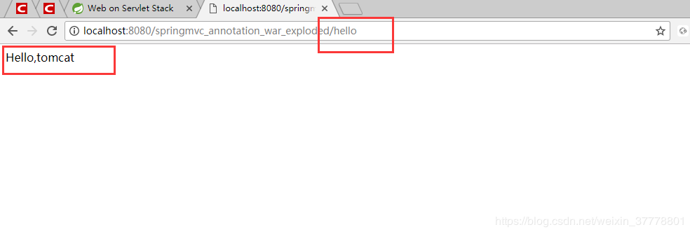


## springmvc-定制与接管SpringMVC
SpringMVC的其他相关的注解的配置参考官方文档:https://docs.spring.io/spring/docs/5.2.0.BUILD-SNAPSHOT/spring-framework-reference/web.html#mvc-config


SpringMVC具体配置的参考文档:https://docs.spring.io/spring/docs/5.2.0.BUILD-SNAPSHOT/spring-framework-reference/web.html#mvc-config-customize


我们就可以这样来写：
```java
//Spring的容器不扫描controller;父容器
@ComponentScan(value="com.atguigu",excludeFilters={
		@Filter(type=FilterType.ANNOTATION,classes={Controller.class})
})
public class RootConfig {

}
```

```java
//SpringMVC只扫描Controller，子容器
//useDefaultFilters = false 禁用默认的过滤规则
@ComponentScan(value = {"com.ldc"},includeFilters = {
        @Filter(type = FilterType.ANNOTATION,classes = {Controller.class})
},useDefaultFilters = false)
@EnableWebMvc
public class AppConfig implements WebMvcConfigurer {

    @Override
    public void configurePathMatch(PathMatchConfigurer pathMatchConfigurer) {

    }

    @Override
    public void configureContentNegotiation(ContentNegotiationConfigurer contentNegotiationConfigurer) {

    }

    @Override
    public void configureAsyncSupport(AsyncSupportConfigurer asyncSupportConfigurer) {

    }

    @Override
    public void configureDefaultServletHandling(DefaultServletHandlerConfigurer defaultServletHandlerConfigurer) {
        //将SpringMVC处理不了的请求交给tomcat，专门针对于静态资源的，这个时候，静态资源就是可以访问的
        defaultServletHandlerConfigurer.enable();
    }

    @Override
    public void addFormatters(FormatterRegistry formatterRegistry) {
        //添加自定义的类型转换器
    }

    @Override
    public void addInterceptors(InterceptorRegistry interceptorRegistry) {

    }

    @Override
    public void addResourceHandlers(ResourceHandlerRegistry resourceHandlerRegistry) {

    }

    @Override
    public void addCorsMappings(CorsRegistry corsRegistry) {

    }

    @Override
    public void addViewControllers(ViewControllerRegistry viewControllerRegistry) {

    }

    @Override
    public void configureViewResolvers(ViewResolverRegistry viewResolverRegistry) {

    }

    @Override
    public void addArgumentResolvers(List<HandlerMethodArgumentResolver> list) {

    }

    @Override
    public void addReturnValueHandlers(List<HandlerMethodReturnValueHandler> list) {

    }

    @Override
    public void configureMessageConverters(List<HttpMessageConverter<?>> list) {

    }

    @Override
    public void extendMessageConverters(List<HttpMessageConverter<?>> list) {

    }

    @Override
    public void configureHandlerExceptionResolvers(List<HandlerExceptionResolver> list) {

    }

    @Override
    public void extendHandlerExceptionResolvers(List<HandlerExceptionResolver> list) {

    }

    @Override
    public Validator getValidator() {
        return null;
    }

    @Override
    public MessageCodesResolver getMessageCodesResolver() {
        return null;
    }
}
```

但是上面直接实现WebMvcConfigurer接口的方式，有很多的方法用不到，我们可以用这个适配器WebMvcConfigurerAdapter来实现，它实现了WebMvcConfigurer接口：

我们可以来定义一个视图解析器：
```java
//SpringMVC只扫描Controller，子容器
//useDefaultFilters = false 禁用默认的过滤规则
@ComponentScan(value = {"com.ldc"},includeFilters = {
        @Filter(type = FilterType.ANNOTATION,classes = {Controller.class})
},useDefaultFilters = false)
@EnableWebMvc
public class AppConfig extends WebMvcConfigurerAdapter {
    //定制

    //视图解析器

    @Override
    public void configureViewResolvers(ViewResolverRegistry registry) {
        //默认所有页面都是从/WEB-INF/xxx.jsp
        //registry.jsp();
        //我们也可以自己来写规则
        registry.jsp("/WEB-INF/views/", ".jsp");
    }
}
```

我们在/WEB-INF/views/这个路径下新建一个success.jsp
```xml
<%@ page contentType="text/html;charset=UTF-8" language="java" %>
<html>
<head>
    <title>Title</title>
</head>
<body>
<h1>success</h1>
</body>
</html>
```
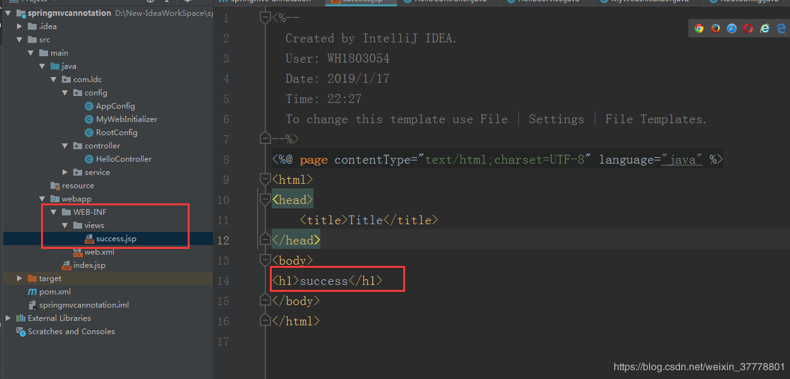

现在，我们来运行项目，测试：这个时候，就表示视图解析器配置成功了
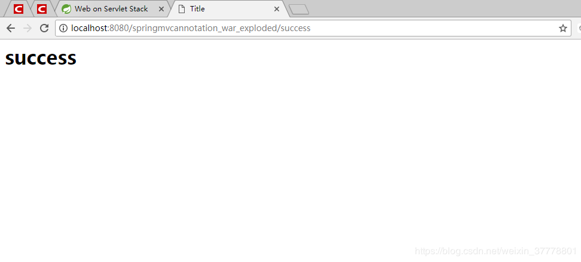


我们在这个路径下放一个图片，然后再写一个jsp来访问它
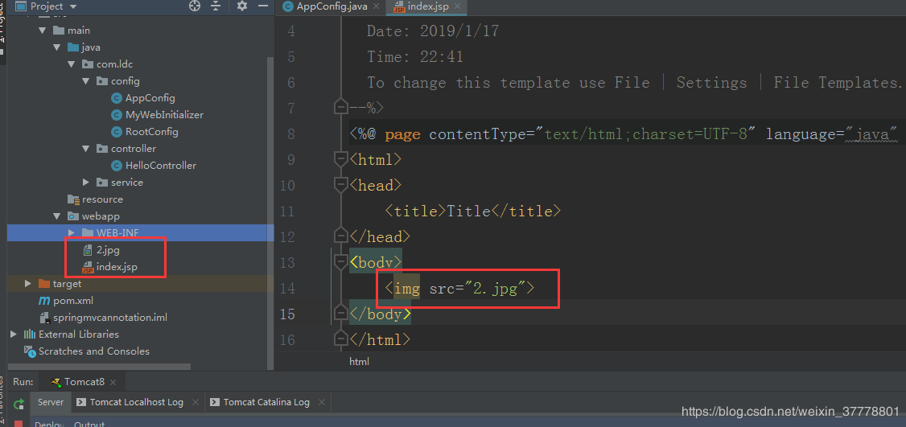

这个时候，图片是显示不出来的：
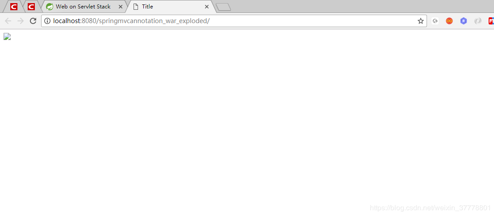


现在，我们来配置允许静态资源的访问：
```java
//SpringMVC只扫描Controller，子容器
//useDefaultFilters = false 禁用默认的过滤规则
@ComponentScan(value = {"com.ldc"},includeFilters = {
        @Filter(type = FilterType.ANNOTATION,classes = {Controller.class})
},useDefaultFilters = false)
@EnableWebMvc
public class AppConfig extends WebMvcConfigurerAdapter {
    //定制

    //视图解析器

    @Override
    public void configureViewResolvers(ViewResolverRegistry registry) {
        //默认所有页面都是从/WEB-INF/xxx.jsp
        //registry.jsp();
        //我们也可以自己来写规则
        registry.jsp("/WEB-INF/views/", ".jsp");
    }

    //静态资源的访问
    @Override
    public void configureDefaultServletHandling(DefaultServletHandlerConfigurer configurer) {
        configurer.enable();
    }
}
```
这个时候，我们的图片就是可以访问了：
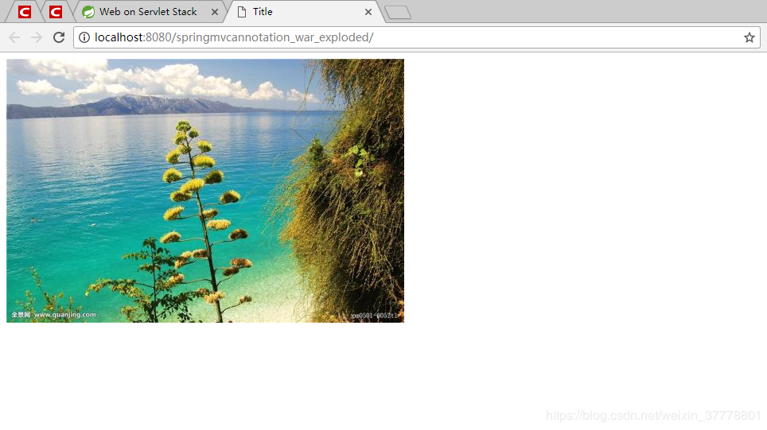

我们写上一个拦截器：
```java
public class MyFirstInterceptor implements HandlerInterceptor {
    //在目标方法执行之前执行
    @Override
    public boolean preHandle(HttpServletRequest httpServletRequest, HttpServletResponse httpServletResponse, Object o) throws Exception {
        System.out.println("preHandle...");
        return true;
    }

    //在目标方法执行之后执行
    @Override
    public void postHandle(HttpServletRequest httpServletRequest, HttpServletResponse httpServletResponse, Object o, ModelAndView modelAndView) throws Exception {
        System.out.println("postHandle...");
    }

    //页面响应以后执行
    @Override
    public void afterCompletion(HttpServletRequest httpServletRequest, HttpServletResponse httpServletResponse, Object o, Exception e) throws Exception {
        System.out.println("afterCompletion...");
    }
}
```

我们在配置类里面添加拦截器：
```java
//SpringMVC只扫描Controller，子容器
//useDefaultFilters = false 禁用默认的过滤规则
@ComponentScan(value = {"com.ldc"},includeFilters = {
        @Filter(type = FilterType.ANNOTATION,classes = {Controller.class})
},useDefaultFilters = false)
@EnableWebMvc
public class AppConfig extends WebMvcConfigurerAdapter {
    //定制

    //视图解析器

    @Override
    public void configureViewResolvers(ViewResolverRegistry registry) {
        //默认所有页面都是从/WEB-INF/xxx.jsp
        //registry.jsp();
        //我们也可以自己来写规则
        registry.jsp("/WEB-INF/views/", ".jsp");
    }

    //静态资源的访问
    @Override
    public void configureDefaultServletHandling(DefaultServletHandlerConfigurer configurer) {
        configurer.enable();
    }

    //配置拦截器
    @Override
    public void addInterceptors(InterceptorRegistry registry) {
        //拦截任意的路径
        registry.addInterceptor(new MyFirstInterceptor()).addPathPatterns("/**");
    }
}
```
我们重新启动，并且访问这个路径：
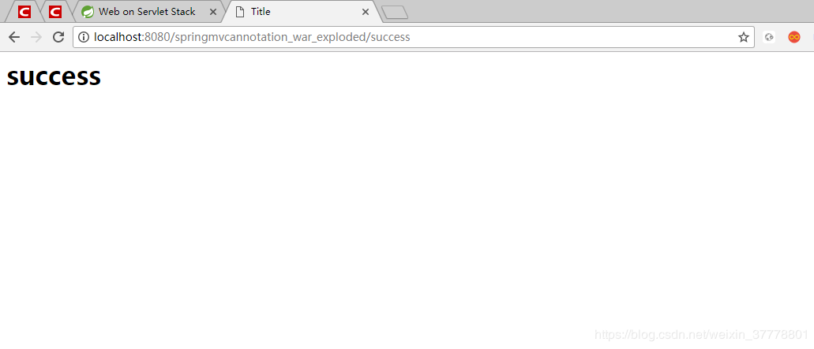
我们发现控制台已经打印了，说明拦截器已经起作用了：
```
preHandle…
postHandle…
afterCompletion…
preHandle…
postHandle…
afterCompletion…
```


```xml

```

```java

```