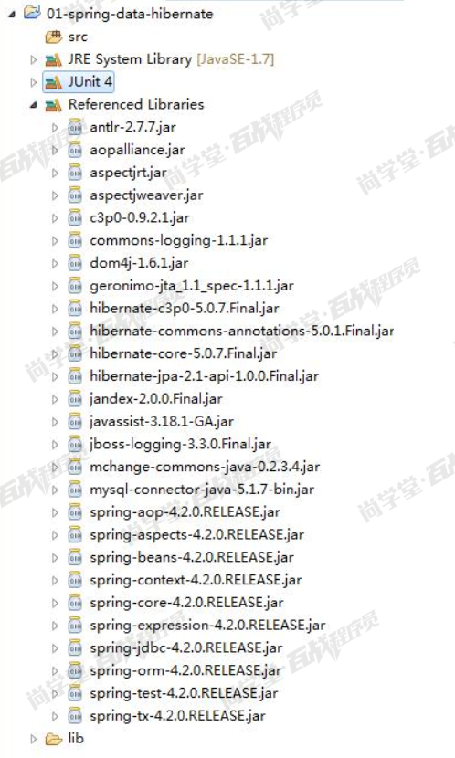
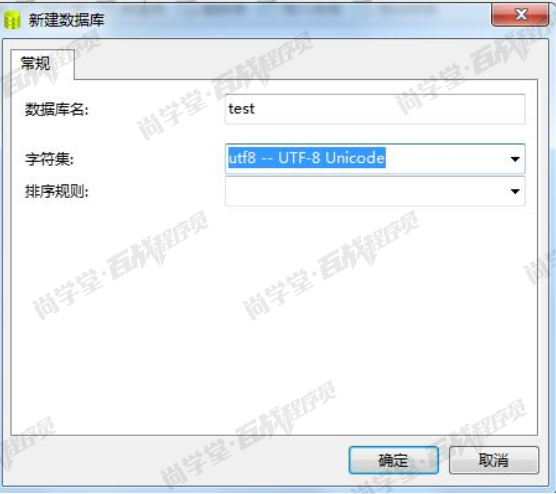
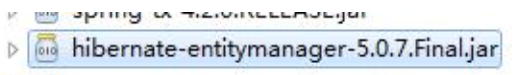

## 02-Hibernate回顾(了解)

### Spring 整合 Hibernate
#### 一、 创建项目


#### 二、 在配置文件中定义框架整合
jdbc.properties:
```properties
jdbc.url=jdbc:mysql://localhost:3306/test
jdbc.driver.class=com.mysql.jdbc.Driver
jdbc.username=root
jdbc.password=root
```

applicationContext.xml:
```xml
<?xml version="1.0" encoding="UTF-8"?>
<beans xmlns="http://www.springframework.org/schema/beans"
	xmlns:xsi="http://www.w3.org/2001/XMLSchema-instance" xmlns:context="http://www.springframework.org/schema/context"
	xmlns:aop="http://www.springframework.org/schema/aop" xmlns:tx="http://www.springframework.org/schema/tx"
	xsi:schemaLocation="http://www.springframework.org/schema/beans 
	http://www.springframework.org/schema/beans/spring-beans.xsd
	http://www.springframework.org/schema/context
	http://www.springframework.org/schema/context/spring-context.xsd
	http://www.springframework.org/schema/aop
	http://www.springframework.org/schema/aop/spring-aop.xsd
	http://www.springframework.org/schema/tx 
	http://www.springframework.org/schema/tx/spring-tx.xsd">
	
	<!-- 配置读取properties文件的工具类 -->
	<context:property-placeholder location="classpath:jdbc.properties"/>
	
	<!-- 配置c3p0数据库连接池 -->
	<bean id="dataSource" class="com.mchange.v2.c3p0.ComboPooledDataSource">
		<property name="jdbcUrl" value="${jdbc.url}"/>
		<property name="driverClass" value="${jdbc.driver.class}"/>
		<property name="user" value="${jdbc.username}"/>
		<property name="password" value="${jdbc.password}"/>
	</bean>
	
	<!-- 配置Hibernate的SeesionFactory -->
	<bean id="sessionFactory" class="org.springframework.orm.hibernate5.LocalSessionFactoryBean">
		<property name="dataSource" ref="dataSource"/>
		<!-- hibernateProperties属性：配置与hibernate相关的内容，如显示sql语句，开启正向工程 -->
		<property name="hibernateProperties">
			<props>
				<!-- 显示当前执行的sql语句 -->
				<prop key="hibernate.show_sql">true</prop>
				<!-- 开启正向工程 -->
				<prop key="hibernate.hbm2ddl.auto">update</prop>
			</props>
		</property>
		<!-- 扫描实体所在的包 -->
		<property name="packagesToScan">
			<list>
				<value>com.bjsxt.pojo</value>
			</list>
		</property>
	</bean>
	

	<!-- 配置HiberanteTemplate对象 -->
	<bean id="hibernateTemplate" class="org.springframework.orm.hibernate5.HibernateTemplate">
		<property name="sessionFactory" ref="sessionFactory"/>
	</bean>
	<!-- 配置Hibernate的事务管理器 -->
	<bean id="transactionManager" class="org.springframework.orm.hibernate5.HibernateTransactionManager">
		<property name="sessionFactory" ref="sessionFactory"/>
	</bean>
	
	<!-- 配置开启注解事务处理 -->
	<tx:annotation-driven transaction-manager="transactionManager"/>
	
	<!-- 配置springIOC的注解扫描 -->
	<context:component-scan base-package="com.bjsxt"/>
</beans>
```

#### 三、 通过 Hibernate 完成 CRUD 操作
##### 1 创建数据库


##### 2 编写实体类
```java
import java.io.Serializable;

import javax.persistence.Column;
import javax.persistence.Entity;
import javax.persistence.GeneratedValue;
import javax.persistence.GenerationType;
import javax.persistence.Id;
import javax.persistence.Table;

@Entity
@Table(name="t_users")
public class Users implements Serializable{

	@Id
	@GeneratedValue(strategy=GenerationType.IDENTITY)//strategy=GenerationType.IDENTITY 自增长
	@Column(name="userid")
	private Integer userid;
	
	@Column(name="username")
	private String username;
	
	@Column(name="userage")
	private Integer userage;

	public Integer getUserid() {
		return userid;
	}

	public void setUserid(Integer userid) {
		this.userid = userid;
	}

	public String getUsername() {
		return username;
	}

	public void setUsername(String username) {
		this.username = username;
	}

	public Integer getUserage() {
		return userage;
	}

	public void setUserage(Integer userage) {
		this.userage = userage;
	}

	@Override
	public String toString() {
		return "Users [userid=" + userid + ", username=" + username + ", userage=" + userage + "]";
	}
	
}
```

##### 3 编写 UserDao 接口与接口实现类
接口实现类:
```java
@Repository
public class UsersDaoImpl  implements UsersDao {

	@Autowired
	private HibernateTemplate hibernateTemplate;
	
	@Override
	public void insertUsers(Users users) {
		this.hibernateTemplate.save(users);
	}

	@Override
	public void updateUsers(Users users) {
		this.hibernateTemplate.update(users);

	}

	@Override
	public void deleteUsers(Users users) {
		this.hibernateTemplate.delete(users);

	}

	@Override
	public Users selectUsersById(Integer userid) {
		return this.hibernateTemplate.get(Users.class, userid);
	}
}
```

##### 4 编写测试代码:
```java
@RunWith(SpringJUnit4ClassRunner.class)
@ContextConfiguration("classpath:applicationContext.xml")
public class UsersDaoImplTest {

	@Autowired
	private UsersDao usersDao;
	
	
	/**
	 * 添加用户
	 */
	@Test
	@Transactional// 在测试类对于事务提交方式默认的是回滚。
	@Rollback(false)//取消自动回滚
	public void testInsertUsers(){
		Users users = new Users();
		users.setUserage(20);
		users.setUsername("张三");
		this.usersDao.insertUsers(users);
	}
	
	/**
	 * 更新用户
	 */
	@Test
	@Transactional
	@Rollback(false)
	public void testUpdateUsers(){
		Users users = new Users();
		users.setUserid(2);
		users.setUserage(22);
		users.setUsername("李四");
		this.usersDao.updateUsers(users);
	}
	
	/**
	 * 根据userid查询用户
	 */
	@Test
	public void testSelectUsersById(){
		Users users = this.usersDao.selectUsersById(2);
		System.out.println(users);
	}
	
	/**
	 * 删除用户
	 */
	@Test
	@Transactional
	@Rollback(false)
	public void testDeleteUsers(){
		Users users = new Users();
		users.setUserid(2);
		this.usersDao.deleteUsers(users);
	}	
}
```

#### 四、 HQL 查询
HQL： Hibernate Query Language

HQL 的语法： 就是将原来的 sql 语句中的表与字段名称换成对象与属性的名称就可以了

##### 1 添加查询方法
```java
@Override
public List<Users> selectUserByName(String username) {
    //getCurrentSession:当前session必须要有事务边界，且只能处理唯一的一个事务。当事务提交或者回滚后session自动失效
    //openSession:每次都会打开一个新的session.加入每次使用多次。则获得的是不同session对象。使用完毕后我们需要手动的调用colse方法关闭session
    Session session = this.hibernateTemplate.getSessionFactory().getCurrentSession();
    //sql:select * from t_users where username = 
    Query query = session.createQuery("from Users where username = :abc");
    Query queryTemp = query.setString("abc",username);
    return queryTemp.list();
}
```

##### 2 测试代码
```java
/**
 * HQL测试
 */
@Test
@Transactional
public void testSelectUserByName(){
    List<Users> list = this.usersDao.selectUserByName("张三");
    for (Users users : list) {
        System.out.println(users);
    }
}
```

#### 五、 SQL 查询
使用原生sql查询

##### 1 添加查询方法
```java
@Override
public List<Users> selectUserByNameUseSQL(String username) {
    Session session = this.hibernateTemplate.getSessionFactory().getCurrentSession();
    Query query = session.createSQLQuery("select * from t_users where username = ?").addEntity(Users.class).setString(0, username);
    return query.list();
}
```

##### 2 测试代码
```java
/**
 * SQL测试
 */
@Test
@Transactional
public void testSelectUserByNameUseSQL(){
    List<Users> list = this.usersDao.selectUserByNameUseSQL("张三");
    for (Users users : list) {
        System.out.println(users);
    }
}
```

#### 六、 QBC 查询
QBC： Query By Criteria

##### 1 添加查询方法
```java
@Override
public List<Users> selectUserByNameUseCriteria(String username) {
    Session session = this.hibernateTemplate.getSessionFactory().getCurrentSession();
    //sql:select * from t_users where username = 张三
    Criteria c = session.createCriteria(Users.class);
    c.add(Restrictions.eq("username", username));
    return c.list();
}
```

##### 2 测试代码
```java
/**
 * Criteria测试
 */
@Test
@Transactional
public void testSelectUserByNameUseCriteria(){
    List<Users> list = this.usersDao.selectUserByNameUseCriteria("张三");
    for (Users users : list) {
        System.out.println(users);
    }
}
```

### Spring 整合 Hibernate JPA
JPA： 由 Sun 公司提供了一对对于持久层操作的标准(接口+文档)

Hibernate:是 Gavin King 开发的一套对于持久层操作的自动的 ORM 框架。

Hibernate JPA:是在 Hibernate3.2 版本那种提供了对于 JPA 的标准的实现。 提供了一套按
照 JPA 标准来实现持久层开发的 API

#### 一、导入HIbernateJPA 相关的 jar 包、修改配置文件
在项目中导入 HIbernateJPA 相关的 jar 包


配置文件:
applicationContext.xml
```xml
<?xml version="1.0" encoding="UTF-8"?>
<beans xmlns="http://www.springframework.org/schema/beans"
	xmlns:xsi="http://www.w3.org/2001/XMLSchema-instance" xmlns:context="http://www.springframework.org/schema/context"
	xmlns:aop="http://www.springframework.org/schema/aop" xmlns:tx="http://www.springframework.org/schema/tx"
	xsi:schemaLocation="http://www.springframework.org/schema/beans 
	http://www.springframework.org/schema/beans/spring-beans.xsd
	http://www.springframework.org/schema/context
	http://www.springframework.org/schema/context/spring-context.xsd
	http://www.springframework.org/schema/aop
	http://www.springframework.org/schema/aop/spring-aop.xsd
	http://www.springframework.org/schema/tx 
	http://www.springframework.org/schema/tx/spring-tx.xsd">
	
	<!-- 配置读取properties文件的工具类 -->
	<context:property-placeholder location="classpath:jdbc.properties"/>
	
	<!-- 配置c3p0数据库连接池 -->
	<bean id="dataSource" class="com.mchange.v2.c3p0.ComboPooledDataSource">
		<property name="jdbcUrl" value="${jdbc.url}"/>
		<property name="driverClass" value="${jdbc.driver.class}"/>
		<property name="user" value="${jdbc.username}"/>
		<property name="password" value="${jdbc.password}"/>
	</bean>
	
	<!-- Spring整合JPA  配置EntityManagerFactory-->
	<bean id="entityManagerFactory" class="org.springframework.orm.jpa.LocalContainerEntityManagerFactoryBean">
		<property name="dataSource" ref="dataSource"/>
		<property name="jpaVedorAdapter">
			<bean class="org.springframework.orm.jpa.vendor.HibernateJpaVendorAdapter">
				<!-- hibernate相关的属性的注入 -->
				<!-- 配置数据库类型 -->
				<property name="database" value="MYSQL"/>
				<!-- 正向工程 自动创建表 -->
				<property name="generateDdl" value="true"/>
				<!-- 显示执行的SQL -->
				<property name="showSql" value="true"/>
			</bean>
		</property>
		<!-- 扫描实体的包 -->
		<property name="packagesToScan">
			<list>
				<value>com.bjsxt.pojo</value>
			</list>
		</property>
	</bean>

	<!-- 配置Hibernate的事务管理器 -->
	<bean id="transactionManager" class="org.springframework.orm.jpa.JpaTransactionManager">
		<property name="entityManagerFactory" ref="entityManagerFactory"/>
	</bean>
	
	<!-- 配置开启注解事务处理 -->
	<tx:annotation-driven transaction-manager="transactionManager"/>
	
	<!-- 配置springIOC的注解扫描 -->
	<context:component-scan base-package="com.bjsxt"/>
</beans>
```

#### 二、 Hibernate JPA 的 CRUD 操作
##### 1 接口实现类
```java
@Repository
public class UsersDaoImpl  implements UsersDao {

	@PersistenceContext(name="entityManagerFactory")
	private EntityManager entityManager;
	
	@Override
	public void insertUsers(Users users) {
		this.entityManager.persist(users);
	}

	@Override
	public void updateUsers(Users users) {
		this.entityManager.merge(users);
	}

	@Override
	public void deleteUsers(Users users) {
		Users  u = this.selectUsersById(users.getUserid());
		this.entityManager.remove(u);
	}

	@Override
	public Users selectUsersById(Integer userid) {
		return this.entityManager.find(Users.class, userid);
	}
}
```

##### 2 测试代码:
```java
@RunWith(SpringJUnit4ClassRunner.class)
@ContextConfiguration("classpath:applicationContext.xml")
public class UsersDaoImplTest {

	@Autowired
	private UsersDao usersDao;
	
	
	/**
	 * 添加用户
	 */
	@Test
	@Transactional// 在测试类对于事务提交方式默认的是回滚。
	@Rollback(false)//取消自动回滚
	public void testInsertUsers(){
		Users users = new Users();
		users.setUserage(24);
		users.setUsername("王小丽");
		this.usersDao.insertUsers(users);
	}
	
	/**
	 * 更新用户
	 */
	@Test
	@Transactional
	@Rollback(false)
	public void testUpdateUsers(){
		Users users = new Users();
		users.setUserid(5);
		users.setUserage(22);
		users.setUsername("王五");
		this.usersDao.updateUsers(users);
	}
	
	/**
	 * 根据userid查询用户
	 */
	@Test
	public void testSelectUsersById(){
		Users users = this.usersDao.selectUsersById(4);
		System.out.println(users);
	}
	
	/**
	 * 删除用户
	 */
	@Test
	@Transactional
	@Rollback(false)
	public void testDeleteUsers(){
		Users users = new Users();
		users.setUserid(4);
		this.usersDao.deleteUsers(users);
	}
}
```

#### 三、 Hibernate JPA 中的 JPQL 语句
##### 1 添加查询方法
```java
@Override
public List<Users> selectUserByName(String username) {
    return this.entityManager.createQuery(" from Users where username = :abc").setParameter("abc", username).getResultList();
}
```

##### 2 测试代码
```java
/**
 * HQL测试
 */
@Test
@Transactional
public void testSelectUserByName(){
    List<Users> list = this.usersDao.selectUserByName("张三");
    for (Users users : list) {
        System.out.println(users);
    }
}
```

#### 四、 HibernateJPA 中的 SQL 语句
##### 1 添加查询方法
```java
@Override
public List<Users> selectUserByNameUseSQL(String username) {
    //在 Hibernate JPA 中 如果通过？ 方式来帮顶参数， 那么他的查数是从 1开始的。 而 hibernate 中是从 0 开始的。
    return this.entityManager.createNativeQuery("select * from t_users where username = ?", Users.class)
    .setParameter(1,username).getResultList();
}
```

##### 2 测试代码
```java
/**
 * SQL测试
 */
@Test
@Transactional
public void testSelectUserByNameUseSQL(){
    List<Users> list = this.usersDao.selectUserByNameUseSQL("张三");
    for (Users users : list) {
        System.out.println(users);
    }
}
```

#### 五、 HibernateJPA 中 QBC 查询
##### 1 添加查询方法
```java
@Override
public List<Users> selectUserByNameUseCriteria(String username) {
    //CriteriaBuilder 对象： 创建一个 CriteriaQuery,创建查询条件。
    CriteriaBuilder builber = this.entityManager.getCriteriaBuilder();
    //CriteriaQuery 对象： 执行查询的 Criteria 对象
    //select * from t_users
    CriteriaQuery<Users> query = builber.createQuery(Users.class);
    //获取要查询的实体类的对象
    Root<Users> root = query.from(Users.class);
    //封装查询条件
    Predicate cate = builber.equal(root.get("username"), username);
    //select * from t_users where username = 张三
    query.where(cate);
    //执行查询
    TypedQuery<Users> typeQuery = this.entityManager.createQuery(query);
    return typeQuery.getResultList();
}
```

##### 2 测试代码
```java
/**
 * Criteria测试
 */
@Test
@Transactional
public void testSelectUserByNameUseCriteria(){
    List<Users> list = this.usersDao.selectUserByNameUseCriteria("张三");
    for (Users users : list) {
        System.out.println(users);
    }
}
```

