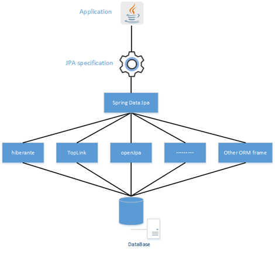
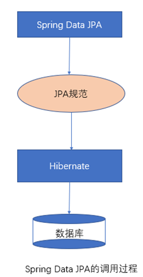
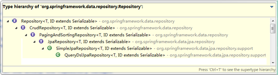
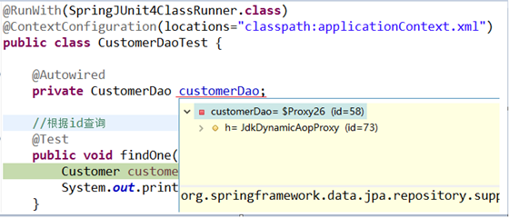
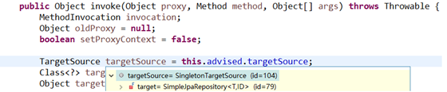
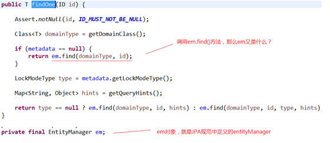

## SpringDatJPA快速入门
### Spring Data JPA概述
#### 概念
Spring Data JPA 是 Spring 基于 ORM 框架、JPA 规范的基础上封装的一套JPA应用框架，可使开发者用极简的代码即可实现对数据库的访问和操作。它提供了包括增删改查等在内的常用功能，且易于扩展！**学习并使用 Spring Data JPA 可以极大提高开发效率！**

**Spring Data JPA 让我们解脱了DAO层的操作，基本上所有CRUD都可以依赖于它来实现**,在实际的工作工程中，推荐使用Spring Data JPA + ORM（如：hibernate）完成操作，这样在切换不同的ORM框架时提供了极大的方便，同时也使数据库层操作更加简单。

#### Spring Data JPA 与 JPA和hibernate之间的关系
JPA是一套规范，内部是有接口和抽象类组成的。hibernate是一套成熟的ORM框架，而且Hibernate实现了JPA规范，所以也可以称hibernate为JPA的一种实现方式，我们使用JPA的API编程，意味着站在更高的角度上看待问题（面向接口编程）
Spring Data JPA是Spring提供的一套对JPA操作更加高级的封装，是在JPA规范下的专门用来进行数据持久化的解决方案。




Spring Data JPA完整的调用过程:


### SpringDatJPA快速入门
#### 需求
使用SpringDataJpa实现CRUD操作。

#### 环境搭建
创建一个maven工程，然后将以下的依赖添加到工程中
```xml
<?xml version="1.0" encoding="UTF-8"?>
<project xmlns="http://maven.apache.org/POM/4.0.0"
         xmlns:xsi="http://www.w3.org/2001/XMLSchema-instance"
         xsi:schemaLocation="http://maven.apache.org/POM/4.0.0 http://maven.apache.org/xsd/maven-4.0.0.xsd">
    <modelVersion>4.0.0</modelVersion>

    <groupId>com.jpa</groupId>
    <artifactId>springdatajpa_test</artifactId>
    <version>1.0-SNAPSHOT</version>

    <properties>
        <project.build.sourceEncoding>UTF-8</project.build.sourceEncoding>
        <project.reporting.outputEncoding>UTF-8</project.reporting.outputEncoding>
        <maven.compiler.source>1.8</maven.compiler.source>
        <maven.compiler.target>1.8</maven.compiler.target>
        <spring.version>4.2.4.RELEASE</spring.version>
        <hibernate.version>5.0.7.Final</hibernate.version>
        <slf4j.version>1.6.6</slf4j.version>
        <log4j.version>1.2.12</log4j.version>
        <c3p0.version>0.9.1.2</c3p0.version>
        <mysql.version>5.1.47</mysql.version>
    </properties>

    <dependencies>
        <!-- junit单元测试 -->
        <dependency>
            <groupId>junit</groupId>
            <artifactId>junit</artifactId>
            <version>4.12</version>
            <scope>test</scope>
        </dependency>

        <!-- spring beg -->
        <dependency>
            <groupId>org.aspectj</groupId>
            <artifactId>aspectjweaver</artifactId>
            <version>1.6.8</version>
        </dependency>

        <dependency>
            <groupId>org.springframework</groupId>
            <artifactId>spring-aop</artifactId>
            <version>${spring.version}</version>
        </dependency>

        <dependency>
            <groupId>org.springframework</groupId>
            <artifactId>spring-context</artifactId>
            <version>${spring.version}</version>
        </dependency>

        <dependency>
            <groupId>org.springframework</groupId>
            <artifactId>spring-context-support</artifactId>
            <version>${spring.version}</version>
        </dependency>

        <dependency>
            <groupId>org.springframework</groupId>
            <artifactId>spring-orm</artifactId>
            <version>${spring.version}</version>
        </dependency>

        <dependency>
            <groupId>org.springframework</groupId>
            <artifactId>spring-beans</artifactId>
            <version>${spring.version}</version>
        </dependency>

        <dependency>
            <groupId>org.springframework</groupId>
            <artifactId>spring-core</artifactId>
            <version>${spring.version}</version>
        </dependency>

        <!-- spring end -->

        <!-- hibernate beg -->
        <dependency>
            <groupId>org.hibernate</groupId>
            <artifactId>hibernate-core</artifactId>
            <version>${hibernate.version}</version>
        </dependency>
        <dependency>
            <groupId>org.hibernate</groupId>
            <artifactId>hibernate-entitymanager</artifactId>
            <version>${hibernate.version}</version>
        </dependency>
        <dependency>
            <groupId>org.hibernate</groupId>
            <artifactId>hibernate-validator</artifactId>
            <version>5.2.1.Final</version>
        </dependency>
        <!-- hibernate end -->

        <!-- c3p0 beg -->
        <dependency>
            <groupId>c3p0</groupId>
            <artifactId>c3p0</artifactId>
            <version>${c3p0.version}</version>
        </dependency>
        <!-- c3p0 end -->

        <!-- log end -->
        <dependency>
            <groupId>log4j</groupId>
            <artifactId>log4j</artifactId>
            <version>${log4j.version}</version>
        </dependency>

        <dependency>
            <groupId>org.slf4j</groupId>
            <artifactId>slf4j-api</artifactId>
            <version>${slf4j.version}</version>
        </dependency>

        <dependency>
            <groupId>org.slf4j</groupId>
            <artifactId>slf4j-log4j12</artifactId>
            <version>${slf4j.version}</version>
        </dependency>
        <!-- log end -->


        <dependency>
            <groupId>mysql</groupId>
            <artifactId>mysql-connector-java</artifactId>
            <version>${mysql.version}</version>
        </dependency>

        <dependency>
            <groupId>org.springframework.data</groupId>
            <artifactId>spring-data-jpa</artifactId>
            <version>1.9.0.RELEASE</version>
        </dependency>

        <dependency>
            <groupId>org.springframework</groupId>
            <artifactId>spring-test</artifactId>
            <version>4.2.4.RELEASE</version>
        </dependency>

        <!-- el beg 使用spring data jpa 必须引入 -->
        <dependency>
            <groupId>javax.el</groupId>
            <artifactId>javax.el-api</artifactId>
            <version>2.2.4</version>
        </dependency>

        <dependency>
            <groupId>org.glassfish.web</groupId>
            <artifactId>javax.el</artifactId>
            <version>2.2.4</version>
        </dependency>
        <!-- el end -->
        
        <!--如果是jdk1.8不需要引入此jar包-->
        <dependency>
            <groupId>javax.xml.bind</groupId>
            <artifactId>jaxb-api</artifactId>
            <version>2.3.0</version>
        </dependency>
    </dependencies>

</project>
```

#### 整合Spring Data JPA与Spring
创建一个applicationContext.xml配置文件，然后在其中配置SpringDataJpa的相关配置。
```xml
<?xml version="1.0" encoding="UTF-8"?>
<beans xmlns="http://www.springframework.org/schema/beans"
       xmlns:xsi="http://www.w3.org/2001/XMLSchema-instance" xmlns:aop="http://www.springframework.org/schema/aop"
       xmlns:context="http://www.springframework.org/schema/context"
       xmlns:jdbc="http://www.springframework.org/schema/jdbc" xmlns:tx="http://www.springframework.org/schema/tx"
       xmlns:jpa="http://www.springframework.org/schema/data/jpa" xmlns:task="http://www.springframework.org/schema/task"
       xsi:schemaLocation="
      http://www.springframework.org/schema/beans http://www.springframework.org/schema/beans/spring-beans.xsd
      http://www.springframework.org/schema/aop http://www.springframework.org/schema/aop/spring-aop.xsd
      http://www.springframework.org/schema/context http://www.springframework.org/schema/context/spring-context.xsd
      http://www.springframework.org/schema/jdbc http://www.springframework.org/schema/jdbc/spring-jdbc.xsd
      http://www.springframework.org/schema/tx http://www.springframework.org/schema/tx/spring-tx.xsd
      http://www.springframework.org/schema/data/jpa
      http://www.springframework.org/schema/data/jpa/spring-jpa.xsd">
    <!-- 1.dataSource 配置数据库连接池-->
    <bean id="dataSource" class="com.mchange.v2.c3p0.ComboPooledDataSource">
        <property name="driverClass" value="com.mysql.jdbc.Driver" />
        <property name="jdbcUrl" value="jdbc:mysql://localhost:3306/jpa331" />
        <property name="user" value="root" />
        <property name="password" value="root" />
    </bean>
    <!--工厂类对象-->
    <bean id="entityManagerFactory" class="org.springframework.orm.jpa.LocalContainerEntityManagerFactoryBean">
        <!--配置数据源-->
        <property name="dataSource" ref="dataSource"/>
        <!--实体类的包扫描器-->
        <property name="packagesToScan" value="com.itheima.jpa.entity"/>
        <!--配置供应商适配器-->
        <property name="jpaVendorAdapter">
            <bean class="org.springframework.orm.jpa.vendor.HibernateJpaVendorAdapter">
                <!--是否向控制台输出sql语句-->
                <property name="showSql" value="true"/>
                <!--是否自动创建表
                    如果是true：相当于update，hibernate.hbm2ddl.auto属性配置成update
                    如果是false：相当于none
                -->
                <property name="generateDdl" value="true"/>
                <!--使用的数据库类型-->
                <property name="database" value="MYSQL"/>
            </bean>
        </property>
    </bean>
    <!--配置事务-->
    <!-- 3.事务配置-->
    <!-- 3.1JPA事务管理器  -->
    <bean id="transactionManager" class="org.springframework.orm.jpa.JpaTransactionManager">
        <property name="entityManagerFactory" ref="entityManagerFactory" />
    </bean>
    <!-- 3.2.txAdvice-->
    <tx:advice id="txAdvice" transaction-manager="transactionManager">
        <tx:attributes>
            <tx:method name="save*" propagation="REQUIRED"/>
            <tx:method name="insert*" propagation="REQUIRED"/>
            <tx:method name="update*" propagation="REQUIRED"/>
            <tx:method name="delete*" propagation="REQUIRED"/>
            <tx:method name="get*" read-only="true"/>
            <tx:method name="find*" read-only="true"/>
            <tx:method name="*" propagation="REQUIRED"/>
        </tx:attributes>
    </tx:advice>
    <!-- 3.3.aop-->
    <aop:config>
        <aop:pointcut id="pointcut" expression="execution(* com.itheima.jpa.service.*.*(..))" />
        <aop:advisor advice-ref="txAdvice" pointcut-ref="pointcut" />
    </aop:config>
    <!--dao的包扫描器-->
    <jpa:repositories base-package="com.itheima.jpa.dao"
                      transaction-manager-ref="transactionManager"
                      entity-manager-factory-ref="entityManagerFactory"/>
</beans>
```
另一版本：
```xml
<?xml version="1.0" encoding="UTF-8"?>
<beans xmlns="http://www.springframework.org/schema/beans"
	xmlns:xsi="http://www.w3.org/2001/XMLSchema-instance" xmlns:context="http://www.springframework.org/schema/context"
	xmlns:aop="http://www.springframework.org/schema/aop" xmlns:tx="http://www.springframework.org/schema/tx"
	xmlns:jpa="http://www.springframework.org/schema/data/jpa"
	xsi:schemaLocation="http://www.springframework.org/schema/beans 
	http://www.springframework.org/schema/beans/spring-beans.xsd
	http://www.springframework.org/schema/context
	http://www.springframework.org/schema/context/spring-context.xsd
	http://www.springframework.org/schema/aop
	http://www.springframework.org/schema/aop/spring-aop.xsd
	http://www.springframework.org/schema/data/jpa 
	http://www.springframework.org/schema/data/jpa/spring-jpa.xsd
	http://www.springframework.org/schema/tx 
	http://www.springframework.org/schema/tx/spring-tx.xsd">
	<!-- 配置读取properties文件的工具类 -->
	<context:property-placeholder location="classpath:jdbc.properties"/>
	
	<!-- 配置c3p0数据库连接池 -->
	<bean id="dataSource" class="com.mchange.v2.c3p0.ComboPooledDataSource">
		<property name="jdbcUrl" value="${jdbc.url}"/>
		<property name="driverClass" value="${jdbc.driver.class}"/>
		<property name="user" value="${jdbc.username}"/>
		<property name="password" value="${jdbc.password}"/>
	</bean>
	
	<!-- Spring整合JPA  配置EntityManagerFactory-->
	<bean id="entityManagerFactory" class="org.springframework.orm.jpa.LocalContainerEntityManagerFactoryBean">
		<property name="dataSource" ref="dataSource"/>
		<property name="jpaVendorAdapter">
			<bean class="org.springframework.orm.jpa.vendor.HibernateJpaVendorAdapter">
				<!-- hibernate相关的属性的注入 -->
				<!-- 配置数据库类型 -->
				<property name="database" value="MYSQL"/>
				<!-- 正向工程 自动创建表 -->
				<property name="generateDdl" value="true"/>
				<!-- 显示执行的SQL -->
				<property name="showSql" value="true"/>
			</bean>
		</property>
		<!-- 扫描实体的包 -->
		<property name="packagesToScan">
			<list>
				<value>com.bjsxt.pojo</value>
			</list>
		</property>
	</bean>

	<!-- 配置Hibernate的事务管理器 -->
	<bean id="transactionManager" class="org.springframework.orm.jpa.JpaTransactionManager">
		<property name="entityManagerFactory" ref="entityManagerFactory"/>
	</bean>
	
	<!-- 配置开启注解事务处理 -->
	<tx:annotation-driven transaction-manager="transactionManager"/>
	
	<!-- 配置springIOC的注解扫描 -->
	<context:component-scan base-package="com.bjsxt"/>
	
	<!-- Spring Data JPA 的配置 -->
	<!-- base-package：扫描dao接口所在的包 -->
	<jpa:repositories base-package="com.bjsxt.dao"/>
</beans>
```

#### 创建Entity实体类
```java
import javax.persistence.*;

//代表是一个jpa的实体类
@Entity
//配置实体类和数据库中表的映射关系 name对应的表名
@Table(name = "cst_customer")
public class Customer {

    //配置主键的生成策略
    //GenerationType.IDENTITY是自增长
    @GeneratedValue(strategy = GenerationType.IDENTITY)
    //使用序列生成主键
    //@GeneratedValue(strategy = GenerationType.SEQUENCE, generator = "cust_seq")
    //@SequenceGenerator(name = "cust_seq", sequenceName = "cust_sequence")
    //使用表生成主键
    //@GeneratedValue(strategy = GenerationType.TABLE, generator = "tab_gen")
    //@TableGenerator(name = "tab_gen", table = "ids_gen", pkColumnName = "ids", valueColumnName = "vals", pkColumnValue = "customer", allocationSize = 1)
    //@GeneratedValue(strategy = GenerationType.AUTO)
    //在主键字段使用@Id标注
    @Id
    //配置属性和字段的映射关系
    @Column(name = "cust_id")
    private long custId;
    @Column(name = "cust_name")
    private String custName;
    @Column(name = "cust_source")
    private String custSource;
    @Column(name = "cust_industry")
    private String custIndustry;
    @Column(name = "cust_level")
    private String custLevel;
    @Column(name = "cust_address")
    private String custAddress;
    @Column(name = "cust_phone")
    private String custPhone;

    public long getCustId() {
        return custId;
    }

    public void setCustId(long custId) {
        this.custId = custId;
    }

    public String getCustName() {
        return custName;
    }

    public void setCustName(String custName) {
        this.custName = custName;
    }

    public String getCustSource() {
        return custSource;
    }

    public void setCustSource(String custSource) {
        this.custSource = custSource;
    }

    public String getCustIndustry() {
        return custIndustry;
    }

    public void setCustIndustry(String custIndustry) {
        this.custIndustry = custIndustry;
    }

    public String getCustLevel() {
        return custLevel;
    }

    public void setCustLevel(String custLevel) {
        this.custLevel = custLevel;
    }

    public String getCustAddress() {
        return custAddress;
    }

    public void setCustAddress(String custAddress) {
        this.custAddress = custAddress;
    }

    public String getCustPhone() {
        return custPhone;
    }

    public void setCustPhone(String custPhone) {
        this.custPhone = custPhone;
    }
}
```

#### 编写Dao
Spring Data JPA的Dao编写规范:

1.创建一个Dao层接口，并实现JpaRepository和JpaSpecificationExecutor
2.提供相应的泛型

Dao:
```java
public interface CustomerDao extends JpaRepository<Customer, Long>, JpaSpecificationExecutor<Customer> {
}
```

#### 测试Dao
##### 创建测试类
可以使用SpringTest对Dao进行测试。创建一个测试类，并将CustomerDao注入。
```java
@RunWith(SpringJUnit4ClassRunner.class)
@ContextConfiguration("classpath:applicationContext.xml")
public class SpringDataJpaTest {

    @Autowired
    private CustomerDao customerDao;
}
```

##### 根据id查询
```java
@Test
public void findCustomerById() {
    Customer customer = customerDao.findOne(1l);
    System.out.println(customer);
}
```

##### 添加数据
```java
@Test
public void testSave() {
    Customer customer = new Customer();
    customer.setCustName("李逵");
    customer.setCustAddress("山东");
    customer.setCustIndustry("土匪");
    customer.setCustLevel("vip");
    //保存数据
    customerDao.save(customer);
}
```

##### 更新数据
```java
@Test
public void testUpdate() {
    Customer customer = customerDao.findOne(1l);
    customer.setCustName("武松");
    customer.setCustAddress("清河县");
    //更新数据
    customerDao.save(customer);

}
```

##### 删除数据
```java
@Test
public void testDelete() {
    customerDao.delete(1l);
}
```

### Spring Data JPA的内部原理剖析
#### Spring Data JPA的常用接口分析
在客户的案例中，我们发现在自定义的CustomerDao中，并没有提供任何方法就可以使用其中的很多方法，那么这些方法究竟是怎么来的呢？答案很简单，对于我们自定义的Dao接口，由于继承了JpaRepository和JpaSpecificationExecutor，所以我们可以使用这两个接口的所有方法。


在使用Spring Data JPA时，一般实现JpaRepository和JpaSpecificationExecutor接口，这样就可以使用这些接口中定义的方法，但是这些方法都只是一些声明，没有具体的实现方式，那么在 Spring Data JPA中它又是怎么实现的呢？

#### Spring Data JPA的实现过程
通过对客户案例，以debug断点调试的方式，通过分析Spring Data JPA的原来来分析程序的执行过程
我们以findOne方法为例进行分析

	代理子类的实现过程

断点执行到方法上时，我们可以发现注入的customerDao对象，本质上是通过JdkDynamicAopProxy生成的一个代理对象

	代理对象中方法调用的分析

当程序执行的时候，会通过JdkDynamicAopProxy的invoke方法，对customerDao对象生成动态代理对象。根据对Spring Data JPA介绍而知，要想进行findOne查询方法，最终还是会出现JPA规范的API完成操作，那么这些底层代码存在于何处呢？答案很简单，都隐藏在通过JdkDynamicAopProxy生成的动态代理对象当中，而这个动态代理对象就是SimpleJpaRepository


通过SimpleJpaRepository的源码分析，定位到了findOne方法，在此方法中，返回em.find()的返回结果，那么em又是什么呢？


带着问题继续查找em对象，我们发现em就是EntityManager对象，而他是JPA原生的实现方式，所以我们得到结论Spring Data JPA只是对标准JPA操作进行了进一步封装，简化了Dao层代码的开发

#### Spring Data JPA完整的调用过程分析


