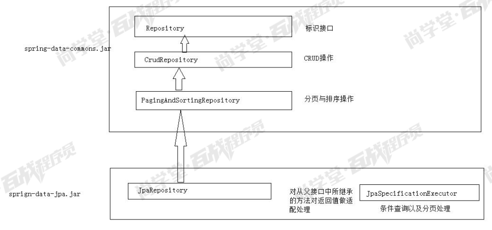
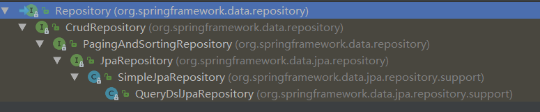
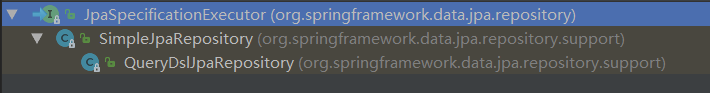
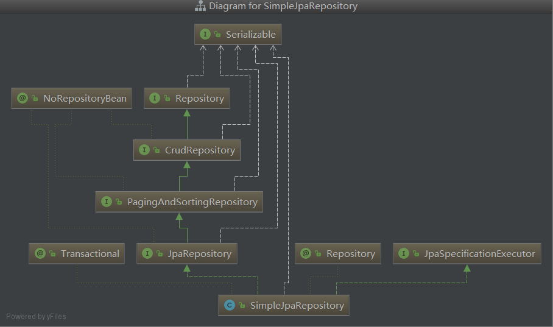
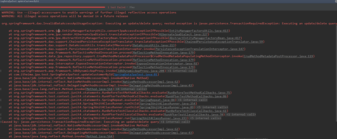
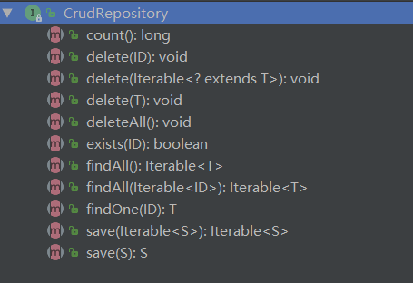
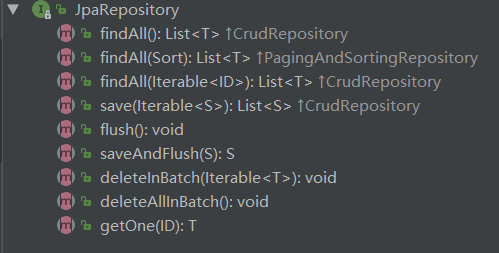
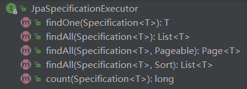

## SpringDatJPA基本使用

### Spring Data JPA 的接口继承结构








Spring Data JPA 的运行原理,实际上工作的是SimpleJpaRepository类：
```java
@PersistenceContext(name="entityManagerFactory")
private EntityManager em;
@Test
public void test1(){
    //org.springframework.data.jpa.repository.support.SimpleJpaRepository@fba8bf
    //System.out.println(this.usersDao);
    //class com.sun.proxy.$Proxy29 代理对象 是基于 JDK 的动态代理方式创建的
    //System.out.println(this.usersDao.getClass());
    JpaRepositoryFactory factory = new JpaRepositoryFactory(em);
    //getRepository(UsersDao.class);可以帮助我们为接口生成实现类。 而这个实现类是 SimpleJpaRepository 的对象
    //要求： 该接口必须要是继承 Repository 接口
    UsersDao ud = factory.getRepository(UsersDao.class);
    System.out.println(ud);
    System.out.println(ud.getClass());
}
```

Repository是一个声明接口，要使用Spring Data JPA必须继承它。

在实际开发中我们会继承JpaRepository，有时候也会继承JpaSpecificationExecutor接口(必须继承JpaRepository，因为JpaSpecificationExecutor没有继承Repository 接口),然后我们就可以使用接口中定义的方法进行查询

### Repository 接口
Repository 接口是 Spring Data JPA 中为我我们提供的所有接口中的顶层接口

Repository 提供了两种查询方式的支持

* 1） 基于方法名称命名规则查询    
* 2） 基于@Query 注解查询  

#### 方法名称命名规则查询
顾名思义，方法命名规则查询就是根据方法的名字，就能创建查询。只需要按照Spring Data JPA提供的方法命名规则定义方法的名称，就可以完成查询工作。Spring Data JPA在程序执行的时候会根据方法名称进行解析，并自动生成查询语句进行查询

按照Spring Data JPA 定义的规则，查询方法以findBy开头，涉及条件查询时，条件的属性用条件关键字连接，要注意的是：条件属性首字母需大写。框架在进行方法名解析时，会先把方法名多余的前缀截取掉，然后对剩下部分进行解析。

规则： findBy(关键字)+属性名称(属性名称的首字母大写)+查询条件(首字母大写)

| 关键字            | 方法命名                       | sql where字句              |
| ----------------- | ------------------------------ | -------------------------- |
| And               | findByNameAndPwd               | where name= ? and pwd =?   |
| Or                | findByNameOrSex                | where name= ? or sex=?     |
| Is,Equals         | findByIdIs,findByIdEquals      | where id= ?                |
| Between           | findByIdBetween                | where id between ? and ?   |
| LessThan          | findByIdLessThan               | where id < ?               |
| LessThanEqual     | findByIdLessThanEqual          | where id <= ?              |
| GreaterThan       | findByIdGreaterThan            | where id > ?               |
| GreaterThanEqual  | findByIdGreaterThanEqual       | where id > = ?             |
| After             | findByIdAfter                  | where id > ?               |
| Before            | findByIdBefore                 | where id < ?               |
| IsNull            | findByNameIsNull               | where name is null         |
| isNotNull,NotNull | findByNameNotNull              | where name is not null     |
| Like              | findByNameLike                 | where name like ?          |
| NotLike           | findByNameNotLike              | where name not like ?      |
| StartingWith      | findByNameStartingWith         | where name like '?%'       |
| EndingWith        | findByNameEndingWith           | where name like '%?'       |
| Containing        | findByNameContaining           | where name like '%?%'      |
| OrderBy           | findByIdOrderByXDesc           | where id=? order by x desc |
| Not               | findByNameNot                  | where name <> ?            |
| In                | findByIdIn(Collection<?> c)    | where id in (?)            |
| NotIn             | findByIdNotIn(Collection<?> c) | where id not  in (?)       |
| True              | findByAaaTue                   | where aaa = true           |
| False             | findByAaaFalse                 | where aaa = false          |
| IgnoreCase        | findByNameIgnoreCase           | where UPPER(name)=UPPER(?) |

##### 测试

Entity：
```java
import java.io.Serializable;

import javax.persistence.Column;
import javax.persistence.Entity;
import javax.persistence.GeneratedValue;
import javax.persistence.GenerationType;
import javax.persistence.Id;
import javax.persistence.Table;

@Entity
@Table(name="t_users")
public class Users implements Serializable{

	@Id
	@GeneratedValue(strategy=GenerationType.IDENTITY)//strategy=GenerationType.IDENTITY 自增长
	@Column(name="userid")
	private Integer userid;
	
	@Column(name="username")
	private String username;
	
	@Column(name="userage")
	private Integer userage;

	public Integer getUserid() {
		return userid;
	}

	public void setUserid(Integer userid) {
		this.userid = userid;
	}

	public String getUsername() {
		return username;
	}

	public void setUsername(String username) {
		this.username = username;
	}

	public Integer getUserage() {
		return userage;
	}

	public void setUserage(Integer userage) {
		this.userage = userage;
	}	
}
```

接口
```java
public interface UsersDao extends Repository<Users, Integer> {
	
	List<Users> findByUsernameIs(String string);
	List<Users> findByUsernameLike(String string);
	List<Users> findByUsernameAndUserageGreaterThanEqual(String name,Integer age);
}
```

测试类
```java
@RunWith(SpringJUnit4ClassRunner.class)
@ContextConfiguration("classpath:applicationContext.xml")
public class RepositoryTest {

	@Autowired
	private UsersDao usersDao;
	
	/**
	 * 需求：使用用户名作为查询条件
	 */
	@Test
	public void test1(){
		/**
		 * 判断相等的条件，有三种表示方式
		 * 1,什么都不写，默认的就是做相等判断
		 * 2,Is
		 * 3,Equal
		 */
		List<Users> list = this.usersDao.findByUsernameIs("王五");
		for (Users users : list) {
			System.out.println(users);
		}
	}
	
	/**
	 * 需求：根据用户姓名做Like处理
	 * Like:条件关键字
	 */
	@Test
	public void test2(){
		List<Users> list = this.usersDao.findByUsernameLike("王%");
		for (Users users : list) {
			System.out.println(users);
		}
	}
	
	/**
	 * 需求：查询名称为王五，并且他的年龄大于等于22岁
	 */
	@Test
	public void test3(){
		List<Users> list = this.usersDao.findByUsernameAndUserageGreaterThanEqual("王五", 22);
		for (Users users : list) {
			System.out.println(users);
		}
	}
}
```

#### 基于@Query 注解的查询
使用Spring Data JPA提供的查询方法已经可以解决大部分的应用场景，但是对于某些业务来说，我们还需要灵活的构造查询条件，这时就可以使用@Query注解，结合JPQL或者SQL的语句方式完成查询

@Query 注解的使用非常简单，只需在方法上面标注该注解，同时提供一个JPQL或者SQL查询语句即可


**推荐用原生sql查询，jpql语句虽然兼容多种数据库但是不容易测试，sql便于测试而且其他很多地方都用到SQL语句，多练练也不错**

##### 通过 JPQL 语句查询
JPQL： 通过 Hibernate 的 HQL 演变过来的。 他和 HQL 语法及其相似。

接口：
```java
//使用@Query注解查询
@Query(value="from Users where username = ?")
List<Users> queryUserByNameUseJPQL(String name);

@Query("from Users where username like ?")
List<Users> queryUserByLikeNameUseJPQL(String name);

@Query("from Users where username = ? and userage >= ?")
List<Users> queryUserByNameAndAge(String name,Integer age);
```
测试：
```java
/**
 * 测试@Query查询 JPQL
 */
@Test
public void test4(){
    List<Users> list = this.usersDao.queryUserByNameUseJPQL("王五");
}

/**
 * 测试@Query查询 JPQL
 */
@Test
public void test5(){
    List<Users> list = this.usersDao.queryUserByLikeNameUseJPQL("王%");
}

/**
 * 测试@Query查询 JPQL
 */
@Test
public void test6(){
    List<Users> list = this.usersDao.queryUserByNameAndAge("王五", 22);
}
```

##### 通过 SQL 语句查询
接口：
```java
//使用@Query注解查询SQL
//nativeQuery:默认的是false.表示不开启sql查询。是否对value中的语句做转义。
@Query(value="select * from t_users where username = ?",nativeQuery=true)
List<Users> queryUserByNameUseSQL(String name);

@Query(value="select * from t_users where username like ?",nativeQuery=true)
List<Users> queryUserByLikeNameUseSQL(String name);

@Query(value="select * from t_users where username = ? and userage >= ?",nativeQuery=true)
List<Users> queryUserByNameAndAgeUseSQL(String name,Integer age);
```
测试：
```java
/**
 * 测试@Query查询 SQL
 */
@Test
public void test7(){
    List<Users> list = this.usersDao.queryUserByNameUseSQL("王五");
}

/**
 * 测试@Query查询 SQL
 */
@Test
public void test8(){
    List<Users> list = this.usersDao.queryUserByLikeNameUseSQL("王%");
}

/**
 * 测试@Query查询 SQL
 */
@Test
public void test9(){
    List<Users> list = this.usersDao.queryUserByNameAndAgeUseSQL("王五", 22);
}
```

##### 通过@Query 注解完成数据更新
也可以通过使用 @Query 来执行一个更新操作，为此，我们需要在使用 @Query 的同时，用 @Modifying 来将该操作标识为修改查询，这样框架最终会生成一个更新的操作，而非查询
```java
@Query(value="update Customer set custName = ?1 where custId = ?2")
@Modifying
public void updateCustomer(String custName,Long custId);
```
执行测试方法时发生如下异常：

发生此异常的原因是由于更新操作在执行是没有开启事务，所以会出现此问题。可以在此测试方法上开启事务，并且设置执行方法之后提交。
```java
@Test
@Transactional      //添加事务
@Commit             //执行之后提交
public void updateCustomerById() {
    customerDao.updateCustomerNameById( 2l,"李金山");
}
```
或者在dao的方法上添加@Transactional注解也可以解决此问题
```java
@Query("update Customer set custName=?2 where custId=?1")
@Modifying
@Transactional
public void updateCustomerNameById(long id, String name);
```

又或者：
```java
@Query("update Users set userage = ? where userid = ?")
@Modifying //@Modifying当前语句是一个更新语句
void updateUserAgeById(Integer age,Integer id);
```
```java
/**
 * 测试@Query update
 */
@Test
@Transactional
@Rollback(false)
public void test10(){
    this.usersDao.updateUserAgeById(24, 5);
}
```

### CrudRepository 接口


接口
```java
public interface UsersDao extends CrudRepository<Users, Integer> {
	
}
```

测试代码
```java
@RunWith(SpringJUnit4ClassRunner.class)
@ContextConfiguration("classpath:applicationContext.xml")
public class RepositoryTest {

	@Autowired
	private UsersDao usersDao;
	
	/**
	 * 添加单条数据
	 */
	@Test
	public void test1(){
		Users user = new Users();
		user.setUserage(21);
		user.setUsername("赵小丽");
		this.usersDao.save(user);
	}
	
	/**
	 * 批量添加数据
	 */
	@Test
	public void test2(){
		Users user = new Users();
		user.setUserage(21);
		user.setUsername("赵小丽");
		
		Users user1 = new Users();
		user1.setUserage(25);
		user1.setUsername("王小虎");
		
		List<Users> list= new ArrayList<>();
		list.add(user);
		list.add(user1);
		
		this.usersDao.save(list);
		
	}
	
	/**
	 * 根据ID查询单条数据
	 */
	@Test
	public void test3(){
		Users users = this.usersDao.findOne(13);
		System.out.println(users);
	}
	
	/**
	 * 查询全部数据
	 */
	@Test
	public void test4(){
		List<Users> list = (List<Users>)this.usersDao.findAll();
		for (Users users : list) {
			System.out.println(users);
		}
	}
	
	/**
	 * 删除数据
	 */
	@Test
	public void test5(){
		this.usersDao.delete(13);
	}
	
	/**
	 * 更新数据 方式一
	 */
	@Test
	public void test6(){
		Users user = this.usersDao.findOne(12);
		user.setUsername("王小红");
		this.usersDao.save(user);
	}
	
	/**
	 * 更新数据 方式二
	 */
	@Test
	@Transactional
	@Rollback(false)
	public void test7(){
		Users user = this.usersDao.findOne(12);//持久化状态的
		user.setUsername("王小小");
	}
}
```

### PagingAndSortingRepository 接口
```java
public interface PagingAndSortingRepository<T, ID extends Serializable> extends CrudRepository<T, ID> {
	Iterable<T> findAll(Sort sort);
	Page<T> findAll(Pageable pageable);
}
```

接口
```java
public interface UsersDao extends PagingAndSortingRepository<Users, Integer>{
	
}
```

测试代码
```java
@RunWith(SpringJUnit4ClassRunner.class)
@ContextConfiguration("classpath:applicationContext.xml")
public class RepositoryTest {

	@Autowired
	private UsersDao usersDao;
	
	/**
	 * 分页
	 */
	@Test
	public void test1(){
		int page = 2; //page:当前页的索引。注意索引都是从0开始的。
		int size = 3;// size:每页显示3条数据
		Pageable pageable= new PageRequest(page, size);
		Page<Users> p = this.usersDao.findAll(pageable);
		System.out.println("数据的总条数："+p.getTotalElements());
		System.out.println("总页数："+p.getTotalPages());
		List<Users> list = p.getContent();
		for (Users users : list) {
			System.out.println(users);
		}
	}
	
	/**
	 * 对单列做排序处理
	 */
	@Test
	public void test2(){
		//Sort:该对象封装了排序规则以及指定的排序字段(对象的属性来表示)
		//direction:排序规则
		//properties:指定做排序的属性
		Sort sort = new Sort(Direction.DESC,"userid");
		List<Users> list = (List<Users>)this.usersDao.findAll(sort);
		for (Users users : list) {
			System.out.println(users);
		}
	}
	
	/**
	 * 多列的排序处理
	 */
	@Test
	public void test3(){
		//Sort:该对象封装了排序规则以及指定的排序字段(对象的属性来表示)
		//direction:排序规则
		//properties:指定做排序的属性
		Order order1 = new Order(Direction.DESC,"userage");
		Order order2 = new Order(Direction.ASC,"username");
		Sort sort = new Sort(order1,order2);
		List<Users> list = (List<Users>)this.usersDao.findAll(sort);
		for (Users users : list) {
			System.out.println(users);
		}
	}
}
```

### JpaRepository 接口
JpaRepository 接口是我们开发时使用的最多的接口。 其特点是可以帮助我们将其他接口的方法的返回值做适配处理。 可以使得我们在开发时更方便的使用这些方法。


接口
```java
public interface UsersDao extends JpaRepository<Users, Integer>{
	
}
```

测试代码
```java
@RunWith(SpringJUnit4ClassRunner.class)
@ContextConfiguration("classpath:applicationContext.xml")
public class RepositoryTest {

	@Autowired
	private UsersDao usersDao;
	
	/**
	 * 查询全部数据
	 */
	@Test
	public void test1(){
		List<Users> list  = this.usersDao.findAll();
		for (Users users : list) {
			System.out.println(users);
		}
	}
}
```

### JpaSpecificationExecutor 接口
**有时我们在查询某个实体的时候，给定的条件是不固定的，这时就需要动态构建相应的查询语句**，在Spring Data JPA中可以通过JpaSpecificationExecutor接口查询。相比JPQL其优势是类型安全、更加的面向对象。完成多条件查询， 并且支持分页与排序。


对于JpaSpecificationExecutor，这个接口基本是围绕着Specification接口来定义的。我们可以简单的理解为，Specification构造的就是查询条件。

#### Specification接口定义
```java
//构造查询条件
/**
*	root	：Root接口，代表查询的根对象，可以通过root获取实体中的属性
*	query	：代表一个顶层查询对象，用来自定义查询
*	cb		：用来构建查询，此对象里有很多条件方法
**/
public Predicate toPredicate(Root<T> root, CriteriaQuery<?> query, CriteriaBuilder cb);
```
此接口定义非常简单，其中只有一个方法就是toPredicate，它的作用就是生成Predicate对象，也就是查询条件。

参数说明：

* 1、CriteriaBuilder：用来构建CritiaQuery的构建器对象    
* 2、CriteriaQuery：代表一个specific的顶层查询对象，它包含着查询的各个部分，比如：select 、from、where、group by、order by等注意：CriteriaQuery对象只对实体类型或嵌入式类型的Criteria查询起作用。通过调用CriteriaBuilder的createQuery或createTupleQuery方法可以获得CriteriaQuery的实例    
* 3、Root：代表Criteria查询的根对象，Criteria查询的查询根定义了实体类型，能为将来导航获得想要的结果，它与SQL查询中的FROM子句类似。可以通过调用CriteriaQuery的from方法可以获得Root实例  


返回值：
Predicate：一个简单或复杂的谓词类型，其实就相当于条件或者是条件组合。

可以简单理解为：

* CriteriaQuery：sql语句中的各种关键字。例如wherer、order by、group by、having等    
* Root：设置from    
* CriteriaBuilder：设置具体查询条件  

#### CriteriaBuilder方法对应关系
| 方法名称                    | Sql对应关系          |
| --------------------------- | -------------------- |
| equle                       | filed = value        |
| gt（greaterThan ）          | filed > value        |
| lt（lessThan ）             | filed < value        |
| ge（greaterThanOrEqualTo ） | filed >= value       |
| le（ lessThanOrEqualTo）    | filed <= value       |
| notEqule                    | filed != value       |
| like                        | filed like value     |
| notLike                     | filed not like value |


#### 测试
接口
```java
/**
 * JpaSpecificationExecutor接口讲解
 * 注意：JpaSpecificationExecutor<Users>:不能单独使用，需要配合着jpa中的其他接口一起使用
 */
public interface UsersDao extends JpaRepository<Users, Integer>,JpaSpecificationExecutor<Users>{
	
}
```

测试代码
```java
@RunWith(SpringJUnit4ClassRunner.class)
@ContextConfiguration("classpath:applicationContext.xml")
public class RepositoryTest {

	@Autowired
	private UsersDao usersDao;
	
	/**
	 * 需求：根据用户姓名查询数据
	 */
	@Test
	public void test1(){
		Specification<Users> spec = new Specification<Users>() {

			/**
			 * @return Predicate:定义了查询条件
			 * @param Root<Users> root:根对象。封装了查询条件的对象
			 * @param CriteriaQuery<?> query:定义了一个基本的查询。一般不使用
			 * @param CriteriaBuilder cb:创建一个查询条件
			 */
			@Override
			public Predicate toPredicate(Root<Users> root, CriteriaQuery<?> query, CriteriaBuilder cb) {
				Predicate pre = cb.equal(root.get("username"), "王五");
				return pre;
			}
		};
		List<Users> list = this.usersDao.findAll(spec);
		for (Users users : list) {
			System.out.println(users);
		}
	}
	
	/**
	 * 多条件查询 方式一
	 * 需求：使用用户姓名以及年龄查询数据
	 */
	@Test
	public void test2(){
		Specification<Users> spec = new Specification<Users>() {

			@Override
			public Predicate toPredicate(Root<Users> root, CriteriaQuery<?> query, CriteriaBuilder cb) {
				List<Predicate> list = new ArrayList<>();
				list.add(cb.equal(root.get("username"),"王五"));
				list.add(cb.equal(root.get("userage"),24));
				//此时条件之间是没有任何关系的。
				Predicate[] arr = new Predicate[list.size()];
				return cb.and(list.toArray(arr));
			}
			
		};
		List<Users> list = this.usersDao.findAll(spec);
		for (Users users : list) {
			System.out.println(users);
		}
	}
	
	/**
	 * 多条件查询 方式二
	 * 需求：使用用户姓名或者年龄查询数据
	 */
	@Test
	public void test3(){
		Specification<Users> spec = new Specification<Users>() {

			@Override
			public Predicate toPredicate(Root<Users> root, CriteriaQuery<?> query, CriteriaBuilder cb) {
				return cb.or(cb.equal(root.get("username"),"王五"),cb.equal(root.get("userage"), 25));
			}
			
		};
		List<Users> list = this.usersDao.findAll(spec);
		for (Users users : list) {
			System.out.println(users);
		}
	}
	
	/**
	 * 需求：查询王姓用户，并且做分页处理
	 */
	@Test
	public void test4(){
		//条件
		Specification<Users> spec = new Specification<Users>() {

			@Override
			public Predicate toPredicate(Root<Users> root, CriteriaQuery<?> query, CriteriaBuilder cb) {
				return cb.like(root.get("username").as(String.class), "王%");
			}
			
		};
		
		//分页
		Pageable pageable = new PageRequest(2, 2);
		Page<Users> page = this.usersDao.findAll(spec, pageable);
		System.out.println("总条数："+page.getTotalElements());
		System.out.println("总页数："+page.getTotalPages());
		List<Users> list = page.getContent();
		for (Users users : list) {
			System.out.println(users);
		}
	}
	
	/**
	 * 需求：查询数据库中王姓的用户，并且根据用户id做倒序排序
	 */
	@Test
	public void test5(){
		//条件
		Specification<Users> spec = new Specification<Users>() {

			@Override
			public Predicate toPredicate(Root<Users> root, CriteriaQuery<?> query, CriteriaBuilder cb) {
				return cb.like(root.get("username").as(String.class), "王%");
			}
			
		};
		//排序
		Sort sort = new Sort(Direction.DESC,"userid");
		List<Users> list = this.usersDao.findAll(spec, sort);
		for (Users users : list) {
			System.out.println(users);
		}
	}
	
	/**
	 * 需求：查询数据库中王姓的用户，做分页处理，并且根据用户id做倒序排序
	 */
	@Test
	public void test6(){
		//排序等定义
		Sort sort = new Sort(Direction.DESC,"userid");
		//分页的定义
		Pageable pageable = new PageRequest(2,2, sort);
		
		//查询条件
		Specification<Users> spec = new Specification<Users>() {

			@Override
			public Predicate toPredicate(Root<Users> root, CriteriaQuery<?> query, CriteriaBuilder cb) {
				return cb.like(root.get("username").as(String.class), "王%");
			}
			
		};
		Page<Users> page = this.usersDao.findAll(spec, pageable);
		System.out.println("总条数："+page.getTotalElements());
		System.out.println("总页数："+page.getTotalPages());
		List<Users> list = page.getContent();
		for (Users users : list) {
			System.out.println(users);
		}
	}
	
}
```

### 使用Example快速实现动态查询
#### Example官方介绍
Query by Example (QBE) is a user-friendly querying technique with a simple interface. It allows dynamic query creation and does not require to write queries containing field names. In fact, Query by Example does not require to write queries using store-specific query languages at all.

谷歌翻译： 

按例查询（QBE）是一种用户界面友好的查询技术。 它允许动态创建查询，并且不需要编写包含字段名称的查询。 实际上，按示例查询不需要使用特定的数据库的查询语言来编写查询语句。

#### Example api的组成
* Probe: 含有对应字段的实例对象。    
* ExampleMatcher：ExampleMatcher携带有关如何匹配特定字段的详细信息，相当于匹配条件。    
* Example：由Probe和ExampleMatcher组成，用于查询。  

#### 限制
* 属性不支持嵌套或者分组约束，比如这样的查询 firstname = ?0 or (firstname = ?1 and lastname = ?2)    
* 灵活匹配只支持字符串类型，其他类型只支持精确匹配  

Limitations 

1. No support for nested/grouped property constraints like firstname = ?0 or (firstname = ?1 and lastname = ?2)   
2. Only supports starts/contains/ends/regex matching for strings and exact matching for other property types  

#### 使用
创建实体映射：
```java
@Entity
@Table(name="t_user")
@Data
@AllArgsConstructor
@NoArgsConstructor
@ToString
public class User {

    @Id
    @GeneratedValue(strategy = GenerationType.IDENTITY)
    private Integer id;

    @Column(name="username")
    private String username;

    @Column(name="password")
    private String password;

    @Column(name="email")
    private String email;

    @Column(name="phone")
    private String phone;

    @Column(name="address")
    private String address;
}
```

测试查询：
```java
@Test
public void contextLoads() {
    User user = new User();
    user.setUsername("admin");
    Example<User> example = Example.of(user);
    List<User> list = userRepository.findAll(example);
    System.out.println(list);
}

打印的sql语句如下：

Hibernate: 
    select
        user0_.id as id1_0_,
        user0_.address as address2_0_,
        user0_.email as email3_0_,
        user0_.password as password4_0_,
        user0_.phone as phone5_0_,
        user0_.username as username6_0_ 
    from
        t_user user0_ 
    where
        user0_.username=?
```
可以发现，试用Example查询，默认情况下会忽略空值，官方文档也有说明：

This is a simple domain object. You can use it to create an Example. By default, fields having null values are ignored, and strings are matched using the store specific defaults. Examples can be built by either using the of factory method or by using ExampleMatcher. Example is immutable.

在上面的测试之中，我们只是只是定义了Probe而没有ExampleMatcher，是因为默认会不传时会使用默认的匹配器。点进方法可以看到下面的代码：
```java
static <T> Example<T> of(T probe) {
    return new TypedExample(probe, ExampleMatcher.matching());
}

static ExampleMatcher matching() {
    return matchingAll();
}

static ExampleMatcher matchingAll() {
    return (new TypedExampleMatcher()).withMode(ExampleMatcher.MatchMode.ALL);
}
```

#### 自定匹配器规则
```java
@Test
public void contextLoads() {
    User user = new User();
    user.setUsername("y");
    user.setAddress("sh");
    user.setPassword("admin");
    ExampleMatcher matcher = ExampleMatcher.matching()
            .withMatcher("username", ExampleMatcher.GenericPropertyMatchers.startsWith())//模糊查询匹配开头，即{username}%
            .withMatcher("address" ,ExampleMatcher.GenericPropertyMatchers.contains())//全部模糊查询，即%{address}%
            .withIgnorePaths("password");//忽略字段，即不管password是什么值都不加入查询条件
    Example<User> example = Example.of(user ,matcher);
    List<User> list = userRepository.findAll(example);
    System.out.println(list);
}

打印的sql语句如下：
select
    user0_.id as id1_0_,
    user0_.address as address2_0_,
    user0_.email as email3_0_,
    user0_.password as password4_0_,
    user0_.phone as phone5_0_,
    user0_.username as username6_0_ 
from
    t_user user0_ 
where
    (
        user0_.username like ?
    ) 
    and (
        user0_.address like ?
    )

参数如下：
2018-03-24 13:26:57.425 TRACE 5880 --- [           main] o.h.type.descriptor.sql.BasicBinder      : binding parameter [1] as [VARCHAR] - [y%]
2018-03-24 13:26:57.425 TRACE 5880 --- [           main] o.h.type.descriptor.sql.BasicBinder      : binding parameter [2] as [VARCHAR] - [%sh%]
```


#### 补充
##### 官方创建ExampleMatcher例子（1.8 lambda）
```java
ExampleMatcher matcher = ExampleMatcher.matching()
  .withMatcher("firstname", match -> match.endsWith())
  .withMatcher("firstname", match -> match.startsWith());
}
```
##### StringMatcher 参数
| Matching                      | 生成的语句                                  | 说明                   |
| ----------------------------- | ------------------------------------------- | ---------------------- |
| DEFAULT (case-sensitive)      | firstname = ?0                              | 默认（大小写敏感）     |
| DEFAULT (case-insensitive)    | LOWER(firstname) = LOWER(?0)                | 默认（忽略大小写）     |
| EXACT (case-sensitive)        | firstname = ?0                              | 精确匹配（大小写敏感） |
| EXACT (case-insensitive)      | LOWER(firstname) = LOWER(?0)                | 精确匹配（忽略大小写） |
| STARTING (case-sensitive)     | firstname like ?0 + ‘%’                     | 前缀匹配（大小写敏感） |
| STARTING (case-insensitive)   | LOWER(firstname) like LOWER(?0) + ‘%’       | 前缀匹配（忽略大小写） |
| ENDING (case-sensitive)       | firstname like ‘%’ + ?0                     | 后缀匹配（大小写敏感） |
| ENDING (case-insensitive)     | LOWER(firstname) like ‘%’ + LOWER(?0)       | 后缀匹配（忽略大小写） |
| CONTAINING (case-sensitive)   | firstname like ‘%’ + ?0 + ‘%’               | 模糊查询（大小写敏感） |
| CONTAINING (case-insensitive) | LOWER(firstname) like ‘%’ + LOWER(?0) + ‘%’ | 模糊查询（忽略大小写） |

说明： 
1. 在默认情况下（没有调用withIgnoreCase()）都是大小写敏感的。 
2. api之中还有个regex，但是我在mysql下测试报错，不了解具体作用。

#### 总结
1、通过在使用springdata jpa时可以通过Example来快速的实现动态查询，同时配合Pageable可以实现快速的分页查询功能。通过在使用springdata jpa时可以通过Example来快速的实现动态查询，同时配合Pageable可以实现快速的分页查询功能。    
2、对于非字符串属性的只能精确匹配，比如想查询在某个时间段内注册的用户信息，就不能通过Example来查询对于非字符串属性的只能精确匹配，比如想查询在某个时间段内注册的用户信息，就不能通过Example来查询

```java

```