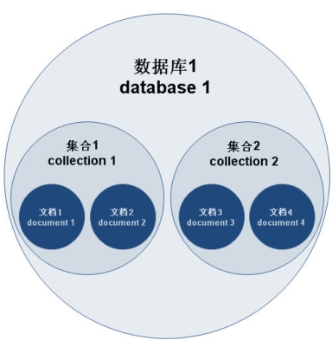
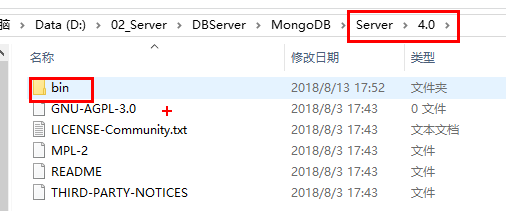
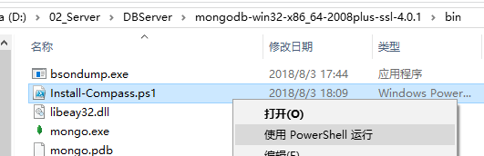
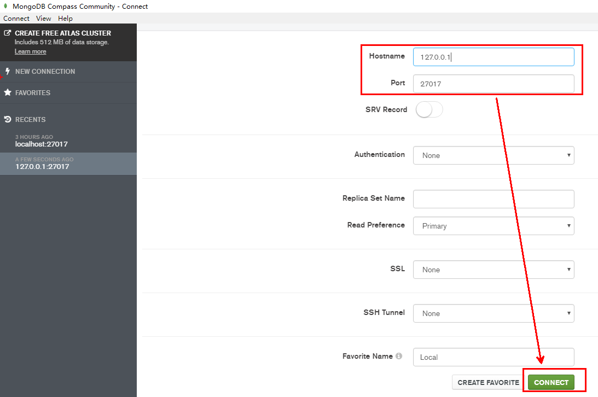
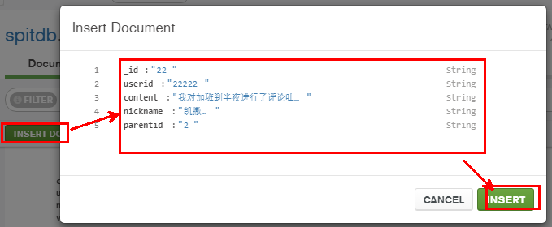

# 文档型数据库MongoDB

v1.0.28_201904 By BoBo

课程目标：

- 理解MongoDB的特点、业务场景和熟悉体系结构、数据类型等。
- 能够安装和启动MongoDB、图形化管理界面Compass的安装使用
- 掌握常用的MongoDB各种命令
- 熟悉Java操作MongoDB（了解）
- 使用Spring Data MongoDB完成吐槽微服务的相关业务的开发


# 1. MongoDB概述

## 1.1 吐槽和评论数据特点分析

吐槽（微博、朋友圈）和评论（文章评论、商品评论）两项功能存在以下特点：

（1）数据量大

（2）写入操作频繁（读写都很频繁）

（3）价值较低

对于这样的数据，我们更适合使用MongoDB来实现数据的存储。

## 1.2 什么是MongoDB

MongoDB 是一个跨平台的，面向文档的数据库，是当前 NoSQL 数据库产品中最热门的一种。它介于关系数据库和非关系数据库之间，是非关系数据库当中功能最丰富，最像关系数据库的产品。它支持的数据结构非常松散，是类似 JSON 的 BSON 格式，因此可以存储比较复杂的数据类型。
​	MongoDB 的官方网站地址是：http://www.mongodb.org/

## 1.3 MongoDB特点

 MongoDB 最大的特点是他支持的查询语言非常强大，其语法有点类似于面向对象的查询语言，几乎可以实现类似关系数据库单表查询的绝大部分功能，而且还支持对数据建立索引。它是一个面向集合的,模式自由的文档型数据库。
具体特点总结如下：
（1）面向集合存储，易于存储对象类型的数据
（2）模式自由
（3）支持动态查询
（4）支持完全索引，包含内部对象
（5）支持复制和故障恢复
（6）使用高效的二进制数据存储，包括大型对象（如视频等）
（7）自动处理碎片，以支持云计算层次的扩展性
（8）支持 Python，PHP，Ruby，Java，C，C#，Javascript，Perl 及 C++语言的驱动程序，社区中也提供了对 Erlang 及.NET 等平台的驱动程序
（9） 文件存储格式为 BSON（一种 JSON 的扩展）

## 1.4 MongoDB体系结构

MongoDB 的逻辑结构是一种层次结构。主要由：
文档(document)、集合(collection)、数据库(database)这三部分组成的。逻辑结构是面向用户的，用户使用 MongoDB 开发应用程序使用的就是逻辑结构。
（1）MongoDB 的文档（document），相当于关系数据库中的一行记录。
（2）多个文档组成一个集合（collection），相当于关系数据库的表。
（3）多个集合（collection），逻辑上组织在一起，就是数据库（database）。
（4）一个 MongoDB 实例支持多个数据库（database）。
文档(document)、集合(collection)、数据库(database)的层次结构如下图:



下表是MongoDB与MySQL数据库逻辑结构概念的对比：

| MongoDB           | 关系型数据库Mysql |
| ----------------- | ----------------- |
| 数据库(databases) | 数据库(databases) |
| 集合(collections) | 表(table)         |
| 文档(document)    | 行(row)           |

## 1.5 Bson数据类型

BSON (Binary JSON) Serialization，BSON( Binary Serialized Document Format) 是一种二进制形式的存储格式，采用了类似于 C 语言结构体的名称、对表示方法，支持内嵌的文档对象和数组对象，具有轻量性、可遍历性、高效性的特点，可以有效描述非结构化数据和结构化数据。

- null：用于表示空值或者不存在的字段，{“x”:null}
- 布尔型：布尔类型有两个值true和false，{“x”:true}
- 数值：shell默认使用64位浮点型数值。{“x”：3.14}或{“x”：3}。对于整型值，可以使用NumberInt（4字节符号整数）或NumberLong（8字节符号整数），{“x”:NumberInt(“3”)}{“x”:NumberLong(“3”)}
- 字符串：UTF-8字符串都可以表示为字符串类型的数据，{“x”：“呵呵”}
- 日期：日期被存储为自新纪元依赖经过的毫秒数，不存储时区，{“x”:new Date()}
- 正则表达式：查询时，使用正则表达式作为限定条件，语法与JavaScript的正则表达式相同，{“x”:/[abc]/}
- 数组：数据列表或数据集可以表示为数组，{“x”： [“a“，“b”,”c”]}
- 内嵌文档：文档可以嵌套其他文档，被嵌套的文档作为值来处理，{“x”:{“y”:3 }}
- 对象Id：对象id是一个12字节的字符串，是文档的唯一标识，{“x”: objectId() }
- 二进制数据：二进制数据是一个任意字节的字符串。它不能直接在shell中使用。如果要将非utf-字符保存到数据库中，二进制数据是唯一的方式。
- 代码：查询和文档中可以包括任何JavaScript代码，{“x”:function(){/…/}}


# 2. MongoDB安装与启动

## 2.1 Window系统MongoDB安装

1. 下载安装包

   到官网下载，可以下载`msi`的安装版，也可以下载`zip`的免安装版。

   - 安装版可选自动安装服务到系统中（会自动生成数据目录和日志目录），可选安装图形化工具Compass（DBA管理工具，联网情况下自动下载并安装）。


   - 免安装版需要手动建立目录，若要安装到系统服务中也需要手动操作。

2. 安装

   安装版的安装：直接双击运行安装文件，按照提示步骤安装即可。如果步安装服务，则不会自动生成data和log目录。

   

   免安装版的安装：解压压缩包到一个目录，在安装目录中手动建立`data`目录用于存放数据文件，建立`log`文件夹用于存放日志文件。

   为了方便我们每次启动，可以将安装目录的bin目录设置到环境变量的path中，`bin`目录下是一些常用命令，比如`mongod`启动服务用的，`mongo`客户端连接服务用的。

3. 运行启动

一、命令行参数方式启动服务
（1）首先打开命令提示符，创建一个用于存放数据的目录（如果安装后已经建立了，可以省略该步骤）

```
md D:\02_Server\DBServer\mongodb-win32-x86_64-2008plus-ssl-4.0.1\data
```


（2）启动服务

```
mongod --dbpath=..\data
或
mongod --dbpath=D:\02_Server\DBServer\mongodb-win32-x86_64-2008plus-ssl-4.0.1\data
```

我们在启动信息中可以看到，mongoDB的默认端口是27017，如果我们想改变默认的启动端口，可以通过--port来指定端口。

三、配置文件方式启动服务

在bin目录中新建配置文件`mongod.conf `，内如参考如下：

```
storage:
  #The directory where the mongod instance stores its data.Default Value is "\data\db" on Windows.
  dbPath: D:\02_Server\DBServer\mongodb-win32-x86_64-2008plus-ssl-4.0.1\data

```

详细配置项内容可以参考官方文档：https://docs.mongodb.com/manual/reference/configuration-options/ 

【注意】

1）配置文件中如果使用双引号，比如路径地址，自动会将双引号的内容转义。如果不转义，则会报错：

```
error-parsing-yaml-config-file-yaml-cpp-error-at-line-3-column-15-unknown-escape-character-d
```

解决：

a. 对`\`换成`/`或`\\`

b. 如果路径中没有空格，则无需加引号。

2）配置文件中不能以Tab分割字段 

解决：

将其转换成空格。


启动方式：

```
mongod --config mongod.conf
或
mongod -f mongod.conf
```

【扩展了解】基本配置参考：

```yaml
systemLog:
   destination: file
   #The path of the log file to which mongod or mongos should send all diagnostic logging information
   path: "D:/02_Server/DBServer/mongodb-win32-x86_64-2008plus-ssl-4.0.1/log/mongod.log"
   logAppend: true
storage:
   journal:
      enabled: true
   #The directory where the mongod instance stores its data.Default Value is "/data/db".
   dbPath: "D:/02_Server/DBServer/mongodb-win32-x86_64-2008plus-ssl-4.0.1/data"
net:
   #bindIp: 127.0.0.1
   port: 27017
setParameter:
   enableLocalhostAuthBypass: false
```


## 2.2 Mongo命令行客户端的连接


在命令提示符输入以下命令即可完成登陆

```
mongo
或
mongo --host=127.0.0.1 --port=27017
```

查看已经有的数据库

```
>show databases
```

退出mongodb

```
exit
```


更多参数可以通过帮助查看：

```
mongo --help
```


## 2.3 Compass-图形化界面客户端

MongoDB安装版在安装时，默认选中了Compass，会自动安装，桌面上会有一个树叶图标名字叫`MongoDB Compass Community`。

如果当时没有勾选安装，或使用的是免安装版，则需要手动安装。

安装时又可以使用在线安装和离线安装两种方式。

1）在线安装

在mongodb的安装目录的bin目录中，找到`Install-Compass.ps1`文件，右键菜单中选择“使用PowerShell运行”。



2）离线安装

到MongoDB官网下载MongoDB Compass，

地址：[https://www.mongodb.com/download-center/v2/compass?initial=true](https://www.mongodb.com/download-center/v2/compass?initial=true)

如果是下载安装版，则按照步骤安装；如果是下载加压缩版，直接解压，执行里面的`MongoDBCompassCommunity.exe`文件即可。

在打开的界面中，输入主机地址、端口等相关信息，点击连接：




## 2.4 Docker 环境下MongoDB安装

在宿主机创建mongo容器：

```
docker run -id --name=tensquare_mongo -p 27017:27017 mongo:4.0.2
或
docker run -id --name=tensquare_mongo -p 27017:27017 -v /var/mongodb/data:/data/db mongo:4.0.2
或
docker run -id --name=tensquare_mongo -p 27017:27017 -v /var/mongodb/data/db:/data/db -v /var/mongodb/data/configdb:/data/configdb --privileged=true mongo:4.0.2
```

远程登陆测试：（命令行或图形化界面）

```
mongo 192.168.40.128
或
mongo --host 192.168.40.132
```

了解：MongoDB数据库勒索事件


# 3. MongoDB常用命令

## 3.1 案例需求

以吐槽表（数据存放到MongoDB中）为例讲解MongoDB常用命令

| 吐槽集合（表、集合） | spit       |                |                   |
| -------------------- | ---------- | -------------- | ----------------- |
| 字段名称             | 字段含义   | 字段类型       | 备注              |
| _id                  | ID         | ObjectId或文本 | Mongo的主键的字段 |
| content              | 吐槽内容   | 文本           |                   |
| publishtime          | 发布日期   | 日期           |                   |
| userid               | 发布人ID   | 文本           |                   |
| nickname             | 发布人昵称 | 文本           |                   |
| visits               | 浏览量     | 整型           |                   |
| thumbup              | 点赞数     | 整型           |                   |
| share                | 分享数     | 整型           |                   |
| comment              | 回复数     | 整型           |                   |
| state                | 是否可见   | 文本           |                   |
| parentid             | 上级ID     | 文本           | 主吐槽的ID        |

## 3.2 选择和创建数据库

选择和创建数据库的语法格式：

```
use 数据库名称
```


如果数据库不存在则自动创建，以下语句创建spit数据库

```
use spitdb
```


## 3.3 插入文档

插入文档的语法格式：

```
db.集合名称.insert(数据);
```

我们这里可以插入以下测试数据：

```
db.spit.insert({content:"听说十次方课程很给力呀",userid:"1011",nickname:"肉丝",visits:NumberInt(902)})
```

提示：mongo中的数字，默认情况下是double类型，如果要存整型，必须使用函数NumberInt(整型数字)，否则取出来就有问题了。

执行后，如下，说明插入一个数据成功了。

```
WriteResult({ "nInserted" : 1 })
```


## 3.4 基本查询文档

查询集合的语法格式：

```
db.集合名称.find(条件)
```

如果我们要查询spit集合的所有文档，我们输入以下命令

```
db.spit.find()
或
db.spit.find({})
```

这里你会发现每条文档会有一个叫_id的字段，这个相当于我们原来关系数据库中表的主键，当你在插入文档记录时没有指定该字段，MongoDB会自动创建，其类型是ObjectID类型。如果我们在插入文档记录时指定该字段也可以，其类型可以是ObjectID类型，也可以是MongoDB支持的任意类型。
输入以下测试语句:

```
db.spit.insert({_id:"1",content:"我还是没有想明白到底为啥出错",userid:"1012",nickname:"小明",visits:NumberInt(2020)});
db.spit.insert({_id:"2",content:"加班到半夜",userid:"1013",nickname:"凯撒",visits:NumberInt(1023)});
db.spit.insert({_id:"3",content:"手机流量超了咋办？",userid:"1013",nickname:"凯撒",visits:NumberInt(111)});
db.spit.insert({_id:"4",content:"坚持就是胜利",userid:"1014",nickname:"诺诺",visits:NumberInt(1223)});
```

如果我想按一定条件来查询，比如我想查询userid为1013的记录，怎么办？很简单！只
要在find()中添加参数即可，参数也是json格式，如下：

```
db.spit.find({userid:'1013'})
或
db.spit.find({userid:"1013"})
```

【另外】

如果你只需要返回符合条件的第一条数据，我们可以使用findOne命令来实现

```
db.spit.findOne({userid:'1013'})
```


补充：查询排序：

```
db.spit.find().sort({userid:-1,visits:1})
```

ps: 1 代表正序，-1代表倒序


## 3.5 修改与删除文档

修改文档的语法结构：

```
db.集合名称.update(条件,修改后的数据)
```

如果我们想修改_id为1的记录，浏览量为2000，输入以下语句：

```
db.spit.update({_id:"1"},{visits:NumberInt(2000)})
```

执行后，我们会发现，这条文档除了visits字段其它字段都不见了，为了解决这个问题，我们需要使用修改器$set来实现，命令如下：

我们想修改_id为2的记录，浏览量为2000，输入以下语句：

```
db.spit.update({_id:"2"},{$set:{visits:NumberInt(2000)}})
```

这样就OK啦。
删除文档的语法结构：

```
db.集合名称.remove(条件)
```

以下语句可以将数据全部删除，请慎用（暂时不做）

```
db.spit.remove({})
```

如果删除_id=1的记录，输入以下语句

```
db.spit.remove({_id:"1"})
```


## 3.6 统计查询

统计记录条件使用count()方法。

```
db.集合名称.count(条件)
```

以下语句统计spit集合的记录数，如果没有条件，则统计所有。

```
db.spit.count()
```

如果按条件统计 ，例如：统计userid为1013的记录条数

```
db.spit.count({userid:"1013"})
```


## 3.7 分页列表查询

可以使用limit()方法来读取指定数量的数据，使用skip()方法来跳过指定数量的数据。

如果你想返回指定条数的记录，可以在find方法后调用limit来返回结果(TopN)，例如：

```
db.spit.find().limit(3)
```

skip方法同样接受一个数字参数作为跳过的记录条数。（前N个不要）

```
db.spit.find().skip(3)
```

分页查询：需求：每页2个，第二页开始：跳过前两条数据，接着值显示3和4条数据

```
//第一页
db.spit.find().skip(0).limit(2)
//第二页
db.spit.find().skip(2).limit(2)
//第三页
db.spit.find().skip(4).limit(2)
```


## 3.8 正则的复杂条件查询

MongoDB的模糊查询是通过**正则表达式**的方式实现的。格式为：

```
/模糊查询字符串/
```

例如，我要查询吐槽内容包含“流量”的所有文档，代码如下：

```
db.spit.find({content:/流量/})
```

如果要查询吐槽内容中以“加班”开头的，代码如下：

```
db.spit.find({content:/^手机/})
```


## 3.9 比较查询

<, <=, >, >= 这个操作符也是很常用的，格式如下:

```
db.集合名称.find({ "field" : { $gt: value }}) // 大于: field > value
db.集合名称.find({ "field" : { $lt: value }}) // 小于: field < value
db.集合名称.find({ "field" : { $gte: value }}) // 大于等于: field >= value
db.集合名称.find({ "field" : { $lte: value }}) // 小于等于: field <= value
db.集合名称.find({ "field" : { $ne: value }}) // 不等于: field != value
```

示例：查询吐槽浏览量大于500的记录

```
db.spit.find({visits:{$gt:NumberInt(500)}})

```


## 3.10 包含查询

包含使用$in操作符。
示例：查询吐槽集合中userid字段包含1013或1014的文档

```
db.spit.find({userid:{$in:["1013","1014"]}})
```

不包含使用$nin操作符。
示例：查询吐槽集合中userid字段不包含1013和1014的文档

```
db.spit.find({userid:{$nin:["1013","1014"]}})
```


## 3.11 条件连接查询

我们如果需要查询同时满足两个以上条件，需要使用$and操作符将条件进行关联。（相
当于SQL的and）
格式为：

```
$and:[ {  },{  },{ } ]
```

示例：查询吐槽集合中visits大于等于500 并且小于1000的文档：

```
db.spit.find({$and:[{visits:{$gte:NumberInt(500)}},{visits:{$lt:NumberInt(1000)}}]})
或
db.spit.find({$and:[ {visits:{$gte:500}} ,{visits:{$lt:1000} }]})
```

如果两个以上条件之间是或者的关系，我们使用 操作符进行关联，与前面 and的使用方式相同
格式为：

```
$or:[ {  },{  },{   } ]
```

示例：查询吐槽集合中userid为1013，或者浏览量小于1000的文档记录

```
db.spit.find({$or:[ {userid:"1013"} ,{visits:{$lt:1000} }]})
```


## 3.12 列值增长

如果我们想实现对某列值在原有值的基础上进行增加或减少，可以使用$inc运算符来实现。

需求：对3号数据的浏览量，每次递增1

```
db.spit.update({_id:"3"},{$inc:{visits:NumberInt(1)}})
```


## 3.13 常用命令小结

```
选择切换数据库：use spitdb
插入数据：db.spit.insert({bson数据})
查询所有数据：db.spit.find();
条件查询数据：db.spit.find({条件})
查询符合条件的第一条记录：db.spit.findOne({条件})
查询符合条件的前几条记录：db.spit.find({条件}).limit(条数)
查询符合条件的跳过的记录：db.spit.find({条件}).skip(条数)
修改数据：db.spit.update({条件},{修改后的数据}) 或db.spit.update({条件},{$set:{要修改部分的字段:数据})
修改数据并自增某字段值：db.spit.update({条件},{$inc:{自增的字段:步进值}})
删除数据：db.spit.remove({条件})
统计查询：db.spit.count({条件})
模糊查询：db.spit.find({字段名:/正则表达式/})
条件比较运算：db.spit.find({字段名:{$gt:值}})
包含查询：db.spit.find({字段名:{$in:[值1，值2]}})或db.spit.find({字段名:{$nin:[值1，值2]}})
条件连接查询：db.spit.find({$and:[{条件1},{条件2}]})或db.spit.find({$or:[{条件1},{条件2}]})

```


# 4. Java操作MongoDB

## 4.1 mongodb-driver（了解）

mongodb-driver是mongo官方推出的java连接mongoDB的驱动包，相当于JDBC驱动。我们通过一个入门的案例来了解mongodb-driver的基本使用。

官方驱动说明和下载：http://mongodb.github.io/mongo-java-driver/
​	官方驱动示例文档：http://mongodb.github.io/mongo-java-driver/3.8/driver/getting-started/quick-start/


### 4.1.1 快速使用

第一步：创建测试工程mongodbdemo，引入依赖：

```xml
<?xml version="1.0" encoding="UTF-8"?>
<project xmlns="http://maven.apache.org/POM/4.0.0"
         xmlns:xsi="http://www.w3.org/2001/XMLSchema-instance"
         xsi:schemaLocation="http://maven.apache.org/POM/4.0.0 http://maven.apache.org/xsd/maven-4.0.0.xsd">
    <modelVersion>4.0.0</modelVersion>

    <groupId>cn.itcast.demo</groupId>
    <artifactId>mongodemo</artifactId>
    <version>1.0-SNAPSHOT</version>
    <dependencies>
        <!--MongoDB驱动-->
        <dependency>
            <groupId>org.mongodb</groupId>
            <artifactId>mongodb-driver</artifactId>
            <version>3.8.0</version>
        </dependency>

        <dependency>
            <groupId>junit</groupId>
            <artifactId>junit</artifactId>
            <version>4.12</version>
            <scope>test</scope>
        </dependency>
    </dependencies>

</project>
```

【了解】

`mongodb-driver-async`是异步驱动，效率高，但必须是JDK7以上版本或使用Netty。

如果JDK6或以下，只能使用`mongodb-driver`驱动了。


第二步：创建测试类，编写第一个程序：插入数据

cn.itcast.demo.MongoFirstTest

```java
import com.mongodb.client.MongoClient;
import com.mongodb.client.MongoClients;
import com.mongodb.client.MongoCollection;
import com.mongodb.client.MongoDatabase;
import org.bson.Document;
import org.junit.Test;

import java.util.Date;

public class MongoFirstTest {

    //插入一条数据
    @Test
    public void testInsert(){
        //创建一个连接，自带连接池效果
        MongoClient mongoClient= MongoClients.create("mongodb://192.168.40.128:27017");
        //操作一个数据库，如果数据库不存在，当您为该数据库首次存储数据时，会自动创建数据库。
        MongoDatabase spitdbDatabase = mongoClient.getDatabase("spitdb");
        //得到一个集合对象，如果集合不存在，当您为该数据库首次存储数据时，会自动创建集合。
        MongoCollection<Document> collection = spitdbDatabase.getCollection("spit");
        //创建一个文档，参数可以接收键值对，也可以直接接收一个Map对象
        //文档对象的本质是BSON类型，该类型对应java.util.Map;BSON数组对应的是java.util.List
        Document document=new Document("content","原生驱动操作API")
                .append("userid","8888")
                .append("visits",1234)
                .append("publishtime",new Date());

        //插入一个文档，如果文档没有指定_id，则自动生成_id和值
        // 如果批量插入，使用insertMany(list)
        collection.insertOne(document);
        //释放资源
        mongoClient.close();
    }
}

```

测试结果：查看数据是否正常插入。


### 4.1.2 CRUD

下面基于junit编写CRUD，参考代码如下：

cn.itcast.demo.MongoCrudTest

```java
package cn.itcast.demo;
import com.mongodb.client.*;
import com.mongodb.client.model.Filters;
import org.bson.Document;
import org.bson.conversions.Bson;
import org.bson.types.ObjectId;
import org.junit.After;
import org.junit.Before;
import org.junit.Test;

import java.util.Date;

public class MongoCrudTest {
    //连接对象
    private MongoClient mongoClient=null;
    //数据库对象
    private MongoDatabase spitdbDatabase=null;
    //集合对象
    private MongoCollection<Document> collection=null;
    @Before
    public void setUp() throws Exception {
        //创建一个连接，自带连接池效果
        mongoClient= MongoClients.create("mongodb://192.168.40.128:27017");
        //操作一个数据库，如果数据库不存在，当您为该数据库首次存储数据时，会自动创建数据库。
        spitdbDatabase = mongoClient.getDatabase("spitdb");
        //得到一个集合对象，如果集合不存在，当您为该数据库首次存储数据时，会自动创建集合。
        collection = spitdbDatabase.getCollection("spit");
    }

    @After
    public void tearDown() throws Exception {
        //释放资源，关闭连接
        mongoClient.close();
    }

    //插入一个文档
    @Test
    public void testInsertOne(){

        //创建一个文档，参数可以接收键值对，也可以直接接收一个Map对象
        //文档对象的本质是BSON类型，该类型对应java.util.Map;BSON数组对应的是java.util.List
        Document document=new Document("content","原生驱动操作API")
                .append("userid","8888")
                .append("visits",1234)
                .append("publishtime",new Date());

        //插入一个文档，如果文档没有指定_id，则自动生成_id和值
        // 如果批量插入，使用insertMany(list)
        collection.insertOne(document);
    }
    //更新一个文档
    @Test
    public void testUpdateOne(){
        //条件文档数据，注意，主键_id的类型比较特殊，如果是自动生成的主键，则是ObjectId类型
        Document conditionDocument=new Document("_id",new ObjectId("5b724502e3be2c2cc8961c7e"));
        //要修改后的文档数据，其中$set代表只更新部分字段
        Document document=new Document("$set",new Document("content","原生驱动操作API再次说明"));

        //更新一个文档，参数1：条件，参数2：要更新的内容
        collection.updateOne(conditionDocument,document);
        // 如果批量更新，使用updateMany(bson1,bson2)，条件文档中可以编写更复杂的条件。
    }

    //删除一个文档
    @Test
    public void testDeleteOne(){
        //条件文档数据，注意，主键_id的类型比较特殊，如果是自动生成的主键，则是ObjectId类型
        Document conditionDocument=new Document("_id",new ObjectId("5b724502e3be2c2cc8961c7e"));
        //更新一个文档，参数1：条件
        collection.deleteOne(conditionDocument);
        // 如果批量删除，使用deleteMany(bson1,bson2)，条件文档中可以编写更复杂的条件。
    }
    
    //查询所有
    @Test
    public void testFindAll(){
        //查询所有文档
        FindIterable<Document> documents = collection.find();
        printDocument(documents);
        //如果需要限制返回行数，可以在find()方法后添加first()、limit()等方法
    }

    //打印文档
    private void printDocument(FindIterable<Document> documents) {
        for (Document document : documents) {
            System.out.println("-------------------------------");
            System.out.println("编号：" + document.getObjectId("_id"));
            System.out.println("内容：" + document.getString("content"));
            System.out.println("用户编号：" + document.getString("userid"));
            System.out.println("浏览量 ：" + document.getInteger("visits"));
            System.out.println("发布时间：" + document.getDate("publishtime"));
        }
    }


    //条件查询
    @Test
    public void testFindByCondition(){
        //查询userid为8888，且浏览量大于等于1000的所有文档：{$and:[{$eq:{"userid":"8888"},$gte:{"visits":1000}}]}
        //Filters是一个构造条件的帮助类
        FindIterable<Document> documents = collection.find(Filters.and(Filters.eq("userid","8888"),Filters.gte("visits",1000)));
        printDocument(documents);
    }

}


```

【提示】

复杂条件的拼接，可以通过Filters的类的静态方法进行操作，该方法返回的是Bson对象。


## 4.2 SpringDataMongoDB

### 4.2.1 介绍

SpringData家族成员之一，用于操作MongoDB的持久层框架，封装了底层的mongodb-driver。

官网主页： https://projects.spring.io/spring-data-mongodb/

我们十次方项目的吐槽微服务就采用SpringDataMongoDB框架。


# 5. 吐槽微服务

## 5.1 需求分析

采用SpringDataMongoDB框架实现吐槽微服务的持久层。
实现功能：

（1）基本增删改查API

（2）根据上级ID查询吐槽列表

（3）吐槽点赞

（4）发布吐槽

## 5.2 表结构分析

| 专栏文章评论 | comment    |          |                                |
| ------------ | ---------- | -------- | ------------------------------ |
| 字段名称     | 字段含义   | 字段类型 | 备注                           |
| _id          | ID         | 文本     |                                |
| content      | 吐槽内容   | 文本     |                                |
| publishtime  | 发布日期   | 日期     |                                |
| userid       | 发布人ID   | 文本     |                                |
| nickname     | 发布人昵称 | 文本     |                                |
| visits       | 浏览量     | 数字     |                                |
| thumbup      | 点赞数     | 数字     |                                |
| share        | 分享数     | 数字     |                                |
| comment      | 回复数     | 数字     |                                |
| state        | 状态       | 文本     |                                |
| parentid     | 上级ID     | 文本     | 如果没有该值表示文章的顶级吐槽 |


## 5.3 模块搭建

（1）搭建子模块tensquare_spit，pom.xml引入依赖：

```xml
<?xml version="1.0" encoding="UTF-8"?>
<project xmlns="http://maven.apache.org/POM/4.0.0"
         xmlns:xsi="http://www.w3.org/2001/XMLSchema-instance"
         xsi:schemaLocation="http://maven.apache.org/POM/4.0.0 http://maven.apache.org/xsd/maven-4.0.0.xsd">
    <parent>
        <artifactId>tensquare_parent</artifactId>
        <groupId>com.tensquare</groupId>
        <version>1.0-SNAPSHOT</version>
    </parent>
    <modelVersion>4.0.0</modelVersion>

    <artifactId>tensquare_spit</artifactId>

    <dependencies>
        <dependency>
            <groupId>org.springframework.boot</groupId>
            <artifactId>spring-boot-starter-data-mongodb</artifactId>
        </dependency>
        <dependency>
            <groupId>com.tensquare</groupId>
            <artifactId>tensquare_common</artifactId>
            <version>1.0-SNAPSHOT</version>
        </dependency>
    </dependencies>
</project>
```

（2）创建application.yml

```yaml
server:
  #服务端口
  port: 9006
spring:
  application:
    #指定服务名
    name: tensquare-spit
  #数据源配置
  data:
    mongodb:
      # 主机地址
      host: 192.168.40.128
      # 数据库
      database: spitdb
      # 默认端口是27017
      port: 27017

```

（3）创建启动类

cn.tensquare.spit.SpitApplication

```java
package cn.tensquare.spit;
import org.springframework.boot.SpringApplication;
import org.springframework.boot.autoconfigure.SpringBootApplication;
import org.springframework.cache.annotation.EnableCaching;
import org.springframework.context.annotation.Bean;
import utils.IdWorker;

@SpringBootApplication
public class SpitApplication {

	public static void main(String[] args) {
		SpringApplication.run(SpitApplication.class, args);
	}

	@Bean
	public IdWorker idWorker(){
		return new IdWorker(1, 1);
	}
	
}

```


## 5.4 基本增删改查

（1）创建实体类
创建包com.tensquare.spit，包下建包po用于存放实体类，创建实体类

cn.tensquare.spit.po.Spit

```java
package cn.tensquare.spit.po;

import org.springframework.data.annotation.Id;
import org.springframework.data.mongodb.core.mapping.Document;
import org.springframework.data.mongodb.core.mapping.Field;

import java.io.Serializable;
import java.util.Date;

/**
 * 吐槽实体类
 */
//把一个java类声明为mongodb的文档，可以通过collection参数指定这个类对应的文档。
//@Document(collection="mongodb 对应 collection 名")
// 若未加 @Document ，该 bean save 到 mongo 的 spit collection
// 若添加 @Document ，则 save 到 spit collection
@Document(collection="spit")//可以省略，如果省略，则默认使用类名小写映射集合
public class Spit implements Serializable {
    //主键标识，该属性的值会自动对应mongodb的主键字段"_id"，如果该属性名就叫“id”,则该注解可以省略，否则必须写
    @Id
    private String id;//主键
    //该属性对应mongodb的字段的名字，如果一致，则无需该注解
    @Field("content")
    private String content;//吐槽内容
    private Date publishtime;//发布日期
    private String userid;//发布人ID
    private String nickname;//昵称
    private Integer visits;//浏览量
    private Integer thumbup;//点赞数
    private Integer share;//分享数
    private Integer comment;//回复数
    private String state;//状态
    private String parentid;//上级ID
    //getter and setter.....
    public String getId() {
        return id;
    }

    public void setId(String id) {
        this.id = id;
    }

    public String getContent() {
        return content;
    }

    public void setContent(String content) {
        this.content = content;
    }

    public Date getPublishtime() {
        return publishtime;
    }

    public void setPublishtime(Date publishtime) {
        this.publishtime = publishtime;
    }

    public String getUserid() {
        return userid;
    }

    public void setUserid(String userid) {
        this.userid = userid;
    }

    public String getNickname() {
        return nickname;
    }

    public void setNickname(String nickname) {
        this.nickname = nickname;
    }

    public Integer getVisits() {
        return visits;
    }

    public void setVisits(Integer visits) {
        this.visits = visits;
    }

    public Integer getThumbup() {
        return thumbup;
    }

    public void setThumbup(Integer thumbup) {
        this.thumbup = thumbup;
    }

    public Integer getShare() {
        return share;
    }

    public void setShare(Integer share) {
        this.share = share;
    }

    public Integer getComment() {
        return comment;
    }

    public void setComment(Integer comment) {
        this.comment = comment;
    }

    public String getState() {
        return state;
    }

    public void setState(String state) {
        this.state = state;
    }

    public String getParentid() {
        return parentid;
    }

    public void setParentid(String parentid) {
        this.parentid = parentid;
    }
}
```


补充：

@Indexed

org.springframework.data.mongodb.core.index.Indexed.class
声明该字段需要索引，建索引可以大大的提高查询效率。

@CompoundIndex

org.springframework.data.mongodb.core.index.CompoundIndex.class
复合索引的声明，建复合索引可以有效地提高多字段的查询效率。


（2）创建数据访问接口
com.tensquare.spit包下创建dao包，包下创建接口

cn.tensquare.spit.dao.SpitRepository

```java
package cn.tensquare.spit.dao;

import cn.tensquare.spit.po.Spit;
import org.springframework.data.mongodb.repository.MongoRepository;

/**
 * 吐槽数据访问层
 */
public interface SpitRepository extends MongoRepository<Spit,String> {
}

```

（3）创建业务逻辑类
com.tensquare.spit包下创建service包，包下创建类

```java
package cn.tensquare.spit.service;

import cn.tensquare.spit.dao.SpitRepository;
import cn.tensquare.spit.po.Spit;
import org.springframework.beans.factory.annotation.Autowired;
import org.springframework.stereotype.Service;
import utils.IdWorker;

import java.util.Date;
import java.util.List;

@Service
public class SpitService {
    @Autowired
    private SpitRepository spitRepository;

    @Autowired
    private IdWorker idWorker;

    /**
     * 增加
     *
     * @param spit
     */
    public void saveSpit(Spit spit) {
        spit.setId(idWorker.nextId() + "");
        spitRepository.save(spit);
    }

    /**
     * 修改
     *
     * @param spit
     */
    public void updateSpit(Spit spit) {
        spitRepository.save(spit);
    }

    /**
     * 删除
     *
     * @param id
     */
    public void deleteSpitById(String id) {
        spitRepository.deleteById(id);
    }

    /**
     * 查询全部列表
     *
     * @return
     */
    public List<Spit> findSpitList() {
        return spitRepository.findAll();
    }

    /**
     * 根据ID查询实体
     *
     * @param id
     * @return
     */
    public Spit findSpitById(String id) {
        return spitRepository.findById(id).get();
    }
}

```

（4）com.tensquare.spit包下创建controller类

cn.tensquare.spit.web.controller.SpitController

```java
package cn.tensquare.spit.web.controller;

        import cn.tensquare.spit.po.Spit;
        import cn.tensquare.spit.service.SpitService;
        import constants.StatusCode;
        import dto.ResultDTO;
        import org.springframework.beans.factory.annotation.Autowired;
        import org.springframework.web.bind.annotation.*;

/**
 *
 */
@RestController
@CrossOrigin
@RequestMapping("/spit")
public class SpitController {

    @Autowired
    private SpitService spitService;
    /**
     * 增加
     * @param spit
     */
    @PostMapping
    public ResultDTO add(@RequestBody Spit spit){
        spitService.saveSpit(spit);
        return new ResultDTO(true, StatusCode.OK,"增加成功");
    }

    /**
     * 修改
     * @param spit
     */
    @PutMapping("/{id}")
    public ResultDTO edit(@RequestBody Spit spit, @PathVariable String id ){
        spit.setId(id);
        spitService.updateSpit(spit);
        return new ResultDTO(true,StatusCode.OK,"修改成功");
    }

    /**
     * 删除
     * @param id
     */
    @DeleteMapping("/{id}")
    public ResultDTO remove(@PathVariable String id ){
        spitService.deleteSpitById(id);
        return new ResultDTO(true,StatusCode.OK,"删除成功");
    }

    /**
     * 查询全部数据
     * @return
     */
    @GetMapping
    public ResultDTO list(){
        return new ResultDTO(true,StatusCode.OK,"查询成功",spitService.findSpitList());
    }

    /**
     * 根据ID查询
     * @param id ID
     * @return
     */
    @GetMapping("/{id}")
    public ResultDTO listById(@PathVariable String id){
        return new ResultDTO(true,StatusCode.OK,"查询成功",spitService.findSpitById(id));
    }
}

```

【注意】

将公共异常处理的类拷贝进来。


（5）测试：在Swagger中测试查询所有。

```
GET http://localhost:9006/spit
```


参考测试数据

```
{
  "_id": "1001",
  "content": "吐槽测试01",
  "userid": "9999",
  "nickname": "小九九",
  "visits": 1500,
  "thumbup": 500,
  "share": 300,
  "comment": 100,
  "state": "1",
  "parentid": ""
}
```


## 5.5 根据上级ID查询吐槽评论的分页列表

（1）SpitRespository新增方法定义

```java
    /**
     * 根据上级ID查询吐槽列表（分页）
     * @param parentid
     * @param pageable
     * @return
     */
    Page<Spit> findByParentid(String parentid, Pageable pageable);
```


（2）SpitService新增方法

```java
 /**
     * 根据上级ID查询吐槽列表
     * @param parentid
     * @param page
     * @param size
     * @return
     */
    public Page<Spit> findSpitListPageByParentid(String parentid,int page,int size){
        return spitRepository.findByParentid(parentid, PageRequest.of(page-1,size));
    }
```


（3）SpitController新增方法

```java
/**
     * 根据上级ID查询吐槽分页数据
     * @param parentid
     * @param page
     * @param size
     * @return
     */
    @GetMapping("/comment/{parentid}/{page}/{size}")
    public ResultDTO listPageByParentid(@PathVariable String parentid , @PathVariable int page, @PathVariable int size){
        Page<Spit> pageResponse = spitService.findSpitListPageByParentid(parentid, page, size);
        return  new ResultDTO(true,StatusCode.OK,"查询成功",  new PageResultDTO<Spit>(pageResponse.getTotalElements(), pageResponse.getContent()) );
    }
```


（4）测试

先造一个对一个吐槽进行吐槽评论的数据，这里使用compass插入数据：



插入的数据参考：

```
{
  “_id”:"22"
  "content": "我对加班到半夜进行了评论吐槽，你们真苦啊哈哈",
  "userid": "22222",
  "nickname": "凯撒的粉丝",
  "parentid": "2"
}
```


查询

```
GET http://localhost:9006/spit/comment/2/1/10
```


## 5.6 吐槽点赞MongoTemplate

我们看一下以下点赞的临时示例代码： SpitService 新增updateThumbup方法

```java
    /**
     * 点赞-效率低
     * @param id
     */
    public void updateSpitThumbupToIncrementingOld(String id){
        Spit spit = spitRepository.findById(id).get();
        spit.setThumbup(spit.getThumbup()+1);
        spitRepository.save(spit);
    }
```

以上方法虽然实现起来比较简单，但是执行效率并不高，因为我只需要将点赞数加1就可以了，没必要查询出所有字段修改后再更新所有字段。

我们可以使用MongoTemplate类来实现对某列的操作。
（1）修改SpitService

```java
    //注入MongoTemplate
    @Autowired
    private MongoTemplate mongoTemplate;

/**
     * 使用底层的MongoTemplate工具类来直接操作
     * 根据吐槽的id，增加点赞的数量
     * @param id
     */
   public void updateSpitThumbupToIncrementing(String id){
       System.out.println("------"+id);
       //构建查询条件对象
       Query query=new Query();
       //添加条件
       query.addCriteria(Criteria.where("_id").is(id));

       //构建要修改的对象
       Update update=new Update();
        //对点赞数递增1
        //参数1：递增的字段，参数2：递增的步进，这里是每次+1
        update.inc("thumbup",1);
       //        update.set(key,value)//更新部分字段

       //更新符合条件的第一条记录，
       //参数1：查询条件对象；参数2：要修改的对象；参数3：映射的实体类或集合名字
       //db.spit.update({_id:"213123123123"},{$inc:{thumbup:NumberInt(1)}})
       mongoTemplate.updateFirst(query,update,"spit");
       //更新多条文档-参考
//       mongoTemplate.updateMulti(Query.query(Criteria.where("content").is("吐槽测试01"))
//               ,Update.update("visits",1100)
//               ,Spit.class);
   }
```

（2）SpitController新增方法

```java
/**
     *  根据吐槽id，增加点赞的数量
     * @param id
     * @return
     */
    @PutMapping("/thumbup/{id}")
    public ResultDTO incrementThumbup(@PathVariable String id){
        spitService.updateSpitThumbupToIncrementing(id);
        return new ResultDTO(true,StatusCode.OK,"点赞成功");
    }
```


（3）测试:

```
PUT http://localhost:9006/spit/thumbup/2
```


## 5.7 使用Redis控制不能重复点赞

业务：一个用户，在24小时内，对某吐槽，只能点赞一次。

解决方案：基于Redis缓存实现控制的，我们可以通过redis控制用户不能重复点赞。


（1）首先引入依赖

```xml
        <dependency>
            <groupId>org.springframework.boot</groupId>
            <artifactId>spring-boot-starter-data-redis</artifactId>
        </dependency>
```

（2）修改application.yml，在spring节点下面新增：

```yaml
	redis:
        # Redis服务器地址（默认localhost）
        host: 192.168.40.128
```

（3）修改SpitController代码的incrementThumbup方法的逻辑

```java

      //注入redistemplate
    @Autowired
    private RedisTemplate<String,String> redisTemplate;
//    @Autowired
//    private StringRedisTemplate redisTemplate;

    /**
     *  根据吐槽id，增加点赞的数量
     * @param id
     * @return
     */
    @PutMapping("/thumbup/{id}")
    public ResultDTO incrementThumbup(@PathVariable String id){
        //目标：某用户24小时内只能点赞一次
        //1)获取当前登录的用户，后边我们会修改为真正的当前登陆的用户（先写死）
        String userid="2023";
        //2)定义已经点赞的用户在Redis中存放的key
        String redisKey="thumbup_"+userid+"_"+ id;
        //3)判断用户是否点过赞
        if(null!=redisTemplate.opsForValue().get(redisKey)){
            //如果存在，说明该用户已经点过赞了
            return new ResultDTO(false, StatusCode.REPERROR,"您已经点过赞了");
        }
        //24小时内没有点过赞的
        //点赞
        spitService.updateSpitThumbupToIncrementing(id);
        //在redis中记录一下:将该用户和吐槽信息放入Redis缓存,并设置24小时内有效
//        redisTemplate.opsForValue().set(redisKey,"1",1, TimeUnit.DAYS);
        redisTemplate.opsForValue().set(redisKey,"1",15, TimeUnit.SECONDS);

        return new ResultDTO(true,StatusCode.OK,"点赞成功");
    }
```


## 5.8 发布吐槽

修改SpitService的saveSpit方法

```java

/**
     * 发布吐槽（或吐槽评论）
     *
     * @param spit
     */
    public void saveSpit(Spit spit) {
        //主键
        spit.setId(idWorker.nextId() + "");
        //默认值
        spit.setPublishtime(new Date());//发布时间为当前时间
        spit.setVisits(0);//浏览量
        spit.setShare(0);//分享数
        spit.setThumbup(0);//点赞数
        spit.setComment(0);//回复数
        spit.setState("1");//状态
        //保存新的吐槽
        spitRepository.save(spit);
        //判断是否存在上级id--处理对某个吐槽进行评论吐槽后，父吐槽的评论数+1
        if(!StringUtils.isEmpty(spit.getParentid())){
            //如果存在，则说明是在回复吐槽，则需要将被回复的吐槽的回复数+1
            mongoTemplate.updateFirst(
                    Query.query(Criteria.where("_id").is(spit.getParentid()))
                    ,new Update().inc("comment",1)
                    ,"spit");
        }
    }
```

提示：用户id是由表现层提供。


测试：

增加吐槽的参考数据

```
POST http://localhost:9006/spit
{
  "content": "明天会刮大风",
  "userid": "9001",
  "nickname": "李大仙"
}
```
增加吐槽回复的参考数据

```
POST http://localhost:9006/spit
{
  "content": "明天不但会刮大风，还会下大雨",
  "userid": "9002",
  "nickname": "王小仙",
  "parentid":"1029392400205877248"
}
```


## 5.9 增加浏览量与分享数

学员实现


# 6. 文章评论功能开发（课后）

业务分析：文章有评论的功能，比如“头条详情”的文章，下方就有评论区。本节就是完成文章的评论功能。

## 表结构分析

| 专栏文章评论 | comment  |          |                           |
| ------------ | -------- | -------- | ------------------------- |
| 字段名称     | 字段含义 | 字段类型 | 备注                      |
| _id          | ID       | 文本     |                           |
| articleid    | 文章ID   | 文本     |                           |
| content      | 评论内容 | 文本     |                           |
| userid       | 评论人ID | 文本     |                           |
| parentid     | 父评论ID | 文本     | 如果为0表示文章的顶级评论 |
| publishdate  | 评论日期 | 日期     |                           |


以下功能学员实现

## 新增评论

（1）修改tensquare_article工程的pom.xml，添加Spring Data MongoDB的依赖：

```java
		<dependency>
            <groupId>org.springframework.boot</groupId>
            <artifactId>spring-boot-starter-data-mongodb</artifactId>
        </dependency>
```

（2）修改application.yml ,在spring节点下新增配置

```yaml
  data:
    mongodb:
      host: 192.168.184.134
      database: commentdb
```

（3）创建实体类

```java
/**
 * 文章评论（mongoDB）
 * @author Administrator
 *
 */
public class Comment implements Serializable{
@Id    
private String _id;    
private String articleid;    
private String content;    
private String userid;    
private String parentid;    
private Date publishdate;    
   
    //getter and setter....
}
```

（4）创建数据访问接口

```java
/**
 * 评论Dao
 * @author Administrator
 *
 */
public interface CommentRepository extends MongoRepository<Comment, String> {
 
}
```

（5）创建业务逻辑类

```java
@Service
public class CommentService {
    @Autowired    
    private CommentRepository commentRepository;    

    @Autowired    
    private IdWorker idWorker;    

    public void add(Comment comment){    
        comment.setId( idWorker.nextId()+""  );        
        commentRepository.save(comment);                
    }    
}
```

（6）创建控制器类

```java
@RestController
@CrossOrigin
@RequestMapping("/comment")
public class CommentController {
    @Autowired    
    private CommentService commentService;    

    @RequestMapping(method= RequestMethod.POST)    
        public Result save(@RequestBody Comment comment){    
        commentService.add(comment);        
        return new Result(true, StatusCode.OK, "提交成功 ");        
    }    
}
```

## 根据文章ID查询评论列表

（1）CommentDao新增方法定义

```java
/**    
 * 根据文章ID查询评论列表    
 * @param articleid    
 * @return    
 */    
public List<Comment> findByArticleid(String articleid); 
```

（2）CommentService新增方法

```java
public List<Comment> findByArticleid(String articleid){    
	return commentRepository.findByArticleid(articleid);                
} 
```

（3）CommentController新增方法

```java
@RequestMapping(value="/article/{articleid}",method= RequestMethod.GET)
public Result findByArticleid(@PathVariable String articleid){
return new Result(true, StatusCode.OK, "查询成功", 
	commentService.findByArticleid(articleid));
   
}
```

## 删除评论

代码略


# 7. 总结

## 课程总结

## 面试问题

1. 你在项目中有没有使用到mongodb?

2. 你的工程是如何操作MongoDB的？

   spring data mongodb

3. 在项目的哪些场景下使用MongoDB ?

   吐槽 、文章评论、商品评论

   （1）数据量大

   （2）写入操作频繁（读写都很频繁）

   （3）价值较低
