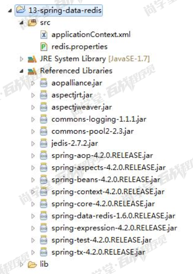
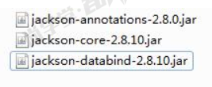

## Spring Data Redis
### Spring Data Redis简介
spring-data-Redis为spring-data模块中对redis的支持部分，简称为“SDR”，提供了在Spring应用中通过简单的配置访问redis服务，对redis底层开发包(Jedis,  JRedis, and RJC)进行了高度封装，RedisTemplate提供了redis各种操作。

SpringDataRedis针对Jedis提供了如下功能:

* 1.连接池自动管理,提供了一个高度封装的RedisTemplate类  
* 2.针对Jedis客户端中大量api进行了归类封装,将同一类型操作封装为operation接口
```
ValueIoerations:简单K-V操作
SetIOperations:set类型数据操作.
ZSetOperations:zset类型数据操作
HashOperations:针对map类型的数据操作
ListOperations:针对list类型的数据操作.
```
* 3.提供了对key的“bound”(绑定)便捷化操作API，可以通过bound封装指定的key，然后进行一系列的操作而无须“显式”的再次指定Key，即BoundKeyOperations：
```
BoundValueOperations
BoundSetOperations
BoundListOperations
BoundSetOperations
BoundHashOperations
```

### Redis 安装
1 安装环境
```
Redis 版本： 3.0.0
环境： Linux
```

2 安装步骤
```
2.1安装 gcc 编译器
yum install gcc-c++

2.2解压安装包
tar -zxf redis-3.0.0.tar.gz

2.3进入解压目录进行编译
cd redis-3.0.0
make

2.4将 Redis 安装到指定目录
make PREFIX=/usr/local/redis install

2.5启动 Redis
    2.5.1 前置启动
    默认的是前置启动： ./redis-server
    
    2.5.2 后置启动
    先将 redis.conf 文件拷贝到 redis 的安装目录
    cp redis.conf /usr/local/redis/bin
    编辑 redis.conf 文件修改： daemonize yes
    启动： ./redis-server redis.conf
    查看 redis 进程： ps aux|grep redis
    关闭后置启动的 Redis： ./redis-cli shutdown
```

### 整合环境
#### 整合spring
1 创建项目


2 整合配置
applicationContext.xml:
```xml
<?xml version="1.0" encoding="UTF-8"?>
<beans xmlns="http://www.springframework.org/schema/beans"
	xmlns:xsi="http://www.w3.org/2001/XMLSchema-instance" 
	xmlns:context="http://www.springframework.org/schema/context"
	xsi:schemaLocation="http://www.springframework.org/schema/beans 
	http://www.springframework.org/schema/beans/spring-beans.xsd
	http://www.springframework.org/schema/context
	http://www.springframework.org/schema/context/spring-context.xsd">
	<!-- 配置读取properties文件的工具类 -->
	<context:property-placeholder location="classpath:redis.properties"/>
	
	<!-- Jedis连接池 -->
	<bean id="poolConfig" class="redis.clients.jedis.JedisPoolConfig">
		<property name="maxTotal" value="${redis.pool.maxtTotal}"/>
		<property name="maxIdle" value="${redis.pool.maxtIdle}"/>
		<property name="minIdle" value="${redis.pool.minIdle}"/>
	</bean>
	
	<!-- Jedis连接工厂:创建Jedis对象的工厂 -->
	<bean id="jedisConnectionFactory" class="org.springframework.data.redis.connection.jedis.JedisConnectionFactory">
		<!-- IP地址 -->
		<property name="hostName" value="${redis.hostname}"/>
		<!-- 端口 -->
		<property name="port" value="${redis.port}"/>
		<!-- 连接池 -->
		<property name="poolConfig" ref="poolConfig"/>
	</bean>
	
	<!-- Redis模板对象:是SpringDataRedis提供的用户操作Redis的对象 -->
	<bean id="redisTemplate" class="org.springframework.data.redis.core.RedisTemplate">
	<!-- 默认的序列化器：序列化器就是根据规则将存储的数据中的key与value做字符串的序列化处理 -->
	<!-- keySerializer、valueSerializer：对应的是Redis中的String类型 -->
	<!-- hashKeySerializer、hashValueSerializer：对应的是Redis中的Hash类型 -->
	<property name="keySerializer">
		<bean class="org.springframework.data.redis.serializer.StringRedisSerializer"></bean>
	</property>
	<property name="valueSerializer">
	    <bean class="org.springframework.data.redis.serializer.StringRedisSerializer"></bean>
	</property>
	</bean>
</beans>
```

redis.properties:
```properties
redis.pool.maxtTotal=20
redis.pool.maxIdle=10
redis.pool.minIdle=5

redis.hostname=192.168.70.129
redis.port=6379
```

测试整合环境：
```java
import org.junit.Test;
import org.junit.runner.RunWith;
import org.springframework.beans.factory.annotation.Autowired;
import org.springframework.data.redis.core.RedisTemplate;
import org.springframework.test.context.ContextConfiguration;
import org.springframework.test.context.junit4.SpringJUnit4ClassRunner;

//Redis测试
@RunWith(SpringJUnit4ClassRunner.class)
@ContextConfiguration("classpath:applicationContext.xml")
public class RedisTest {

	@Autowired
	private RedisTemplate<String, Object> redisTemplate;
	
	/**
	 * 添加键值对
	 */
	@Test
	public void test1(){
		this.redisTemplate.opsForValue().set("key", "test");
	}
	
	/**
	 * 获取redis中的数据
	 */
	@Test
	public void test2(){
		String str = (String)this.redisTemplate.opsForValue().get("key");
		System.out.println(str);
	}

}
```

#### 整合spring(maven)
引入Spring相关依赖、引入JUnit依赖   （内容参加其它工程）
引入Jedis和SpringDataRedis依赖
```xml
<!-- Spring -->
 <dependencies>
     <dependency>
        <groupId>junit</groupId>
        <artifactId>junit</artifactId>
        <version>4.12</version>
    </dependency>
    <dependency>
        <groupId>org.springframework</groupId>
        <artifactId>spring-context</artifactId>
        <version>4.2.4.RELEASE</version>
    </dependency>
    <dependency>
        <groupId>org.springframework</groupId>
        <artifactId>spring-beans</artifactId>
        <version>4.2.4.RELEASE</version>
    </dependency>
    <dependency>
        <groupId>org.springframework</groupId>
        <artifactId>spring-context-support</artifactId>
        <version>4.2.4.RELEASE</version>
    </dependency>
    <dependency>
        <groupId>org.springframework</groupId>
        <artifactId>spring-test</artifactId>
        <version>4.2.4.RELEASE</version>
    </dependency>
    <!-- 缓存 -->
    <dependency> 
          <groupId>redis.clients</groupId> 
          <artifactId>jedis</artifactId> 
          <version>2.8.1</version> 
    </dependency> 
    <dependency> 
          <groupId>org.springframework.data</groupId> 
          <artifactId>spring-data-redis</artifactId> 
          <version>1.7.2.RELEASE</version> 
    </dependency>    
</dependencies>
<build>
        <plugins>            
            <!-- java编译插件 -->
            <plugin>
                <groupId>org.apache.maven.plugins</groupId>
                <artifactId>maven-compiler-plugin</artifactId>
                <version>3.2</version>
                <configuration>
                    <source>1.7</source>
                    <target>1.7</target>
                    <encoding>UTF-8</encoding>
                </configuration>
            </plugin>
        </plugins>
</build>
```
在src/main/resources下创建properties文件夹，建立redis-config.properties
```properties
redis.host=127.0.0.1
redis.port=6379
redis.pass=
redis.database=0
redis.maxIdle=300
redis.maxWait=3000
redis.testOnBorrow=true
```
在src/main/resources下创建spring文件夹 ，创建applicationContext-redis.xml
```xml
<?xml version="1.0" encoding="UTF-8"?>
<beans xmlns="http://www.springframework.org/schema/beans"
    xmlns:xsi="http://www.w3.org/2001/XMLSchema-instance" xmlns:p="http://www.springframework.org/schema/p"
    xmlns:context="http://www.springframework.org/schema/context"
    xmlns:dubbo="http://code.alibabatech.com/schema/dubbo" xmlns:mvc="http://www.springframework.org/schema/mvc"
    xsi:schemaLocation="http://www.springframework.org/schema/beans http://www.springframework.org/schema/beans/spring-beans.xsd
        http://www.springframework.org/schema/mvc http://www.springframework.org/schema/mvc/spring-mvc.xsd
        http://code.alibabatech.com/schema/dubbo http://code.alibabatech.com/schema/dubbo/dubbo.xsd
        http://www.springframework.org/schema/context http://www.springframework.org/schema/context/spring-context.xsd">
    
   <context:property-placeholder location="classpath*:properties/*.properties" />   
   <!-- redis 相关配置 --> 
   <bean id="poolConfig" class="redis.clients.jedis.JedisPoolConfig">  
     <property name="maxIdle" value="${redis.maxIdle}" />   
     <property name="maxWaitMillis" value="${redis.maxWait}" />  
     <property name="testOnBorrow" value="${redis.testOnBorrow}" />  
   </bean>  
   <bean id="JedisConnectionFactory" class="org.springframework.data.redis.connection.jedis.JedisConnectionFactory" 
       p:host-name="${redis.host}" p:port="${redis.port}" p:password="${redis.pass}" p:pool-config-ref="poolConfig"/>  
   
   <bean id="redisTemplate" class="org.springframework.data.redis.core.RedisTemplate">  
     <property name="connectionFactory" ref="JedisConnectionFactory" />  
   </bean>  
</beans>
```
```
maxIdle ：最大空闲数
maxWaitMillis:连接时的最大等待毫秒数
testOnBorrow：在提取一个jedis实例时，是否提前进行验证操作；如果为true，则得到的jedis实例均是可用的；
```

#### springboot
引入依赖
```xml
<dependency>
    <groupId>org.springframework.boot</groupId>
    <artifactId>spring-boot-starter-data-redis</artifactId>
</dependency>
```

修改application.yml ,在spring节点下添加配置
```yaml
  redis:
    # Redis服务器地址
    host: 192.168.40.128
```

【参考】更多配置项如下
```yaml
  redis:
    # Redis服务器地址（默认localhost）
    host: 192.168.40.128
    # Redis服务器连接端口（6379）
    port: 6379
    # Redis数据库索引（默认为0）
    database: 0
    # Redis服务器连接密码（默认为空）
    password:
    # 连接超时时间（毫秒）
    timeout: 5000
    jedis:
      pool:
        # 连接池最大连接数（使用负值表示没有限制，默认是8）
        max-active: 8
        # 连接池中的最大空闲连接（使用负值表示没有限制，默认是8）
        max-idle: 8
        # 连接池最大阻塞等待时间（使用负值表示没有限制，默认是-1ms）
        max-wait: -1ms
        # 连接池中的最小空闲连接（默认是0）
        min-idle: 0
```

### 各种数据类型基本操作
#### 值类型操作
```java
@RunWith(SpringJUnit4ClassRunner.class)
@ContextConfiguration(locations="classpath:spring/applicationContext-redis.xml")
public class TestValue {
    @Autowired
    private RedisTemplate redisTemplate;    
    @Test
    public void setValue(){
        redisTemplate.boundValueOps("name").set("qingmu");        
    }    
    @Test
    public void getValue(){
        String str = (String) redisTemplate.boundValueOps("name").get();
        System.out.println(str);
    }    
    @Test
    public void deleteValue(){
        redisTemplate.delete("name");;
    }    
}
```

#### Set类型操作
```java
@RunWith(SpringJUnit4ClassRunner.class)
@ContextConfiguration(locations="classpath:spring/applicationContext-redis.xml")
public class TestSet {
    
    @Autowired
    private RedisTemplate redisTemplate;
    
    /**
     * 存入值
     */
    @Test
    public void setValue(){
        redisTemplate.boundSetOps("nameset").add("曹操");        
        redisTemplate.boundSetOps("nameset").add("刘备");    
        redisTemplate.boundSetOps("nameset").add("孙权");
    }
    
    /**
     * 提取值
     */
    @Test
    public void getValue(){
        Set members = redisTemplate.boundSetOps("nameset").members();
        System.out.println(members);
    }
    
    /**
     * 删除集合中的某一个值
     */
    @Test
    public void deleteValue(){
        redisTemplate.boundSetOps("nameset").remove("孙权");
    }
    
    /**
     * 删除整个集合
     */
    @Test
    public void deleteAllValue(){
        redisTemplate.delete("nameset");
    }
}
```

#### List类型操作
（1）右压栈
```java
    /**
     * 右压栈：后添加的对象排在后边
     */
    @Test
    public void testSetValue1(){        
        redisTemplate.boundListOps("namelist1").rightPush("刘备");
        redisTemplate.boundListOps("namelist1").rightPush("关羽");
        redisTemplate.boundListOps("namelist1").rightPush("张飞");        
    }
    
    /**
     * 显示右压栈集合
     */
    @Test
    public void testGetValue1(){
        List list = redisTemplate.boundListOps("namelist1").range(0, 10);
        System.out.println(list);
    }
```
运行结果：
[刘备, 关羽, 张飞]

（2）左压栈
```java
    /**
     * 左压栈：后添加的对象排在前边
     */
    @Test
    public void testSetValue2(){        
        redisTemplate.boundListOps("namelist2").leftPush("刘备");
        redisTemplate.boundListOps("namelist2").leftPush("关羽");
        redisTemplate.boundListOps("namelist2").leftPush("张飞");        
    }
    
    /**
     * 显示左压栈集合
     */
    @Test
    public void testGetValue2(){
        List list = redisTemplate.boundListOps("namelist2").range(0, 10);
        System.out.println(list);
    }
```
运行结果：
[张飞, 关羽, 刘备]

（3）根据索引查询元素
```java
    /**
     * 查询集合某个元素
     */
    @Test
    public void testSearchByIndex(){
        String s = (String) redisTemplate.boundListOps("namelist1").index(1);
        System.out.println(s);
    }
```

（4）移除某个元素的值
```java
    /**
     * 移除集合某个元素
     */
    @Test
    public void testRemoveByIndex(){
        redisTemplate.boundListOps("namelist1").remove(1, "关羽");
    }
```

#### Hash类型操作
（1）存入值
```java
    @Test
    public void testSetValue(){
        redisTemplate.boundHashOps("namehash").put("a", "唐僧");
        redisTemplate.boundHashOps("namehash").put("b", "悟空");
        redisTemplate.boundHashOps("namehash").put("c", "八戒");
        redisTemplate.boundHashOps("namehash").put("d", "沙僧");
    }
```
（2）提取所有的KEY
```java
@Test
public void testGetKeys(){
    Set s = redisTemplate.boundHashOps("namehash").keys();        
    System.out.println(s);        
}
```
运行结果：
[唐僧, 悟空, 八戒, 沙僧]

（4）根据KEY提取值
```java
@Test
public void testGetValueByKey(){
    Object object = redisTemplate.boundHashOps("namehash").get("b");
    System.out.println(object);
}
```
运行结果：
悟空

（5）根据KEY移除值
```java
@Test
public void testRemoveValueByKey(){
    redisTemplate.boundHashOps("namehash").delete("c");
}
```
运行后再次查看集合内容：
[唐僧, 悟空, 沙僧]
```java
@Test
publicvoid testGetValues(){
    List values = redisTemplate.boundHashOps("namehash").values();
    System.out.println(values);    
}
```

### Spring Data Redisd 存储实体对象
```xml
<!-- Redis模板对象:是SpringDataRedis提供的用户操作Redis的对象 -->
<bean id="redisTemplate" class="org.springframework.data.redis.core.RedisTemplate">
<!-- 默认的序列化器：序列化器就是根据规则将存储的数据中的key与value做字符串的序列化处理 -->
<!-- keySerializer、valueSerializer：对应的是Redis中的String类型 -->
<!-- hashKeySerializer、hashValueSerializer：对应的是Redis中的Hash类型 -->
<property name="keySerializer">
    <bean class="org.springframework.data.redis.serializer.StringRedisSerializer"></bean>
</property>
<property name="valueSerializer">
    <bean class="org.springframework.data.redis.serializer.StringRedisSerializer"></bean>
</property>
</bean>
```
测试代码：
```java
/**
 * 添加Users
 */
@Test
public void test3(){
    Users users = new Users();
    users.setAge(30);
    users.setId(1);
    users.setName("张三");
    //更换序列化器
    this.redisTemplate.setValueSerializer(new JdkSerializationRedisSerializer());
    this.redisTemplate.opsForValue().set("users", users);
}

/**
 * 获取Users
 * 
 */
@Test
public void test4(){
    //更换序列化器
    this.redisTemplate.setValueSerializer(new JdkSerializationRedisSerializer());
    Users users = (Users)this.redisTemplate.opsForValue().get("users");
    System.out.println(users);
}
```

### Spring Data Redis 以 JSON 的格式存储实体对象
导入 jackson 包

测试代码
```java
/**
 * 添加Users JSON格式
 */
@Test
public void test5(){
    Users users = new Users();
    users.setAge(23);
    users.setId(2);
    users.setName("李四");
    
    this.redisTemplate.setValueSerializer(new Jackson2JsonRedisSerializer<>(Users.class));
    this.redisTemplate.opsForValue().set("usersjson", users);
}

/**
 * 获取Uesrs JSON格式
 */
@Test
public void test6(){
    this.redisTemplate.setValueSerializer(new Jackson2JsonRedisSerializer<>(Users.class));
    Users users = (Users)this.redisTemplate.opsForValue().get("usersjson");
    System.out.println(users);
}
```

### RedisTemplate与StringRedisTemplate
SDR默认采用的序列化策略有两种，一种是String的序列化策略，一种是JDK的序列化策略。

* StringRedisTemplate默认采用的是String的序列化策略，保存的key和value都是采用此策略序列化保存的。   
* RedisTemplate默认采用的是JDK的序列化策略，保存的key和value都是采用此策略序列化保存的。   
* 就是因为序列化策略的不同，即使是同一个key用不同的Template去序列化，结果是不同的。所以根据key去操作数据的时候就出现了操作失败的问题。   

针对数据的“序列化/反序列化”，提供了多种可选择策略(RedisSerializer)：

* JdkSerializationRedisSerializer：POJO对象的存取场景，使用JDK本身序列化机制，将pojo类通过ObjectInputStream/ObjectOutputStream进行序列化操作，最终redis-server中将存储字节序列。是目前最常用的序列化策略。    
* StringRedisSerializer：Key或者value为字符串的场景，根据指定的charset对数据的字节序列编码成string，是“new String(bytes, charset)”和“string.getBytes(charset)”的直接封装。是最轻量级和高效的策略。    
* JacksonJsonRedisSerializer：jackson-json工具提供了javabean与json之间的转换能力，可以将pojo实例序列化成json格式存储在redis中，也可以将json格式的数据转换成pojo实例。因为jackson工具在序列化和反序列化时，需要明确指定Class类型，因此此策略封装起来稍微复杂。【需要jackson-mapper-asl工具支持】    
* OxmSerializer：提供了将javabean与xml之间的转换能力，目前可用的三方支持包括jaxb，apache-xmlbeans；redis存储的数据将是xml工具。不过使用此策略，编程将会有些难度，而且效率最低；不建议使用。【需要spring-oxm模块的支持】  


针对“序列化和发序列化”中JdkSerializationRedisSerializer和StringRedisSerializer是最基础的策略，原则上，我们可以将数据存储为任何格式以便应用程序存取和解析(其中应用包括app，Hadoop等其他工具)，不过在设计时仍然不推荐直接使用“JacksonJsonRedisSerializer”和“OxmSerializer”，因为无论是json还是xml，他们本身仍然是String。

如果你的数据需要被第三方工具解析，那么数据应该使用StringRedisSerializer而不是JdkSerializationRedisSerializer。

JdkSerializationRedisSerializer序列化内容冗余，占用内存最高，只有java支持；StringRedisSerializer、JacksonJsonRedisSerializer占用内存少；

建议：
1、使用StringRedisSerializer，object可以在程序中转成json string然后储存，取出时再转成object；
2、使用JacksonJsonRedisSerializer，不用手动转换
3、无论如何key值建议使用StringRedisSerializer

#### springboot jackson2JsonRedisSerializer配置
```java
import com.fasterxml.jackson.annotation.JsonAutoDetect;
import com.fasterxml.jackson.annotation.PropertyAccessor;
import com.fasterxml.jackson.databind.ObjectMapper;
import org.springframework.cache.annotation.CachingConfigurerSupport;
import org.springframework.context.annotation.Bean;
import org.springframework.context.annotation.Configuration;
import org.springframework.data.redis.connection.RedisConnectionFactory;
import org.springframework.data.redis.core.RedisTemplate;
import org.springframework.data.redis.core.StringRedisTemplate;
import org.springframework.data.redis.serializer.Jackson2JsonRedisSerializer;
import org.springframework.data.redis.serializer.StringRedisSerializer;

//Redis的配置类
@Configuration
public class RedisConfig extends CachingConfigurerSupport {

    /**
     * RedisTemplate配置
     * @param factory
     * @return
     */
    @Bean
    public RedisTemplate<String, Object> redisTemplate(RedisConnectionFactory factory) {
        //创建模板对象
        RedisTemplate<String, Object> redisTemplate= new RedisTemplate<String, Object>(factory);

        // 创建Jackson2JsonRedisSerialize，要用其替换替换默认序列化
        Jackson2JsonRedisSerializer jackson2JsonRedisSerializer = new Jackson2JsonRedisSerializer(Object.class);
        ObjectMapper objectMapper = new ObjectMapper();
        objectMapper.setVisibility(PropertyAccessor.ALL, JsonAutoDetect.Visibility.ANY);
        objectMapper.enableDefaultTyping(ObjectMapper.DefaultTyping.NON_FINAL);
        jackson2JsonRedisSerializer.setObjectMapper(objectMapper);

        // 设置value的序列化规则和 key的序列化规则
        redisTemplate.setKeySerializer(new StringRedisSerializer());
        redisTemplate.setValueSerializer(jackson2JsonRedisSerializer);
        redisTemplate.setHashKeySerializer(new StringRedisSerializer());
        redisTemplate.setHashValueSerializer(jackson2JsonRedisSerializer);
        redisTemplate.afterPropertiesSet();
        return redisTemplate;
    }
}
```

### 设置一个键值及其过期时间
错误的设置方式：
```java
/**
 * Overwrite parts of {@code key} starting at the specified {@code offset} with given {@code value}.
 *
 * @param key must not be {@literal null}.
 * @param value
 * @param offset
 * @see <a href="http://redis.io/commands/setrange">Redis Documentation: SETRANGE</a>
 */
void set(K key, V value, long offset);
```

正确的设置方式：
```java
/**
 * Set the {@code value} and expiration {@code timeout} for {@code key}.
 *
 * @param key must not be {@literal null}.
 * @param value
 * @param timeout
 * @param unit must not be {@literal null}.
 * @see <a href="http://redis.io/commands/setex">Redis Documentation: SETEX</a>
 */
void set(K key, V value, long timeout, TimeUnit unit);
```


