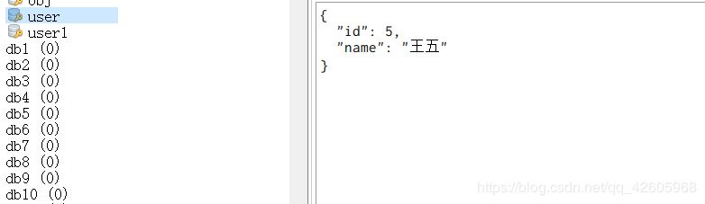

## SpringBootRedis使用fastjson进行序列化
FastJson是阿里开源的一个高性能的JSON框架，FastJson数据处理速度快，无论序列化（把JavaBean对象转化成Json格式的字符串）和反序列化（把JSON格式的字符串转化为Java Bean对象），都是当之无愧的fast；功能强大（支持普通JDK类，包括javaBean, Collection, Date 或者enum）；零依赖（没有依赖其他的任何类库）。

### 例子1
`https://blog.csdn.net/qq_42605968/article/details/92759510`
```java
import com.alibaba.fastjson.support.spring.FastJsonRedisSerializer;
import lombok.extern.slf4j.Slf4j;
import org.springframework.cache.CacheManager;
import org.springframework.cache.annotation.CachingConfigurerSupport;
import org.springframework.cache.annotation.EnableCaching;
import org.springframework.context.annotation.Bean;
import org.springframework.context.annotation.Configuration;
import org.springframework.data.redis.cache.RedisCacheConfiguration;
import org.springframework.data.redis.cache.RedisCacheManager;
import org.springframework.data.redis.connection.RedisConnectionFactory;
import org.springframework.data.redis.core.RedisTemplate;
import org.springframework.data.redis.serializer.StringRedisSerializer;
import java.time.Duration;
import java.util.HashMap;
import java.util.HashSet;
import java.util.Map;
import java.util.Set;

@Slf4j
@Configuration
@EnableCaching//启用缓存，这个注解很重要；
//继承CachingConfigurerSupport，为了自定义生成KEY的策略。可以不继承。
public class CacheConfig extends CachingConfigurerSupport {

    @Bean(name="redisTemplate")
    public RedisTemplate<Object, Object> redisTemplate(RedisConnectionFactory redisConnectionFactory) {
        RedisTemplate<Object, Object> template = new RedisTemplate<>();
        template.setConnectionFactory(redisConnectionFactory);

        FastJsonRedisSerializer<Object> serializer = new FastJsonRedisSerializer<Object>(Object.class);
        // value值的序列化采用fastJsonRedisSerializer
        template.setValueSerializer(serializer);
        template.setHashValueSerializer(serializer);
        // key的序列化采用StringRedisSerializer
        template.setKeySerializer(new StringRedisSerializer());
        template.setHashKeySerializer(new StringRedisSerializer());

        template.setConnectionFactory(redisConnectionFactory);
        return template;
    }

    @Bean
    public CacheManager cacheManager(RedisConnectionFactory factory) {
        // 生成一个默认配置，通过config对象即可对缓存进行自定义配置
        RedisCacheConfiguration config = RedisCacheConfiguration.defaultCacheConfig();
        // 设置缓存的默认过期时间，也是使用Duration设置
        config = config.entryTtl(Duration.ofMinutes(1))
                .disableCachingNullValues();     // 不缓存空值

        // 设置一个初始化的缓存空间set集合
        Set<String> cacheNames =  new HashSet<>();
        cacheNames.add("my-redis-cache1");
        cacheNames.add("my-redis-cache2");

        // 对每个缓存空间应用不同的配置
        Map<String, RedisCacheConfiguration> configMap = new HashMap<>();
        configMap.put("my-redis-cache1", config);
        configMap.put("my-redis-cache2", config.entryTtl(Duration.ofSeconds(120)));

        // 使用自定义的缓存配置初始化一个cacheManager
        RedisCacheManager cacheManager = RedisCacheManager.builder(factory)
                .initialCacheNames(cacheNames)  // 注意这两句的调用顺序，一定要先调用该方法设置初始化的缓存名，再初始化相关的配置
                .withInitialCacheConfigurations(configMap)
                .build();
        return cacheManager;
    }
}
```
使用测试类进行测试
```java
@Test
   public void test05(){
       User user = new User();
       user.setId(5);
       user.setName("王五");
       redisTemplate.opsForValue().set("user1",user);
   }
   @Test
   public void test06(){
       Object user = redisTemplate.opsForValue().get("user");
       User t = (User) JSON.toJavaObject((JSON) user, User.class);
       System.out.println(t);
   }
   
```


### 例子2
`https://www.jb51.net/article/172840.htm`
#### 1、写一个自定义序列化类
```java
/**
 * 自定义序列化类
 * @param <T>
 */
public class FastJsonRedisSerializer<T> implements RedisSerializer<T> {
 
  public static final Charset DEFAULT_CHARSET = Charset.forName("UTF-8");
  private Class<T> clazz;
 
  public FastJsonRedisSerializer(Class<T> clazz) {
    super();
    this.clazz = clazz;
  }
 
  @Override
  public byte[] serialize(T t) throws SerializationException {
    if (null == t) {
      return new byte[0];
    }
    return JSON.toJSONString(t, SerializerFeature.WriteClassName).getBytes(DEFAULT_CHARSET);
  }
 
  @Override
  public T deserialize(byte[] bytes) throws SerializationException {
    if (null == bytes || bytes.length <= 0) {
      return null;
    }
    String str = new String(bytes, DEFAULT_CHARSET);
    return (T) JSON.parseObject(str, clazz);
  }
 
}
```

#### 2、写一个Redis配置类
```java
@Configuration
public class RedisConfiguration {
 
  @Bean
  public RedisTemplate<Object, Object> redisTemplate(
      RedisConnectionFactory redisConnectionFactory) {
    RedisTemplate<Object, Object> template = new RedisTemplate<>();
    //使用fastjson序列化
    FastJsonRedisSerializer fastJsonRedisSerializer = new FastJsonRedisSerializer(Object.class);
    // value值的序列化采用fastJsonRedisSerializer
    template.setValueSerializer(fastJsonRedisSerializer);
    template.setHashValueSerializer(fastJsonRedisSerializer);
    // key的序列化采用StringRedisSerializer
    template.setKeySerializer(new StringRedisSerializer());
    template.setHashKeySerializer(new StringRedisSerializer());
    template.setConnectionFactory(redisConnectionFactory);
    return template;
  }
}
```

#### 3、Student类
```java
@Data
public class Student {
  private Integer studentId;
  private String studentName;
}
```

#### 4、pom.xml引入redis和fastjson的依赖，application.yml配置文件别忘了配置Redis的地址。

#### 5、BootRedisApplication启动类
```java
@SpringBootApplication
public class BootRedisApplication {
 
  public static void main(String[] args) {
    ConfigurableApplicationContext
        context = SpringApplication.run(BootRedisApplication.class, args);
     
    Student student = new Student();
    student.setStudentId(101);
    student.setStudentName("学生A");
     
    RedisTemplate cRedisTemplate = context.getBean("redisTemplate", RedisTemplate.class);
    cRedisTemplate.opsForValue().set("student-1", student);
 
    context.close();
  }
}
```

#### 查看Redis的数据
```java
{"@type":"com.example.bootredis.Student","studentId":101,"studentName":"学生A"}
```

### 例子3
`https://www.cnblogs.com/hongdada/p/9156625.html`
在使用spring-data-redis,默认情况下是使用org.springframework.data.redis.serializer.JdkSerializationRedisSerializer这个类来做序列化

#### 使用Jackson方式
ackson redis序列化是spring中自带的
```java
    @Bean(name="redisTemplate")
    public RedisTemplate<String, Object> redisTemplate() {
        Jackson2JsonRedisSerializer<Object> jackson2JsonRedisSerializer = new Jackson2JsonRedisSerializer<Object>(Object.class);
        ObjectMapper om = new ObjectMapper();
        om.setVisibility(PropertyAccessor.ALL, JsonAutoDetect.Visibility.ANY);
        om.enableDefaultTyping(ObjectMapper.DefaultTyping.NON_FINAL);
        jackson2JsonRedisSerializer.setObjectMapper(om);
        RedisTemplate<String, Object> template = new RedisTemplate<String, Object>();
        template.setConnectionFactory(factory);
        template.setKeySerializer(new StringRedisSerializer());
        template.setValueSerializer(jackson2JsonRedisSerializer);
        template.setHashKeySerializer(new StringRedisSerializer());
        template.setHashValueSerializer(jackson2JsonRedisSerializer);
        template.setDefaultSerializer(new StringRedisSerializer());
        template.afterPropertiesSet();
        return template;
    }
```

#### 使用fastjson方式：
```java
public class FastJson2JsonRedisSerializer<T> implements RedisSerializer<T> {

    public static final Charset DEFAULT_CHARSET = Charset.forName("UTF-8");

    private Class<T> clazz;

    public FastJson2JsonRedisSerializer(Class<T> clazz) {
        super();
        this.clazz = clazz;
    }

    public byte[] serialize(T t) throws SerializationException {
        if (t == null) {
            return new byte[0];
        }
        return JSON.toJSONString(t, SerializerFeature.WriteClassName).getBytes(DEFAULT_CHARSET);
    }

    public T deserialize(byte[] bytes) throws SerializationException {
        if (bytes == null || bytes.length <= 0) {
            return null;
        }
        String str = new String(bytes, DEFAULT_CHARSET);

        return (T) JSON.parseObject(str, clazz);
    }

}
```
注册：
```java
@Configuration
public class RedisConfig {
    @Autowired
    private RedisConnectionFactory factory;

    @Autowired
    private RedisSerializer fastJson2JsonRedisSerializer;

    //fastjson
    @Bean(name="redisTemplate")
    public RedisTemplate<String, Object> fastJsonRedisTemplate() {
        RedisTemplate<String, Object> template = new RedisTemplate<String, Object>();
        template.setConnectionFactory(factory);
        //redis开启事务
        template.setEnableTransactionSupport(true);
        template.setKeySerializer(new StringRedisSerializer());
        template.setValueSerializer(fastJson2JsonRedisSerializer);
        template.setHashKeySerializer(new StringRedisSerializer());
        template.setHashValueSerializer(fastJson2JsonRedisSerializer);
        template.setDefaultSerializer(new StringRedisSerializer());
        template.afterPropertiesSet();
        return template;
    }
}
```
在redis工具类中调用RedisTemplate:
```java
@Component
public class RedisCacheUtil {

    @Autowired
    @Qualifier("redisTemplate")
    private  RedisTemplate<String, String> redisTemplate;

}
```

#### Jackson方式、fastjson方式对比
jackson方式序列化存储redis中数据：
```java
[
  "com.qhong.test.dependBean.Person",
  {
    "age": 20,
    "name": "name0",
    "iss": true
  }
]
```
```java
[
  "java.util.ArrayList",
  [
    [
      "com.qhong.test.dependBean.Person",
      {
        "age": 20,
        "name": "name0",
        "iss": true
      }
    ],
    [
      "com.qhong.test.dependBean.Person",
      {
        "age": 21,
        "name": "name1",
        "iss": true
      }
    ],
    [
      "com.qhong.test.dependBean.Person",
      {
        "age": 22,
        "name": "name2",
        "iss": true
      }
    ]
  ]
]
```
上面的完全不符合json格式规范

fastjson方式序列化：
```java
{
  "@type": "com.qhong.test.dependBean.Person",
  "age": 20,
  "iss": true,
  "name": "name0"
}
```

```java
[
  {
    "@type": "com.qhong.test.dependBean.Person",
    "age": 20,
    "iss": true,
    "name": "name0"
  },
  {
    "@type": "com.qhong.test.dependBean.Person",
    "age": 21,
    "iss": true,
    "name": "name1"
  },
  {
    "@type": "com.qhong.test.dependBean.Person",
    "age": 22,
    "iss": true,
    "name": "name2"
  }
]
```
虽然也不是很好，但是比jackson的好多了
