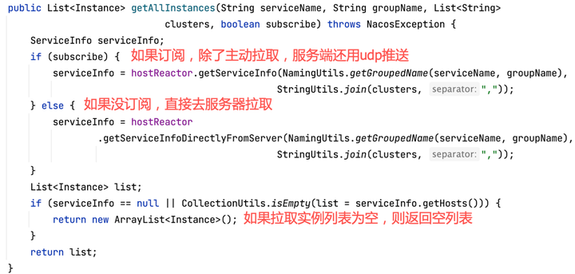
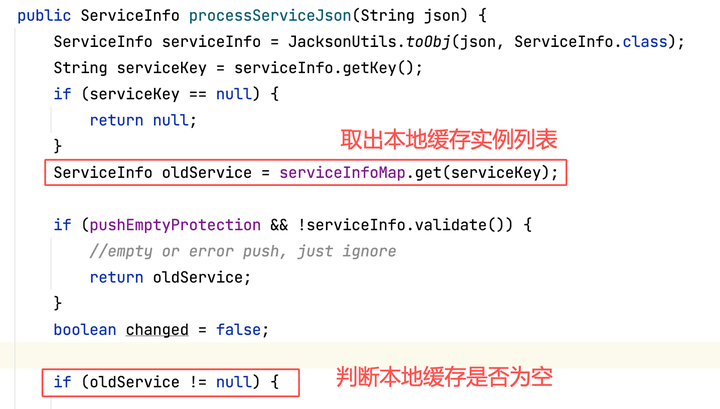

# Nacos服务发现
摘抄自：https://zhuanlan.zhihu.com/p/527746095

nacos服务发现有2种方式：一种是客户端主动调用服务端拉取服务实例列表；另一种是服务订阅模式，是客户端通过注册listener，当nacos服务端服务实例变化时，服务端通过udp协议主动把变更实例列表推送给客户端。见下图：

我们先介绍第一种服务发现：客户端主动去服务端拉取实例列表的模式。

## Nacos客户端服务发现—主动拉取

客户端主动拉取服务器实例列表调用NamingService的getAllInstances方法，我们进去看下代码：

getAllInstances有很多个重载方法，几个重载方法就是4个参数的组合：serverName，groupName，isSubscribe，clusters。groupName是分组，如果不传，默认是DEFAULT_GROUP；isSubscribe：是否订阅，支持服务器主动推送，如果不传，默认是true，支持订阅；clusters表示哪些集群的Instance，传入集群名字的List，如果不传，默认是拉区该服务的所有集群Instance。

下面我们看下getAllInstances方法：

根据客户端是否订阅subscribe来判断，这个subscribe是客户端传过来的参数，如果没有传，则默认为true，如果不订阅需要在参数中传入false。如果订阅了，客户端在主动拉取实例列表的同时，会与nacos服务器建立udp连接，当服务器实例有状态变化时，会通过udp把实例列表主动推送给客户端。最下面是判断从服务器拉取的实例列表为空，则给客户端返回空列表。

接着我们先看下如果没有订阅，直接拉取的调用，HostReactor类的getServiceInfoDirectlyFromServer方法：

这个流程非常简单，getServiceInfoDirectlyFromServer是通过reqApi方法请求nacos服务器，返回Instance列表，reqApi之前讲过，是对请求nacos服务器http请求对封装。本次请求是Http Get，URI是/naocs/v1/ns/instance/list，对应到服务端是InstanceController类的list方法，服务端逻辑我们后面再看。

下面我们看下客户端选择订阅，HostReactor类的getServiceInfo方法，这个方法是核心拉取逻辑，也稍微复杂些。

我们看下流程，先判断本地内存是否有实例列表缓存，这个实例列表缓存到HostReactor类的serviceInfoMap变量中，如果没有缓存，直接去nacos服务器拉取，并把拉回的实例列表缓存serviceInfoMap中，由于实例列表发生更新，所以要创建实例变更事件InstancesChangeEvent，并把该事件发布广播，通知订阅该事件的订阅者，接着会创建定时拉取任务updateTask，扔到线程池中定时执行拉取任务。

我们具体看下getServiceInfo代码，代码较长，分几段看，先看第一段：

isFailoverSwitch是故障转移开关，如果开启，则直接返回了，该服务不能提供服务列表查询。

getServiceInfo0就是从HostReactor类的serviceInfoMap变量中取Instance列表。如果没有拿到，就调用updateServiceNow方法从服务器上拉取，这个方法前后有加解锁操作，防止从服务器拉取实例列表更新本地serviceInfoMap过程中，其他客户端读取到不完整到Instance列表，也就是防止脏读。

接着看下面代码同步锁及等待锁释放：

如果updateingMap有这个servicename，说明正在执行updateServieNow拉取实例列表，这时往下走就会进入同步锁，并在serviceobj对象的wait方法等待，直到updateServieNow调用完毕，调用serviceObj.notifyAll，等待的线程才能通过，这个锁等待就是防止一个线程在更新数据时，另一个线程读取不完整的数据。也就是说如果有一个线程在执行updateServieNow方法时，其他线程都阻塞到上面的代码上，直到updateServieNow执行完。

我们先把updateServieNow看下，再看最后一段。

updateServieNow方法直接调用了updateServie方法，我们直接看updateServie：

queryList方法是从服务器上获取实例列表，参数中传入了udpPort，就是通知服务器主动推送实例变化信息就用这个客户端的udp端口号。最下面就是调用oldservice的notifyAll，通知前面wait方法放行。

中间的一句是调用processServiceJson方法，处理服务器返回的json实例列表，与本地缓存的实例列表做合并等操作。由于方法代码较长，我们看下重点逻辑：

这段先从本地缓存拿ServiceInfo，ServiceInfo里面有个hosts属性存着实例列表，先判断本地是否有这个缓存，如果有缓存，就需要和服务器返回的做对比，这个逻辑后年讲，先讲没有缓存的情况：

本地缓存没有就不用做新老实例对比等复杂操作，直接就是用最新实例列表更新本地缓存servieInfoMap，然后创建InstancesChangeEvent，并发布广播，订阅了该事件等订阅者会收到事件通知。

下面回头看如果本地缓存已经存在，新老实例信息对比的逻辑：

serviceInfoMap.put(serviceInfo.getKey(), serviceInfo);

先更新本地缓存serviceInfoMap，然后遍历从服务器拿到的新实例列表，和本地缓存实例列表对比，如果Ip相同，而实例信息变化了，则把这些变化的实例放入modHosts列表；如果本地缓存中没有找到的新Ip，则放入到newHosts列表中。

遍历本地缓存实例列表，发现服务器返回的实例列表没有这个Ip，说明这个实例已经失效了，就把这些实例放入remvHosts列表中。那么这3个实例列表modHosts、newHosts、remvHosts任何一个列表不为空，就说明实例列表变更了，需要创建实例变更事件InstancesChangeEvent，并发布广播这个事件。

updateServiceNow方法看完了，主要是更新本地实例列表缓存，对比新老实例列表，如果有变化就创建事件、发布广播。

下面我们看下getServiceInfo最后剩下的scheduleUpdateIfAbsent方法：

这个方法主要是创建UpdateTask任务，从服务器拉取实例列表任务，并发这个任务扔到线程池定时执行拉取任务。为防止一个服务启动多个拉取任务，使用futureMap做记录和判断，如果服务已经创建启动了UpdateTask，则不需要再创建，直接return了。

我们接着看UpdataTask线程到run方法是如果定时拉取的？

先看第一段：

先从本地缓存看有没有，没有就从服务器拉，然后执行finally里的下一次任务；如果本地有缓存且不是最新的，那么从服务器拉取更新本地缓存，否则如果本地有缓存且是最新的，那么调用refreshOnly方法，并不更新本地缓存serviceInfoMap，也不会拿服务器返回的实例列表，因为本地是最新的了，而只是通过调用拉取接口reqApi，让服务器更新客户端访问服务器的事件戳，表示客户端udp还是活跃的。如果10秒不去调用客户端，服务端的PushService有一个线程， 专门清理僵死客户端，僵死客户端就是超过10秒没有更新过时间戳的。

先看一些拉取服务器异常情况，failCount会加1，如果正常执行完成则failCount会清0，而finally里面的schedule第一个参数是this，相当于没当该任务执行完成后会再次执行自己，就是个无限循环执行updateTask这个任务，scheduel第2个参数使用了移位操作符， 那么延迟执行时间就是2的failCount次方秒*delayTime，delayTime默认是1秒，失败1次是2秒，失败2次是4秒，以此类推8秒，16秒，32秒。。。，最后和 DEFAULT_DELAY * 60取最小值，后者是60秒，也就是最长延迟60秒。还有一个，前面异常调用return后，还是要执行finally里面的语句的，所以会无限次执行该任务。

总结上面的流程，整体客户端订阅主动拉取实例列表，见下图：

客户端调用NacosNamingService类getAllInstances方法，判断客户端订阅标记传入true，如果没订阅，则调用HostReactor类的getServiceInfoDirectlyFromServer方法，直接从服务器拉取实例列表，返回给客户端；如果客户端订阅服务推送，则调用HostReactor类getServiceInfo方法，这个方法判断本地是否有实例列表缓存，如果没有缓存，则调用HostReactor类的updateServiceNow和updateService方法从服务器获取实例列表，从服务器拿到实例列表json后，调用HostReactor类processServiceJson方法处理返回的json实例列表数据，主要是和本地缓存的实例列表对比， 如果有新增实例、实例信息变化、实例失效等情况，都会触发创建实例变更事件InstanceChangEvent，并通过NotifyCenter类的publishEvent发布广播，通知订阅该事件的listener。如果HostReactor类getServiceInfo方法已经有本地缓存，则调用HostReactor类的scheduleUpdateIfAbsent方法创建UpdateTask主动拉取任务，并扔到线程池中定时启动从服务器拉取最新实例列表并更新到缓存serviceInfoMap中。

## Nacos服务端服务发现—主动拉取

上面讲了客户端调用NacosNamingService类的getAllInstances方法获取该服务实例列表，这个方法最终是调用到Nacos服务端端InstanceController类的list方法。

我们先浏览下整体流程，然后再逐步看下逻辑：

我们先看下list方法：

这个方法代码都是获取request参数，然后把这些参数传递给doSrvIpxt方法，我们接着看这个方法：

前面几行是获取必要的参数，其中ClientInfo是从agent中获取客户端sdk的开发语言及sdk的版本号，后面会用到这2个属性做一些判断。

下面的canEnablePush方法也是判断客户端语言和版本号是否支持udp推送，看下代码：

如果满足udpPort合法并且客户端sdk支持，就调用pushSevice类的addClient方法，之前讲过PushService类作用是通过udp协议把服务变更信息推送给客户端。addClient方法就是创建pushclient对象，并把它加到pushService推送clients的列表中，看下代码：

先创建PushClient对象，然后传给addClient方法，再跟下addClient方法：

clientMap里按照service-key存放着pushClient的Map集合，当通过udp协议推送给客户端时，就是从这个clientMap中按照service-key取出pushClient的Map集合，然后遍历这个Map里的client，用udp协议推送数据，这个pushClient里面存放着连接的socketAddr，包括Ip和port。

接着看下面一段：

当service是空当时候，就返回一个基本当服务信息，Instance列表返回空。

然后检查service是否enable，如果disable就报错。

接着调用service的srvIPs方法，取得该服务下所有实例列表。下面一行是用service选择器对Instance列表做过滤，这个是在控制台创建服务时，可以指定服务选择器类型，分为标签选择器和空选择器，如果没有指定，默认是空选择器，空选择器对实例列表不过滤，直接返回实例列表全集。标签选择器可以指定表达式，比如标签表达式可以指定Ip来过滤实例列表。由于我们在控制台没有指定标签选择器，就是用的默认空选择器，返回的就是原实例列表，不做任何过滤。

再看下如果实例列表srvedIPs为空时，直接返回service一些基本信息，hosts字段时实例列表返回为空了。

再看下一段对低于健康阀值的处理：

先把健康实例和不健康实例分开存放在不同当List里，然后判断健康实例的比例低于控制台设定的阀值时，就要不健康的实例列表也加入的健康实例列表中。为什么要这么做，因为健康实例比例低于阀值时，就意味着健康的实例容器已经很少了，低于预警线了，不健康的实例容器也要参与服务了，毕竟不健康也可以服务，就是响应慢一些，也能分担些流量，否则健康实例扛不住压力，就会崩掉了。

这个阀值在控制台用户可以设置，见下图：

最下面的一段代码就不看了，都是一些合法性校验、json数据的组装，没有什么特别的逻辑，最后把json就返回给客户端了。

我们在通过下图总结下Nacos服务端处理主动拉取的流程：

我们总结下几个重点逻辑：

首先在拉取时，随便把调用的客户端添加到PushService的客户端推送集合中，这样当服务变更通过udp推送，遍历客户端集合时，不会漏掉推送这个客户端。

第二，用选择器对实例列表做过滤，这个是提供给用户在控制台过滤的增强功能，用户可以在控制台通过标签选择器按照自己的需求做过滤，返回自己需要的实例列表，如果用户没有设置标签选择器，将使用默认的空选择器，不对实例列表做过滤，返回原实例列表。

第三，在控制台可以设置健康阀值，用来控制返回哪些实例列表，这样当健康实例低于阀值时，返回包括不健康在内的所有实例，以尽可能多的实例分担流量，防止系统雪崩。

