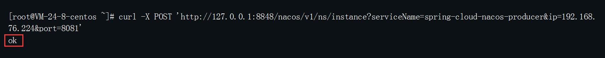
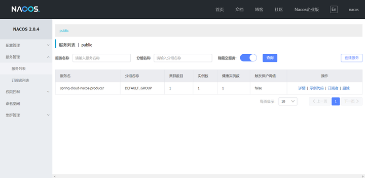
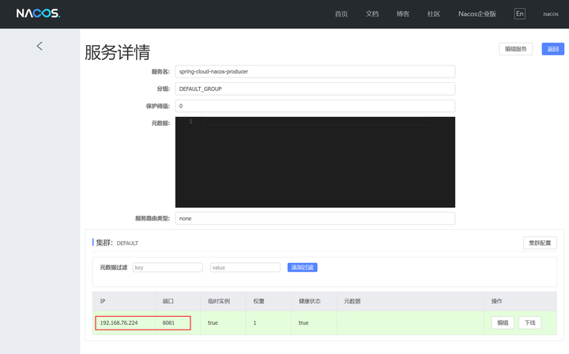
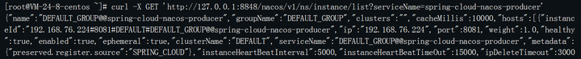

# Nacos服务注册与发现的2种实现方法
摘抄自：https://zhuanlan.zhihu.com/p/465198413


Spring Cloud Alibaba 技术体系中的 Nacos，提供了两个重要的功能：注册中心（服务注册与发现）功能和配置中心功能。 ​

其中注册中心解决了微服务调用中，服务提供者和服务调用者的解耦，让程序开发者可以无需过多的关注服务提供者和调用者的运行细节，只需要通过 Nacos 的注册中心就可以实现两者的互联互通，相当于实现了远程服务本地化，并且提供了健康检查等机制。 ​

而 Nacos 注册中心又提供了两种服务注册和发现的方法：OpenAPI 方法和（Nacos）SDK 方法。 ​

所谓的 OpenAPI 是指通过 Nacos 提供的开放 API 地址实现服务的注册与发现；而 SDK 方法是通过 Nacos 提供的 SDK 框架，也就是使用 spring-cloud-starter-alibaba-nacos-discovery 框架来实现服务注册与发现的功能。

## 1.服务注册

### 1.1 服务注册：OpenAPI模式

OpenAPI 的使用方式相对来说比较简单，首先打开系统的命令行，在系统命令行中使用以下命令实现服务注册：

>  curl -X POST '[http://127.0.0.1:8848/nacos/v1/ns/instance?serviceName=spring-cloud-nacos-producer&ip=192.168.76.224&port=8081](https://link.zhihu.com/?target=http%3A//127.0.0.1%3A8848/nacos/v1/ns/instance%3FserviceName%3Dspring-cloud-nacos-producer%26ip%3D192.168.76.224%26port%3D8081 "http://127.0.0.1:8848/nacos/v1/ns/instance?serviceName=spring-cloud-nacos-producer&ip=192.168.76.224&port=8081")'

以上命令的执行结果如下图所示：



当返回“ok”结果时，表示服务注册成功，其中：

* serviceName：表示服务名。    
* ip：表示客户端程序的 IP 地址。    
* port：表示客户端程序的端口号。

与此同时我们打开 Nacos 管理后台也可以看到我们注册的服务，如下图所示：



点击服务详情，可以看到我们注册的 IP 地址和端口，如下图所示：




### 1.2 服务注册：SDK模式

SDK 模式需要先创建一个 Spring Cloud 项目，项目创建方法请参考：[https://mp.weixin.qq.com/s/c4EHDWAlTXKr3Xl17biglA](https://link.zhihu.com/?target=https%3A//mp.weixin.qq.com/s/c4EHDWAlTXKr3Xl17biglA "https://mp.weixin.qq.com/s/c4EHDWAlTXKr3Xl17biglA")，项目创建成功之后添加 Nacos 的 SDK 框架支持，最后再配置 Nacos 的相关信息即可，具体实现如下。

### 1.2.1 添加 SDK

在 pom.xml 中添加 Nacos SDK 框架支持，具体配置如下：


```java
<dependency>
  <groupId>com.alibaba.cloud</groupId>
  <artifactId>spring-cloud-starter-alibaba-nacos-discovery</artifactId>
</dependency>
```

### 1.2.2 Nacos 配置

SDK 框架添加完成之后，需要在项目的配置文件中添加相应的配置，具体配置内容如下：


```java
# 应用名称
spring.application.name=spring-cloud-nacos-producer
# Nacos认证信息
spring.cloud.nacos.discovery.username=nacos
spring.cloud.nacos.discovery.password=nacos
# Nacos 服务发现与注册配置，其中子属性 server-addr 指定 Nacos 服务器主机和端口
spring.cloud.nacos.discovery.server-addr=127.0.0.1:8848
# 注册到 nacos 的指定 namespace，默认为 public
spring.cloud.nacos.discovery.namespace=public
```

设置完以上配置之后，启动当前项目，程序会自己自动注册到 Nacos 服务端。

## 2.服务发现

服务被正确注册到 Nacos 之后，就可以通过服务发现正常的调用服务提供者暴露的方法了，它的实现方法依然有以下两种。

### 2.1 服务发现：OpenAPI模式

在系统命令行中使用以下命令实现服务发现：

>  curl -X GET '[http://127.0.0.1:8848/nacos/v1/ns/instance/list?serviceName=nacos.naming.serviceName](https://link.zhihu.com/?target=http%3A//127.0.0.1%3A8848/nacos/v1/ns/instance/list%3FserviceName%3Dnacos.naming.serviceName "http://127.0.0.1:8848/nacos/v1/ns/instance/list?serviceName=nacos.naming.serviceName")'

执行结果如下所示：



以上内容 JSON 格式化之后的信息如下：


```java
{
  "name": "DEFAULT_GROUP@@spring-cloud-nacos-producer",
  "groupName": "DEFAULT_GROUP",
  "clusters": "",
  "cacheMillis": 10000,
  "hosts": [
    {
      "instanceId": "192.168.76.224#8081#DEFAULT#DEFAULT_GROUP@@spring-cloud-nacos-producer",
      "ip": "192.168.76.224",
      "port": 8081,
      "weight": 1,
      "healthy": true,
      "enabled": true,
      "ephemeral": true,
      "clusterName": "DEFAULT",
      "serviceName": "DEFAULT_GROUP@@spring-cloud-nacos-producer",
      "metadata": {
        "preserved.register.source": "SPRING_CLOUD"
      },
      "instanceHeartBeatInterval": 5000,
      "instanceHeartBeatTimeOut": 15000,
      "ipDeleteTimeout": 30000
    }
  ],
  "lastRefTime": 1644210068852,
  "checksum": "",
  "allIPs": false,
  "reachProtectionThreshold": false,
  "valid": true
}
```

其中：

* healthy：表示是否开启健康检测功能，也就是定期的将自己的健康状态报告给 Nacos 服务器端。    
* ephemeral：表示是否为临时实例，临时实例下线一段时间之后，会被 Nacos 直接剔除。    
* “"instanceHeartBeatInterval": 5000”：表示每 5s 执行一次健康检测。    
* “"instanceHeartBeatTimeOut": 15000”：表示如果超过 15s 没有收到（客户端）心跳包，就将此实例设置为非健康状态。    
* “"ipDeleteTimeout": 30000”：表示如果超过 30s 没有收到心跳包就剔除临时实例。

### 2.2 服务发现：SDK模式

与 SDK 实现服务注册的步骤类似，服务发现也是先要创建 Spring Cloud 项目，然后添加 Nacos SDK 框架，再配置 Nacos 相关信息，最后编写代码来调用服务提供者提供的方法。

### 2.2.1 添加 SDK

在项目的 pom.xml 文件中，添加 Nacos SDK 框架支持，具体内容如下：


```java
<dependency>
  <groupId>com.alibaba.cloud</groupId>
  <artifactId>spring-cloud-starter-alibaba-nacos-discovery</artifactId>
</dependency>
```

### 2.2.2 配置 Nacos

在项目的配置文件中添加如下 Nacos 的相关配置：


```java
# 应用名称
spring.application.name=springcloud-nacos-consumer
# Nacos认证信息
spring.cloud.nacos.discovery.username=nacos
spring.cloud.nacos.discovery.password=nacos
# Nacos 服务发现与注册配置，其中子属性 server-addr 指定 Nacos 服务器主机和端口
spring.cloud.nacos.discovery.server-addr=127.0.0.1:8848
# 注册到 nacos 的指定 namespace，默认为 public
spring.cloud.nacos.discovery.namespace=public
```

### 2.2.3 调用服务提供者

最后一步在项目中使用 RestTemplate 对象，实现调用服务提供者暴露的方法。 首先我们需要一个 RestTemplate 对象，具体实现代码如下：


```java
import org.springframework.boot.SpringApplication;
import org.springframework.boot.autoconfigure.SpringBootApplication;
import org.springframework.cloud.client.discovery.EnableDiscoveryClient;
import org.springframework.cloud.client.loadbalancer.LoadBalanced;
import org.springframework.context.annotation.Bean;
import org.springframework.web.client.RestTemplate;

@SpringBootApplication
@EnableDiscoveryClient
public class SpringcloudNacosConsumerApplication {
    public static void main(String[] args) {
        SpringApplication.run(SpringcloudNacosConsumerApplication.class, args);
    }
    @LoadBalanced
    @Bean
    public RestTemplate restTemplate() {
        return new RestTemplate();
    }
}
```

有了 RestTemplate 对象之后，我们就可以调用服务提供者了，调用代码如下：


```java
import org.springframework.beans.factory.annotation.Autowired;
import org.springframework.web.bind.annotation.RequestMapping;
import org.springframework.web.bind.annotation.RestController;
import org.springframework.web.client.RestTemplate;

@RestController
public class TestController {
    @Autowired
    private RestTemplate restTemplate;
    @RequestMapping("/hi")
    public String hi(String name) {
        // 调用服务提供者的 sayhi 方法，并将结果返回
        return restTemplate.getForObject("http://spring-cloud-nacos-producer/sayhi/" + 
                                         name,String.class);
    }
}
```

其中“[http://spring-cloud-nacos-producer/sayhi/xxx](https://link.zhihu.com/?target=http%3A//spring-cloud-nacos-producer/sayhi/xxx "http://spring-cloud-nacos-producer/sayhi/xxx")”中的“spring-cloud-nacos-producer”为 Nacos 的服务名，“/sayhi/xxx”为服务提供者提供的方法访问地址。从这里可以看出，在服务调用者这里无需知道服务提供者的具体地址，只需要调用 Nacos 提供的服务名就可以了，这样就实现了服务提供者和调用者的（请求地址）解耦了。

## 小结

Nacos 注册中心提供了两种服务注册与发现的方法：OpenAPI 方式和 SDK 方式，其中比较常用的是 SDK 的实现方式，也就是在项目中添加 Nacos 的 SDK，再配置好 Nacos 的相关配置就可以实现服务的自动注册和调用了。 ​

好了，本期内容到这里就结束了。 ​

各位老铁一键三连哦，我们下期再见！ ​

>  是非审之于己，毁誉听之于人，得失安之于数。 Java面试合集：[http://gitee.com/mydb/interview](https://link.zhihu.com/?target=http%3A//gitee.com/mydb/interview "http://gitee.com/mydb/interview")

