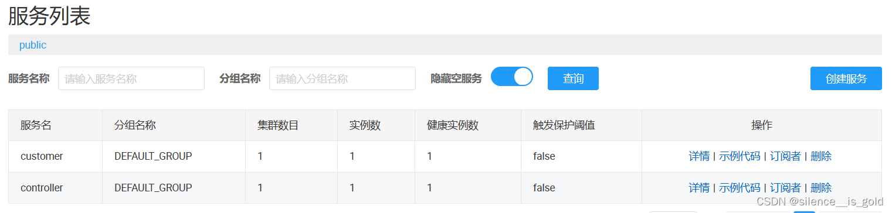

# Nacos的服务注册与发现
摘抄自：https://blog.csdn.net/silence__is_gold/article/details/129436886


## 前言


此处与我之前写的读取[nacos配置](https://so.csdn.net/so/search?q=nacos%E9%85%8D%E7%BD%AE&spm=1001.2101.3001.7020 "nacos配置")文件不同。这里服务发现主要读取nacos的IP地址和端口号，顺便可以读取一些你自己注册时含带的数据。这里除了介绍外，我还会用SpringCloud的方式实现一个客户端和服务端交互的小例子。


## 一、使用SDK的方式注册与发现


### 1.服务注册


如果你是新手，建议先试试这种方式后，再去实现其他方式。虽然其他方式更简单，但不好理解，毕竟封装地比较彻底，整个流程你什么都不知道。


>  
 1.老样子，先在pom.xml中引包。代码如下：


```java
<dependency>
            <groupId>com.alibaba.nacos</groupId>
            <artifactId>nacos-client</artifactId>
            <version>2.0.4</version>
</dependency>

```


>  
 2.在一个可以进行交互的方法（主方法、Controlle[r方](https://so.csdn.net/so/search?q=r%E6%96%B9&spm=1001.2101.3001.7020 "r方")法、junit测试方法都行）中，使用NamingFactory创建NamingService对象。用NamingService对象去注册和发现。代码如下：


```java
try {
	  // 创建NamingService对象，并声明nacos的地址
      NamingService namingService = NamingFactory.createNamingService("localhost:8848");
      //创建服务实例，名字叫customer，IP地址为127.0.0.1，端口为8081
      namingService.registerInstance("customer", "127.0.0.1", 8081);
} catch (NacosException e) {
      throw new RuntimeException(e);
}

```


然后你登入nacos的网站，在服务管理的列表中就能看到你注册的服务了。


>  
 当然，还有更细节的一种，你可以指定更多的服务注册细节。代码如下：


```java
try {
            NamingService namingService = NamingFactory.createNamingService("127.0.0.1:8848");
            // 第二种注册方式，所有数据能够自己写
            Instance instance = new Instance(); // 创建一个实例
            instance.setServiceName("test-app"); // 实例服务名
            instance.setIp("127.5.26.30"); // IP地址
            instance.setHealthy(true); // 服务是否健康，跟后面服务发现有关
            instance.setPort(9762); // 端口
            instance.setClusterName("sh"); // 所属集群
            Map<String, String> map = new HashMap<String, String>();
            map.put("info", "my secret is null");
            instance.setMetadata(map); // 存自定义信息
            namingService.registerInstance("app2", instance); // 注册实例
            System.in.read(); // 这里只是让方法保持运行，否则nacos注册完就结束了，你在nacos网站上是看不到的
        } catch (NacosException e) {
            throw new RuntimeException(e);
        } catch (IOException e) {
            throw new RuntimeException(e);
        }

```


### 2.服务发现


>  
 1.依赖在服务注册时引入了。
 2.同样是使用NamingService对象去发现服务。获取实例的方式有很多，我这里介绍几种：


* getAllInstance(String serviceName) 获取所有实例，返回的是个List    
* selectOneHealthyInstance(String serviceName) 获取一个健康的实例，返回的是个Instance    
* selectInstance(String serviceName, boolean healthy) 获取若干个实例，是否获取健康的实例由healthy来决定


>  
 具体代码如下：


```java
try {
      // 创建nacos连接
      NamingService namingService = NamingFactory.createNamingService("localhost:8848");
      // 获取一个健康的controller服务实例
      Instance instance = namingService.selectOneHealthyInstance("controller");
      if (instance == null) {
         System.out.println("没有获取到健康的实例");
         return result;
      }
 } catch (NacosException e) {
      throw new RuntimeException(e);
}

```


## 二、SpringCloud的方式实现


不写Spring和SpringBoot的方式是因为我没发现用注解进行注册的方式。而服务发现就只是使用@NacosInjected自动装配了一个NamingService而已。获取方式与SDK的一样。


### 1.服务注册


>  
 1.加入依赖


```java
<dependency>
    <groupId>com.alibaba.cloud</groupId>
    <artifactId>spring-cloud-starter-alibaba-nacos-discovery</artifactId>
    <version>${latest.version}</version>
</dependency>

```


>  
 2.在bootstrap.properties里加上如下代码：


```java
server.port=8081 //修改tomcat端口，你如果想起多个服务，这是必须的
spring.application.name=service-provider // 声明服务的名字，即nacos上的服务名

spring.cloud.nacos.discovery.server-addr=127.0.0.1:8848 // nacos的地址

```


>  
 在启动类上加上注解@EnableDiscoveryClient


### 2.服务发现


>  
 引入依赖，在服务注册部分已经说了。
 2.之前使用RestTemplate去访问时，我们需要IP、端口。这里跟SDK不同的地方在于我可以直接通过服务名访问（前提是同一个网段下）。代码如下：


```java
@RequestMapping(value = "/cloud", method = RequestMethod.GET)
    public String sendRequestBySpringCloud() {
        if(restTemplate == null) {
            System.out.println("restTemplate = null");
            restTemplate = new RestTemplate();
        }else {
            System.out.println("restTemplate = " + restTemplate);
        }
        String result = "什么都没拿到"; // 返回的信息
        //此处的controller是已经注册到nacos上的服务名, /show是暴露的接口
        String url = "http://controller/show?meg={meg}&user={user}"; 
        result = restTemplate.getForObject(url, String.class, "nacos", "lican");
        return result;
    }

```


这里的RestTemplate在创建Bean时，还需要加上@LoadBlance注解。因为你通过服务名拿到的实例可能不止一个，说要需要进行负载均衡。代码如下：


```java
@Configuration
public class remoteConfigration {

    @Bean
    @LoadBalanced // spring Cloud方式
    public RestTemplate getRestTemplate() {
        return new RestTemplate();
    }
}

```


## 三、实现一个Client和Controller的小例子


* 各自创建一个maven项目。引入我在SpringCloud中声明的依赖。基础运行依赖如下：


```java
    <parent>
        <groupId>org.springframework.boot</groupId>
        <artifactId>spring-boot-parent</artifactId>
        <version>2.3.12.RELEASE</version>
    </parent>
    <dependencies>
        <dependency>
            <groupId>org.springframework.boot</groupId>
            <artifactId>spring-boot-starter-web</artifactId>
        </dependency>
        <dependency>
            <groupId>com.alibaba.cloud</groupId>
            <artifactId>spring-cloud-starter-alibaba-nacos-config</artifactId>
            <version>2.2.8.RELEASE</version>
        </dependency>
        <dependency>
            <groupId>com.alibaba.cloud</groupId>
            <artifactId>spring-cloud-starter-alibaba-nacos-discovery</artifactId>
            <version>2.2.8.RELEASE</version>
        </dependency>
    </dependencies>

```


>  
 2.建立启动类，两边都建，代码一样。


```java
@SpringBootApplication
public class WebApplication {

    public static void main(String[] args) {
        SpringApplication.run(WebApplication.class);
    }
}

```


>  
 配置bootstrap.properties。两边只有服务名和端口不一样。


```java
server.port=8081 //端口
spring.application.name=customer //服务名
spring.cloud.nacos.server-addr=127.0.0.1:8848 //nacos地址

```


>  
 建立Controller类，对外暴露一个接口。Client端用来与用户在浏览器端交互。Controller端用来与Client端交互。


* Client端


```java
@RestController
public class CustomerController {
    @Autowired
    RestTemplate restTemplate;
    // SpringCloud 方式，记得在remoteConfigration类里面加上@LoadBlance
    @RequestMapping(value = "/cloud", method = RequestMethod.GET)
    public String sendRequestBySpringCloud() {
        if(restTemplate == null) {
            System.out.println("restTemplate = null");
            restTemplate = new RestTemplate();
        }else {
            System.out.println("restTemplate = " + restTemplate);
        }
        String result = "什么都没拿到"; // 返回的信息
        String url = "http://controller/show?meg={meg}&user={user}";
        result = restTemplate.getForObject(url, String.class, "nacos", "lican");
        return result;
    }
}

```


restTemplate在创建Bean时，记得在@Bean下在加上@LoadBlance


* Controller端


```java
@RestController
public class HelloWorld {

    @RequestMapping(value = "show", method = RequestMethod.GET)
    public String showMessage(@RequestParam("meg") String meg, @RequestParam("user") String user) {
        return user+ " " + meg + " 传递成功！！！";
    }
}

```


>  
 开启两个服务，在nacos上的服务配置图为





>  
 在浏览器端访问http://192.168.3.30:8081/cloud，最终结果为


## 总结


突然觉得写这玩意真痛苦(已经无欲无求了)。总的来说，我把nacos的服务注册与发现的配置流程写了一遍，还配上了一个小例子，希望对大家有所帮助。另：完整的例子我已经打包好放在我的资源中，可以直接运行。想要没打成jar包的项目的话，留言一下吧，看到了会给的。


