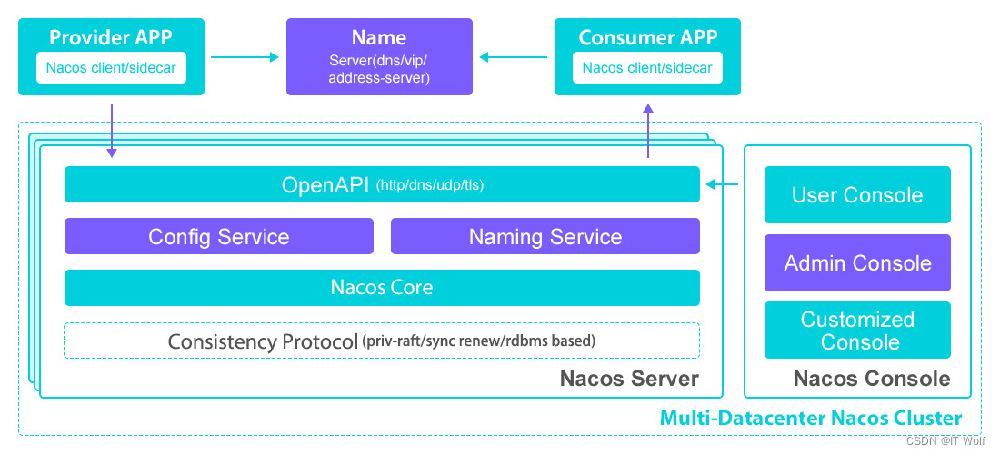
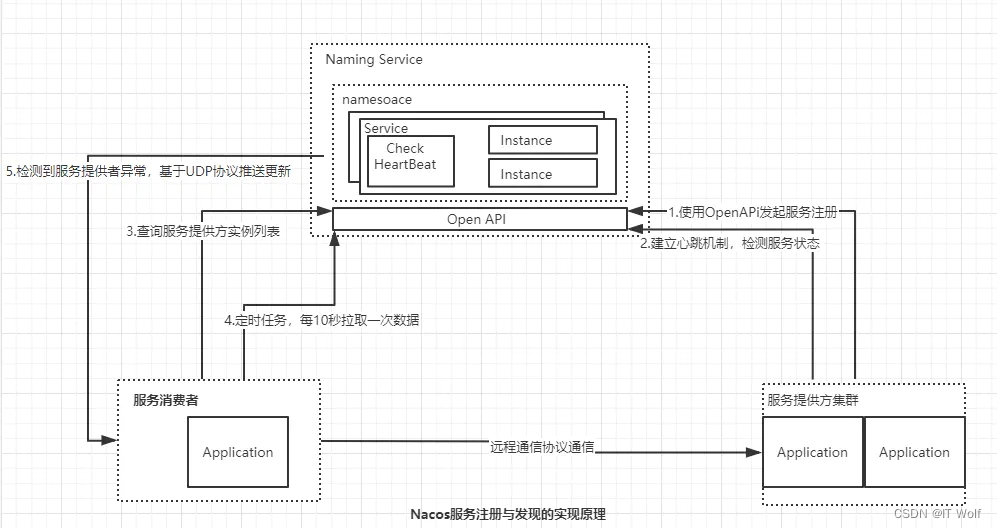
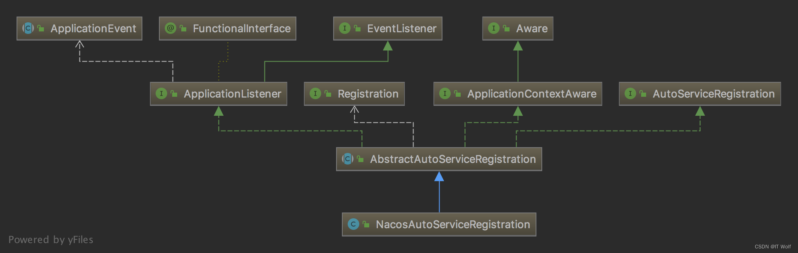

# 服务注册与发现(Nacos)
摘抄自：https://blog.csdn.net/wm31898/article/details/124361950


## 什么是Alibaba [Nacos](https://so.csdn.net/so/search?q=Nacos&spm=1001.2101.3001.7020 "Nacos")


Nacos致力于解决微服务中的统一配置、服务注册与发现等问题。它提供了一组简单易用的特性集，帮助开发者快速实现动态服务发现、服务配置、服务元数据及流量管理


**Nacos的关键特性如下：**


* 服务发现和监控检测    
* 动态配置服务    
* 动态DNS服务    
* 服务及元数据管理


## Nacos的基本使用


来初步了解一下 Nacos 的基本使用


### Nacos的安装


Nacos 支持三种部署，分别是单机、集群和多集群。需要注意一点，Nacos 依赖 Java 环境，并且要求使用 JDK 1.8 以上版本


Nacos 的安装方式一般有两种，一种是源码安装，另一种直接是使用已经编译好的安装包。由于后续需要分析 Nacos 源码，所以这里就先选择第一种源码安装方式


* 在[https://github.com/alibaba/nacos/releases](https://github.com/alibaba/nacos/releases "https://github.com/alibaba/nacos/releases")下载当前 Nacos 的最新版本源码(Source)    
* 解压进入根目录，执行mvn -Prelease-nacos -Dmaven.test.skip=true clean install -U 构建，构建之后会创建一个distribution 目录    
* 执行 cd distribution/target/nacos-server-$version/nacos/bin    
* 执行 sh startup.sh -m standalone 启动服务    
* 服务启动之后，可以通过 http://127.0.0.1:8848/nacos 返回 nacos 控制台


**Nacos服务注册发现相关API**


Nacos提供SDK及Open API 的方式来完成服务注册与发现等操作，由于服务端只提供了 REST 接口，所以SDK本质上是对于 HTTP 请求的封装。下面简单列一下和服务注册相关的核心接口


**注册实例**


将服务地址信息注册到 Nacos Server:


```java
OPAPI：/nacos/v1/ns/instance（POST）
SDK：
void registerInstance(String serviceName, String ip, int port) throws NacosException;
void registerInstance(String serviceName, String ip, int port, String clusterName) throws NacosException;
void registerInstance(String serviceName, Instance instance) throws NacosException;
```


参数说明如下：


* serviceName：服务名称    
* ip：服务实例 IP    
* port：服务实例 Port    
* clusterName：集群名称，表示该服务实例属于哪个集群    
* instance：实例属性，实际上就是把上面这些参数封装成一个对象


调用方式：


```java
NamingService naming = 
NamingFactory.createNameingService(System.getProperty("serverAddr"));
naming.registerInstance("nacos_test", "192.168.1.1", 8080, "DEFAULT");
```


**获取全部实例**


根据服务名称从 Nacos Server 上获取所有服务实例：


```java
Open API: /nacos/v1/ns/instance/list (GET)
SDK:
List<Instance> getAllInstance(String serviceName) throws NacosException;
List<Instance> getAllInstance(String serviceName, List<String> clusters) throws NacosException;
```


参数说明如下：


* serviceName：服务名称    
* cluster：集群列表，可以传递多个值


调用方式


```java
NamingService naming = NamingFactory.createNamingService(System.getProperty("serverAddr"));
System.out.println(naming.getAllInstances("nacos_test", true));
```


**监听服务**


监听服务是指监听指定服务下的实例变化，客户端从 Nacos Server 上获取的实例必须是健康的，否则会造成客户端请求失败。监听服务机制可以让客户端及时感知服务提供者的变化


```java
Open API: /nacos/v1/ns/instance/list （GET）
SDK:
void subscribe(String serviceName, EventListener listener) throws Nacoe NacosException;
void subscribe(String serviceName, List<String> clusters, EventListener listener) throws NacosException;
```


参数说明：


* EventListener：当服务提供者实例发生上、下线时，会触发一个事件回顾


服务监听两种方式


* 第一种是客户端调用 /nacos/v1/ns/Instance/list 定时轮询    
* 第二种是基于 DatagramSocket 的 UDP 协议，实现服务端的主动推送


## Nacos实现原理分析


先看一下 Nacos 的架构及实现[注册中心](https://so.csdn.net/so/search?q=%E6%B3%A8%E5%86%8C%E4%B8%AD%E5%BF%83&spm=1001.2101.3001.7020 "注册中心")的原理


这个是 Nacos官网 图片：





* Provide APP：服务提供者    
* Consumer APP：服务消费者    
* Name Server：通过 VIP （Vritual IP）或者 DNS 的方式实现 Nacos 高可用集群的服务路由    
* Naming Service 是Nacos提供的配置服务、名字服务模块。Consistency Protocol 是一致性协议，用来实现 Nacos 集群节点的数据同步，这里使用的是 Raft 算法（使用类似算法的中间件还有 Etcd、Redis 哨兵选举）    
* Nacos Console：Nacos 控制台


整体来说，服务提供者通过VIP （Vritual IP）访问 Nacos server 高可用集群，基于 Open API 完成服务的注册和服务的查询。Nacos server 本身可以支持主备模式，所以底层会采用数据一致性算法来完成从节点的数据同步。服务消费者也是如此，基于 Open API 从 Nacos Server 中查询服务列表


### 注册中心的原理


服务注册的功能主要体现在：


* 服务实例在启动时注册到服务注册表，并在关闭时注销    
* 服务消费者查询服务注册表，获得可用实例    
* 服务注册中心需要调用服务实例的健康检查 API 来验证它是否能够处理请求


Nacos 服务注册与发现的实现原理图：





## 深入解读Nacos源码


Nacos 源码部分，我们主要阅读三部分：


* 服务注册    
* 服务地址的获取    
* 服务地址变化的感知


### Spring Cloud 什么时候完成服务注册


在 Spring-Cloud-Common 包中有一个类 org.springframework.cloud.clinet.serviceregistry.ServiceResgistry，它是 Spring Cloud 提供的服务注册的标准。集成到 Spring Cloud 中实现服务注册的组件，都会实现该接口


```java
public interface ServiceRegistry<R extends Registration> {
    void register(R registration);
    void deregister(R registration);
    void close();
    void setStatus(R registration, String status);
    <T> T getStatus(R registration);
}
```


这个接口有一个实现类是 com.alibaba.cloud.nacos.registry.NacosServiceRegistry


### Spring Cloud 集成 Nacos 实现过程


在spring-clou-commons包的META-INF/spring.factories中包含自动装配的配置信息如下：


```java
org.springframework.boot.autoconfigure.EnableAutoConfiguration=\org.springframework.cloud.client.CommonsClientAutoConfiguration,\org.springframework.cloud.client.ReactiveCommonsClientAutoConfiguration,\
## 省略部分代码
 
org.springframework.cloud.client.serviceregistry.AutoServiceRegistrationAutoConfiguration
```


其中 AutoServiceRegistrationAutoConfiguration 就是服务注册相关的配置类


服务自动注册类关系图：





可以看出, AbstractAutoServiceRegistration抽象类实现了该接口,并且最重要的是NacosAutoServiceRegistration继承了AbstractAutoServiceRegistration。


看到EventListener我们就应该知道，Nacos是通过Spring的事件机制继承到SpringCloud中去的。


AbstractAutoServiceRegistration实现了onApplicationEvent抽象方法,并且监听WebServerInitializedEvent事件(当Webserver初始化完成之后) , 调用this.bind ( event )方法。


总结一下服务注册的完整过程：


Nacos 客户端通过 Open API 的形式发送服务注册请求


Nacos 服务端收到请求后，做以下三件事


* 构建一个 Service 对象保存到 ConcurrentHashMap 集合中    
* 使用定时任务对当前服务下所有实例建立心跳检测机制    
* 基于数据一致性协议将服务数据进行同步


