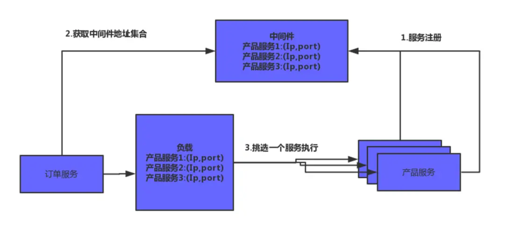
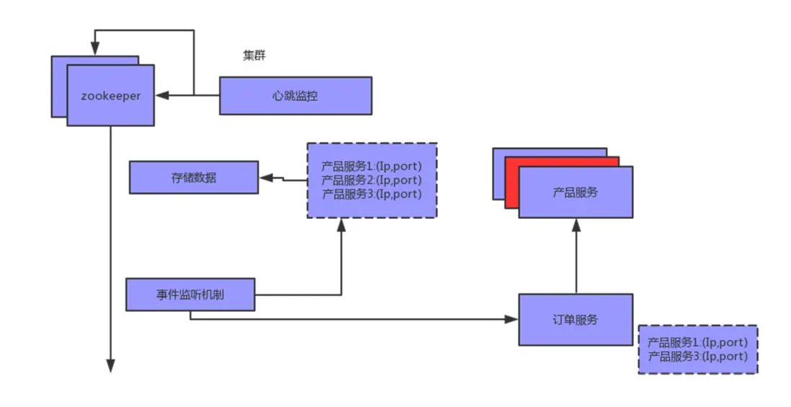
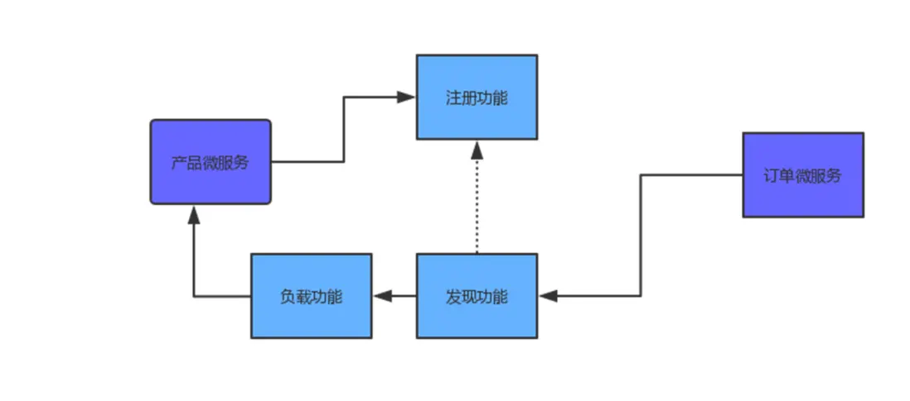

# zookeeper实战之服务注册与发现
摘抄自：https://segmentfault.com/a/1190000019670015

## zookeeper应用场景


回顾下zk应用场景：


* 数据发布与订阅    
* 服务注册与发现    
* 分布式锁    
* 分布式队列    
* master选举    
* 配置中心    
* 命名服务    
* 负载均衡


## zookeeper实现服务注册与发现


**服务注册与发现**





再来看看zk在服务注册与发现中的应用：





**代码实现逻辑：**





服务注册：

```java
public class ServiceRegister {

    private  static final String BASE_SERVICES = "/services";
    private static final String  SERVICE_NAME="/products";

    public static  void register(String address,int port) {
        try {
            ZooKeeper zooKeeper = new ZooKeeper("localhost:2181",5000,(watchedEvent)->{});
            Stat exists = zooKeeper.exists(BASE_SERVICES + SERVICE_NAME, false);
            if(exists==null) {
                zooKeeper.create(BASE_SERVICES + SERVICE_NAME,"".getBytes(), ZooDefs.Ids.OPEN_ACL_UNSAFE, CreateMode.PERSISTENT);
            }
            String server_path = address+":"+port;
            //创建的临时的有序节点
            //临时的话断开连接了可以监听到,有序节点创建代表每一个节点否则相同节点名称无法创建
            zooKeeper.create(BASE_SERVICES + SERVICE_NAME+"/child",server_path.getBytes(), ZooDefs.Ids.OPEN_ACL_UNSAFE,CreateMode.EPHEMERAL_SEQUENTIAL);
            System.out.println("产品服务注册成功");
        } catch (Exception e) {
            e.printStackTrace();
        }
    }
}

```

发现服务：

```java
    public class InitListener implements ServletContextListener {

    private  static final String BASE_SERVICES = "/services";
    private static final String  SERVICE_NAME="/products";

    private ZooKeeper zooKeeper;

    @Override
    public void contextInitialized(ServletContextEvent sce) {
        try {
             zooKeeper = new ZooKeeper("localhost:2181",5000,(watchedEvent)->{
                if(watchedEvent.getType() == Watcher.Event.EventType.NodeChildrenChanged  && watchedEvent.getPath().equals(BASE_SERVICES+SERVICE_NAME)) {
                    updateServiceList();
                }
            });

            updateServiceList();
        } catch (Exception e) {
            e.printStackTrace();
        }

    }

    private void updateServiceList() {
       try{
           List<String> children = zooKeeper.getChildren(BASE_SERVICES  + SERVICE_NAME, true);
           List<String> newServerList = new ArrayList<String>();
           for(String subNode:children) {
               byte[] data = zooKeeper.getData(BASE_SERVICES  + SERVICE_NAME + "/" + subNode, false, null);
               String host = new String(data, "utf-8");
               System.out.println("host:"+host);
               newServerList.add(host);
           }
           //保存注册服务的ip端口信息，以供远程rpc调用
           LoadBalance.SERVICE_LIST = newServerList;
       }catch (Exception e) {
           e.printStackTrace();
       }
    } 
}

public abstract class LoadBalance {
    public volatile static List<String> SERVICE_LIST;

    public abstract String choseServiceHost();

}

/**
 * 随机负载均衡算法
 */
public class RamdomLoadBalance extends LoadBalance {
    @Override
    public String choseServiceHost() {
        String result = "";
        if(!CollectionUtils.isEmpty(SERVICE_LIST)) {
            int index = new Random().nextInt(SERVICE_LIST.size());
            result = SERVICE_LIST.get(index);
        }
        return result ;
    }
}

```


再讲讲几个关键点1.注册服务的时候需要创建临时节点,断开连接的时候也就是服务端挂了后节点删除可监听到2.注册服务的时候创建的是有序节点,一般来说相同服务都是有几台机器的,创建顺序节点可区分多台机器的服务3.发现服务的一端监听服务节点的子节点，有子节点被删除了或者有新子节点创建即重新发现服务可用的机器


dubbo中基于zk的服务注册与发现也是这个原理


