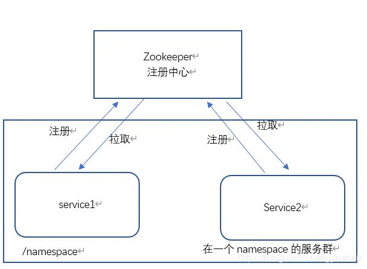
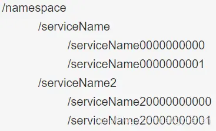

# 基于Zookeeper Java API实现服务注册与发现功能
摘抄自：https://www.jianshu.com/p/94dce509881a


通过使用zookeeper提供的java API更好的学习和理解zookeeper。


## 需求描述


大致满足服务注册与发现的基本功能


* 服务的注册功能    
* 服务上线自动注册到zookeeper    
* 服务离线自动从zookeeper中删除    
* 服务动态发现功能

服务上线自动拉取zookeeper中已经注册的服务信息。
有新的服务注册到zookeeper，自动拉取更新本地注册表。
有服务离线自动删除本地注册表中该服务的信息。    
* 保证服务信息数据的最终一致性


  

架构图


## 设计思路


### 相关概念


* 命名空间(namesapce)： 用于划分不同的服务群。    
* 服务群：多个相关联的服务可以组成服务群，一个服务群使用一个唯一的命名空间(namespace)与其他服务群隔离，便于管理。    
* 服务注册：将服务实例信息注册到对应的命名空间中。    
* 服务发现：从zookeeper注册中心对应的命名空间拉取服务信息，并保存到本地注册表。


  

20210227164835718.png


### 实现方案


整个系统分为两个模块：服务注册模块和服务发现模块。服务系统要注册到zookeeper，首先需要知道zookeeper的地址信息，有关zookeeper的配置信息配置到**zookeeper.properties**中。使用application.properties保存服务相关配置，这些配置是注册时服务实例信息的重要来源。系统使用log4j输出日志，使用log4j.properties配置日志。


* zookeeper.properties 包含以下配置项
```java
zk.server.addr=localhost:2181       # zookeeper地址
zk.server.session.timeout=5000            
zk.server.namespace=/service      #服务群的命名空间(namespace)，服务将注册到该znode节点下

```    
* application.properties 包含一下配置项
```java
application.name=common-service #应用名称，作为服务名
server.port=8093   #该服务的端口

```    
* log4j.properties参考log4j相关配置


#### 服务注册实现方案


当服务启动时，读取配置，初始化zookeeper客户端。首先要确保配置的namespace在zookeeper中存在对应的znode节点，如果不存在则先创建。然后判断application.name（也作为serviceName）值为path的znode节点是否存在，不存在则调用zookeeper api创建以application.name值为path的znode节点，此节点将作为该服务的注册路径，接下来该服务的所有实例都注册到该节点下。然后以application.name（也作为serviceName）值为path在/namespace/serverName路径下创建服务实例对应path并写入该服务实例的数据，需要注意以临时序列号的方式创建该znode，至此服务注册完成。大致总结:


* 以持久化方式创建/namespace的zookeeper znode作为服务群命名空间。    
* 以持久化方式创建/namespace/serviceName的znode作为服务集群的注册路径    
* 当服务注册时，以临时序列号方式方式创建/namesapce/serviceName/serviceName0000000000的znode，并将服务信息写入到该节点下。以临时序列号方式方式创建该节点是因为当服务断开后会自动删除该节点，这样zookeeper会通知监听该znode的服务，动态的更新服务注册表，这样就实现了服务的动态发现功能。


当多个服务的多个实例注册完成后zookeeper znode如下：


在这里插入图片描述


服务注册完成后，使用zookeeper的api watch /namespace节点即可监听该路径的变化。


#### 服务发现实现方案


服务启动后，会主动调用zookeeper的api遍历/namesapce路径，获取所有的children节点，将数据保存在该服务下，这样就发现了所有的服务信息。在服务启动时，已经监听了/namespace znode节点，所以以后如果有新的服务注册到zookeeper或者有服务断开zookeeper，将会通知该服务，该服务会更新自己的注册表。这样服务的动态发现就实现了。


## 编码实现


### zookeeper环境


使用的zookeeper版本为3.6.2


### Maven依赖


```java
<dependency>
      <groupId>org.apache.zookeeper</groupId>
      <artifactId>zookeeper</artifactId>
      <version>3.6.2</version>
</dependency>

```


要与zookeeper server版本对应。


### 配置文件


将三个配置文件放到classpath下


* zookeeper.properties
```java
 zk.server.addr=localhost:2181
 zk.server.session.timeout=5000
 zk.server.namespace=/service

```    
* application.properties
```java
application.name=common-service
server.port=8093

```    
* log4j.properties
```java
 log4j.rootLogger=INFO,standout
 log4j.appender.standout=org.apache.log4j.ConsoleAppender
 log4j.appender.standout.layout=org.apache.log4j.PatternLayout
 log4j.appender.standout.layout.conversionPattern=%d{yyyy/MM/dd HH:mm:ss} %p %l:%m%n

```


### 属性配置实现


#### 应用配置实现


```java
package com.github.cloudgyb.config;

import java.io.IOException;
import java.io.InputStream;
import java.util.Properties;

import org.slf4j.Logger;
import org.slf4j.LoggerFactory;

/**
 * 应用配置
 * @author cloudgyb
 * 2021/2/26 16:15
 */
public class ApplicationProperties {
    private final static Logger logger = LoggerFactory.getLogger(ApplicationProperties.class);
    private final static String configFile = "application.properties";
    private final static String applicationNameKey = "application.name";
    private final static String serverPortKey = "server.port";
    private String applicationName;
    private Integer serverPort;

    private static final ApplicationProperties prop = new ApplicationProperties();

    static{
        logger.info("开始从"+configFile+"加载应用配置信息.");
        try (InputStream ins = ApplicationProperties.class.getClassLoader()
                .getResourceAsStream(configFile)) {
            if (ins == null)
                throw new ApplicationConfigException("应用配置错误，在classpath下未发现'" + configFile + "文件！");
            Properties properties = new Properties();
            properties.load(ins);
            String applicationName = properties.getProperty(applicationNameKey);
            if (applicationName == null || "".equals(applicationName))
                throw new ApplicationConfigException("应用配置错误，'" + applicationNameKey + "'未配置！");
            else
                prop.applicationName = applicationName;
            String serverPort = properties.getProperty(serverPortKey);
            if(serverPort == null || "".equals(serverPort)){
                throw new ApplicationConfigException("应用配置错误，'" + serverPortKey + "'未配置！");
            }else{
                prop.serverPort = Integer.valueOf(serverPort);
            }
        }catch (ApplicationConfigException | IOException e){
            logger.error(e.getMessage());
            System.exit(-1);
        }catch (NumberFormatException e){
            logger.error("应用配置错误，'"+serverPortKey+"'值不合法！");
            System.exit(-1);
        }
        logger.info("加载应用配置完成!");
    }
    private ApplicationProperties(){}

    public static ApplicationProperties config() {
        return prop;
    }
    //省略getter
}

```


#### zookeeper配置实现


```java
package com.github.cloudgyb.config;

import java.io.IOException;
import java.io.InputStream;
import java.util.Properties;
import org.slf4j.Logger;
import org.slf4j.LoggerFactory;

/**
 * zk Server 配置
 * @author cloudgyb
 * 2021/2/25 14:30
 */
public class ZookeeperServerConfigProperties {
    private static final Logger logger = LoggerFactory.getLogger(ZookeeperServerConfigProperties.class);
    private static final String confFile = "zookeeper.properties";
    private static final String serverAddrKey = "zk.server.addr";
    private static final String sessionTimeoutKey = "zk.server.session.timeout";
    private static final String namespaceKey = "zk.server.namespace";
    private static final int defaultSessionTimeout = 2000;
    private String serverAddress;
    private Integer sessionTimeout;
    private String namespace;

    private static final ZookeeperServerConfigProperties configPropertiesHolder = new ZookeeperServerConfigProperties();

    static {
        logger.info("开始从"+confFile+"加载zookeeper配置.");
        try (InputStream ins = ZookeeperServerConfigProperties.class.getClassLoader()
                .getResourceAsStream(confFile)) {
            if (ins == null)
                throw new ZookeeperConfigException("配置错误，在classpath下未发现'" + confFile + "文件！");
            Properties properties = new Properties();
            properties.load(ins);
            String addr = properties.getProperty(serverAddrKey);
            if (addr == null || "".equals(addr))
                throw new ZookeeperConfigException("配置错误，'" + serverAddrKey + "'未配置！");
            else
                configPropertiesHolder.serverAddress = addr;
            String timeout = properties.getProperty(sessionTimeoutKey);
            if (timeout == null || "".equals(timeout)) {
                configPropertiesHolder.sessionTimeout = defaultSessionTimeout;
            }
            else {
                try {
                    configPropertiesHolder.sessionTimeout = Integer.valueOf(timeout);
                }
                catch (NumberFormatException e) {
                    throw new ZookeeperConfigException("配置错误，'" + sessionTimeoutKey + "'值不合法！");
                }
            }
            String ns = properties.getProperty(namespaceKey);
            if (ns == null || "".equals(ns)) {
                throw new ZookeeperConfigException("配置错误，'" + namespaceKey + "'未配置！");
            }
            else {
                configPropertiesHolder.namespace = ns;
            }
            logger.info("从" + confFile + "读取zookeeper配置完成.");
        }
        catch (IOException e) {
            logger.error("配置错误," + e.getMessage());
            System.exit(1);
        }
        catch (ZookeeperConfigException e) {
            logger.error(e.getMessage());
            System.exit(1);
        }
    }

    private ZookeeperServerConfigProperties() {
    }

    public static ZookeeperServerConfigProperties config() {
        return configPropertiesHolder;
    }
    //省略getter
}

```


### 服务注册实现


服务注册接口


```java
/**
 * 服务注册接口
 * @author cloudgyb
 * 2021/2/25 17:31
 */
public interface ServiceRegister {
    boolean registry();
}

```


服务注册实现


```java
package com.github.cloudgyb.registry;

import java.io.ByteArrayOutputStream;
import java.io.IOException;
import java.io.ObjectOutputStream;

import com.github.cloudgyb.config.ApplicationProperties;
import com.github.cloudgyb.config.ZookeeperServerConfigProperties;
import com.github.cloudgyb.util.IPUtil;
import org.apache.log4j.Logger;
import org.apache.zookeeper.CreateMode;
import org.apache.zookeeper.KeeperException;
import org.apache.zookeeper.ZooDefs;
import org.apache.zookeeper.ZooKeeper;
import org.apache.zookeeper.data.Stat;

/**
 * 注册服务类，向zookeeper注册该应用的信息
 * @author cloudgyb
 * 2021/2/25 17:24
 */
public class RegistryService implements ServiceRegister {
    private final Logger logger = Logger.getLogger(RegistryService.class);
    private final ZooKeeper zooKeeper;
    private final ZookeeperServerConfigProperties configProperties;

    public RegistryService(ZooKeeper zooKeeper) {
        this.zooKeeper = zooKeeper;
        this.configProperties = ZookeeperServerConfigProperties.config();
    }

    /**
     * 会在zookeeper中创建以下znode结构
     * /namespace/serviceName/serviceName0000000000
     *                       /serviceName0000000001
     *                       /serviceName0000000002
     * @return 注册成功返回true
     */
    @Override
    public boolean registry() {
        try (ByteArrayOutputStream baos = new ByteArrayOutputStream();
             ObjectOutputStream oos = new ObjectOutputStream(baos)) {
            ServiceInstanceInfo info = generateServiceInfo();
            oos.writeObject(info);
            ensureZNodeExist(configProperties.getNamespace(), info.getServiceName());
            this.zooKeeper.create(configProperties.getNamespace() + "/" +
                            info.getServiceName() + "/" + info.getServiceName(),
                    baos.toByteArray(),
                    ZooDefs.Ids.OPEN_ACL_UNSAFE,
                    CreateMode.EPHEMERAL_SEQUENTIAL);
        }
        catch (IOException | InterruptedException | KeeperException e) {
            logger.error(e.getMessage(), e);
            return false;
        }
        return true;
    }

    private void ensureZNodeExist(String namespace, String serviceName) throws KeeperException, InterruptedException {
        Stat exists = zooKeeper.exists(namespace, false);
        if (exists == null) {
            logger.info("zookeeper namespace:" + namespace + "不存在，开始创建...");
            String s = zooKeeper.create(namespace, null, ZooDefs.Ids.OPEN_ACL_UNSAFE, CreateMode.PERSISTENT);
            logger.info("zookeeper namespace:" + s + "已创建！");
        }
        Stat isExist = zooKeeper.exists(namespace + "/" + serviceName, false);
        if (isExist == null) {
            logger.info("zookeeper service Znode:" + serviceName + "不存在，开始创建...");
            String s = zooKeeper.create(namespace + "/" + serviceName, null,
                    ZooDefs.Ids.OPEN_ACL_UNSAFE,
                    CreateMode.PERSISTENT);
            logger.info("zookeeper service Znode:" + s + "已创建！");
        }
    }

    private ServiceInstanceInfo generateServiceInfo() {
        ApplicationProperties config = ApplicationProperties.config();
        return new ServiceInstanceInfo(config.getApplicationName(), IPUtil
                .getIpAddress(),
                config.getServerPort());
    }
}


```


服务实例信息pojo


```java
package com.github.cloudgyb.registry;

import java.io.Serializable;
/**
 * 服务实例属性信息，序列化后注册到zookeeper
 * @author cloudgyb
 * 2021/2/25 17:26
 */
public class ServiceInstanceInfo implements Serializable {
    private String serviceName;
    private String ip;
    private int port;

    ServiceInstanceInfo(String serviceName, String ip, int port) {
        this.serviceName = serviceName;
        this.ip = ip;
        this.port = port;
    }
    //省略getter和setter
    @Override
    public String toString() {
        return "ServiceInstanceInfo{" +
                "serviceName='" + serviceName + '\'' +
                ", ip='" + ip + '\'' +
                ", port=" + port +
                '}';
    }
}

```


### 服务发现实现


服务发现接口


```java
package com.github.cloudgyb.discovery;

import org.apache.zookeeper.KeeperException;
import org.apache.zookeeper.WatchedEvent;

/**
 * 服务发现接口
 * @author cloudgyb
 * 2021/2/25 17:48
 */
public interface ServiceDiscover {
    void discovery(WatchedEvent e) throws KeeperException, InterruptedException;
}

```


服务发现实现类


```java
package com.github.cloudgyb.discovery;

import java.io.ByteArrayInputStream;
import java.io.IOException;
import java.io.ObjectInputStream;
import java.util.List;
import java.util.Map;
import java.util.concurrent.ConcurrentHashMap;

import com.github.cloudgyb.config.ZookeeperServerConfigProperties;
import com.github.cloudgyb.registry.ServiceInstanceInfo;
import org.apache.zookeeper.KeeperException;
import org.apache.zookeeper.WatchedEvent;
import org.apache.zookeeper.ZooKeeper;
import org.apache.zookeeper.data.Stat;
import org.slf4j.Logger;
import org.slf4j.LoggerFactory;

/**
 * 服务发现实现类
 * @author cloudgyb
 * 2021/2/25 17:52
 */
public class DiscoveryService implements ServiceDiscover {
    private final Logger logger = LoggerFactory.getLogger(DiscoveryService.class);
    private final ZookeeperServerConfigProperties properties;
    private final ZooKeeper zooKeeper;
    private final ConcurrentHashMap<String, Map<String, ServiceInstanceInfo>> registry;

    public DiscoveryService(ZookeeperServerConfigProperties properties, ZooKeeper zooKeeper) {
        this.properties = properties;
        this.zooKeeper = zooKeeper;
        this.registry = new ConcurrentHashMap<>(4);
    }

    public void discovery(WatchedEvent e) throws KeeperException, InterruptedException {
        int type = e.getType().getIntValue();
        if (type == -1)
            return;
        logger.info("注册信息发生变化，type=" + type + ",path=" + e.getPath());
        if (type == 1) {//节点创建（有新的服务注册）
            logger.info("有新的服务注册，添加服务信息到注册表...");
            String path = e.getPath();
            ServiceInstanceInfo serviceInstanceInfo = addServiceInfo(path);
            logger.info("已添加服务：" + serviceInstanceInfo);
        }
        else if (type == 2) {//节点删除（有服务断开）
            logger.info("有服务离线，从注册表删除服务信息...");
            String path = e.getPath();
            ServiceInstanceInfo serviceInstanceInfo = deleteServiceInfo(path);
            logger.info("已移除服务：" + serviceInstanceInfo);
        }

    }

    private ServiceInstanceInfo deleteServiceInfo(String path) {
        String[] split = path.split("/");
        if (split.length < 4)
            return null;
        String serviceName = split[2];
        String serviceInstanceName = split[3];
        Map<String, ServiceInstanceInfo> map = registry.get(serviceName);
        ServiceInstanceInfo serviceInstanceInfo = map.get(serviceInstanceName);
        map.remove(serviceInstanceName);
        return serviceInstanceInfo;
    }

    private ServiceInstanceInfo addServiceInfo(String path) throws KeeperException, InterruptedException {
        //例如：path=/service/serviceName/serviceName0000000000
        String[] split = path.split("/");
        if (split.length < 4)
            return null;
        //分割之后，serviceName就是第2个元素
        String serviceName = split[2];
        String serviceInstanceName = split[3];
        Map<String, ServiceInstanceInfo> map = registry.get(serviceName);
        if(map == null){
            map = new ConcurrentHashMap<>();
            registry.put(serviceName,map);
        }
        byte[] data = zooKeeper.getData(path, false, new Stat());
        ServiceInstanceInfo serviceInstanceInfo = toObject(data);
        map.put(serviceInstanceName, serviceInstanceInfo);
        return serviceInstanceInfo;
    }

    public void flushRegistry() throws KeeperException, InterruptedException {
        List<String> serviceNameList = zooKeeper.getChildren(properties.getNamespace(), true);
        if (serviceNameList == null)
            return;
        for (String serviceName : serviceNameList) {
            Map<String, ServiceInstanceInfo> serviceList = registry.get(serviceName);
            if (serviceList == null)
                serviceList = new ConcurrentHashMap<>();
            List<String> serviceInstanceList = zooKeeper
                    .getChildren(properties.getNamespace() + "/" + serviceName,
                            false);
            if (serviceInstanceList != null) {
                for (String serviceInstanceName : serviceInstanceList) {
                    byte[] data = zooKeeper.getData(
                            properties.getNamespace() + "/" + serviceName + "/" +
                                    serviceInstanceName,
                            false, new Stat());
                    ServiceInstanceInfo serviceInstanceInfo = toObject(data);
                    serviceList.put(serviceInstanceName, serviceInstanceInfo);
                }
            }
            registry.put(serviceName, serviceList);
        }
    }

    private ServiceInstanceInfo toObject(byte[] data) {
        try (
                ByteArrayInputStream bis = new ByteArrayInputStream(data);
                ObjectInputStream ois = new ObjectInputStream(bis)
        ) {
            return (ServiceInstanceInfo) ois.readObject();
        }
        catch (ClassNotFoundException | IOException e) {
            e.printStackTrace();
        }
        return null;
    }

    public ConcurrentHashMap<String, Map<String, ServiceInstanceInfo>> getRegistry() {
        return registry;
    }
}


```


服务发现监控类Watcher


```java
package com.github.cloudgyb.discovery;

import java.io.IOException;
import java.util.Map;
import java.util.Set;
import java.util.concurrent.ConcurrentHashMap;

import com.github.cloudgyb.config.ZookeeperServerConfigProperties;
import com.github.cloudgyb.registry.RegistryService;
import com.github.cloudgyb.registry.ServiceInstanceInfo;
import org.apache.zookeeper.AddWatchMode;
import org.apache.zookeeper.KeeperException;
import org.apache.zookeeper.WatchedEvent;
import org.apache.zookeeper.Watcher;
import org.apache.zookeeper.ZooKeeper;
import org.slf4j.Logger;
import org.slf4j.LoggerFactory;

/**
 * zookeeper watcher
 * @author cloudgyb
 * 2021/2/26 17:01
 */
public class ZookeeperWatcher implements Watcher {
    private final Logger logger = LoggerFactory.getLogger(ZookeeperWatcher.class);
    private ZooKeeper zooKeeper;
    private DiscoveryService discoveryService;

    public ZookeeperWatcher() {
        try {
            ZookeeperServerConfigProperties zkConfig = ZookeeperServerConfigProperties.config();
            this.zooKeeper = new ZooKeeper(zkConfig.getServerAddress(), zkConfig.getSessionTimeout(),
                    this);
            this.discoveryService = new DiscoveryService(zkConfig,zooKeeper);
            registryService();
            this.discoveryService.flushRegistry();
            showRegistry();
            enableWatch(zkConfig.getNamespace());
        }catch (IOException | KeeperException | InterruptedException e){
            logger.error("初始化zookeeper客户端错误！",e);
        }
    }

    /**
     * 启动路径监听
     * @param namespace 服务注册的节点路径
     */
    private void enableWatch(String namespace) {
        try {
            zooKeeper.addWatch(namespace, AddWatchMode.PERSISTENT_RECURSIVE);
        }catch (Exception e){
            logger.error("监听"+namespace+"错误！",e);
        }
    }

    /**
     * 将自己注册到zookeeper
     */
    private void registryService() {
        logger.info("开始注册服务....");
        RegistryService registryService = new RegistryService(this.zooKeeper);
        registryService.registry();
        logger.info("注册服务成功！");
    }

    @Override
    public void process(WatchedEvent watchedEvent) {
        Event.EventType type = watchedEvent.getType();
        System.out.println("--------------------");
        System.out.println(type);
        System.out.println("监听到变化。");
        try {
            discoveryService.discovery(watchedEvent);
            showRegistry();
        }
        catch (Exception e) {
            logger.error("更新注册信息失败！", e);
        }
        System.out.println("------------------------");
    }

    private void showRegistry() {
        ConcurrentHashMap<String, Map<String,ServiceInstanceInfo>> registry =
                discoveryService.getRegistry();
        Set<Map.Entry<String, Map<String,ServiceInstanceInfo>>> entries = registry.entrySet();
        for (Map.Entry<String, Map<String,ServiceInstanceInfo>> entry : entries) {
            System.out.println(entry.getKey());
            Map<String,ServiceInstanceInfo> entryValue = entry.getValue();
            if(entryValue != null){
                Set<Map.Entry<String, ServiceInstanceInfo>> entries1 = entryValue.entrySet();
                for (Map.Entry<String, ServiceInstanceInfo> e : entries1) {
                    System.out.println(e.getKey()+":"+e.getValue());
                }
            }
        }
    }
}


```


### 启动类实现（测试）

```java
public class App {
    public static void main(String[] args) throws InterruptedException {
        ZookeeperWatcher zookeeperWatcher = new ZookeeperWatcher();
        Thread.sleep(Long.MAX_VALUE);
    }
}

```


Thread.sleep(Long.MAX_VALUE); 用于模拟服务长时间启动。


## 最后

基本实现了服务注册和发现的功能，但是代码中有很多设计不合理的地方，很多需要优化的地方，仅供学习。github:[https://github.com/cloudgyb/zookeeper-service-discovery](https://links.jianshu.com/go?to=https%3A%2F%2Fgithub.com%2Fcloudgyb%2Fzookeeper-service-discovery "https://github.com/cloudgyb/zookeeper-service-discovery")


