# 手绘了11张图，帮你看明白 Zookeeper 如何实现服务注册发现

摘抄自：http://www.uml.org.cn/zjjs/202203234.asp

作为一个协调服务，常常用来配合其他中间件来用，比如：Dubbo + Zookeeper，Hadoop + Zookeeper等，Zookeeper可以实现：服务注册发现、分布式锁、配置中心等功能。今天我们重点来学习一下 Zookeeper 是如何实现服务注册发现的。

对微服务稍有了解的小伙伴应该都听说过 Zookeeper，我们来看看在官网上是如何介绍的：

Zookeeper 是一个分布式的、开源的分布式应用程序协调服务。

作为一个协调服务，常常用来配合其他中间件来用，比如：Dubbo + Zookeeper，Hadoop + Zookeeper等，Zookeeper可以实现：服务注册发现、分布式锁、配置中心等功能。

今天我们重点来学习一下 Zookeeper 是如何实现服务注册发现的。

## 分布式带来的问题

先正式介绍 Zookeeper 之前，我们先引入一个业务场景：订单服务需要调用用户服务的接口。

要实现这个功能非常简单，我们只需要知道用户服务的 ip 和 port 就可以了。

突然有一天，用户数量激增，用户服务扛不住了，这个时候只能进行扩容，多部署几个实例，这个时候问题就来了，订单服务该调用哪个用户服务的实例?

最简单的办法就是在订单服务中配置所有的用户服务实例，然后使用某种算法(比如说轮询)从配置列表中选择一个就可以了。

看似问题解决了，其实隐患很大：

用户服务的实例数会根据负载进行动态调整，每次调整完都要更新配置列表，非常麻烦，也容易出错。

某些服务实例 down 掉了，如果没来得及从配置列表中清除掉，就会造成调用者请求接口报错。

如何解决呢?往往解决这类分布式问题都需要一块公共的区域来保存这些信息。

## 用 Redis 解决

需要一块公共的区域保存这些信息，那利用 Redis 是否可以实现?

每个服务实例启动之后都向 Redis 注册信息，停止时也从 Redis 中删除数据。

存放在 Redis 中的信息简单来说就是服务实例的 ip + port，订单服务需要调用用户服务时直接从 Redis 中获取即可。

简单流程如下图所示：

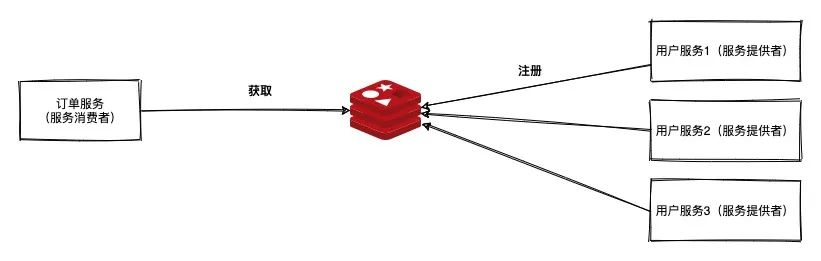  

每次调用的时候都去 Redis 查询一次，频繁的查询可能会导致性能瓶颈，为了解决这个问题我们可以在查询之后在本地缓存一份数据，这样每次调用可以优先从本地获取数据。

但这样又会出现新的问题，本地缓存如何刷新呢，如果服务提供者某些实例 down 掉了或者扩容新增了一批实例，那服务消费者如何才能快速感知到呢?

要想解决这个问题，最先想到的一个办法就是让服务消费者定时轮询 Redis，发现有更新了就去更新本地缓存，看起来也能解决本地缓存刷新的问题，但是多久轮询一次呢，1 秒或者10 秒?

轮询时间太短依然有性能瓶颈问题，这样本地缓存也没有存在的必要了;轮询时间太长，本地缓存来不及更新，就会存在 "脏" 数据。

以上的方案都不完美，并且不优雅，主要有以下几点：

基于定时任务会导致很多无效的查询。

定时任务存在周期性，没法做到实时，这样就可能存在请求异常。

如果服务被强行 kill，没法及时清除 Redis，这样这个看似可用的服务将永远不可用!

所以我们需要一个更加靠谱的解决方案。

## 用 Zookeeper 解决

用过 Dubbo 的小伙伴对这张图肯定很熟悉，步骤 0 到 4 是服务注册发现的核心流程。
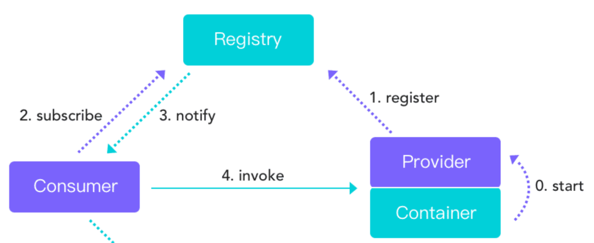  

这个流程与我们上面讨论的不谋而合，那 Dubbo 是如何实现的呢?实际上 Dubbo 作为一个通用的框架提供了多种解决方案，如：Zookeeper、Nacos等。

不管是哪种方案，总结起来都是一种套路，基本流程如下：

每个服务实例启动之后将自己的信息(ip+port)写入公共区域;

调用者订阅自己感兴趣的服务实例，获取服务实例信息列表后缓存在自己本地;

服务实例停止或者 down 调后将公共区域自己的信息清除掉;

公共区域通知调用者你感兴趣的信息已经发生变更，请更新一下本地的缓存。

## Zookeeper的重点特性

(1)树状目录结构

Zookeeper是一个树状的文件目录结构，与 Unix 文件系统很类似。树中每个节点可以称作为一个ZNode，每一个ZNode都可以通过其路径唯一标识，最重要的是我们可以对每个 ZNode 进行增删改查。

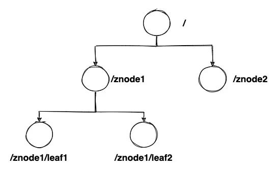  

(2)持久节点(Persistent)

客户端与Zookeeper服务端断开连接后，节点仍然存在不会被删除，这样的节点就叫做持久节点。

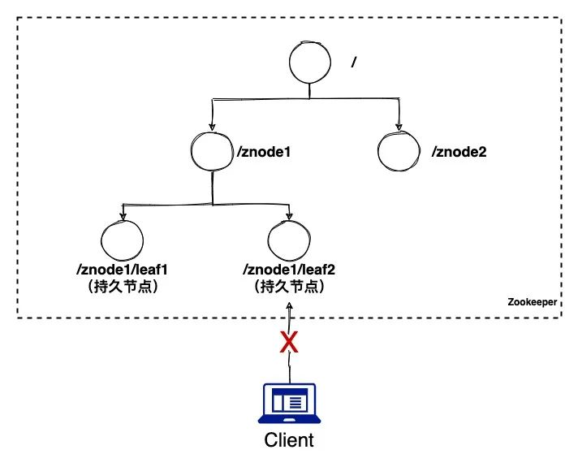  

(3)持久有序节点(Persistent_sequential)

持久有序节点是在上面持久节点的特性上加上了有序性，有序性的意思是服务向Zookeeper注册信息时，Zookeeper 根据注册顺序给每个节点编号。

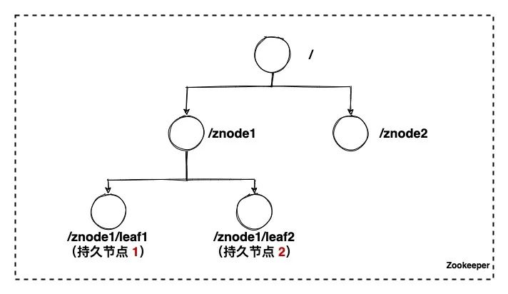  

(4)临时节点(Ephemeral)

客户端与Zookeeper服务端断开连接后，该节点被删除。

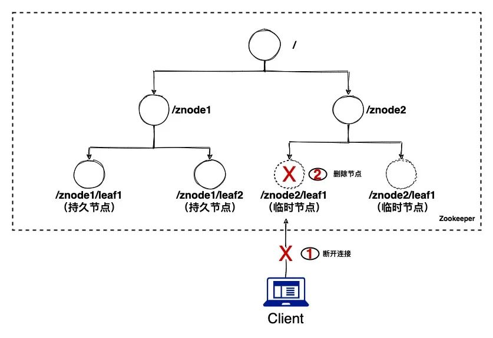  

注意:临时节点下不存在子节点;持久节点下可以存在临时节点。

(5)临时有序节点(Ephemeral_sequential)

临时有序节点是在临时节点的基础上再加上有序性，跟持久有序节点类似。

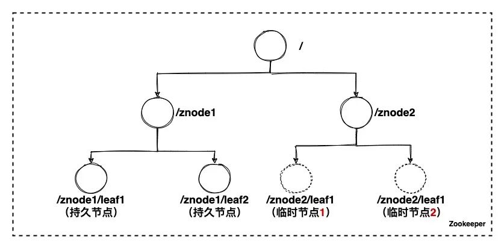  

(6)节点监听(Wacher)

节点监听是Zookeeper最重要的特性之一，客户端可以监听任意节点，节点有任何变化 Zookeeper 可以通过回调的方式通知给客户端，这样客户端不用轮询就可以及时感知节点变化。

如下图所示，客户端(client)开始监听临时节点 1，因某种原因临时节点 1 被删除了，Zookeeper 通过回调将变化通知给 client 了。

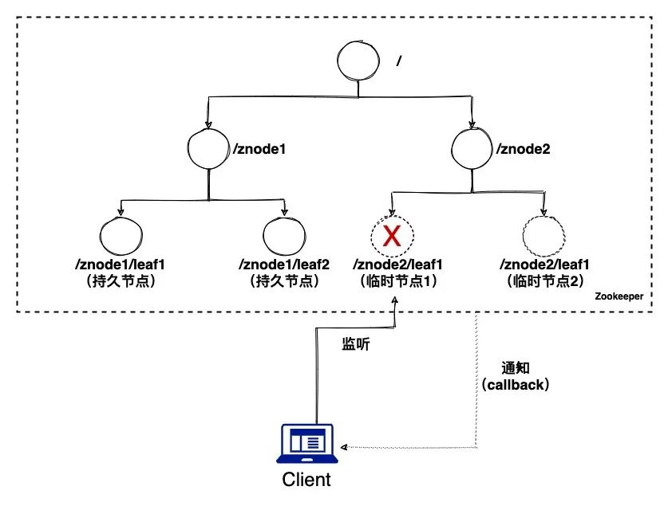  

## Zookeeper 实现服务注册发现

了解了Zookeeper的一些重要特性，我们再来看下 Zookeeper 是如何实现服务注册和发现的。还是以订单服务、用户服务的场景为例。

服务提供方(用户服务)启动成功后将服务信息注册到Zookeeper，服务信息包括实例的 ip、端口等元信息。注册成功 Zookeeper 还可以通过心跳监测来动态感知实例变化，详细的过程这里不展开。

服务消费方(订单服务)需要调用用户服务的接口，但因为不知道实例的 ip、端口等信息，只能从 Zookeeper 中获取调用地址列表，然后进行调用，这个过程成为服务的订阅。

订阅成功后服务消费方可以将调用列表缓存在本地，这样不用每次都去调用 Zookeeper 获取。一旦 Zookeeper感知到用户服务实例变化后就会通知给服务消费方，服务消费方拿到结果后就会更新本地缓存，这个过程称之为通知。

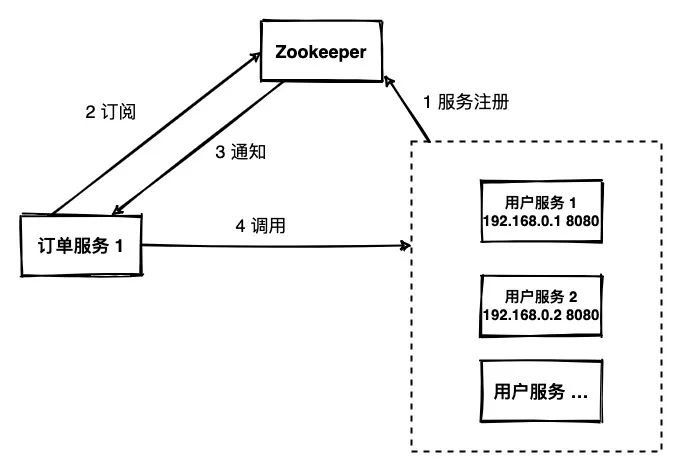  

服务注册原理

服务启动后会自动向 Zookeeper 注册，注册的规则如下：

每个服务会创建一个持久节点和若干个临时节点。比如：用户服务首先创建一个持久节点 user，然后每个服务实例会在持久节点下创建一个临时有序节点。

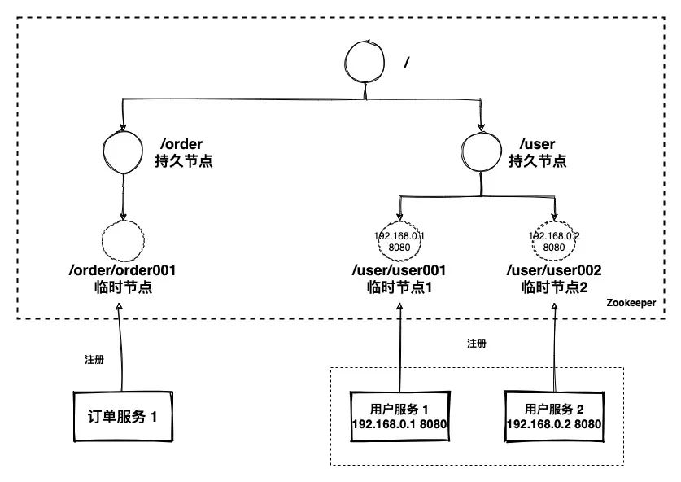  

服务动态发现原理

由于订单服务需要调用用户服务的接口，所以订单服务会订阅 user 节点，一旦用户服务有变化(增加实例或者减少实例)，Zookeeper 都会将最新的列表信息推送给订单服务，这个过程就是服务动态发现的基本原理。少用文字描述，大家直接看图：

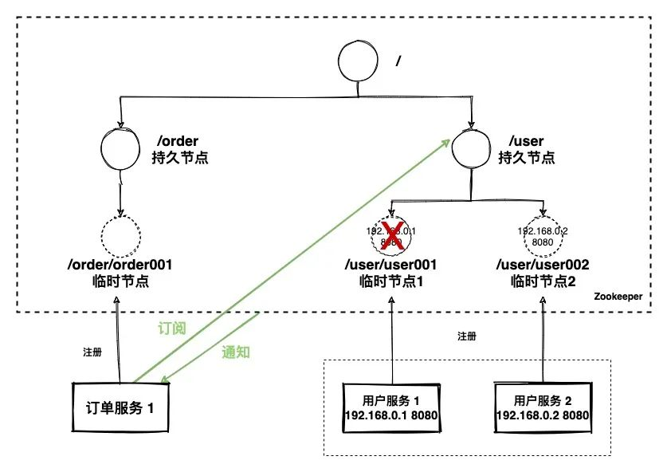  

## 小结

文章首先引入订单服务和用户服务的例子，说明了分布式场景下可能存在的问题：服务提供者实例越多，维护的成本越高。

经过分析，我们得出结论：需要使用一块公共的区域存储实例信息。

如何提供公共的区域?我们先想到了Redis。

经过实践发现 Redis 确实可以解决服务注册和服务发现的问题，但是同时又引入了其他问题：

基于定时任务会导致很多无效的查询。

定时任务存在周期性，没法做到实时，这样就可能存在请求异常。

如果服务被强行 kill，没法及时清除 Redis，这样这个看似可用的服务将永远不可用!

当我们一筹莫展的时候，我们发现强大的 Dubbo 框架使用了 Zookeeper 来实现服务注册和发现的功能。为了更好的学习 Zookeeper 是如何实现服务注册和发现功能的，我们了解到 Zookeeper 的一些重要特性：

树状目录结构

持久节点

持久有序节点

临时节点

临时有序节点

节点监控

这些重要的特性为最后实现服务注册和动态发现打下了坚实的基础。

文章的最后，我们再次以订单服务和用户服务为例通过两张图生动的诠释了服务注册和动态发现的流程和原理。

