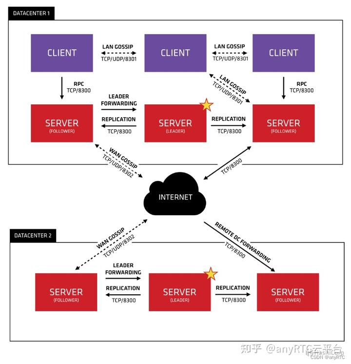

# 分布式系统中服务注册发现组件的原理及比较
摘抄自：https://zhuanlan.zhihu.com/p/566271472

## 背景

在分布式架构的系统中，服务发现简单来讲就是通过服务名找到提供服务的实例地址和端口，主要用于解决如何获取服务实例地址问题。

随着容器技术的兴起，服务集群部署在系统各处，服务之间的远程调用都需要通过服务发现来实现。服务注册发现是分布式系统中不可或缺的关键组件，常用于构建服务注册发现解决方案的开源框架如ZooKeeper、Etcd、Consul。下面主要介绍一下如何基于ZooKeeper、Etcd、Consul构建服务注册发现方案并进行一下对比。

一个标准的服务注册发现架构主要有三部分组成，分别是服务注册中心、服务消费者、服务提供者，架构图如下所示：

服务注册中心是服务发现的核心组件，其本质上是一个服务名和服务实例地址映射集合，除了提供服务注册发现，服务记录，动态管理服务等功能外，还需要具备如下能力：

* 容错（Fault Tolerance）：服务注册中心保存了分布式系统中所有服务名与服务实例地址映射，一旦故障必将导致整个系统不可用，是整个分布式系统核心，必须具备高可用性。    
* 服务健康检查（Service Health Check）：服务注册中心必须要能及时发现故障实例并将其注销以防止被错误访问。    
* 监视器（Watcher）：服务注册中心必须具备及时通知服务调用者服务实例注册或注销的能力，以便服务调用者及时采取措施。

注册/注销服务实例一般有两种选择：

* 服务实例自己注册即Self-Registration模式，在服务实例启动成功后主动将自己注册到服务注册中心，这种方法好处是架构简单但需要为服务用到的每种编程语言实现注册代码；    
* 通过其他组件来注册服务实例即Thrid-party Registration模式，例如使用一个独立Agent通过轮询或监听事件去跟踪运行的服务实例变化进行注册或注销，好处是服务实例与服务注册中心解耦但引入第三方组件增加了架构复杂性。

## 服务注册发现组件方案

## ZooKeeper

ZooKeeper提供分布式协调服务，在分布式系统中常被用于配置管理、名字服务、分布式锁及组管理，通常运行在一组节点上实现容错（当运行在n个节点上时能容忍n/2个节点同时故障）。

## 如何通过ZooKeeper来实现服务发现？

ZooKeeper使用临时节点（ephemeral node）来实现服务注册和基本的健康检查功能。每当服务实例启动就会在ZooKeeper中注册一个临时节点，而当服务实例故障或下线该临时节点会被ZooKeeper自动删除，如果有其他服务依赖这个服务可以设置监听该服务实例对应的临时节点，当临时节点被删除时，依赖该服务的其他服务会获得通知。依赖ZooKeeper自身的高可用及临时节点提供的健康检查和监听机制来实现具备容错能力的服务发现机制。

## 组件特点

从ZooKeeper的数据结构特点看，并不是基于服务注册而设计的，ZooKeeper提供的命名空间与文件系统的名称空间非常相似，在数据结构上高度抽象为K-V格式，十分通用。

ZooKeeper组件支持节点短暂存在，只要创建znode的会话处于活动状态，这些znode就会存在，会话结束时，将删除znode。Dubbo框架正是基于这个特点，服务启动往Zookeeper注册的就是临时节点，需要定时发心跳到ZooKeeper来续约节点，并允许服务下线时，将ZooKeeper上相应的节点删除，同时ZooKeeper使用ZAB协议虽然保证了数据的强一致性。

实际开发过程中,建议使用Apache Curator来替代Zookeeper原生客户端库，Apache Curator通过封装ZooKeeper原生API，提供更高抽象层次API让ZooKeeper使用起来更加容易和可靠，而且提供专用于实现服务发现的API。

## Etcd

Etcd是一个基于Raft共识算法具备线性强一致性（linearizable）的Key-Value存储系统，可以为每个Key设置TTL（time to live），当TTL过后相应Key会自动过期失效。

基于Etcd构建服务发现解决方案将Etcd作为服务注册中心，服务实例注册就是在Etcd中构建一个Key-Value记录，由服务实例自身或代理负责设置并定期更新其关联Key的TTL，如果服务实例故障其对应Key就会在TTL之后过期失效，相当于将该故障服务实例注销，通过定时心跳以达到监控健康状态的效果。而且Etcd提供监听机制，允许为Key设置监听器当该Key发生变化时，监听器能及时获取通知。

Etcd自身的高可用特性，基于TTL提供基本的服务健康检查，基于监听机制及时感知服务实例变化，使Etcd成为微服务架构中常用服务发现解决方案。

## Consul

Consul是一个成熟的服务发现解决方案。其核心是一个基于Raft共识算法具备线性强一致性的Key-Value存储系统作为服务注册中心，并提供代理（Agent）机制一方面用于协调服务注册，一方面提供服务健康检查。代理（Agent）会在每个运行服务的节点上启动，获取节点地址并将该服务实例注册到服务注册中心。

架构上Consul包括两类组件：Server、Agent，服务注册信息保存在Server上，通过Raft共识算法保证多个Server间数据线性强一致，保证服务注册中心高可用；将所有Agent作为集群节点，使用Gossip协议进行组关系管理和故障探测，当有Agent加入（启动）或离开（故障）集群时其他Agent会得到通知，实现服务健康检查和监视功能。

Gossip协议常用于集群组关系管理和故障检测，每个节点都通过一个或多个引导节点加入集群，引导节点有集群中所有节点列表，每个节点都从自己所知节点列表中随机选择一组节点周期性地发送多播消息，最终集群中所有节点都能知道其他节点。这个过程看起来很神奇，实际上Gossip协议能在几秒内将消息传遍有上百节点的集群。Akka、Riak、Cassandra都使用Gossip协议维护集群成员列表和故障探测。

## 总结

文章总结了分布式系统中常用的服务注册发现解决方案，基于Zookeeper、Etcd、Consul框架方案核心思想是通过一组实例（3个或者5个）提供线性强一致性（Linearizable）分布式高可用Key-Value存储服务，将Key-Value存储作为服务注册中心，当相关Key发生变化时监视器能及时通知客户端，通知机制配合服务健康检查当有服务实例启动或故障时客户端能及时感知服务拓扑变化以实现智能路由，从实现方式上看它们可以看作是中心化的服务发现方案。

总体比较，Consul 提供了原生的分布式锁、健康检查、服务发现机制支持，让业务可以更省心，同时也对多数据中心进行了支持；当然 Etcd 和 ZooKeeper 也都有相应的库，也能很好的进行支持，但是这两者不支持多数据中心；

ZooKeeper 在 Java 业务中选型使用的较多，Etcd 因为是 go 语言开发的，所以如果本身就是 go 的技术栈，使用这个也是个不错的选择，Consul 在国外应用比较多，中文文档及实践案例相比 etcd 较少。

此外Consul和Etcd都非常适合容器环境，因为Docker容器启动、停止都会发送事件（Event），基于事件通知机制非常便于将服务实例从Consul或Etcd上注册、注销。

**参考文档**

服务发现框架选型: Consul、Zookeeper还是etcd ？

