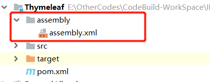
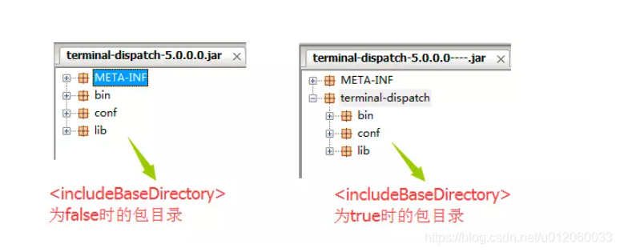

# maven之插件打包详解
摘抄自：https://blog.csdn.net/u012060033/article/details/117089705


`maven`打包到`lib`中使用`build`插件，要么使用`assmebly`插件要么不用此插件


`maven`插件的命名约定：
`maven`插件有着自己的一套命名规范。官方插件命名的格式为`maven-xxx-plugin`,非官方的插件命名为`xxx-maven-plugin`


`maven`打包方式有如下三种：


* `maven-jar-plugin`，默认的打包插件，用来打普通的`project JAR`包；    
* `maven-shade-plugin`，用来打可执行`JAR`包，也就是所谓的`fat JAR`包；    
* `maven-assembly-plugin`，支持自定义的打包结构，也可以定制依赖项等


另外还有`spring-boot-maven-plugin`插件打包


## 1 assmebly


### 1.1 assmebly简介


`Maven-assembly-plugin`是`maven`中针对打包任务而提供的标准插件,可以实现自定义打包。
主要提供如下功能：


* 提供一个把工程依赖元素、模块、网站文档等其他文件存放到单个归档文件里    
* 打包成指定格式分发包，支持各种主流的格式如`zip`、`tar.gz`、`jar`和`war`等，具体打包哪些文件是高度可控的    
* 能够自定义`包含/排除`指定的目录或文件


assmebly是从官网下载：[http://maven.apache.org/plugins/maven-assembly-plugin/download.cgi](http://maven.apache.org/plugins/maven-assembly-plugin/download.cgi "http://maven.apache.org/plugins/maven-assembly-plugin/download.cgi")


### 1.2 assmebly配置


#### 1.2.1 maven中配置


在`maven`的`<build>`标签中配置


```xml
<build>
    <plugins>
        <plugin>
            <groupId>org.apache.maven.plugins</groupId>
            <artifactId>maven-assembly-plugin</artifactId>
            <version>${maven-assembly-plugin.version}<version>
            <configuration>
             	<!-- 配置描述符文件 指定文件位置 -->
                <descriptor>assembly/assembly.xml</descriptor> 
            </configuration>
            <executions>
            	<execution>
                	<id>make-assembly</id>
                    <!-- 绑定到package生命周期 -->
                    <phase>package</phase>
                    <goals>
                    	<!-- 只运行一次 -->
                    	<goal>single</goal>
                    </goals>
                 </execution>
             </executions>
         </plugin>
     </plugins>
</build>

```


#### 1.2.2 maven标签


##### 1.2.2.1 configuration标签说明


`descriptor`标签中的`assembly.xml`就是指定的配置文件位置



#### 1.2.3 assembly.xml配置


```xml
<assembly>
    <id>assembly</id>
    <formats>
        <format>tar.gz</format>
    </formats>
    <includeBaseDirectory>true</includeBaseDirectory>
    <fileSets>
        <fileSet>
        	<!--  启动信息 -->
            <directory>src/main/bin</directory>
            <includes>
                <include>*.sh</include>
            </includes>
            <outputDirectory>bin</outputDirectory>
            <fileMode>0755</fileMode>
        </fileSet>
        <fileSet>
            <!--  配置信息 -->
            <directory>src/main/conf</directory>
            <outputDirectory>conf</outputDirectory>
        </fileSet>
        <fileSet>
            <directory>src/main/sql</directory>
            <includes>
                <include>*.sql</include>
            </includes>
            <outputDirectory>sql</outputDirectory>
        </fileSet>
        <fileSet>
            <directory>target/classes/</directory>
            <includes>
                <include>*.properties</include>
                <include>*.xml</include>
                <include>*.txt</include>
            </includes>
            <outputDirectory>conf</outputDirectory>
        </fileSet>
    </fileSets>
    <files>
        <file>
            <source>target/${project.artifactId}-${project.version}.jar</source>
            <outputDirectory>.</outputDirectory>
        </file>
    </files>
    <dependencySets>
        <dependencySet>
            <unpack>false</unpack>
            <scope>runtime</scope>
            <outputDirectory>lib</outputDirectory>
        </dependencySet>
    </dependencySets>
</assembly>

```


#### 1.2.4 assembly标签


##### 1.2.4.1 id标签


`id`标识符，添加到生成文件名称的后缀符。如果指定`id`的话，目标文件则是`${artifactId}-${id}.tar.gz`


##### 1.2.4.2 formats标签


`formats`是`assembly`插件支持的打包格式有`zip、tar、tar.gz (or tgz)、tar.bz2 (or tbz2)、jar、dir、war`，可以同时指定多个打包格式


```xml
<formats> 
     <format>tar.gz</format> 
     <format>dir</format>
 </formats>

```


##### 1.2.4.3 includeBaseDirectory标签


`includeBaseDirectory`标签指定打的包是否包含打包层目录（比如`finalName`是`terminal-dispatch`，当值为`true`，所有文件被放在包内的`terminal-dispatch`目录下，否则直接放在包的根目录下）



##### 1.2.4.4 dependencySets标签


用来定制工程依赖`jar`包的打包方式，核心元素如下表所示：


* `outputDirectory`： 指定包依赖目录，该目录是相对于根目录    
* `includes/include*`：包含依赖    
* `excludes/exclude*`：排除依赖    
* `useProjectArtifact`：指定打包时是否包含工程自身生成的`jar`包    
* `unpack`：布尔值，`false`表示将依赖以原来的`JAR`形式打包，`true`则表示将依赖解成`*.class`文件的目录结构打包    
* `scope`：表示符合哪个作用范围的依赖会被打包进去。`compile`与`provided`都不用管，一般是写`runtime`


##### 1.2.4.5 fileSets标签


`fileSets`标签用来设置一组文件在打包时的属性：


* `directory`：源目录的路径。    
* `includes/excludes`：设定包含或排除哪些文件，支持通配符。    
* `fileMode`：指定该目录下的文件权限，采用`Unix`八进制描述法，(`User Group Other`)所属属性默认值是`0644`，`Read = 4，Write = 2和Execute = 1`    
* `outputDirectory`：指定文件集合的输出目录，生成目录的路径，该目录是相对于根目录


##### 1.2.4.6 files标签


`files`标签可以指定`目的文件`名到指定目录，其他和`fileSets`相同，核心元素如下表所示：


* `source`：源文件，相对路径或绝对路径    
* `outputDirectory`：输出目录    
* `destName`： 目标文件名    
* `fileMode`：文件权限


### 1.3 示例


不使用assembly.xml示例


```xml
<plugin>
   <groupId>org.apache.maven.plugins</groupId>
   <artifactId>maven-dependency-plugin</artifactId>
   <executions>
    <execution>
     <id>copy-dependencies</id>
     <phase>prepare-package</phase>
     <goals>
        <goal>copy-dependencies</goal>
      </goals>
      <configuration>
              <outputDirectory>
               ${project.build.directory}/lib
            </outputDirectory>
       </configuration>
      </execution>
    </executions>
</plugin>

<plugin>
 <groupId>org.apache.maven.plugins</groupId>
 <artifactId>maven-jar-plugin</artifactId>
   <!-- <version>2.4</version>-->
   <!-- 对要打的jar包进行配置 -->
  <configuration>
  <!-- Configuration of the archiver -->
 <archive>
<!--生成的jar中，不要包含pom.xml和pom.properties这两个文件-->
<addMavenDescriptor>false</addMavenDescriptor>
<!-- Manifest specific configuration -->
<manifest>
<mainClass><!-- 启动类-->
 cn.hr.HRApp
</mainClass>
 <!--是否要把第三方jar放到manifest的classpath中-->
<addClasspath>true</addClasspath>
<!-- 生成的manifest中classpath的前缀， 因为要把第三方jar放到lib目录下， 所以classpath的前缀是lib/ -->
                            <classpathPrefix>lib/</classpathPrefix>
</manifest>
</archive>
<!--过滤掉不希望包含在jar中的文件-->
<excludes>
 <!-- 排除不需要的文件夹(路径是jar包内部的路径) -->
<exclude>**/assembly/</exclude>
</excludes>
</configuration>
</plugin>

```


## 2 直接打包


这种方式就不用配置assmebly文件，直接打包就可以了


### 2.1 示例文件


```xml
  <build>
        <plugins>  
        <!-- maven依赖打包配置 -->
            <plugin>
                <groupId>org.apache.maven.plugins</groupId>
                <artifactId>maven-dependency-plugin</artifactId>
                <executions>
                    <execution>
                        <id>copy-dependencies</id>
                        <phase>prepare-package</phase>
                        <goals>
                            <goal>copy-dependencies</goal>
                        </goals>
                        <configuration>
                            <outputDirectory>
                                ${project.build.directory}/lib
                            </outputDirectory>
                        </configuration>
                    </execution>
                </executions>
            </plugin>
 <!-- maven主文件打包 -->
            <plugin>
                <groupId>org.apache.maven.plugins</groupId>
                <artifactId>maven-jar-plugin</artifactId>
                <!-- <version>2.4</version>-->
                <!-- 对要打的jar包进行配置 -->
                <configuration>
                    <!-- Configuration of the archiver -->
                    <archive>
                        <!--生成的jar中，不要包含pom.xml和pom.properties这两个文件-->
                        <addMavenDescriptor>false</addMavenDescriptor>
                        <!-- Manifest specific configuration -->
                        <manifest>
                        	<!-- 指定运行类 -->
                            <mainClass>
                                cn.test.App
                            </mainClass>
                            <!--是否要把第三方jar放到manifest的classpath中-->
                            <addClasspath>true</addClasspath>
                            <!-- 生成的manifest中classpath的前缀， 因为要把第三方jar放到lib目录下， 所以classpath的前缀是lib/ -->
                            <classpathPrefix>lib/</classpathPrefix>
                        </manifest>
                    </archive>
                    <!--过滤掉不希望包含在jar中的文件-->
                    <excludes>
                        <!-- 排除不需要的文件夹(路径是jar包内部的路径) -->
                        <exclude>**/assembly/</exclude>
                    </excludes>
                </configuration>
            </plugin>
        </plugins>
    </build>

```


## 3 使用SpringBoot插件打包


### 3.1 简介


`spring-boot-maven-plugin`是`spring boot`提供的`maven`打包插件。可打直接可运行的`jar包`或`war包`。
如果使用`2.2.1.RELEASE`版本，则需要`maven`版本在2.0及以上，JDK在1.8及以上


### 3.2 pom示例


```xml
<?xml version="1.0" encoding="UTF-8"?>
<project xmlns="http://maven.apache.org/POM/4.0.0"
         xmlns:xsi="http://www.w3.org/2001/XMLSchema-instance"
         xsi:schemaLocation="http://maven.apache.org/POM/4.0.0 http://maven.apache.org/xsd/maven-4.0.0.xsd">
    <parent>
        <groupId>org.springframework.boot</groupId>
        <artifactId>spring-boot-dependencies</artifactId>
        <version>2.6.11</version>
    </parent>
    <modelVersion>4.0.0</modelVersion>
    <packaging>jar</packaging>
    <artifactId>mine</artifactId>

    <dependencies>
        ···
    </dependencies>

    <build>
    	<!-- mavne打包动态修改替换配置文件中的占位符 -->
	    <resources>
	        <resource>
	            <directory>${basedir}/src/main/resources</directory>
	            <!-- 处理其中的可替换参数（@..@符合标注的变量） -->
	            <filtering>true</filtering>
	        </resource>
	        <!-- 可以配置引入哪些配置文件includes或排除哪些文件excludes -->
	    </resources>

        <plugins>
        	<!-- 跳过单元测试的 插件-->
			<plugin>
			    <groupId>org.apache.maven.plugins</groupId>
			    <artifactId>maven-surefire-plugin</artifactId>
			    <version>2.19.1</version>
			    <configuration>
			     	<!-- 默认关掉单元测试，不用手动关闭了 -->
			        <skipTests>true</skipTests>
			    </configuration>
			</plugin>
			<!-- 配置文件处理插件  -->
	        <plugin>
	            <groupId>org.apache.maven.plugins</groupId>
	            <artifactId>maven-resources-plugin</artifactId>
	            <version>3.1.0</version>
	            <configuration>
	                <encoding>utf-8</encoding>
	                <!-- 是否使用默认占位符@@ -->
	                <useDefaultDelimiters>true</useDefaultDelimiters>
	            </configuration>
	        </plugin>

            <plugin>
                <groupId>org.springframework.boot</groupId>
                <artifactId>spring-boot-maven-plugin</artifactId>
                <configuration>
                    <!-- 指定该 Main Class 为全局的唯一入口 -->
                    <mainClass>cn.test.App</mainClass>
                    <layout>ZIP</layout>
                </configuration>
                <executions>
                    <execution>
                        <goals>
                        <!-- 将依赖到的包都放进去 -->
                            <goal>repackage</goal>
                        </goals>
                    </execution>
                </executions>
            </plugin>
        </plugins>
    </build>
</project>

```


### 3.3 插件详解


插件提供了6个`maven goal`：


* `build-info`：生成项目的构建信息文件 `build-info.properties`    
* `help`：用于展示`spring-boot-maven-plugin`的帮助信息。使用命令行`mvn spring-boot:help -Ddetail=true -Dgoal=<goal-name>`可展示goal的参数描述信息。    
* `repackage`：可生成可执行的jar包或war包。插件的核心goal。    
* `run`：运行 Spring Boot 应用    
* `start`：在集成测试阶段，控制生命周期    
* `stop`：在集成测试阶段，控制生命周期


#### 3.3.1 打包 repackage


将`spring-boot-maven-plugin`引入`pom`，执行`mvn package`命令，即可打jar包（插件默认打jar包），`target`文件夹里的`*.jar`即为可执行jar包。
打包主要使用的是`repackage goal`，它是`spring-boot-starter-parent`为插件设置的`默认goal`。这个`goal`绑定在`maven`的`package`生命周期上，完整命令为`mvn package spring-boot:repackage`。在 mvn package 执行打包之后，repackage 再次打包生成可执行的 jar包或war包。
默认情况下，`repackage`生成包的名称与`mvn package`生成的原始包名称相同，而原始包被重命名为`*.origin`


`repackage`命令生成的包，默认会包含项目引入的所有依赖，包括`scope`为`provied`的依赖
若项目引入了`spring-boot-devtools`，默认`spring-boot-devtools`会被打在包里，若想排除，应设置`repackage`的`excludeDevtools`参数为`true`。在打war包时，还应将spring-boot-devtools 的optinal设置为true或将scope设置为provided。


```xml
<build>
    <plugins>
        <plugin>
            <groupId>org.springframework.boot</groupId>
            <artifactId>spring-boot-maven-plugin</artifactId>
            <executions>
                <execution>
                    <id>repackage</id>
                    <configuration>
                        <excludeDevtools>true</excludeDevtools>
                    </configuration>
                </execution>
            </executions>
        </plugin>
    </plugins>
</build>

```


`repackage`会在`Manifest`文件中写入`Main-Class and Start-Class`属性。当默认值不能使程序正常运行时，可以通过插件配置。`Manifest`文件位于的META-INF文件夹中。


打可执行jar包时，示例如下：


```xml
Manifest-Version: 1.0
Archiver-Version: Plexus Archiver
Built-By: beauty
Start-Class: com.demo.beauty.BeautyApplication
Spring-Boot-Classes: BOOT-INF/classes/
Spring-Boot-Lib: BOOT-INF/lib/
Spring-Boot-Version: 2.2.1.RELEASE
Created-By: Apache Maven 3.6.3
Build-Jdk: 1.8.0_251
Main-Class: org.springframework.boot.loader.JarLauncher

```


对应的plugin


```xml
<build>
    <plugins>
        <plugin>
            <groupId>org.springframework.boot</groupId>
            <artifactId>spring-boot-maven-plugin</artifactId>
            <configuration>
                <mainClass>com.demo.beauty.BeautyApplication</mainClass>
            </configuration>
        </plugin>
    </plugins>
</build>

```


可以看出，打可执行jar包时，`spring-boot-maven-plugin`的`mainClass`参数对应的是`Manifest`文件中的`Start-Class`属性，即项目的启动类。


#### 3.3.2 layout标签


`Manifest`文件中的`Main-Class`属性由插件的`layout`决定。`layout`属性值默认为jar/war。`layout`种类有：


* `JAR`，即通常的可执行jar。`Main-Class : org.springframework.boot.loader.JarLauncher`    
* `WAR`，即通常的可执行war。`Main-Class : org.springframework.boot.loader.warLauncher`。为避免将war包部署在容器中运行时可能的冲突问题，`provided` 类型的依赖都被放置在可执行 `war` 包的 `WEB-INF/lib-provided` 文件夹中，包括直接运行war需要的内置容器。    
* `ZIP`，亦可作`DIR`，类似于`JAR`。`Main-Class : org.springframework.boot.loader.PropertiesLauncher`
 当启动时需要用 `-Dloader.path=lib/`指定额外的类加载路径 
  `-Dloader.path` 是 `Spring Boot` 应用程序的特性，用于指定额外的`类加载路径`。
 在 `Spring Boot` 应用程序中，通常使用 `-Dloader.path` 来指定外部库和配置文件的路径。`-classpath` 是 `Java` 应用程序的标准参数，用于指定类加载器在运行时搜索类和资源文件的路径。
 在普通 `Java` 应用程序中，使用 `-classpath` 参数来指定类加载路径    
* `NONE`，打包所有依赖库和项目资源，但是不打包任何启动器。可以看到在 `layout`为NONE时，打出的包中的org文件夹没有了，Manifest 文件中没有Start-Class属性，Main-Class属性值为项目的启动类。


```xml
Manifest-Version: 1.0
Archiver-Version: Plexus Archiver
Built-By: beauty
Spring-Boot-Classes: BOOT-INF/classes/
Spring-Boot-Lib: BOOT-INF/lib/
Spring-Boot-Version: 2.2.1.RELEASE
Created-By: Apache Maven 3.6.3
Build-Jdk: 1.8.0_251
Main-Class: com.demo.beauty.BeautyApplication

```


