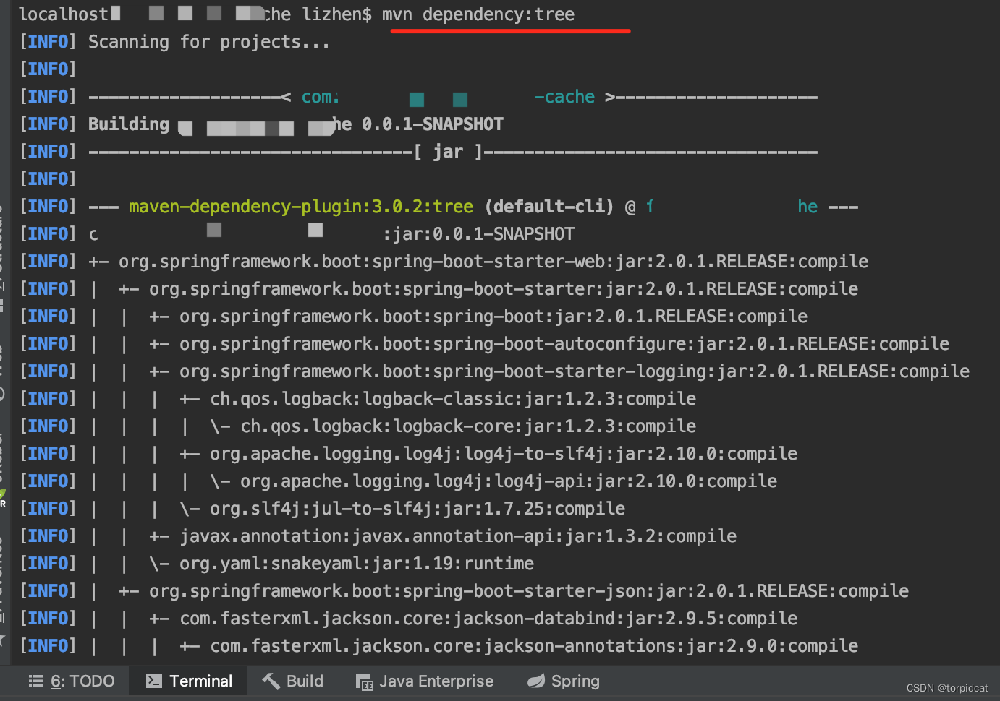
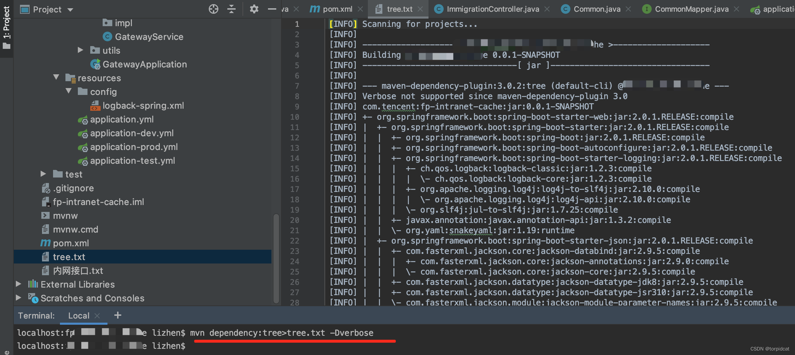
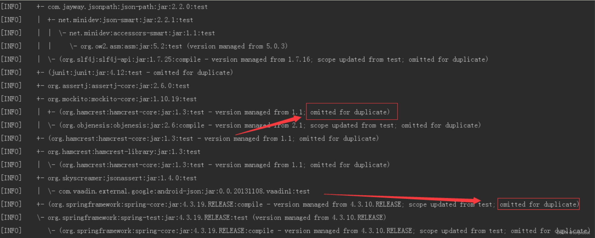
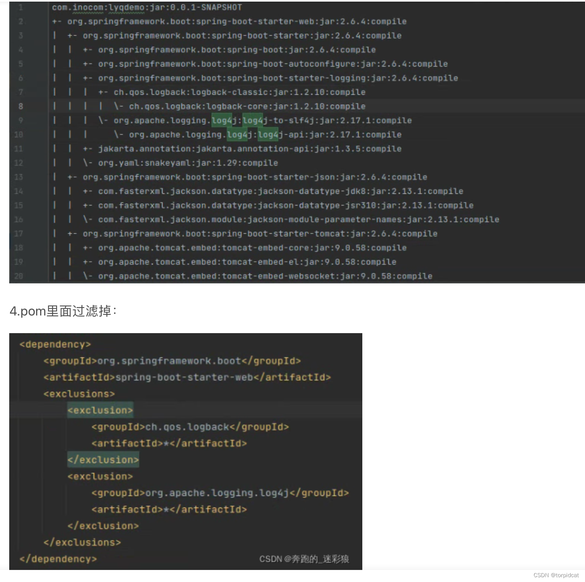
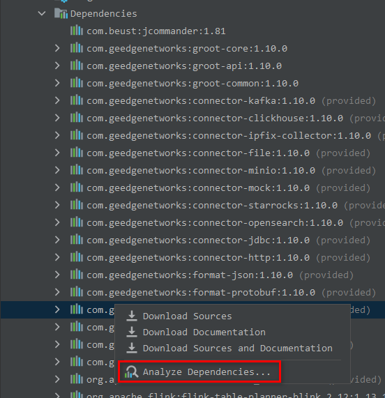
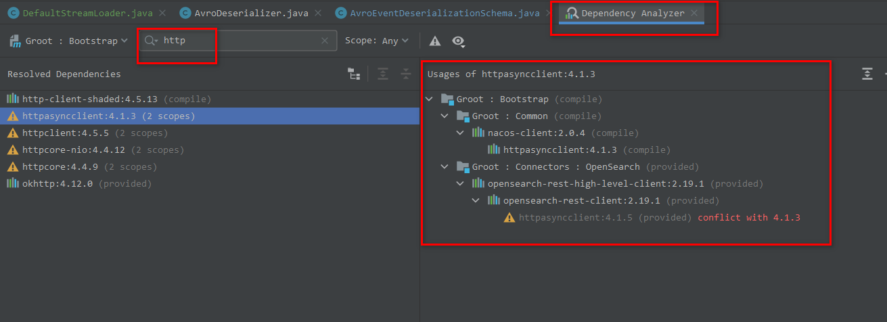

## mvn dependency:tree maven列出依赖树结构 查看冲突依赖 解决依赖冲突
摘抄自：https://blog.csdn.net/torpidcat/article/details/130881488

### 一、列出依赖树结构

命令行列出依赖结构


```
 mvn dependency:tree
```




将依赖树结构打印到txt文件


```
 mvn dependency:tree>tree.txt
```




将依赖树结构打印到txt文件 并对比出冲突


```
 mvn dependency:tree>tree.txt -Dverbose
```




### 二、解决 依赖包冲突问题





参考


[https://www.cnblogs.com/kingsonfu/p/11800375.html](https://www.cnblogs.com/kingsonfu/p/11800375.html "https://www.cnblogs.com/kingsonfu/p/11800375.html")


[https://blog.csdn.net/qq_24712507/article/details/123658596](https://blog.csdn.net/qq_24712507/article/details/123658596 "https://blog.csdn.net/qq_24712507/article/details/123658596")

# idea 查看引入某个依赖的依赖树





