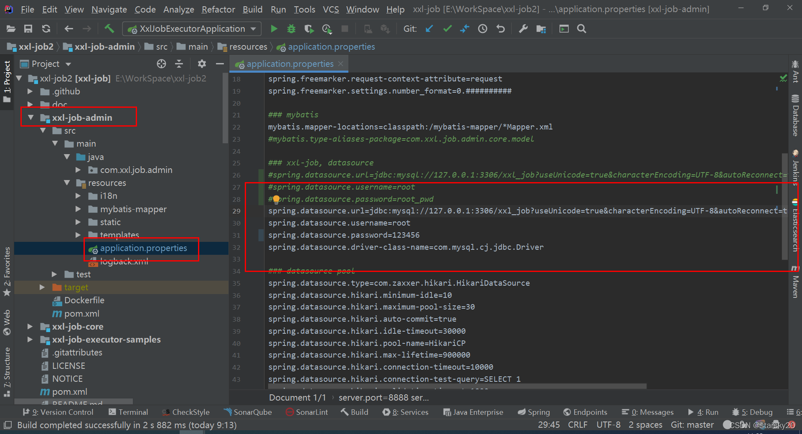
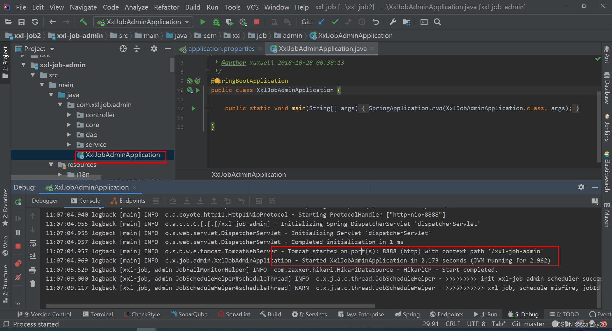
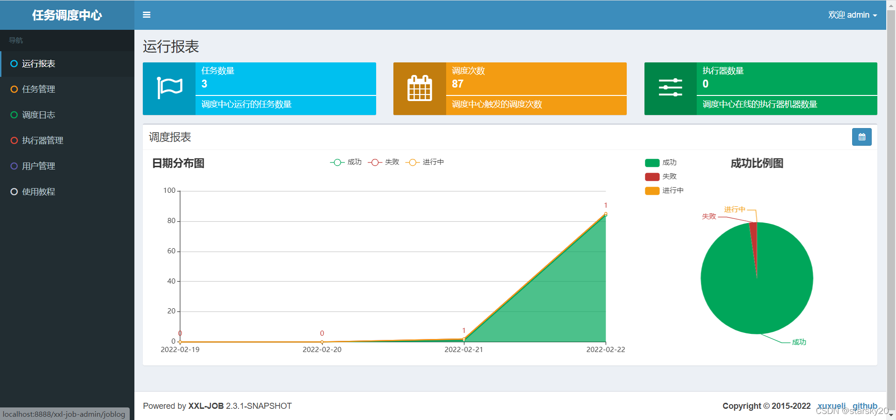
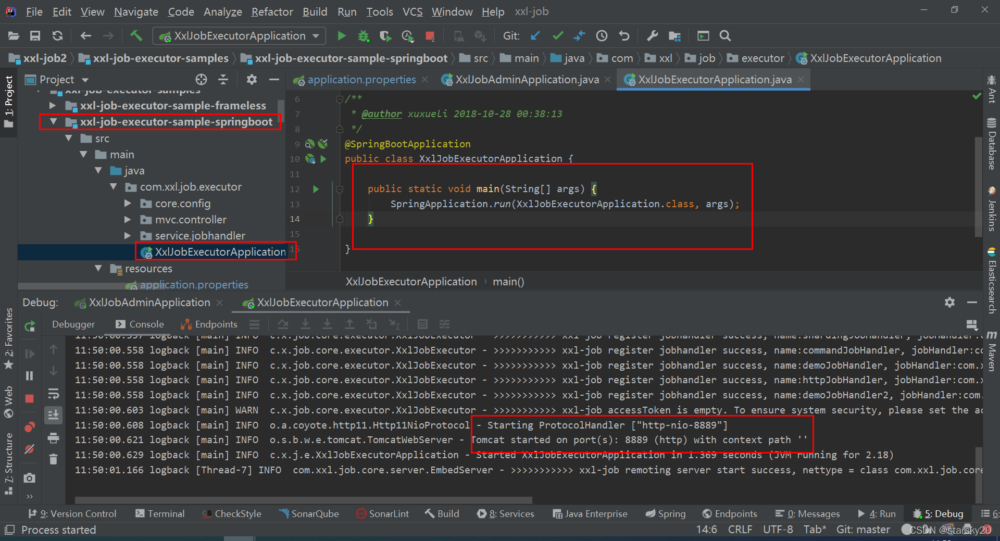
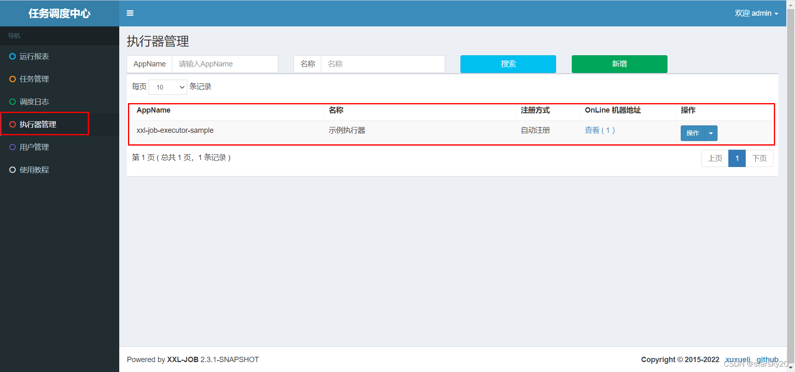
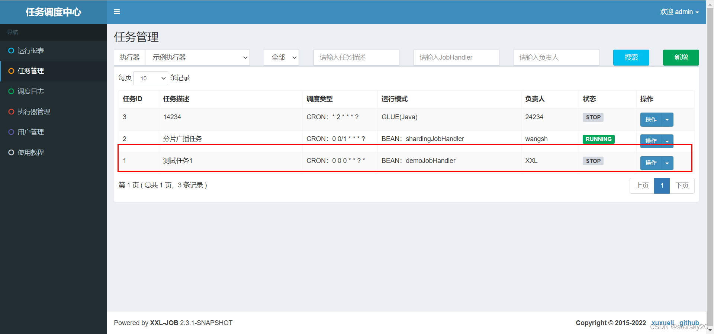
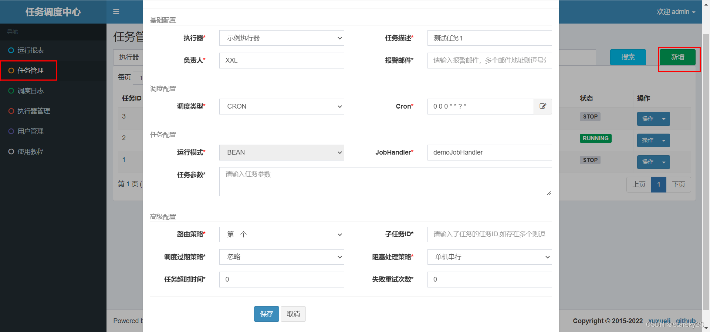

# xxjob分布式任务调度
https://blog.csdn.net/seashouwang/article/details/123063536


## xxjob分布式任务调度


XXL-JOB是一个分布式任务调度平台，其核心设计目标是开发迅速、学习简单、轻量级、易扩展。现已开放源代码并接入多家公司线上产品线，开箱即用

参考官网：[https://github.com/xuxueli/xxl-job](https://github.com/xuxueli/xxl-job "https://github.com/xuxueli/xxl-job")
中文文档：[https://www.xuxueli.com/xxl-job/#《分布式任务调度平台XXL-JOB》](https://www.xuxueli.com/xxl-job/#%E3%80%8A%E5%88%86%E5%B8%83%E5%BC%8F%E4%BB%BB%E5%8A%A1%E8%B0%83%E5%BA%A6%E5%B9%B3%E5%8F%B0XXL-JOB%E3%80%8B "https://www.xuxueli.com/xxl-job/#《分布式任务调度平台XXL-JOB》")

### 下载源码

源码仓库地址:
https://github.com/xuxueli/xxl-job
http://gitee.com/xuxueli0323/xxl-job


中央仓库地址

```xml
<!-- http://repo1.maven.org/maven2/com/xuxueli/xxl-job-core/ -->
<dependency>
    <groupId>com.xuxueli</groupId>
    <artifactId>xxl-job-core</artifactId>
    <version>${最新稳定版本}</version>
</dependency>

```


### 初始化“调度数据库”


下载项目源码并解压，获取 “调度数据库初始化SQL脚本” 并执行即可。
“调度数据库初始化SQL脚本” 位置为: /xxl-job/doc/db/tables_xxl_job.sql
调度中心支持集群部署，集群情况下各节点务必连接同一个mysql实例;
如果mysql做主从,调度中心集群节点务必强制走主库;


### 编译源码


解压源码,按照maven格式将源码导入IDE, 使用maven进行编译即可，源码结构如下：
```
xxl-job-admin：调度中心
xxl-job-core：公共依赖
xxl-job-executor-samples：执行器Sample示例（选择合适的版本执行器，可直接使用，也可以参考其并将现有项目改造成执行器）
：xxl-job-executor-sample-springboot：Springboot版本，通过Springboot管理执行器，推荐这种方式；
：xxl-job-executor-sample-frameless：无框架版本；
```

### 配置部署“调度中心”


调度中心项目：xxl-job-admin
作用：统一管理任务调度平台上调度任务，负责触发调度执行，并且提供任务管理平台。


#### 调度中心配置


打开idea工具，修改调度中心，修改数据库地址，用户，密码 改为自己本地使用数据库。
调度中心配置文件地址：
/xxl-job/xxl-job-admin/src/main/resources/application.properties



调度中心配置内容说明：


```properties
### 调度中心JDBC链接：链接地址请保持和 2.1章节 所创建的调度数据库的地址一致
spring.datasource.url=jdbc:mysql://127.0.0.1:3306/xxl_job?useUnicode=true&characterEncoding=UTF-8&autoReconnect=true&serverTimezone=Asia/Shanghai
spring.datasource.username=root
spring.datasource.password=root_pwd
spring.datasource.driver-class-name=com.mysql.jdbc.Driver
### 报警邮箱
spring.mail.host=smtp.qq.com
spring.mail.port=25
spring.mail.username=xxx@qq.com
spring.mail.password=xxx
spring.mail.properties.mail.smtp.auth=true
spring.mail.properties.mail.smtp.starttls.enable=true
spring.mail.properties.mail.smtp.starttls.required=true
spring.mail.properties.mail.smtp.socketFactory.class=javax.net.ssl.SSLSocketFactory
### 调度中心通讯TOKEN [选填]：非空时启用；
xxl.job.accessToken=
### 调度中心国际化配置 [必填]： 默认为 "zh_CN"/中文简体, 可选范围为 "zh_CN"/中文简体, "zh_TC"/中文繁体 and "en"/英文；
xxl.job.i18n=zh_CN
## 调度线程池最大线程配置【必填】
xxl.job.triggerpool.fast.max=200
xxl.job.triggerpool.slow.max=100
### 调度中心日志表数据保存天数 [必填]：过期日志自动清理；限制大于等于7时生效，否则, 如-1，关闭自动清理功能；
xxl.job.logretentiondays=30

```


#### 启动调度中心服务


xxl-job-admin 服务，选择XxlJobAdminApplication类启动服务

启动完成登录该服务，默认登录账号密码 admin 123456
http://localhost:8888/xxl-job-admin/jobinfo



### 执行器项目


“执行器”项目：xxl-job-executor-sample-springboot (提供多种版本执行器供选择，现以 springboot 版本为例，可直接使用，也可以参考其并将现有项目改造成执行器)
作用：负责接收“调度中心”的调度并执行；可直接部署执行器，也可以将执行器集成到现有业务项目中。


#### maven依赖


确认pom文件中引入了 “xxl-job-core” 的maven依赖；


#### 执行器配置


执行器配置，配置文件地址：


```properties
/xxl-job/xxl-job-executor-samples/xxl-job-executor-sample-springboot/src/main/resources/application.properties

```


执行器配置，配置内容说明：


```properties
#调度中心部署跟地址 [选填]：如调度中心集群部署存在多个地址则用逗号分隔。执行器将会使用该地址进行"执行器心跳注册"和"任务结果回调"；为空则关闭自动注册；
xxl.job.admin.addresses=http://127.0.0.1:8080/xxl-job-admin
#执行器通讯TOKEN [选填]：非空时启用；
xxl.job.accessToken=
#执行器AppName [选填]：执行器心跳注册分组依据；为空则关闭自动注册
xxl.job.executor.appname=xxl-job-executor-sample
#执行器注册 [选填]：优先使用该配置作为注册地址，为空时使用内嵌服务 ”IP:PORT“ 作为注册地址。从而更灵活的支持容器类型执行器动态IP和动态映射端口问题。
xxl.job.executor.address=
#执行器IP [选填]：默认为空表示自动获取IP，多网卡时可手动设置指定IP，该IP不会绑定Host仅作为通讯实用；地址信息用于 "执行器注册" 和 "调度中心请求并触发任务"；
xxl.job.executor.ip=
#执行器端口号 [选填]：小于等于0则自动获取；默认端口为9999，单机部署多个执行器时，注意要配置不同执行器端口；
xxl.job.executor.port=9999
#执行器运行日志文件存储磁盘路径 [选填] ：需要对该路径拥有读写权限；为空则使用默认路径；
xxl.job.executor.logpath=/data/applogs/xxl-job/jobhandler
#执行器日志文件保存天数 [选填] ： 过期日志自动清理, 限制值大于等于3时生效; 否则, 如-1, 关闭自动清理功能；
xxl.job.executor.logretentiondays=30

```


#### 执行器组件配置


执行器组件，配置文件地址：


```properties
/xxl-job/xxl-job-executor-samples/xxl-job-executor-sample-springboot/src/main/java/com/xxl/job/executor/core/config/XxlJobConfig.java

```


执行器组件，配置内容说明：


```java
@Bean
public XxlJobSpringExecutor xxlJobExecutor() {
    logger.info(">>>>>>>>>>> xxl-job config init.");
    XxlJobSpringExecutor xxlJobSpringExecutor = new XxlJobSpringExecutor();
    xxlJobSpringExecutor.setAdminAddresses(adminAddresses);
    xxlJobSpringExecutor.setAppname(appname);
    xxlJobSpringExecutor.setIp(ip);
    xxlJobSpringExecutor.setPort(port);
    xxlJobSpringExecutor.setAccessToken(accessToken);
    xxlJobSpringExecutor.setLogPath(logPath);
    xxlJobSpringExecutor.setLogRetentionDays(logRetentionDays);
    return xxlJobSpringExecutor;
}

```


#### 部署执行器项目：


如果已经正确进行上述配置，可将执行器项目编译打部署，系统提供多种执行器Sample示例项目，选择其中一个即可，各自的部署方式如下。
xxl-job-executor-sample-springboot：项目编译打包成springboot类型的可执行JAR包，命令启动即可；
xxl-job-executor-sample-frameless：项目编译打包成JAR包，命令启动即可；
至此“执行器”项目已经部署结束。

启动完成后，登录调度中心查看执行器。

这里执行器采用自动注册发现，appname为xxl-job-executor-sample-springboot 项目中application.properties配置文件中配置的名称xxl.job.executor.appname


### 任务创建


步骤一：新建任务：
登录调度中心，点击下图所示“新建任务”按钮，新建示例任务。然后，参考下面截图中任务的参数配置，点击保存。
输入图片说明

输入图片说明

以上采用bean方式创建任务，按照cron指定默认运行。


创建任务代码


```java
package com.xxl.job.executor.service.jobhandler;

import com.xxl.job.core.context.XxlJobHelper;
import com.xxl.job.core.handler.annotation.XxlJob;
import org.slf4j.Logger;
import org.slf4j.LoggerFactory;
import org.springframework.stereotype.Component;

import java.io.BufferedInputStream;
import java.io.BufferedReader;
import java.io.DataOutputStream;
import java.io.InputStreamReader;
import java.net.HttpURLConnection;
import java.net.URL;
import java.util.Arrays;
import java.util.concurrent.TimeUnit;

/**
 * XxlJob开发示例（Bean模式）
 *
 * 开发步骤：
 *      1、任务开发：在Spring Bean实例中，开发Job方法；
 *      2、注解配置：为Job方法添加注解 "@XxlJob(value="自定义jobhandler名称", init = "JobHandler初始化方法", destroy = "JobHandler销毁方法")"，注解value值对应的是调度中心新建任务的JobHandler属性的值。
 *      3、执行日志：需要通过 "XxlJobHelper.log" 打印执行日志；
 *      4、任务结果：默认任务结果为 "成功" 状态，不需要主动设置；如有诉求，比如设置任务结果为失败，可以通过 "XxlJobHelper.handleFail/handleSuccess" 自主设置任务结果；
 *
 * @author xuxueli 2019-12-11 21:52:51
 */
@Component
public class SampleXxlJob {
    private static Logger logger = LoggerFactory.getLogger(SampleXxlJob.class);

    /**
     * 1、简单任务示例（Bean模式）
     */
    @XxlJob("demoJobHandler")
    public void demoJobHandler() throws Exception {
        XxlJobHelper.log("XXL-JOB, Hello World.");
        System.out.println("demoJobHandler------------------");
        for (int i = 0; i < 5; i++) {
            XxlJobHelper.log("beat at:" + i);
            TimeUnit.SECONDS.sleep(2);
        }
        // default success
    }
}

```


创建任务完成，通过在页面点击启动任务执行，查看后期输出日志。


